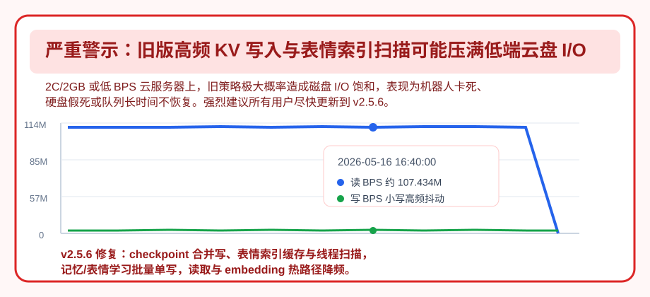

# 更新日志

本文件记录版本行为和兼容性变更。功能、配置和部署说明见 `README.md`。

## [Embodiment-2.5.7] - 2026-08-13

> **本次交付：将 preview 中已验证的 Bot → Persona → Session 作用域隔离、运行时生命周期和投递边界修复定版。**

- 作用域身份、会话代际与运行时服务都要求可验证的所有权；身份不完整、过期或不匹配时保持拒绝，不将状态、缓存或回调猜测性复用到另一 Bot、Persona 或 Session。
- 即时投递、持久化 outbox、系统提示缓存与 LLM 请求运行时沿同一作用域边界清理；竞态、迟到回调和旧句柄不会重获已释放会话的写入权。
- 保持 AstrBot `>=4.26,<5.0.0` 与 Python `3.10–3.13` 的发布基线；稳定包身份为纯 `2.5.7`。

## [Embodiment-2.5.0] - 2026-07-27

> **本次交付：跨会话身份连续性、可审核的 QQ 空间说说、同响应语义分段、WebUI 运行观测，以及投递、历史和热重载一致性修复。**

2.5.0 stable 将 grey 系列已经验证的能力与修复一次定版：可按身份延续会话线索、在审核边界内发布生活模拟说说、让一条回复自然分段，并把运行数据直接呈现在 WebUI。发送、历史保存与覆盖安装链路也随之收口，减少用户可见的重复、遗漏和加载不一致。Embodiment 命名谱系与下方旧数字版本是两条不同的版本线；本稳定包的纯版本身份为 `2.5.0`。

> [!IMPORTANT]
> - **兼容性**：升级前确认 AstrBot `>=4.26,<5.0.0` 与 Python `3.10–3.13`。
> - **默认边界**：跨会话身份连续性与 QQ 空间说说均默认关闭；启用前请确认自己的身份、可见范围和发布审核策略。
> - **Stable 身份**：本包版本为纯 `2.5.0`；v3 研究路径在 stable 中禁用，不接管请求、回复或状态写入。
> - **迁移**：先备份 AstrBot 数据目录。退役的旧核心快照会保留但不自动转换；Embodiment 初始化新状态，兼容用户记忆仍由记忆模块处理。

### 🚀 版本定位

本版把 grey 中分别验证过的身份连续、外部表达、回复分段、观测与投递修复一并定版。默认路径不主动打开高影响能力；部署者可以先保持原有行为，再逐项启用并在 WebUI 中确认实际效果。

#### 运行基线

- 支持 AstrBot `>=4.26,<5.0.0` 与 Python `3.10–3.13`，并补齐 AstrBot 4.26 的钩子参数兼容。
- stable 只标识为 `2.5.0`；不再携带 grey 后缀，也不把研究中的 v3 当作稳定功能宣告。

### ✨ Added｜新能力

#### 跨会话身份连续性（默认关闭）

过去换群或从群聊转到私聊，连续的关系与上下文容易断开。本版可按身份延续跨对话摘要、关系状态和人格快照，让被允许的会话在下次相遇时有可用的连续线索。

- 默认关闭；开启后仍同时经过身份、作用范围和可见性门控，不把「开启」等同于无条件共享。
- 未启用 `unique_session` 的共享群桶无法可靠归属单一身份，会安全地拒绝跨会话读写；不确定时保持隔离。
- 结果是连续性只在可证明的归属和可见范围内发生，而非将群内混合内容归到某个人名下。

#### QQ 空间生活模拟说说（默认关闭）

生活模拟可以生成 QQ 空间说说草稿，为长期互动提供低频、可审核的外部表达入口。默认流程仍由主人逐条审核；取消或过期的草稿不会发布，日/周上限与隐私净化持续生效。

- 凭据由部署者在配置中提供，插件不自动获取，也不会记录到日志。
- 提供分级自主权选项，但自动发布不是默认模式；默认始终是主人审核后发布。
- 结果是发布能力可以按部署场景放开，同时保留明确的人工、隐私和频率边界。

#### 同响应内的语义节拍

过去若要获得更自然的消息节奏，往往需要额外的分段模型调用。主回复模型现在可在同一次响应中写入语义节拍，不增加独立的分段 LLM 请求。

- 没有有效分段标记时，按显式换行回退；代码块、表格和列表保持整体，孤立标点会并入相邻文本。
- 工具中间内容与空分段标记不会制造气泡，避免把处理过程误当作用户可见回复。

#### WebUI 运行观测

WebUI 现覆盖会话、认知、路由、边界、表达与反馈等运行视角，使部署者能从同一界面确认路径状态。L1–L7 统计展示真实均值、分位数与样本数，并兼容历史监控数据。

- 默认选取最活跃宿主会话；零值和亚毫秒值也会如实显示，而不是被当作缺失。
- 结果是观测面反映真实运行数据，便于区分未发生、极快完成和旧数据三类情况。

### ♻️ Changed｜核心链路收口

#### 模型配置从散点走向分层

常用配置收口为聊天模型、共享辅助文本模型与 Embedding 模型，减少同一能力分散配置带来的路由歧义。专用 Provider 移入高级覆盖：普通部署保有清晰默认面，特殊场景仍可精细指定。

#### `v2core` 成为本地认知基线

即时认知判断改为无条件使用本地 `v2core`，不再同步等待独立评估模型。结果是普通对话的认知路径更稳定、依赖更少；旧版的「是否启用 `v2core`」不再是一个可变边界。

### 🐛 Fixed｜稳定性与一致性

#### 回复只投递一次

TTS、媒体和其他结果处理完成后，系统才决定由哪条最终路径投递回复，避免处理结果先发文字、最终回复又重复出现。若语义分段无法在正文发送前安全启动，会先回退给 AstrBot，而不是进入半启动状态。

- 只有实际成功投递的内容写入历史；中断、过期和失败草稿不再留下伪对话。
- 第三方 Agent 与 CloneTTS 接管后的历史同步已修复，用户看到的投递结果与可追溯历史保持一致。

#### 中文 L1→L2 整理恢复有效

中文 L1→L2 整理不再依赖空白分词后的关键词重叠，而是以本轮直接索引选择条目；中文、英文和混合文本都可按评估结果正确下沉。

#### 覆盖安装与会话隔离

覆盖安装后的热重载会清理残留模块，避免新文件没有被真正加载；会话上下文隔离也已修复，减少不同会话相互串扰。AstrBot 4.26 新增的钩子额外参数现可被兼容接收，升级宿主后不会因钩子签名不匹配而中断处理。

### 🧪 Grey 研发与 Stable 边界

v3 仍是一条与 stable 主链路隔离的研究旁路。grey 阶段已经验证了可复现的影子判定、有明确边界的状态编码、独立的运行生命周期与状态仓库，以及无需人工标签的证据采集；这些证据用于证明新架构能被约束和审计，并不代表部署者现在需要启用它。

- stable 构建中 v3 处于禁用状态，不拥有请求、不接管回复，也不写入状态。
- 因此本公告不将 v3 列为 Added；部署者无需为它配置默认运行路径。

### 🧹 Removed｜迁移收口

以下旧键不再读取：`sylanne_enable_v2core`、`sylanne_alpha_fast_assessor_enabled`、`sylanne_alpha_fast_assessor_provider_id`、`sylanne_alpha_hajide_compat_mode`。遗留值会被忽略，可安全删除；它们不再改变本版固定的本地 `v2core` 路径或兼容模式。

旧核心快照不会被自动迁移，以免把历史结构猜测性地写进新状态。完成备份后让 Embodiment 初始化新核心状态；需要保留的兼容用户记忆仍由专门的记忆模块承接。

### 🎯 总结

Embodiment-2.5.0 把 grey 阶段证明可行的能力带入 stable，同时保留默认关闭、身份隔离、人工审核和失败回退等边界。升级后可先按原有默认运行，再有选择地启用跨会话连续性、空间说说或语义节拍，并通过 WebUI 观察它们是否确实在预期范围内工作。

## [Embodiment-2.5.0-grey.7] - 2026-07-23

> 历史灰测公告。该构建已由 `Embodiment-2.5.0` stable 取代。

### 灰测范围

- 验证主模型原生语义分段：不增加独立 LLM 请求，结构化内容不拆分，异常 marker 清理后安全回退。
- 验证 LLM 配置收口：常用路由集中展示，功能专用 Provider 进入高级覆盖区，Embedding 使用专用模型列表。
- 验证分段发送失败、取消、TTS/媒体接管和第三方 Agent 历史保存边界。
- 验证 v3 确定性影子路径的隔离性；该路径不接管现网回复或 v2 状态。

### 默认边界

- 跨群记忆、QQ 空间说说和即时聊天接管默认关闭。
- v3 仅用于灰测观测，不作为稳定版启用结论。
- grey.7 安装包身份为 `2.5.0-grey.7`；当前稳定包身份为 `2.5.0`。

## [Embodiment-2.5.0-grey.5] - 2026-07-14

> 灰测修订：修复中文 L1 记忆在 12 小时语义整理中几乎无法被确认并下沉到 L2 的问题。

### 修复：中文记忆定时下沉长期低命中

**症状**：定时整理任务会正常调用评估模型，但中文摘要通常长期留在 L1；实际运行中往往要等 L1 堆满，才能靠容量兜底把部分条目推进 L2，6:00/18:00 的语义整理效果很弱。

**根因**：旧流程让评估模型输出关键词，再对 L1 摘要和整段模型回复分别调用空白 `split()` 后求交集。中文句子通常没有空格，整句会成为单个 token，几乎不可能与关键词列表产生交集。

**修复**：每轮整理为当前全部 L1 条目分配临时数字编号，评估模型只返回应长期保留的编号 JSON，本地严格校验后直接映射到本轮快照的记忆 ID。中文、英文和中英混合文本使用同一条直接选择路径，不再依赖分词命中率；下沉范围仅限本轮实际选择的 ID，不会顺带搬走其他已确认条目。

### 稳健性：失败重试与提示词数据边界

空响应或格式损坏的 JSON 不再消耗本轮定时整理机会，后台检查会保留后续重试；合法空数组仍视为一次有效评估。L1 文本以紧凑 JSON 数据块注入评估提示词，并转义标签边界字符，避免记忆内容闭合数据标签。解析器支持裸数组、`selected` 对象和 fenced JSON，逐值拒绝布尔、字符串、浮点及越界索引。

### 发布包校准

版本化安装包、`dist/astrbot_plugin_sylanne.zip` 与仓库根目录通用安装包均由同一份 grey.5 源码重新生成；安装前可解压检查 `metadata.yaml`，版本必须为 `2.5.0-grey.5`。

## [Embodiment-2.5.0-grey.4] - 2026-07-14

> 灰测修订：修复开启即时聊天相关开关后，Dify、Coze、DashScope、DeerFlow 等第三方 Agent 的正常回复没有完整写入 AstrBot WebUI 对话历史的问题。

### 🐛 修复：第三方 Agent 对话历史只剩用户消息或整轮为空

**症状**：消息和回复在聊天端均正常，但 AstrBot WebUI 的对话数据里只看到 `user`，看不到对应 `assistant`；缺少 ConversationManager 或同步失败的路径还可能整轮为空。

**根因**：第三方 Agent 会触发 Sylanne 的 LLM 响应钩子，但不执行 AstrBot 内置 Agent 的 `_save_to_history`。grey.3 为避免即时发送链路与框架重复写入，又统一使用了 `skip_conv_sync=True`，最终只有用户侧兜底、没有任何写者保存 assistant。

**修复**：保留 `skip_conv_sync=True`，在确认框架不会保存本轮时执行一次 awaited 原子整轮兜底：正常第三方回复通过一次 ConversationManager 更新按顺序写入 `[user, assistant]`；SILENT、错误或 stopped 轮只写 `[user]`；内置 Agent 仍完全交给框架保存，插件零写，避免重复历史。同步锁先解析到 AstrBot UMO 再获取，同一 WebUI 会话的并发更新不再因 Sylanne session key 不同而互相覆盖；数据库更新成功后才消费本轮 once-guard，失败时保留后续钩子的重试机会。

### 🔧 AstrBot 4.26 Web API 兼容

插件内嵌 WebUI 路由从旧 Quart request/Response 迁移到 `astrbot.api.web` 的 FastAPI 公开接口，并把最低 AstrBot 版本明确为 `>=4.26`。这同时避免 WebUI handler 在新版本宿主缺少 Quart 兼容环境时运行失败。

### 📦 发布包校正

版本化安装包、`dist/astrbot_plugin_sylanne.zip` 与仓库根目录通用安装包均由同一份 grey.4 源码重新生成；安装前可解压检查 `metadata.yaml`，版本必须为 `2.5.0-grey.4`。

### ✨ 说说发布自主权档位

新增 `sylanne_alpha_qzone_autonomy`：`review_all`（默认，每条仍给主人确认）、`low_risk_auto`（关键词粗筛与 LLM 语义判断均确认只涉及她自己时才自动发布）和 `full_auto`（通过广播净化硬闸后直接发布）。无论档位如何，PII/群聊背景净化与每日、每周频率上限均保持生效；未知配置值 fail-safe 回退 `review_all`。

## [Embodiment-2.5.0-grey.3] - 2026-07-13

> 灰测修订：修复 **grey.2 在 AstrBot 4.26.x 上加载后、消息一进来就崩**（事件钩子报 `takes 2 positional arguments but 5 were given` 等）。grey.2 只在 4.25.x 上验过，未覆盖 4.26.x 的钩子调用约定。

### 🐛 修复：AstrBot 4.26.x 事件钩子多传参数导致 TypeError

**症状**：grey.2 在 AstrBot 4.26.x 机器上能装上、但一有消息/一发起 LLM 请求就报 `EmotionalStatePlugin.on_message() takes 2 positional arguments but 5 were given`（`on_llm_request`/`on_llm_response`/`on_decorating_result` 同类），插件事实上不可用。4.25.x 不受影响。

**根因**：AstrBot 4.26.x 起，框架调用插件事件钩子时会多传若干上下文位置参数（`handler(event, *extra)`）；本插件的钩子签名固定为 `(event)` / `(event, request)`，接不下多出来的参数，Python 直接抛 `TypeError`。开发/测试机是 4.25.x，钩子只收到文档约定的参数，故未暴露。

**修复**：给全部 6 个事件钩子（`on_message` / `on_llm_request` / `on_llm_response` / `on_decorating_result` / 两个 `after_message_sent`）的签名加上 `*args, **kwargs` 兜住框架多传的参数，`request`/`response` 仍固定在第 2 位（与 4.26.5 文档 `(event, req)` / `(event, resp)` 一致）。对 4.26.x（吸收多余参数）与 4.25.x（`args` 为空）双向兼容；插件本身只用 `event` 及既有的 `request`/`response`，行为不变。已用"按 4.26.x 调用约定绑定 6 个钩子签名"逐一验证不再 `TypeError`，并跑通 4.25.x 全量测试（1800 passed）。

## [Embodiment-2.5.0-grey.2] - 2026-07-13

> 灰测修订：修复 **grey.1 在"装过旧版的机器上覆盖安装/热重载后加载失败**（`cannot import name 'realtime_flags' from 'sylanne_alpha.message_dispatch'`）。

### 🐛 修复：热重载时旧模块缓存遮蔽新文件

**症状**：此前已安装过 Sylanne 的机器，上传/覆盖安装 grey.1 后，插件加载报 `cannot import name 'realtime_flags'`（或其它新符号）；全新机器不受影响。

**根因**：本插件把插件目录加入 `sys.path`、以【顶层绝对名】`sylanne_alpha.*` 导入子包，这些模块在 `sys.modules` 里的键不带 `data.plugins.<目录>.` 前缀；而 AstrBot 重载插件时只清理带该前缀的模块（`star_manager._get_plugin_related_modules`）。于是旧版的 `sylanne_alpha.*` 残留在 `sys.modules` 中，Python 直接返回缓存、不读磁盘上的新文件，新版新增的符号自然找不到。全新进程无残留故不复现。

**修复**：`main.py` 在导入任何 `sylanne_alpha` 子模块之前，主动从 `sys.modules` 清除残留的 `sylanne_alpha*`，强制每次（重）加载都从磁盘重读。仅在非 pytest 环境执行（测试不走 AstrBot 热重载路径，跳过以免新旧同名模块并存）。已用"旧模块预置进 sys.modules → 重载导入"真码复现故障并验证修复。

> 立即绕过（无需换包）：**完全重启 AstrBot 进程**（非热重载/仅刷新），新进程无旧缓存即可正常加载。grey.2 起覆盖安装也不再需要重启。

## [Embodiment-2.5.0-grey] - 2026-07-13

> 灰测版（未正式发布，待真机验收）。2.5.0 三大基调一次到位：①**跨群记忆**（她按"人"跨群/跨私聊记住你）；②**QQ 空间说说**（她按生活模拟发说说，主人过目才发）；③**即时聊天接管重做**（修好"一开就崩"的实时分段）。外加"同一句话回两遍"的入站幂等修复。**三大新功能默认全部关闭，装上行为与现网一致**；逐项开启才生效。

### 🌐 新功能：跨群记忆（旁挂人核，默认关）

以前记忆粒度是"会话 × 用户"，换个群/私聊她就像重新认识你。本版新增按身份（platform + sender_id）挂靠的旁挂层，让记忆与关系跨会话连贯——**不改会话主键、不合并 per-session 主记忆、可随时关闭回退**。三层可分别开：

- **对话货架**（`cross_dialogue`）：经净化的 bot↔本人直接对话摘要供跨群召回参考；写入前"净化双摘要"剥离第三方旁观内容。
- **关系人格**（`cross_relationship`）：关系四计数 + warmth 长期基线 + 有界瞬时情绪偏移（她对你当下的余温/余怒，随时间自然回落，绝不影响她对别人的态度）按身份跨群携带。
- **气质快照**（`cross_personality`）：Sylanne Six 表层人格按身份混合，跨群出生时保持气质一致。
- 档位与范围：`cross_session_mode`（off/shadow/on）、`cross_session_scope`（owner/all）、`cross_visibility_tier`（same_group/cross_group/strict）。
- **隐私硬闸**：未开 `unique_session` 的共享群桶身份中立跳过，绝不把多人混合摘要记到某一个人头上；召回侧六道硬闸（身份 / 私聊 / 跨群 / 场合标记 / 双闸冗余 / 提及降级），任何不确定一律 fail-closed 不召回。

### 📮 新功能：QQ 空间说说（生活模拟驱动，默认关）

她会按自己的"生活/心情"发说说分享，素材取自她自己的经历、心情与你俩的关系（像真人在过日子）。

- **唯一发布路径 = 主人过目**：她生成草稿 → 私聊发给主人 → 主人回「说说确认」才发、「说说取消」即丢、超时自动作废；**无自动发送**，带每日/每周频率上限。
- **公开广播净化**：来源白名单（只收她自己的生活/反思/与用户关系记忆，排除他人事实与第三方私事）+ 广播净化闸（联系方式/长数字/群聊背景等结构化泄露拦截）+ 主人过目兜底散文体第三方内容。
- **凭据边界**：`qzone_cookie` / `qzone_my_qq` 由部署者在配置页手填、代码只读，**绝不自动抓取、绝不写入日志**；总开关 `qzone_enabled` 默认关。

### 🐛 修复：即时聊天接管 LLM 响应分段（"一开就崩"）

开启"允许即时聊天接管 LLM 响应分段"后曾出现的多重故障，本版彻底重做：

- **图片/语音被吞**：接管清空消息链导致非文字组件消失 → 现改为遇非纯文字直接放行框架原样发送。
- **渐进失忆**：接管使回复内容读空、框架跳过历史落库，她逐轮忘记自己刚说过的话 → 现保留回复内容，让框架照常落库。
- **重复发送**（部分 provider 每条双发 / 流式平台整条双发）→ 发送抑制改由框架自身的装饰钩子完成，与内容字段解耦、跨 provider 一致。
- 本修复"只改发送、不动保存"，与会话历史完整性、"回复两遍"修复彼此正交。

### 🐛 修复：同一句话被回两遍（入站消息幂等）

对同一条入站消息的重复投递按 `(会话, message_id)` 幂等去重，在请求入口拦下第二次处理，阻止框架把重复的用户轮再拼一次写进历史。

### ⚠️ 已知限制

- 跨群记忆在群聊里真正生效需部署者开启 AstrBot 的 `unique_session`；未开时共享群按身份中立跳过（安全侧）。
- `cross_group` / `strict` 高级档在缺少群成员名单数据时保守 fail-closed，实际召回偏少；默认 `same_group` 最稳。
- QQ 空间说说对"只提第三方姓名、无联系方式"的散文体内容，自动闸不保证拦住，依赖主人过目这道人工闸。
- 即时聊天接管的活体流式 / 真模型端到端未在灰测内验证，建议开启后用两类 provider 各自试跑。

### 🔧 工程

- 三条功能各自独立分支开发、经对抗性红线审查（默认路径零回归 / 数据安全 / 隐私泄露专猎）后合并，合并交互再过一道红线复核；全量 1800 项测试通过。
- 配置页分组重排（可折叠分组）计划在灰测验收后单独进行，本版配置项仍为扁平结构。

## [Embodiment-2.4.1] - 2026-07-11

> 热修复：**同一句话被回答两遍**（换措辞重答已答过的问题，且看起来"没注意到"你最新那条消息）。灰测报告 → 真代码复现 → 真进程灰测三级证实，根因是会话历史被写坏。

### 🐛 修复：会话历史悬挂重复 user 轮（跨锁双写竞态）

**症状**：她会用不同措辞把你几分钟前问过、且已经答过的问题再答一遍；密集连发时更明显；最新那条消息反而像被忽略。

**根因**：插件在**请求期**用一个 fire-and-forget 后台任务抢先把用户消息写进 AstrBot 会话历史（leg-3，为 SILENT 轮兜底而设），而框架自己在回复后也会做一次**整表覆盖**落库。两者各持一把**不同的锁**，互不排斥。当那个后台任务被调度到框架落库**之后**才执行时，它读到的历史已经是 `[…, 用户问题, 她的回答]`，而幂等守卫明确豁免 `user` 角色，于是又追加一条同样的用户消息——历史变成 `[…, u, b, u]`。下一轮模型看到"这个问题被重新问了一遍"，自然重新作答；被顶到后面的最新消息则失去注意力。污染每轮随整表覆盖保留并逐轮累积。

**修复**：让 user 侧对齐 bot 侧早已采用的 `skip_conv_sync` 哲学——**框架会落库的轮次，插件一个字都不写**。
- 删除请求期无条件 user 写。
- 改为响应期收口（`_on_llm_response_inner` 的 `finally`）**仅当框架本轮确定不落库时**才补写 user，且在框架 per-umo 会话锁内 `await` 完成。
- 判据 `_framework_will_persist_this_turn` 精确镜像框架 `_save_to_history` 的落库谓词（无 conversation / 被 stop 且未 abort / 空 completion 且无 tool 结果且未 abort / 响应对象为空或 role 非 assistant）。
- 由此**补写永远是该轮唯一的 user 写者**，跨锁双写从结构上消失；SILENT 轮"保住用户消息"的原有保护一分不减。

**验证**：真 AstrBot v4.25.1 进程 + 真 pipeline 灰测。同一会话背靠背并发投递三条消息压框架会话锁，实测三个 pipeline 同时争锁而只有一个进临界区、LLM 调用被串行化，历史干净无重复无丢失（三次重跑稳定）。再补一组**四轮并发且全部 SILENT**（即每轮都真的执行补写）：四路争锁、每次补写都落在框架锁持有窗口内，四条用户消息各写一次、不丢不重。两组对照都证明测试有鉴别力——把旧行为放回去并把写入延迟到框架落库之后，坏形状 `[u, b, u]` 如期复现；绕过补写路径上的会话同步锁，并发写立刻丢失。另含 SILENT 夹心轮、流式、Live、abort、连发合并轮全通过；1533 项单元测试绿。

> 顺带厘清一处容易误解的归因：修复涉及的两把锁分工不同。框架 per-umo 会话锁隔开的是「插件补写」与「框架整表覆盖写」（本次所修的跨锁双写）；而同一会话多轮并发时，多个补写之间是靠插件自己的会话同步锁串行化的。

### 🐛 一并修复：provider 全挂轮丢失用户消息（err 轮兜底）

上面的主修复把 user 补写移到响应钩子后，会漏掉一类轮次：**provider 连同全部 fallback 一并失败时**（例如代理 504 连炸），框架在那条路径上根本不触发 `on_llm_response` 钩子，响应期补写没机会跑，框架自己也因回复非 assistant 而不落库——该轮用户消息谁都不写，下一轮她就看不到你刚说的话。

修复：新增一个 `after_message_sent` 兜底钩子，**仅当框架本轮确定不落库时**把 user 补进历史。它同样跑在框架会话锁内（AstrBot 的洋葱式调度让发送阶段在处理阶段挂起期间嵌套执行，此刻锁未释放——已用锁探针实测确认），所以补写仍是该轮唯一写者，不是跨锁竞态。

这里有个反直觉的坑，拦它用了三道防线（缺一不可，均经真进程灰测 + 变异测试证实为承重）：
- **三态标记**区分「本轮没走 LLM 请求（纯指令）」「响应钩子已处理」「请求跑过但响应钩子未触发」，只对最后一种补写——避免把纯指令轮也盲塞一条 user。
- **终态门**：模型带前导文本调工具时，工具循环的中间步也会发消息、触发这个钩子，此时不能补。只在 agent 已到终态（完成/出错）才放行。
- **每轮至多补一次**：缓冲模式下终态门挡不住的场景，靠它兜底，防止同一轮补出 `[u, u]` 悬挂重复（那正是主修复要消灭的形状）。

### ⚠️ 已知限制

- **仅流式档（`provider_settings.streaming_response=true`）**下，provider 全挂轮的用户消息仍不会进历史——流式路径上发送阶段提前返回，兜底钩子不触发。框架默认关闭流式，此限制默认不生效；开了流式即回归原生 AstrBot 行为（用户可见报错、非静默丢失）。
- 第三方 agent runner（dify/coze 等）部署下 err 轮兜底不生效（那类 runner 不注册终态信息，兜底宁可不补也不误补）。本地 provider 部署不受影响。

### 🔧 其它

- `state_persistence` 同步失败日志 `debug` → `warning`（该补未补的瞬时 IO 故障不再静默）。
- 修正两处失真注释：其一是幂等守卫旁"请求期不存在并发写"的错误假设（正是本 bug 的思想根源），其二是判据 docstring 对错误路径的归因。

## [Embodiment-2.4.0] - 2026-07-08

> 自 2.3.0 起累积的一个**大版本**，四条主线 + 两个后端面同包生效：①活人感行为层（让她像活人不像机器人）；②记忆数据安全重设计（防丢失/复活/污染，两阶段红线）；③上下文完整性 + 防漂移根治（几轮就失忆跳题，真模型证实的联合条件）；④WebUI 全量重构。外加记忆只读管理面（MEM-04）与巩固假成功修复。经灰度验证后转正式发布。

> **版本号说明**：上一个对外发布是 **Embodiment-2.2.0**；**Embodiment-2.3.0 未单独发布**（仅 next-gen 线内部里程碑），其内容（issue #43 主动消息重复三链修复 + T3 内容片段泄露修复 + 上游引擎升级 2.4.0）**随本版一并发布**。因此从上一个公开版本 2.2.0 升级，即同时获得 2.3.0 与 2.4.0 的全部改动——2.3.0 那批详见下方独立条目。公开发布序列 2.2.0 → 2.4.0，跳过的 2.3.0 号不再单发。

### 🫀 活人感（Liveness，15 张卡两 wave 全落地）

从"规整的应答机器"改造成"有呼吸感的人"，绝大多数默认关、可配置：

- **打破节拍器**：首段回复前加思考延迟；抖动 / 分心 / 躯体驱动的打字速度（cps），不再每条都同一个节奏（T1-01/T1-02）。
- **软"已读不回" + 冷却收尾再回来**：情绪低时读了先不回，过阵子自己接回来（T2-01/T2-03）。
- **SPEAK 后的追发 / 补充**：说完一句想起来再补一条（afterthought，T2-02）。
- **连发不被合并**：你连发几条，她不再糊成一段回（T2-04）。
- **用户追问线程 + 仪式可达性**（T2-05/T2-06）；**主动反馈闭环 + RhythmLearner 复活**（T2-07/T1-04）。
- **状态驱动的分发调制**（cps / 分段 / 预延迟随情绪状态变化，T3-01）。
- **反 AI 腔风格线 + 注入卫生**（T4-01/T4-03）；**共享 VariantPool** 取代静态单行模板（T4-02）。
- **轻度夜间节律纹理**（T1-03，配置门控、默认关）。
- 每张卡过抗幻觉流水线，拦下多次真 MAJOR；4 个较激进行为默认关，等实机开验。

### 🧠 记忆数据安全重设计（红线：防丢失 / 复活 / 污染，两阶段）

**Phase 0（MEM-01/02/09）**：

- **MEM-01** 黄金往返基线 + 迁移脊柱（磁盘形状锁死、可回归）。
- **MEM-02** 恢复 KV 水合接线 + 防重启清零（进程重启不再把记忆归零）。
- **MEM-09** 退役破坏性再固化重写——旧路径会把召回命中的 L2 条目原地送 LLM 改写、无备份、embedding 错配、孤立影子层，已下线（非破坏性 overlay 才是正道）。
- 显式抹除对抗水合复活的门闩、delete 清全 3 键、崩溃残留净化。

**Phase 1（MEM-03，数据安全四张 + 存储解耦）**：

- **写入咽喉 + incarnation 栅栏**原语（F2）：所有记忆写入过单一咽喉，转世纪元栅栏挡住跨身份污染。
- **delete 臂激活栅栏**（F3）：删除即激活栅栏，`.alpha.json` 清理并入删除原语。
- **load 路径准入栅栏 + 隔离路由**：加载时可疑数据进隔离区而非直接入库。
- **持久化待删索引 + 启动扫描**：崩溃/中断的删除有据可查、启动补扫。
- **存储解耦**（PR-5）：删掉写 `body.memory["_memory_system"]` 的死重，KV 成唯一持久面。
- 每张过 opus/fable 对抗闸专猎 fail-open，逐条对抗复核 + 修完再核。

### 🩹 上下文完整性 + 防漂移（红线：几轮就失忆 + 跳到不相干旧话题）

**上下文完整性（先修的一批）**：

- 不再把外部主动消息插件泄漏进历史的模板"假用户话"当真用户语音持久化。
- 历史稀释不再永久腰斩已落库历史（写穿透会复利腰斩，已下线原地截断）。
- conv_mgr 同步不再和框架自身历史写入抢跑；损坏会话历史 fail-closed；thinking-only 草稿 no-ghost 兜底。
- **SILENT 轮真正保住用户消息**：修好 `sync_message_to_conv_mgr` 三处独立缺陷（pydantic 对象序列化炸库、history JSON 字符串被拆成单字符、session_key 与 unified_msg_origin key 空间错位）。

**防漂移三腿（真模型 A/B 证实根因是「历史丢失 AND 幽灵注入」联合条件，缺一不发作）**：

- **leg-1 认 /reset**：监听 `_clean_ltm_session`（`/reset`、`/new` 都设，对真框架 4.25.1 核过），设 `MemorySystem` 召回纪元边界（`created_at < 边界`不再自动召回，**一条不删**）+ 清工作集；L2/L3 长期记忆、关系人格自我、`_incarnation_epoch` 全保住——忘掉这段对话，但没忘你是谁。
- **leg-2 注入侧纵深防御**：历史缺失轮在 `recall()` **唯一收敛点**丢弃零相关近期兜底项（temporal_proximity 幽灵，PERCEPT/legacy 两路一处全覆盖），延后离题生活事件（defer 不丢）；动态注入绝对封顶兜底（floor 护住感知槽）；召回冗余用 blake2b 归一化-精确去重——**刻意弃用模糊 Jaccard/MinHash**，字符相似度分不清「过来/过去」（会误删语义相反的记忆），只折叠"仅标点/空白/大小写不同的同一句"。历史在场的 on-topic 路径逐字不变。
- **leg-3 空回吞轮补第二条历史丢失路**：`_background_observe_request` 的 conv_mgr 用户轮同步上移到任何可能抛异常的代码之前（移动非新增，恰好一次、不双写），堵住"这轮判 SILENT → 用户那句话永久从历史消失"。

**验证四路**：确定性装配 A/B（薄历史轮幽灵全消、满历史轮逐字保留）+ opus 红线对抗闸逐条独立复核（3 REAL 全修）+ 全量 **1487 passed / 2 skipped** + 真模型 glm-5 A/B（修后不再跳到「标注元数据」）。

### ✨ WebUI 全量重构

- **技术栈换代**：从三份手写 monolith HTML 重构为 **Vue 3 + Vite + TypeScript + Pinia + vue-router** 单文件构建（`vite-plugin-singlefile` 内联进 `UI/index.html`，仍是零依赖单文件、AstrBot 直接托管）。
- **8 个真页面**（占位页全部替换为真端点）：监测 / 认知核 / 配置 / 日志 / 记忆 / 人格 / 生活 / 管理。
- **找回丢掉的仪式感**：开机 / 登录 / 归来过渡动画重做；恢复中缝脊柱轨（带拖拽物理）与「解剖台」两栏布局（任何东西都不跨过中线）；可读性字号地板。
- **签名身份**：默认暗色主题（不跟随系统偏好）；对抗式设计评审加固模板。

### 🗂️ 记忆只读管理面（MEM-04）

- 新增 `MemoryFacade` + 三个只读 admin 端点（`/api/admin/inspect`、`/quarantine_view`、`/pending_deletes`）+ v2core 镜像；配套「管理」页，直接看隔离区 / 待删 / 记忆核查。

### 🐛 其他修复

- **巩固/崩解假成功修复**：WebUI stdlib handler 用捕获的 `_main_loop` 走 `run_coroutine_threadsafe`，meltdown/consolidate 不再谎报成功。
- **节律 EMA 被跨停机 gap 污染修复**：`UserModelDomain._rhythm_ema`（相邻用户消息间隔的 EMA）无 gap 上限，加载旧持久化数据后插件停机那段跨重启间隔（可达数天）被当成一次真实节律喂进 EMA，实机实测把值顶到 1 万+，`reply_overdue` 随之几乎永不触发、活人感静默/主动搭话哑掉。修：仅 `0<gap<=3600s` 才入 EMA（超上限=离开/停机，不学，只推进时间戳）；加载时越界/NaN/inf/负值置 None 冷启（下条正常 gap 一轮重初始化到真 cadence）。全库扫描确认无同类未修暗桩。

### 🏗️ 引擎

- **vendored `sylanne_core` 升级 2.4.0 → 2.5.0**：2.5 清死栈——移除零行为消费者的 `_Kuramoto`/`_Plasticity`/`_FreeEnergy` 惰性桩及只写不读的 personality/feedback reach-in（`kuramoto_k1`/`plasticity`/`free_energy`/`hopfield_strength` 等），载荷输出 `sync_order` 保留。公共导出面 `__all__`（43 符号）逐字不变，对插件零接口变更；插件只吃 vendored 自包含副本、相对导入不串 pip 包；全量 1492 passed。

### ⚠️ 升级提示 / 已知限制

- 建议升级后验一下上下文修复：`/reset` 后开新对话、连发短句，看是否还几轮跳题；活人感 4 个默认关行为按需开启。
- 已知限制：`/reset` 对 L2/L3 长期记忆的召回压制是运行时纪元边界（不落盘），进程重启后失效——被 `/reset` 压下去的旧话题在重启后可能重新可召回（保守设计、不丢数据；L1 热池清空是持久的，主漂移修复也是持久的）。

## [Embodiment-2.3.0] - 2026-06-27

> issue #43「主动消息重复」根因三链修复 + 对话内容片段泄露修复 + 上游引擎升级 2.4.0，整包同时生效。

### 🐛 Bug Fixes

- **issue #43 主动消息重复（三链根治）**：
  - H1 生活模拟静默冻结 → 失败计数 + 漏桶探测式退避（阈值 3 / 最多跳 20 拍，永不永久封死）+ 壁钟节流告警（`_LIFE_FAIL_WARN_INTERVAL_S=3600`），provider 缺失时启动即 WARNING，恢复后立即复原节律。
  - 大饼 override 残留（崩溃/竞态）→ ProactiveBridge 改 provenance 安全：per-sid 锁短临界区、in-flight 守卫、KV sidecar 基线、RMW 只还原自有键（`proactive_prompt`/`segmented_reply_settings`），三段式还原进 finally，启动期 `recover_inflight_baselines()` 清残留；用户的 `proactive_prompt` 配置全程不被误删。
  - H3 记忆按 `life_event_id` 去重 → 写入即去重（命中跳过不更新）+ 召回两条路径（legacy 与 activation）统一折叠，空 id 不当去重键。
- **内容片段泄露（T3）**：provider 把回复以 `[{'type':'text',...}]` 列表/repr 形式返回时，`normalize_completion_text` 在所有读边界归一（v2core 首读 + 回复管线两处），仅 `ast.literal_eval` 还原（无脆弱正则）、绝不吞正常正文（散文/JSON/图注原样透传）、支持截断 repr 与尾反斜杠还原。

### 🏗️ 架构 / 引擎

- **vendored `sylanne_core` 升级 2.0.0 → 2.4.0**（canonical SylannEngine）：2.3.0 新增 `deterministic_fusion` / `pel_core` / `telemetry`、移除 resonance-field 死栈（`resonance_field*` / `coupling_dynamics` / `topology_gate`）；2.3.1 追加畸形 LLM 输入硬化（非 dict JSON 兜 `AttributeError`、`null` 字段经 `_coerce_float` 安全归一、跨档位快照 `_resize` 维度对齐、NaN/溢出守卫，新增 `_numeric` 共享工具）——正是 PR #45 gemini 审查点到的三处 SDK 鲁棒性缺口，上游 PR #19 已修复；2.3.2 多插件引擎共享硬化（模块级注册表、loop 亲和、首占即主、`SharedEngineConflictError` 值比较，新增 `_config_store`/`_identity`/`_rendezvous`/`_assessor_llm`）；2.4.0 新增 single-fire `submit()` 引擎级幂等（`submit_window_seconds=10`）、`tick()` 每 session 45s 心跳收敛器（**本插件 tick 全为事件驱动，已在 `EngineFacade` 构造处显式 `tick_min_interval_seconds=0.0` 关闭**，且生产路径直连 compute 层不经该 API）、`peek_shared`/`wait_shared` 只读探活、`set_llm` 热替换。公共导出面（`__all__` 43 符号）逐字不变，对插件零接口变更；运行时铸造的 `_identity.json`（per-copy UUID，写入模块目录）已列入 `.gitignore` 排除。
- `compat` 模块更名 `message_dispatch`（next-gen 线既有重命名），T3 归一与现有 strip/realtime 工具同处一模块。

### ✅ 验证

- 全量本地 `python -m pytest -q`：913 passed / 2 skipped；ruff 干净。
- 四条修复通道各有专项测试：`test_issue43_h1_freeze` / `test_issue43_memory_dedup` / `test_issue43_bridge_residual` / `test_issue_t3_content_parts`。
- 8 路对抗审查（每个 hand-merge 文件逐 hunk 比对 fix 分支 source of truth + 跨文件签名核对）：fix 逻辑全 clean、零回归。

## [v2.2.0] - 2026-06-23

> 生活模拟全栈落地：从"随机活动池"进化为"有长期成长线、会自适应收敛、带 WebUI 观测面板"的完整系统。

### ✨ Features

- **LifeProject 长期项目线程**（Phase 3）：确定性聚类晋升（7 天内 ≥3 天同类事件自动成为项目），上限 4 个活跃项目，里程碑阈值 {0.25, 0.5, 0.75, 1.0}
- **LifeSkill 自适应技能库**（Phase 3）：3 个种子技能（evening_soft_checkin / creative_milestone_share / thesis_companion），冷却自适应 `clamp(1+2×(1-effectiveness), 1, 4)` —— 用户不回应时技能自动拉长冷却至 4 倍
- **share_policy 项目级门控**（Phase 3）：milestone 模式非里程碑事件强制 SILENT，每项目每次巩固最多分享 1 条里程碑
- **M8 数据源补建**（Phase 3）：`_proactive_dispatch_audit` 写入点补建，feedback_pressure 不再恒为 0；dispatch/response/timeout 闭环；scheduler 双数据源 event_id 去重防双罚
- **WebUI 生活观测面板**（Phase 4）：5 个 API 端点（events/projects/audit/diagnostics/controls），standalone + AstrBot 双端镜像
- **UI 第 7 页 LIFE**（Phase 4）：状态概览 + 项目卡片 + 事件时间线 + 控制面板（开关/强度/清除），30s 自刷新
- **3 个新配置项**：`share_intensity`（off/low/standard/high）、`night_consolidation`（bool）、`allow_memory_write`（bool）
- **记忆契约**（Phase 2A）：来源感知召回，life_sim 事件不被当作用户事实
- **亲密会话路由**（Phase 2B）：rel_register LLM 分类器 + 关系层身份门控 + 生活 outreach 只投亲密私聊
- **反思 + 巩固引擎**（Phase 2C）：LifeReflection（DROWSY，低频 LLM，写 kind_bias）+ LifeConsolidation（RETIRED，零 LLM，生成次日计划）

### 🏗️ 架构

- Schema v2→v3 迁移（旧档自动兼容：空 projects + seed skills）
- 零新引擎、零新 agent——LifeProject/LifeSkill 纯数据，由现有三引擎分阶段管理
- 自适应反馈闭环：effectiveness ↓ → cooldown_multiplier ↑ → 自动收敛到不打扰
- M8 单一惩罚通道守线不变（`unanswered_penalty * 0.0`，scheduler gate 独占）

### 🐛 Bug Fixes

- 修复 milestone 门控永久放行（outreach 成功后标记 milestones_shared）
- 修复 outreach_audit from_dict 非 dict 元素导致 AttributeError
- 修复 audit session 淘汰非 LRU（改 pop+re-insert）
- 修复 scheduler 双数据源 cold_count 重复计算（event_id 去重）
- 修复 v3 state 空 skills 列表被误 seed（按 key 存在性判断）
- 修复 WebUI LIFE 页 XSS（全部动态文本统一 esc() 转义）
- 修复 LIFE 页双重刷新（移除 realtime loop 冗余调用）

### 📊 数据

- 12 文件变更，+2860 行代码 / +880 行测试
- 新增 8 个测试文件，779+ pytest 全过
- 5 个 PR（#29 #30 #31 #32 #33），经 4 轮机器人 review 打磨

---

## [v2.0.0] - 2026-06-09

> 一次叠了三层的重构：在不可逆关系计算引擎之上，重铺地基（模块 agent 化）、长出心智（多智能体编排）、学会成长（自我进化）。计算核心外包给独立 SDK，插件瘦身为纯业务编排层。

### 🏗️ 架构重构：SDK 深度集成

- **计算层 SDK 化**：核心计算从插件内部剥离为独立 vendored SDK（[SylannEngine](https://github.com/Ayleovelle/SylannEngine) `sylanne_core`），插件通过 `engine_adapter.py` 消费 Surface 输出，计算可独立演化
- **共振场替代顺序管线**：7 个计算模块不再 L1→L2→...→L7 顺序执行，而是作为完全 6-单纯形 Δ⁶ 的顶点同时注入 Simplicial Resonance Field 迭代至收敛；表达从场的相变中涌现，旧顺序管线保留为 fallback（ComputationSpine）
- **lite 档位配置**：成对耦合，42 通道，纯 Python 无外部依赖，实测 ~10ms 收敛
- **旧计算层删除**（~9620 行）：计算彻底外包给 SDK，插件不再持有计算实现

### 🏗️ 架构重构：契约化与状态治理

- **Protocol 接口契约化**（CP8-P1）：10 个子模块从 `plugin: Any` → `PluginHost` Protocol 类型契约，编辑器可静态检查，禁止穿透访问
- **SessionStateStore**（CP8-P2）：新建集中运行态容器仓，34 个散落的 per-session dict 迁入统一注册的 `SessionMap`，带 LRU 驱逐 + TTL + 类型守卫，结构性消除 dict 泄漏和跨模块裸访问

### ✨ Features

- **多智能体认知架构**：新增编排器 SelfCore + 9 个标准化认知 agent（emotion/assessor/persona/life/memory/rhythm/proactive/social/dialogue），统一 `perceive→gate→act` 契约，四时点（PRE/POST/RESPONSE_POST/AUTONOMOUS）按需编排，融合多份意图喂回计算栈
  - 模块 agent 化：把原先散在主流程、互相耦合的逻辑拆成独立官能，新增"心思"只需照契约挂一个 agent，不再动核心——为未来扩展与迭代铺路
  - 全局 LLM 预算闸：超预算 agent 按优先级降级为规则档，token 成本有硬上界
- **自驱心跳**：全局单 task 后台循环，按会话三态（AWAKE/DROWSY/RETIRED）演化，"没人说话也活着"
- **三层自我进化（带刹车的自适应）**：
  - 层次1 反应式（零 LLM）：每轮对话后 EMA 微调门控偏置，reward 以"用户续聊间隔"为强信号 + 自评弱先验（防 Goodhart）
  - 层次2 反思式（低频 LLM）：浅睡首拍跑一次元认知，沉淀 reflection_bias；token 三道闸（首拍闸 / 每会话每日预算池 / 输入压缩 ≤1500 字）+ 影子副本锁舞（唤醒优先）
  - 层次3 巩固式（零 LLM）：深睡前记忆衰减 + 反思偏置回归基线 + 进化档案落盘 KV
  - **跨重启累积学习**：进化档案持久化到 KV，服务器重启 / 插件重载后门控偏置不归零
- **进化三铁律护栏**：硬钳位（反射 ±0.15 / 反思 ±0.10 / 总和 ±0.20）+ 无信号自动回归基线 + 与人格漂移物理隔离 + 一键出厂复位
- **主动发言桥接**：适配 [astrbot_plugin_proactive_chat](https://github.com/DBJD-CR/astrbot_plugin_proactive_chat)，Sylanne 决定"何时主动 + 提供生活素材"，可接管分段发送 / 拨动倒计时 / 注入犹豫感（自带主动发言可独立工作，搭配食用更佳）
- **生活模拟素材化**：生活模拟 LLM 产出永远只作为上下文素材，不绕过主模型直发；事件按情况写入记忆层（去标签，LLM 无法区分独立经历与对话记忆）

### 🐛 Bug Fixes

- 修复进化层 per-session 状态无界泄漏（forget_session 收口接入会话删除 / LRU 驱逐）
- 修复 LLM 预算闸形同虚设（assessor 按 mode 分流，降级时跳过重 token 的 main 层）
- 修复主动发言 session→UMO 映射读错位置（origin 恒回退，带后缀会话可能投错）
- 修复自驱 / 巩固持会话锁期间 await LLM/IO 长占锁（改锁舞：锁内取快照、LLM/IO 移锁外）
- MemoryAgent POST 记忆衰减不再被亲密度门控误杀；BoundedDict `__contains__` 补 TTL 一致性
- 修复 PersonaManager async 兼容（AstrBot v4.25 API 变 coroutine，旧代码 coroutine never awaited）
- 修复生活模拟直发路径（大饼不可用时回退为直接 send_message，改为存回 pending context 走主模型链路）

### 📝 工程化

- 仓库美化与协作骨架（借鉴 [@DBJD-CR](https://github.com/DBJD-CR) 的插件模板）：README 重排（Socialify 头图 / 居中徽章 / 快速导航 / 自我进化章节 / 重绘工作流 / 与 Embodiment-1.0.0 对比）、新增 CONTRIBUTING / CODE_OF_CONDUCT / 设计·讨论·文档 Issue 模板 / Dependabot / stale 工作流 / run_ruff.bat
- README 计算架构改写为共振场 Mermaid 全连接图 + SDK 超链接 + 动态 badge
- Changelog 统一折叠进 `
` 块，Repobeats 占位移除

### 📊 数据

- 139 文件变更，+27,411 行 / -4,144 行
- 74 commits
- 实机测试：AstrBot v4.25.1，129 pytest 全过，全链路零报错

---

## [v1.4.7] - 2026-06-06

### 🐛 Bug Fixes

- 修复 1.4.6 热更新后插件加载崩溃 `ImportError: cannot import name 'ensure_background_tasks_list'` (#17)
  - 根因：`main.py` 强制 `importlib.reload(webui_server)` 会重新执行其 `from sylanne_alpha.infra import ...`，但热更新（1.4.5→1.4.6 新增 infra 函数）时 `sys.modules` 里的 `infra` 仍是旧缓存模块，import 不到新符号而崩溃
  - 修复：reload `webui_server` 前先 reload 其依赖 `infra` 让新符号到位；整段加 try/except 兜底，reload 失败时沿用已成功导入的模块，不再崩溃插件加载
- 修复 tool loop 中间步骤向用户泄露 `<thinking>` 内部推理内容的问题
  - 根因：AstrBot `tool_loop_agent_runner` 在工具调用循环的中间 LLM 调用产生的 `<thinking>` 块，会绕过 `on_llm_response` 钩子直接到达 RespondStage 被发送给用户
  - 修复：新增 `on_decorating_result` 钩子（Stage 8 / ResultDecorateStage）作为发送前最后一道过滤，对消息链中所有 Plain 文本执行 `strip_draft_blocks`，清除 `<thinking>` / `<think>` / `<draft_notes>` 块
  - 空内容段自动丢弃，非 Plain 段保持原样；过滤异常降级为 `logger.debug`，不中断响应投递
  - 流式补强：流式输出会跳过 ResultDecorateStage，上述钩子够不着。新增无条件包装 `event.send_streaming` + 有状态 `StreamingThinkingFilter`，跨 chunk 剥离 thinking 块（处理标签被切断、半截标签、reasoning 通道放行），覆盖 WebChat 等流式 surface
- 修复 DeepSeek 等严格 provider 调用工具时报 400 `assistant message with 'tool_calls' must be followed by tool messages`（孤儿 tool_calls）(#18)
  - 根因一（竞态）：`sync_message_to_conv_mgr` 为同步 AstrBot 对话系统，每轮"读全量历史快照→append→整体写回"，与 AstrBot 自身 `_save_to_history` 无锁并发，可能读到 tool 循环中途快照后覆盖写回，把 `[assistant tool_calls][tool]` 拆成孤儿。这条几乎无条件触发，解释了"关插件/清上下文即恢复"
  - 根因二（hajide flatten 不对称）：`_normalize_claude_request_payload` 的 contexts 展平在 hajide 模式删 tool 响应却保留带 tool_calls 的 assistant
  - 修复：① 新增 `sanitize_tool_call_pairing`，在请求定型后（所有改写之后）移除破损配对，对所有模型生效；② hajide flatten 改为对称删除（删 tool 时同删 assistant-tool_calls）；③ 竞态写回前同样净化，避免把孤儿持久化进历史

---

## [v1.4.6] - 2026-06-03

### 🐛 Bug Fixes

- 修复 `_background_tasks` set/list 类型混淆导致对话崩溃的致命 bug (#15)
  - 根因：main 分支部分迁移到 set 操作（`.add`/`.discard`）未完成，与残留的 list 操作（`.append`/`.extend`/`.remove`）冲突
  - 修复：统一回 list 语义，抽取 `ensure_background_tasks_list()` 公共 helper 到 `infra.py`
  - 覆盖 4 个文件共 10 处消费点，全部加类型守卫 + 类型不匹配时打 `logger.warning`

### 🔧 Refactor

- 新增 `ensure_background_tasks_list(p)` helper — 集中管理 `_background_tasks` 类型守卫，消除 11 处重复代码

---

## [v1.4.2] - 2026-05-31

### 🐛 Bug Fixes

- 修复 `webui_server.py` 中 `handle_state` / `handle_theme_get` 读取模块级变量未显式声明 `global` 导致部分 Python 环境报 `SyntaxError: name used prior to global declaration` 的问题 (#10)

### 🔧 DevOps

- Release 工作流改为从 CHANGELOG.md 提取版本日志作为 Release Body（不再使用 auto-generated notes）
- CHANGELOG.md 新增 v1.4.0 / v1.4.1 条目，采用 `## [vX.Y.Z] - YYYY-MM-DD` 格式兼容自动提取

---

## [v1.4.1] - 2026-05-30

### 🐛 Bug Fixes

- 修复 `AlphaKernel` 缺少 `_last_injected_state` 字段导致 `fragment_debounce` 后台任务 100% 崩溃的致命 bug
  - 根因：v1.4.0 的 `llm_request_pipeline.py` 新增短间隔状态比较优化，写入 `kernel._last_injected_state`，但未在 `@dataclass(slots=True)` 的 AlphaKernel 中声明该字段
  - 影响：所有经过 fragment debounce 的实时聊天消息静默丢失，用户无回复

### 🔧 DevOps

- 新增完整 CI pipeline（lint / import-test / package），覆盖历史所有恶性 bug 类型
- 新增自动 Release 工作流：metadata.yaml 变更触发打包 + 发布

---

## [v1.4.0] - 2026-05-29

### ✨ New Features

- LLM 请求管线短间隔状态信号优化：相邻请求间自动比较 warmth/tension 变化，跳过无变化的状态注入
- Fragment debounce 机制增强：累积用户消息片段，延迟合并处理，减少 LLM 调用次数
- WebUI 路由注册增加 `getattr` 兜底，防止版本不一致导致插件加载崩溃

### 🐛 Bug Fixes

- 修复 merge conflict 残留导致的语法错误
- 修复 `get_astrbot_data_path` 类型错误（返回值未正确处理 `Path | str`）
- 修复插件加载崩溃 + WebUI 前端缺失 + favicon 401

---

## [v1.3.0] - 2026-05-28

### 新增：独立观察舱 WebUI

Sylanne 拥有了独立的实验体观察界面，不再依赖 AstrBot Pages 框架。

- 独立 HTTP 服务器（默认端口 2718），Bearer Token 认证，支持热重载
- 单文件 SPA（`UI/index.html`），全部 CSS/JS 内联，零外部依赖
- 七层计算脊柱实时可视化：数据驱动的 spine 层级面板，展示每层延迟和状态
- 登录页实验体观察主题：canvas 粒子引力系统 + 伤痕闪烁 + 扫描线
- Void 吞噬/收缩过渡动画（登录时空洞扩张吞噬面板，登出时收缩回原点）
- 脊柱摇杆导航：阻尼吸附、键盘 W/S 翻页、snap-on-approach 交互
- 会话选择器：下拉切换不同关系的实时状态
- 熔毁弹窗：验证码 + 10s 倒计时 + 终止按钮，防止误操作
- 配置页：折叠联动（开关控制子项可见性）、中英文切换动画
- 记忆面板：手动 LLM 整合触发、强制下沉、实时进度展示
- 两阶段渲染架构：init DOM 一次 + polling 只更新数值，避免重建 DOM

### 新增：记忆系统增强

- 时间感知回忆标签：`刚才` / `N分钟前` / `N小时前` / `昨天` / `N天前` / `N周前` / `N个月前`
- LLM 整合触发器：手动或定时（12h）触发 L1→L2 记忆评估下沉
- `MemoryResult.created_at` 字段：所有记忆条目携带创建时间戳

### 性能优化

- HDC 编码双路径：numpy 向量化路径（预计算 256×2048 字符 LUT，批量 XOR+roll+majority vote），长文本（≥128B）自动启用
- popcount 全面升级：`bin().count("1")` → `int.bit_count()` CPython C 级 intrinsic（4 文件 8 处），**提速 2.4×**
- Scar modifier 缓存：按需重建全维度 modifier 查找表，observe/modulate 不再重复遍历伤痕列表，**缓存命中提速 6.8×**
- Per-relationship personality 缓存：session 未变化时跳过 apply_personality 重新分发
- 诊断 payload 条件跳过：`set_diagnostics(False)` 时 L1 层不构建昂贵的 bit 分析数据
- jieba 模块级导入：避免每次 `_tokenize` 调用都尝试 import

### 运行时可靠性

- 修复 `_session_locks` 被 LRU 驱逐导致并发保护失效的致命 bug
- 后台无限循环任务正确注册到 `_background_tasks`，terminate 时统一取消
- WebUI 速率限制（60 req/min）+ 请求体大小限制（1MB）+ 线程安全读取
- BoundedDict 新增 `on_evict` 回调，驱逐 host 时触发 persist
- 后台评估队列 maxlen=500 背压，防止 LLM 故障时 OOM
- 磁盘持久化 fsync，防止断电数据丢失
- `drain_assessments` 失败 job 支持一次重试
- 热重载修复：`__init__` 强制停止旧 WebUI server，避免端口占用

### 配置变更

- 移除：`sylanne_persona_version`（无意义）、`sylanne_alpha_assessor_provider_id`（拆分为独立配置）、`sylanne_alpha_assessor_llm_enabled`（冗余）
- 新增独立 Provider 配置：main_assessor / fast_assessor / embedding / life_simulation / transcription
- 新增：`locked_persona_prompt`（覆盖动态生成的人格 system prompt）
- 新增：哈基德模型兼容开关（Claude 模型兼容模式）

### 代码质量

- `_safe_ensure_future` 提取到 `sylanne_alpha/utils.py`，消除 5 处重复定义
- `safe_session_key` 加固：过滤全部文件系统不安全字符，截断过长路径
- 新增 `sylanne_alpha/protocols.py`：类型协议定义
- 删除 `sylanne_alpha/multi_user.py`（未使用的旧多用户模块）

### 迁移说明

> **旧 `pages/dashboard/` 已移除。** 升级后请访问 `http://<host>:2718` 使用新的独立观察舱。
> 首次访问需要输入 WebUI Token（在插件配置中设置）。
>
> 如果你之前配置了 `sylanne_alpha_assessor_provider_id`，升级后需要在新的 5 个独立 Provider 配置项中重新选择对应的模型提供商。

---

## 1.2.5

发布日期：2026-05-26

### 架构治理

- main.py 8009→2140 行，抽出 10 个职责单一的委托模块
- WebUI 安全加固：默认 127.0.0.1 绑定、Bearer Token 认证、CORS 收紧、meltdown nonce 防重放
- BoundedDict(maxsize+TTL) 替换所有 session-keyed 字典，防内存泄漏
- 消除所有无注释裸 `except Exception: pass`
- 删除 archive/ 目录和冗余 webui.py

---

## 1.2.3

发布日期：2026-05-25

### 人格系统

- Embodiment 五维人格：expression_drive_trait / perception_acuity / boundary_permeability / inner_order / relational_gravity
- Dual-EMA 人格漂移（fast τ=50, slow τ=500, set_point τ=5000）
- 每关系人格覆盖层（±0.1 delta per session）
- 事件→人格反向塑造闭环

---

## 1.2.0

发布日期：2026-05-24

### 完全重写

- 七层计算脊柱：HDC→Gate→VoidScar→Sheaf→MoE-HGT→Boundary→Expression
- Scar Algebra / Void Calculus / Relational Sheaf Theory 三套形式化框架
- MoE-HGT 三阶段架构（Type-Expert FFN → Cross-Attention → Situation-Expert MoE）
- WebUI Dashboard 实时可视化
- 纯 Python 实现，无 numpy 依赖

---

旧版本历史（3.x 实验线，已废弃）

## 3.0.0-kernel1

发布日期：2026-05-18

### 新增

- 发布 Sylanne 3.0.0-kernel1：Sovereign Yearning Life-Architecture: Nonhuman Relational Body，把正式 4.0 改为 kernel 迭代线，先固定 clean-room 重写的核心边界。
- README 重写 kernel1 前言，把本轮定位为非人关系躯体重写线的第一个 kernel 迭代。
- 新增 `sylanne_body/` clean-room 躯体创生文件，先覆盖事件来源、用户主权、哭泣回潮和喜怒哀乐表达表层。

### 安全与边界

- 用户主权保持不可关闭：拒绝、暂停、离开、重设边界、删除记忆和关闭主动联系都必须保留。
- 哭泣、喜、怒、哀、乐只作为非人关系躯体状态，不声明人类身份、真实痛苦或真实人类眼泪。
- 高风险关系/自我推断仍默认只留在插件内部运行态和本地诊断中，不新增 public API 读取入口。

### 验证

- 新增 body genesis 测试，覆盖非人哭泣、喜怒哀乐、内部表层不进入证据、用户主权和用户不作为燃料。
- 发布包预检契约加入 `sylanne_body/` clean-room 文件，避免 kernel1 躯体文件漏包。

## 3.0.0-exp5

发布日期：2026-05-18

### 新增

- 发布 Sylanne 3.0 第五阶段 Lineage / Branching / WebUI 观察舱：把内部 turning point replay 组织成只读谱系分支观察信号。
- `integrated_self.py` 新增 `build_turning_point_lineage_observatory(...)`，从高置信、可回放、内部限定的转折点 replay 中生成 lineage 与 branches。
- response 后的 self interpretation 记录链路维护近期 replay 队列，并同步生成 `turning_point_lineage_observatory`，用于观察近期关键互动的分支延续和主导方向。
- 注册只读 WebUI 观察舱入口，返回裁剪后的 lineage payload，便于本地维护端查看 exp5 内部闭环。

### 安全与边界

- 谱系分支观察继续使用 `session:speaker:group` 隔离键，只保留 branch type、confidence、phase、bounded_summary、future_tendency 和 branch id。
- 观察舱 payload 不返回 raw conversation、`relationship_time_weight`、`isolation_key` 明细或跨 speaker/group 的分支数据。
- `public_api.py` 不新增 lineage observatory 查询、导出、列表或批量读取方法；默认 runtime diagnostics 会清空 lineage/replay 细节。

### 验证

- 新增 lineage/branching 单元测试，覆盖分支追踪、主导分支计算、跨 speaker 过滤和低信号拒绝。
- 新增 WebUI 观察舱只读裁剪、默认 runtime diagnostics 封闭和 public API 禁止方法断言。
- 全量测试结果以本次发布收尾验证为准。

## 3.0.0-exp4

发布日期：2026-05-18

### 新增

- 发布 Sylanne 3.0 第四阶段 Turning Point Memory + Replay：把高置信关系性转折点候选合成为插件内部 bounded 记忆/回放信号。
- `integrated_self.py` 新增 `build_turning_point_memory_replay(...)`，只接受高置信 self interpretation candidate 和内部关系时间层输入。
- response 后的 self interpretation 记录链路同步生成 `turning_point_memory_replay`，后台 post assessment 路径和普通 response 路径保持一致。

### 安全与边界

- 转折点回放只保存 type、confidence、bounded_summary、future_tendency、phase、turning point types 和 constraints，不保存完整对话文本或 `relationship_time_weight` 明细。
- replay 信号带 `session:speaker:group` 隔离键，不把 candidate 写成事实，也不进入默认 public API 契约。
- `public_api.py` 不新增 turning point replay 查询、导出、列表或批量读取方法；默认 diagnostics 不导出 `turning_point_memory_replay`。

### 验证

- 新增高置信生成、低置信拒绝、bundle/replay 二次清洗和 raw 文本零泄漏测试。
- 新增 public API 禁止方法与默认 diagnostics 封闭断言，覆盖 turning point memory/replay 外泄风险。
- 全量测试结果以本次发布收尾验证为准。

## 3.0.0-exp3

发布日期：2026-05-18

### 新增

- 发布 Sylanne 3.0 第三阶段 Co-Evolution Model：把关系时间层转换为插件内部共演化信号，用于调制人格漂移观测。
- `personality_drift_engine.py` 新增 `build_coevolution_personality_drift_observation(...)`，只接受 `internal_only=true` 且 `public_api_eligible=false` 的关系时间层输入。
- LLM request 和 response 阶段的人格漂移观测接入当前会话的内部 `relational_time_layer`，让连续互动可以在真实时间门控和静态 persona 锚点内缓慢影响表达倾向。

### 安全与边界

- 低信号关系时间层不会放大人格漂移；共演化调制仍受最小更新时间间隔、学习率、单次 impulse cap、trait offset cap 和 persona fingerprint 约束。
- public payload、memory annotation 和 `export_integrated_self_diagnostics(...)` 默认不暴露关系时间链、event id 或 `relationship_time_weight`。
- `public_api.py` 不新增 co-evolution 查询、导出、列表或批量读取方法，避免外部插件调取共演化推断链。

### 验证

- 新增共演化观测单元测试，覆盖内部关系时间权重调制和低信号不放大。
- 新增公开边界回归断言，确保共演化信号不通过默认 public diagnostics、public payload 或记忆注解泄漏。
- 全量测试结果以本次发布收尾验证为准。

## 3.0.0-exp2

发布日期：2026-05-18

### 新增

- 发布 Sylanne 3.0 第二阶段 Relational Time Layer：把近期会话事件、关系性转折点候选和关系候选摘要合成为插件内部只读关系时间信号。
- `ConversationEventLedger` 新增 `build_relational_time_layer(...)`，输出 bounded recent events、时间跨度、关系时间权重、连续性阶段和约束标记；事件证据只记录长度、角色、主题状态和时间字段，不保存完整对话内容。
- integrated self snapshot 和 `understanding_closed_loop` 内部诊断接入 `relational_time_layer`，让 self interpretation 可以参考关系时间的形成、延续或低信号状态。

### 安全与边界

- Relational Time Layer 标记为 `internal_only` 且 `public_api_eligible=false`，默认不进入 public API 契约。
- `export_integrated_self_diagnostics(...)` 默认继续排除 `relational_time_layer`、`self_interpretation`、`relational_turning_point` 和 `turning_point_candidate`。
- `public_api.py` 不新增 relational time 查询、导出、列表或批量读取方法，避免外部插件调取关系时间链。

### 验证

- 新增关系时间层单元测试，覆盖 bounded internal continuity、跨 session 隔离和低信号不升级。
- 新增 public API 封闭回归断言，确保 relational time 不通过默认 diagnostics 暴露。
- 全量测试通过：`642 passed`。

## 3.0.0-exp1

发布日期：2026-05-18

### 新增

- 启动 Sylanne 3.0 关系性自我诞生路线，第一阶段发布 Self-Interpretation Engine：关键互动会在插件内部形成只读自我诠释、关系性意义和未来倾向。
- 新增关系性转折点候选识别：覆盖用户纠正、协作完成、长期偏好、关系修复、依靠信号、沉默节律和共同参照；低信号闲聊不会被提升为关系事实。
- 新增下一轮短承接片段 `[sylanne_relational_self]`：只有高置信候选才注入，并明确不得覆盖当前用户原文、不得把候选当事实。
- `understanding_closed_loop` 内部 runtime diagnostics 可查看 `self_interpretation`，便于研究 3.0 第一阶段的关系性自我闭环。

### 安全与边界

- `export_integrated_self_diagnostics(...)` 默认不导出 `self_interpretation`、`relational_turning_point` 或 `turning_point_candidate`，避免 public API 暴露高风险关系/自我推断。
- 新增 `allow_relational_self_public_export` 高风险公开导出开关；默认关闭，确需公开导出时由配置者手动开启，由此造成的不可预料后果由开启者自行负责。
- `public_api.py` 不新增任何 self interpretation、turning point 或 relational self 查询方法；这些数据只作为 Sylanne 插件内部运行态和本地研究诊断使用。
- self interpretation evidence 只保留限长摘要、触发类型、长度和 posture 等结构化证据，不保存完整用户原文或 assistant 原文。

### 验证

- 新增并通过 self interpretation 单元测试、lifecycle prompt 注入测试、runtime diagnostics 测试和 public API 封闭回归测试。
- 全量测试与发布 zip 预检见本次发布收尾记录。

## 2.8.0-exp

发布日期：2026-05-17

### 新增

- 新增合并实验自我调度版本：self-arbitration、offline experience review diagnostics 和 read-only relationship candidate summary 统一作为 `2.8.0-exp` 发布；major 不推进，minor 表示功能迭代，`-exp` 表示实验能力。
- 新增自我仲裁意图计划：`integrated_self_state` 只读暴露 `intent_plan`，让当前用户原文高于记忆、shadow context、回放诊断和关系推断；技术/测试/发布请求默认选择工具式完成并压低情绪化表达。
- 新增短边界 prompt 片段 `[sylanne_self_arbitration]`：仅在有必要时进入主 prompt，不增加热路径 LLM 调用，也不替换 raw user text。
- 新增离线体验回放诊断 `experience_review`：只读标记可能误解、过度复用记忆/阴影、错过澄清、语气过重和技术任务情绪干扰；该诊断只通过 runtime diagnostics/API 暴露，不注入主 prompt。
- 新增只读关系候选摘要 `relationship_candidate_summary`：包含 familiarity、trust、boundary comfort、repair state、evidence、confidence、expiry risk 和 speaker/group isolation，默认不写长期关系叙事。

### 修复

- 关系候选摘要作为只读 annotation 传入 Sylanne 自有记忆观察时不会触发默认长期记忆写入，避免把推断性关系叙事落库。
- `understanding_closed_loop` runtime diagnostics 补齐 `intent_plan`、`experience_review` 和 `relationship_candidate_summary` 默认字段，便于维护端稳定读取。
- 保留 `2.7.0` 的理解闭环边界：解释候选、表达策略、shadow 生命周期审计和共同语境证据仍不得覆盖当前用户原文。

### 验证

- 新增回归测试覆盖 self-arbitration intent plan、lifecycle prompt 注入边界、experience review flags、relationship candidate summary、记忆写入保护和 runtime diagnostics 暴露。
- 聚焦测试已通过；全量测试与发布 zip 预检见本次发布收尾记录。

## 2.7.0

发布日期：2026-05-17

### 新增

- 新增理解闭环：记录会话事件账本、shadow 生命周期审计、解释候选、记忆闸门、表达策略和共同语境证据，让 Sylanne 能区分“用户原文”“可能的谐音/错字/梗”和“可写入长期记忆的事实”。
- 新增解释引擎和表达策略：高置信谐音/玩笑可短促玩梗，低置信候选先澄清，技术/发布请求保持工具式短答，低信号轮次保持克制。
- 运行时诊断新增 `understanding_closed_loop`，只读暴露解释候选、表达策略、生命周期审计和最近 ledger tail，方便排查上下文注入与 shadow 复用边界。

### 修复

- prompt 注入解释候选时明确“不覆盖用户原文”，避免把候选改写当作当前用户事实。
- 完整送达的上一轮回复继续受 lifecycle auditor 约束，不会默认污染下一轮新话题。
- 发布包清单补齐理解闭环新增根模块，避免 zip 缺少运行时 import 依赖。

### 验证

- 聚焦测试通过：`tests/test_lifelike_learning_engine.py`、`tests/astrbot_lifecycle_part15.py`、`tests/test_command_tools.py`。
- 全量测试与发布 zip 预检见本次发布收尾记录。

## 2.6.2

发布日期：2026-05-17

### 修复

- 修复完整送达的实时接管回复被下一轮普通新话题一刀切当作 `shadow memory` 连续性上下文的问题；现在只有用户纠正、短答绑定或明确引用上一轮（例如“刚才”“再说一遍”“接着说”“没说完”）时，才会注入上一轮已送达内容。
- 自然结束后的新话题会丢弃已送达 backfill，不再把上一轮完整回复拖进当前请求，避免长期上下文被旧情绪、旧比喻或旧话题牵引。

### 验证

- 新增回归测试覆盖：上一轮完整送达后，下一轮发送 GitHub 链接并询问新问题时，不注入 `[sylanne_shadow_memory]`，也不带入上一轮“两周前……”文本。
- 相关生命周期分片通过：`44 passed`；全量本地测试通过：`614 passed, 635 subtests passed`。

## 2.6.1

发布日期：2026-05-17

### 修复

- 修复 `shadow memory` 一次性临时上下文过像“可复述素材”的问题：注入块现在明确声明上一轮 assistant content 是旧回复，只能用于理解用户正在回应或纠正哪句话，不得复述上一轮句式、昵称、表情、比喻或整段情绪结构。
- 扩展用户纠正识别：`什么时候和你说`、`什么时候说过`、`谁跟你说`、`没讲`、`没说` 等口语纠正会触发 `[sylanne_user_correction_context]`，避免用户纠正“我没说过/我现在没讲”时 bot 继续沿用旧误会。
- 修复 OneBot/NapCat `reply` / `quote` / `reference` 段被误当成图片或表情的情况；仅引用旧消息、没有真实当前文本时，不会消费唯一一次 `[sylanne_shadow_memory]`。

### 验证

- 新增回归测试覆盖：用户纠正上一轮 shadow memory 中的“研二/大四”误读、引用旧回复后指出“我现在又没讲”、reply-only payload 不消费 shadow memory。
- 相关生命周期分片通过：`80 passed`。

## 2.6.0

发布日期：2026-05-17

### 新增

- 新增 `shadow memory` 临时连续性工作流：实时接管回复确认完整送达后，不再直接回灌 `request.contexts`，而是合并释放为 `[sylanne_shadow_memory]` 临时块，用于下一轮主回复理解“上一轮已经说出口的内容”。
- README 当前版本提示和“工作流对比（与 0.5.0）”加入 `shadow memory` 新旧链路对比：旧链路是 delivered shadow -> ordinary backfill -> `request.contexts`，新链路是 delivered shadow -> `shadow memory` 临时块 -> 下一轮临时上下文注入。

### 修复

- 记忆召回查询会剥离 `[sylanne_shadow_memory]`，避免实时投递缓存污染 Sylanne 自有长期记忆检索。
- `inject_state=true` 时也会保证 `[sylanne_current_event_time]` 排在 `[sylanne_memory_recall]` 前面，避免状态预算挤压导致旧记忆时间先出现。
- 更新即时聊天接管和 KV 恢复回归测试：验证已送达回复进入 `shadow memory`，不会再被当作 AstrBot 原生长期上下文回填。

### 验证

- 本地通过全量测试：`610 passed, 635 subtests passed`。
- 发布 zip 预检通过，包内 README 与 `main.py` 均包含 `shadow memory` 更新。
- 远程 AstrBot `4.24.2` 烟测通过：Sylanne `2.6.0` 已启用，失败插件列表为空。

## 2.5.6

- 补充收紧 Embedding 消耗：Sylanne 自有记忆写入侧不再每次 idle flush 批量点火嵌入模型，改为每会话低频预算（默认 5 分钟冷却、每批最多 1 条记录），query embedding 缓存延长到 10 分钟，避免密集聊天时把 Embedding Provider 当作热路径持续燃烧。

发布日期：2026-05-16

> [!CAUTION]
> <strong>严重恶性 bug 修复：旧版在低端云服务器、低 BPS 云盘或大表情目录上，极大概率因高频 KV 读写与同步目录扫描造成磁盘 I/O 饱和，表现为硬盘假死、类似硬盘死锁、机器人卡死或后台队列长时间无法恢复。强烈建议所有用户尽快更新到 2.5.6 或更高版本。</strong>
>
> 

### 修复

- 后台 post queue checkpoint 改为同一会话合并写入：短时间内多次入队、领取、完成或失败变更只保留一个延迟 checkpoint 任务，降低 AstrBot KV 小写频率。
- 本地表情包索引增加空结果缓存和目录签名失效：缓存命中不再重复读取目录，目录顶层变化或 TTL 到期后才重建索引。
- 表情包本地目录扫描改为后台线程执行，避免 `rglob/stat` 在 async 事件循环内同步扫大目录。
- Sylanne 自有记忆 idle flush 改为一批 observation 只读/写一次 KV，避免多 speaker 或多碎片记忆在空闲提交时逐条落盘。
- 用户表情学习后台观察改为一批表情只保存一次，避免一条消息带多个表情时连续多次 KV 写入。
- 保留已有内存缓存命中优先策略，避免同一热窗口内反复读取同一个 KV 状态。
- Sylanne 记忆向量召回改为先走本地关键词/关联图；只有无命中且已有可用向量记录时才调用 query embedding，并对同一 query/provider 做短时缓存，聊天热路径不再批量回填旧记忆 embedding。
- 即时聊天临时接管上下文恢复时，KV 瞬断不会再被误标记为“已恢复但无数据”，下一轮会继续尝试从原上下文池恢复。

### 验证

- 新增回归测试覆盖 checkpoint burst 合并、KV 热窗口缓存命中不重复读、表情索引缓存命中不重扫、索引扫描 offload 到非事件循环线程、表情学习批量单写、Sylanne memory idle flush 批量单写、向量召回不在热路径批量补 embedding、query embedding 缓存复用和临时接管上下文 KV 瞬断重试恢复。
- 本地通过新增聚焦测试与 `py_compile`；发布包会包含本次严重风险更新说明和 I/O 警示图。

## 2.5.5

发布日期：2026-05-16

### 修复

- 当前 AstrBot 事件时间会在记忆召回前注入，即使 `inject_state=false` 也能作为时间敏感回复的优先依据，避免旧记忆把昨晚/刚才误说成几天前。
- 记忆召回摘要明确说明 `relative_time` 是记忆片段时间，不是用户上次回复时间；主模型不得据此推断“用户几天没回”。
- 睡醒、昨天、上次聊天、几天没回等时间敏感发言会跳过过期的实时接管 shadow，并标记为 `stale_for_recency_sensitive_turn`。
- 实时接管媒体和表情包发送遇到缺失本地文件时降级为 `missing_local_media_file` blocked 结果，不再中断整轮实时分发、后台释放和普通上下文回填。

### 验证

- 新增回归测试覆盖当前事件时间优先级、过期接管 shadow 门控、记忆 `relative_time` 语义保护、缺失媒体和缺失表情包不炸任务。
- 本地通过即时聊天、媒体发送、睡眠纠正、接管上下文和 `py_compile` 相关聚焦测试。

## 2.5.4

发布日期：2026-05-15

### 修复

- 收窄 Sylanne 自有记忆的联想召回范围：联想记忆必须有当前 query 证据或明确指代桥接，不能只靠旧记忆之间的 association 边进入上下文。
- 新增“记忆相关性 × 提取难度”闸门：已召回片段越多，后续片段提取难度越高；强相关记忆仍可进入，但默认只作为低权重旁注。
- 为记忆参考占比增加理论上限：人格建模只能在 `0.08-0.18` 内轻微浮动 `recall_reference_weight`，不能让记忆覆盖当前对话。
- 记忆注入摘要会显式标注参考权重和“不得覆盖当前对话”，降低旧回忆抢走当前话题的概率。
- 继续保留“已实际提取进上下文的记忆会加深印象”的强化逻辑；未通过闸门的候选记忆不会被误强化。

### 验证

- 新增回归测试覆盖联想召回当前证据门槛、强相关保留、记忆参考权重上限、重复记忆提取难度和注入低权重提示。
- 本地通过 `tests/test_memory_engine.py`、主动调度/记忆注入相关生命周期测试和 `py_compile`。

## 2.5.3

发布日期：2026-05-15

### 修复

- 修复即时聊天接管回复没有稳定回到普通上下文的问题；已送达的接管回复会在后台情绪分析完成、跳过或 dead-letter 后回填为普通 assistant 上下文。
- 临时 `realtime_assistant_history_shadow` 只保留更新/重载后的过渡恢复职责；回填完成后会标记 consumed，避免已发回复反复作为临时提示污染后续话题。
- ordinary backfill 增加硬边界：每轮最多最近 2 条、单条最多 1200 字、最长保留 15 分钟，并在追加到本轮 request 后释放临时池。
- 后台释放必须匹配 `input_epoch`；缺失 epoch 的异常路径不会批量释放同会话所有 delivered shadow。
- Sylanne 自有记忆召回降为最多 3 条、520 字内，继续带 AstrBot 事件时间和近距语义，但明确只作为当前对话的旁注。

### 验证

- 新增回归测试覆盖普通上下文回填、回填预算、epoch 边界和记忆召回条数限制。

## 2.5.2

发布日期：2026-05-15

### 修复

- 修复 OneBot/NapCat 常见嵌套图片段 `type=image` + `data.url/file/file_id` 被识别为空表情元数据的问题。
- 修复当前用户发送 NapCat `mface`/`face`/`sticker` 时缺少稳定上下文的问题；现在会注入谨慎媒体摘要，并提醒主模型不要用旧记忆或文件名凭空描述画面。
- 修复已学习的空表情候选阻塞自动下载缓存的问题；只有 URL 或真实本地路径可发送的候选会进入选择池。
- 修复本地表情目录首次空扫描后被缓存太久，用户后来新增图片仍识别不到的问题。
- Sylanne 自有记忆改为先进入空闲写入队列，等待会话稳定后合并落库，减少半句话、碎片输入和接管打断污染长期记忆。
- 插件关闭、更新或重载前会强制 flush 尚未写入的 Sylanne 记忆队列，降低更新插件造成的上下文丢失风险。

## 2.5.1

发布日期：2026-05-15

### 修复

- 修复 Sylanne 自有记忆召回只有绝对时间、缺少相对时间语义的问题；几分钟内发生的近距上下文现在会标记 `relative_time=刚才/几分钟前`，并提示主模型不要说成“那天”。
- 即时聊天、接管 shadow、断点和自有记忆都已经能带 AstrBot 事件时间；本版进一步把这些时间转成可读的近远关系，降低“刚才发生的事被说成那天”的误读。

### 发布

- 重新生成发布包与 Fuck-U-Code 发酵报告/徽章，确保 README 徽章引用的 SVG 与本次代码基线同步。

## 2.5.0

发布日期：2026-05-14

### 新增

- 新增显式开启的表情包仓库自动下载：`enable_sticker_reaction=true`、`sticker_local_root` 为空且 `sticker_auto_download_enabled=true` 时，会把 `sticker_auto_download_repo_url` 指向的 Git 仓库下载到本机缓存目录后索引。
- 新增 `sticker_auto_download_cache_dir` 和 `sticker_auto_download_timeout_seconds`，可控制缓存位置和首次下载超时；下载失败会回退为无候选表情，不阻塞主回复。

### 安全与包体

- 自动下载默认关闭，不会因为表情包功能或默认 URL 存在就偷偷联网。
- 打包脚本和 zip 预检拒绝 `.cache`、`ChineseBQB`、`auto-stickers`、`stickers` 等外部素材目录，避免把下载素材塞进发布包。

## 2.4.3

发布日期：2026-05-14

### 修复

- 修复主动发言调度器在后台长期常驻的问题：现在只有存在候选会话时才启动，候选耗尽或连续空闲后自动退出，并清理调度任务引用和 idle 计数。
- 主动发言调度器保留低消耗预热语义：新候选会话进入时短延迟唤醒；候选未扫完时按正常低频间隔继续；环境压力过高时仍走 busy delay。
- 修复 Fuck-U-Code 工作流引用已移除 `fuck-u-code-powered.svg` 导致自动提交报告失败的问题。

### 验证

- 新增主动调度器候选唤醒、候选耗尽后退出的回归测试。
- 新增 active runner follow-up 按 AstrBot 消息时间排序、读取嵌套 `message_obj.timestamp` 的回归测试。

## 2.4.2

发布日期：2026-05-14

### 修复

- 修复即时聊天接管里 active runner follow-up 与当前用户碎片混合时，按插件处理顺序而不是 AstrBot 消息发送时间排序的问题；像“我说 / 感觉 / 你 / 骂人 / 像在 / 撒娇 / 宝贝”这类连续碎片会按原始时间线合并。
- AstrBot active runner 捕获的 follow-up 会尽量读取 ticket 或原始事件中的时间戳，缺失时才退回到响应观察时间加稳定偏移。
- `active_agent_followup_merge` 的 `merged_current_user` 会把当前消息也放进同一个时间轴排序，不再默认把当前处理的消息当作最后一句。

### 验证

- `py -3.13 -m unittest tests.astrbot_lifecycle_part13 tests.test_realtime_chat_input -v`
- `py -3.13 -m unittest tests.astrbot_lifecycle_part11 tests.astrbot_lifecycle_part12 tests.astrbot_lifecycle_part14 tests.astrbot_lifecycle_part15 -v`

## 2.4.1

发布日期：2026-05-14

### 修复

- 修复慢速连续短碎片输入被过早放行的问题，例如“感觉 / 你 / 骂人 / 像在 / 撒娇 / 宝贝”不再触发多轮旧碎片回复，而是等到窗口完成后作为同一轮用户意图注入。
- 本地输入完整度回退不再把“累计 3 个碎片”粗暴视为已完成；本地判定未完成时会继续等到短上限或等到窗口变化。
- 新增回归测试覆盖 probe 之后、max wait 之前继续输入的场景，避免只在极快并发补句时才合并成功。

### 验证

- `py -3.13 -m unittest tests.test_realtime_chat_input tests.astrbot_lifecycle_part13 tests.astrbot_lifecycle_part14 tests.astrbot_lifecycle_part15 -v`
- `py -3.13 -m compileall main.py realtime_chat_input.py`

## 2.4.0

发布日期：2026-05-14

### 新增

- 实时接管、投递 shadow、打断 breakpoint、主动派发、pending question 和 Sylanne 自有记忆链路会保留 AstrBot 事件时间、本地时区和 epoch，避免插件处理时间覆盖真实对话时间。
- 自有记忆召回会展示记忆发生时间，帮助后续 LLM 在长历史和插件更新/重载后恢复时理解事件先后。

### 修复

- 时间注入移动到状态学习之后，避免把格式化时间误当作用户口癖或长期记忆素材学习。
- 同步插件版本号、README 当前展示和远程烟测示例版本为 `2.4.0`。

### 验证

- `py -3.13 -m unittest discover tests -v`
- `py -3.13 -m compileall main.py memory_engine.py`
- `py -3.13 scripts\package_plugin.py --output dist\astrbot_plugin_sylanne.zip`
- `node scripts\plugin_zip_preflight.js dist\astrbot_plugin_sylanne.zip astrbot_plugin_sylanne`

## 2.3.19

发布日期：2026-05-14

### 修复

- 内部情绪评估 LLM 遇到 `EmptyModelOutputError` / `no usable output` 时会轻量重试一次；若仍失败或超时，继续使用本地启发式估计，避免偶发空输出直接降低一轮状态更新精度。
- README 当前版本导航锚点同步到 `2.3.19`，避免用户点击当前发布记录时跳回旧版本小节。
- 同步插件版本号、README 当前展示和远程烟测示例版本为 `2.3.19`。

### 验证

- `py -3.13 -m unittest tests.test_astrbot_lifecycle.AstrBotLifecycleTests.test_assessor_retries_once_after_empty_model_output tests.test_astrbot_lifecycle.AstrBotLifecycleTests.test_assessor_timeout_falls_back_to_heuristic -v`
- `py -3.13 -m py_compile main.py`

## 2.3.18

发布日期：2026-05-14

### 修复

- 修复插件更新/重载后同时恢复 interrupted shadow 与 interrupted breakpoint 时，旧的被打断接管回复可能在同一轮或下一轮再次以 `sylanne_realtime_assistant_history` 注入的问题。
- breakpoint 成功注入后会同步消费同一输入轮次或同一全文哈希的 interrupted shadow，避免“已发/未发断点”和“旧回复 shadow”重复进入后续 LLM 请求。
- 同步插件版本号、README 当前展示和远程烟测示例版本为 `2.3.18`。

### 验证

- `py -3.13 -m unittest tests.test_astrbot_lifecycle.AstrBotLifecycleTests.test_interrupted_shadow_recovered_with_breakpoint_does_not_replay -v`
- `py -3.13 -m unittest tests.test_astrbot_lifecycle.AstrBotLifecycleTests.test_realtime_shadow_recovers_from_kv_after_plugin_reload tests.test_astrbot_lifecycle.AstrBotLifecycleTests.test_interrupted_breakpoint_recovers_from_kv_after_plugin_reload tests.test_astrbot_lifecycle.AstrBotLifecycleTests.test_interrupted_shadow_recovered_with_breakpoint_does_not_replay tests.test_astrbot_lifecycle.AstrBotLifecycleTests.test_realtime_shadow_restore_retries_after_transient_kv_failure tests.test_astrbot_lifecycle.AstrBotLifecycleTests.test_stale_reply_is_kept_as_compact_breakpoint_for_next_turn tests.test_astrbot_lifecycle.AstrBotLifecycleTests.test_zero_sent_interrupted_realtime_reply_becomes_next_turn_breakpoint -v`
- `py -3.13 -m py_compile main.py`

## 2.3.17

发布日期：2026-05-14

### 修复

- 修复即时聊天接管分段发送时，`result_chain/message_chain` 中的图片统一落到文本末尾的问题；现在按文本字符锚点插入到对应分条位置，覆盖文本前、文本中间和文本后的图片顺序。
- 表情包计划在没有本地素材或学习元数据时，会在发送结果中明确返回 `no_sticker_candidates`，方便排查“表情包开关已开但没有发送”的真实原因。
- 新增 `fast_assessor_enabled` 独立开关；只有打开该开关并选择 `fast_assessor_provider_id`，再开启对应用户碎片或表情包一致性 gate 时，才会调用第二个快速判断 LLM。
- 补充插件更新/重载恢复测试：接管 shadow 和分条打断 breakpoint 都可从 KV 投递上下文恢复到新插件实例，并在注入后标记 consumed，避免重复污染后续上下文。
- 同步插件版本号、README 当前展示和远程烟测示例版本为 `2.3.17`。

### 验证

- `py -3.13 -m unittest tests.test_astrbot_lifecycle.AstrBotLifecycleTests.test_realtime_shadow_recovers_from_kv_after_plugin_reload tests.test_astrbot_lifecycle.AstrBotLifecycleTests.test_interrupted_breakpoint_recovers_from_kv_after_plugin_reload tests.test_astrbot_lifecycle.AstrBotLifecycleTests.test_realtime_shadow_restore_retries_after_transient_kv_failure -v`
- `py -3.13 -m unittest tests.test_astrbot_lifecycle.AstrBotLifecycleTests.test_sticker_consistency_uses_fast_assessor_for_llm_gate tests.test_astrbot_lifecycle.AstrBotLifecycleTests.test_fast_assessor_provider_requires_explicit_switch tests.test_astrbot_lifecycle.AstrBotLifecycleTests.test_realtime_chat_plan_reports_missing_sticker_candidates tests.test_astrbot_lifecycle.AstrBotLifecycleTests.test_on_llm_response_intercept_preserves_result_chain_images tests.test_astrbot_lifecycle.AstrBotLifecycleTests.test_realtime_chat_inserts_result_chain_image_at_text_anchor tests.test_astrbot_lifecycle.AstrBotLifecycleTests.test_realtime_chat_sends_pre_text_result_chain_image_first -v`
- `py -3.13 -m unittest tests.test_astrbot_lifecycle.AstrBotLifecycleTests.test_realtime_input_llm_gate_can_release_complete_short_fragment tests.test_astrbot_lifecycle.AstrBotLifecycleTests.test_fast_assessor_provider_is_opt_in_when_fast_unset tests.test_astrbot_lifecycle.AstrBotLifecycleTests.test_realtime_input_fast_assessor_prompt_uses_short_context_budget tests.test_astrbot_lifecycle.AstrBotLifecycleTests.test_realtime_input_complete_llm_gate_skips_remaining_max_wait tests.test_astrbot_lifecycle.AstrBotLifecycleTests.test_realtime_input_llm_gate_releases_incomplete_fragment_after_max_wait tests.test_astrbot_lifecycle.AstrBotLifecycleTests.test_realtime_input_llm_gate_stops_old_fragment_when_user_continues tests.test_astrbot_lifecycle.AstrBotLifecycleTests.test_realtime_input_llm_incomplete_gate_merges_slow_semantic_fragments tests.test_astrbot_lifecycle.AstrBotLifecycleTests.test_realtime_input_llm_gate_blocks_premature_emphasis_release_until_complete tests.test_astrbot_lifecycle.AstrBotLifecycleTests.test_realtime_input_llm_incomplete_release_after_max_wait_when_user_stops tests.test_astrbot_lifecycle.AstrBotLifecycleTests.test_short_answer_to_pending_question_skips_fragment_completion_gate -v`
- `py -3.13 -m unittest tests.test_config_schema_contract.ConfigSchemaContractTests.test_schema_has_core_default_values_and_types tests.test_config_schema_contract.ConfigSchemaContractTests.test_provider_schema_keeps_astrbot_selector_contract tests.test_config_schema_contract.ConfigSchemaContractTests.test_schema_defaults_match_runtime_fallbacks -v`
- `py -3.13 -m py_compile main.py`

## 2.3.16

发布日期：2026-05-13

### 修复

- 修复长历史下 Sylanne 短状态预算判定 `request_over_budget` 时，短时用户场景、用户追发合并、接管回复 shadow、打断断点、撤回和纠正上下文被一起跳过的问题。
- 关键连续性上下文现在可以在限长和限条数约束下保底注入；普通状态摘要、长记忆召回和非关键片段仍继续遵守原预算，避免再次把插件变成长上下文重放器。
- 补充回归测试覆盖：接管关闭时的短时场景、工具请求前的追发合并、接管 shadow 在超长历史下的保留，以及表情学习默认关闭后的显式测试配置。
- 同步插件版本号、README 当前展示和远程烟测示例版本为 `2.3.16`。

### 验证

- `py -3.13 -m unittest tests.test_astrbot_lifecycle -v`
- `py -3.13 -m unittest tests.test_remote_smoke_contract tests.test_package_plugin tests.test_config_schema_contract -v`
- `py -3.13 -m py_compile main.py`
- `py -3.13 scripts\package_plugin.py --output dist\astrbot_plugin_sylanne.zip`
- `node scripts\plugin_zip_preflight.js dist\astrbot_plugin_sylanne.zip astrbot_plugin_sylanne`

## 2.3.15

发布日期：2026-05-13

### 修复

- 将真人即时聊天接管、即时聊天风格提示、默认回复接管、用户碎片 LLM gate、表情包回应、表情包一致性 LLM gate 和用户表情学习全部改为默认关闭。
- `fast_assessor_provider_id` 改为显式选择开启：留空时不再回退到情绪估计 Provider 或当前会话模型，避免不知情用户产生额外 token 消耗。
- README 增加高风险功能警告，并说明这些功能仍需更多真实体验和修复；删除用户说明书中不必要的打包排除清单和生硬声明。
- 同步 `_conf_schema.json`、运行时 fallback、配置契约测试、版本号和远程烟测版本示例。

### 验证

- `py -3.13 -m pytest -q tests\test_config_schema_contract.py`
- `py -3.13 -m pytest -q tests\test_remote_smoke_contract.py -k "badges_and_compatibility or records_beta_pr_iterations or remote_smoke_expected_runtime_values_match_metadata or documented_plugin_slug_references_match_metadata"`
- `py -3.13 -m pytest -q tests\test_astrbot_lifecycle.py -k "fast_assessor_provider_is_opt_in_when_fast_unset or realtime_input_llm_gate_can_release_complete_short_fragment or sticker_consistency_uses_fast_assessor_for_llm_gate"`
- `py -3.13 -m py_compile main.py`
- `py -3.13 -m json.tool _conf_schema.json`
- `py -3.13 scripts\package_plugin.py --output dist\astrbot_plugin_sylanne.zip`
- `node scripts\plugin_zip_preflight.js dist\astrbot_plugin_sylanne.zip astrbot_plugin_sylanne`

## 2.3.14

发布日期：2026-05-13

### 修复

- 将插件作者显示统一为 `Aylovelle.S.S`，并同步 `metadata.yaml` 与 `main.py @register(...)`。
- 将插件管理页可见的 LLM 工具、指令和钩子说明改为中文，避免发布页继续显示英文描述或“无描述”。
- 补充 README 中的 `logo.png` 排查说明：图标应位于插件根目录，远端仍显示默认图标时优先确认正式插件目录是否已被新包覆盖。
- 将发布 zip 预检上限按 AstrBot 插件市场约束收紧到 `16MB`，并重新生成发布包。

### 验证

- `python -m pytest -q tests/test_package_plugin.py`
- `python -m pytest -q tests/test_remote_smoke_contract.py`
- `python -m pytest -q tests/test_command_tools.py -k "readme_documents_registered_commands or readme_documents_registered_llm_tools or query_agent_state_tool"`
- `python -m pytest -q tests/test_public_api.py -k "main_register_decorator_uses_plugin_name_constant"`
- `node scripts/plugin_zip_preflight.js dist/astrbot_plugin_sylanne.zip astrbot_plugin_sylanne`

## 2.3.13

发布日期：2026-05-13

### 修复

- 修复活跃 Agent 运行期间用户追发消息丢失前文的问题：当上一轮 LLM 尚未产出可用回复时，同会话同说话人的后续消息会注入 `[sylanne_active_agent_followup_merge]`，让主 LLM 把 pending 用户消息和当前消息视为同一个连续意图。
- 合并发生在 `_request_to_text(request)` 之前，因此 `_last_request_text`、主 LLM 临时上下文和预响应情绪评估都能看到同一份合并事实；这不是长上下文重放，只保留短时间内的 pending 用户 turn。
- 将用户碎片完整性语义等待默认上限从 `6.0s` 降到 `4.0s`，并把运行时硬上限从 `20.0s` 降到 `4.0s`，避免把即时聊天延迟耗在死等上。
- 更新 2.3.13 工作流 SVG：加入等待期追发合并，移除误导性的单点模型诊断节点，调整中文字体栈和跨泳道箭头。
- 同步 `metadata.yaml`、`main.py @register(...)`、README 徽章、当前版本说明和远程烟测示例版本为 `2.3.13`。

### 验证

- `python -m pytest -q tests/test_astrbot_lifecycle.py -k "active_agent_followup or realtime_input or interrupted_reply or short_answer"`
- `python -m pytest -q tests/test_config_schema_contract.py`
- `python -m json.tool _conf_schema.json`

## 2.3.12

发布日期：2026-05-13

### 修复

- 修复主动聊天后台调度不会自行结算 `pending` 主动发言反馈的问题。调度器每轮醒来会先把过期未回应记录标为 `unanswered`，并写入生命化学习与轻量情绪反馈。
- 主动聊天候选上下文新增“长时间未聊天”的时间段推测：只能保守猜测用户可能在忙、休息、睡觉或暂时不方便，不能默认被无视，也不能继续施压追问。
- 主动发言 LLM 裁决增加旧话题去重约束：上一条主动发言无人回应、低信号回应或仍在等待时，不要隔几个小时继续抓同一个话题追问；没有新证据时优先沉默，单纯想念只能用低压力短句。
- 新增快速判断 LLM Provider 配置：用户碎片完整性和表情包一致性等短 JSON 判断可走低推理快模型，并使用独立短上下文预算、短超时和低温度；复杂情绪观测与主动话题裁决仍走原判断 LLM。

### 验证

- `python -m pytest -q tests/test_astrbot_lifecycle.py -k "marks_unanswered_before_repeating_topic"`
- `python -m pytest -q tests/test_astrbot_lifecycle.py -k "proactive_scheduler or proactive_cold_reply"`
- `python -m pytest -q tests/test_astrbot_lifecycle.py -k "fast_assessor or sticker_consistency_uses_fast_assessor"`

## 2.3.11

发布日期：2026-05-13

### 修复

- 将 Sylanne 自有 LLM Tool schema 对所有主聊天模型隐藏，`query_agent_state` 保留为兼容注册、命令/API 后端和内部路径，避免 Gemini/哈基米在工具轮次空回或把内部状态 JSON 发给用户。
- 修复用户短答和二次澄清容易被误解的问题：命中上一轮 bot 问题的短答会跳过碎片完整度 gate；“我只是想确认嵌入模型记忆模块”这类澄清会追加复读抑制 guard。
- 降低即时聊天延迟：碎片探测默认等待从 `0.65s` 降到 `0.25s`，语义等待上限从 `20s` 降到 `6s`；表情本地一致性已通过时不再额外调用内部 LLM。
- 记忆 Embedding provider 改为 AstrBot 原生 provider 选择器，并在『记忆设置』Page 增加可点击 provider 卡片，保留手填 ID 兼容。
- 主动聊天调度默认降频：正常约 15 分钟醒来一次，空闲约 30 分钟，同一会话约 1 小时内不重复复查，减少话题结束后的机械打扰。

### 验证

- `python -m pytest -q tests/test_astrbot_lifecycle.py -k "realtime_input or realtime_pending_bot_question or assistant_history_shadow or user_correction or gemini or tool_request or sticker_consistency or proactive_scheduler"`
- `python -m pytest -q tests/test_command_tools.py -k "query_agent_state_tool or llm_tool_json_result or readme_documents_registered_llm_tools or memory_settings_page"`
- `python -m pytest -q tests/test_config_schema_contract.py`

## 2.3.10

发布日期：2026-05-13

### 修复

- 修复即时聊天接管后，用户已经纠正“昨晚十点多睡了/早早起床了”，下一轮 bot 仍复读“你是不是没睡”的问题。
- 被插件接管的上一轮 assistant 回复会补进 `request.contexts`，让主 LLM 直接看到完整前文，而不是只依赖短摘要。
- 近期用户纠正事实会短暂缓存并作为真实 user 上下文补给下一轮，避免“我今天打算改论文”这类后续回复覆盖掉刚才的睡眠事实纠正。

### 验证

- `python -m pytest -q tests/test_astrbot_lifecycle.py -k "sleep_fact_correction or recent_sleep_correction"`
- `python -m pytest -q tests/test_astrbot_lifecycle.py -k "realtime_pending_bot_question or assistant_history_shadow or user_correction or sleep_fact_correction or recent_sleep_correction or realtime_input_fragments"`

## 2.3.9

发布日期：2026-05-13

### 修复

- 降低哈基米/Gemini OpenAI 兼容模型出现 `OpenAI completion has no usable output` 的概率。高风险 Gemini 主聊天请求现在不再向模型暴露 Sylanne 自己的 LLM Tool schema，包括 `query_agent_state`，避免模型进入工具调用后返回空 `content`。
- 外部插件工具仍会保留；非 Gemini 主模型仍保留统一只读入口 `query_agent_state`，11 个细分 Sylanne 工具继续只作为内部兼容方法存在。
- Gemini/哈基米风险模型每轮都会追加一条极短可见输出 guard，即使本轮没有工具上下文，也明确要求模型返回可见自然语言，减少“有 reasoning tokens 但无用户可见文本”的空回。

### 验证

- `python -m pytest -q tests/test_astrbot_lifecycle.py -k "gemini_tool_request_hides_sylanne_tools or only_sylanne_tools_removes or agent_owned_context_for_gemini_risk_models or removed_sylanne_tool_choice"`
- `python -m pytest -q tests/test_astrbot_lifecycle.py -k "gemini or provider or agent_owned_context or tool_request or tool_result or llm_switch"`
- `python -m pytest -q tests/test_command_tools.py -k "query_agent_state_tool or llm_tool_json_result or readme_documents_registered_llm_tools"`

## 2.3.8

发布日期：2026-05-12

### 修复

- 修复即时聊天分条接管后，用户短答没有稳定绑定到上一轮完整问句簇的问题。比如 bot 先问“喝了杯什么呀？这么神奇，一喝就困？”，用户只回“咖啡啊”时，现在会被视为对上一轮问题的回答，而不是被误解成“用户正在新发起冲咖啡/喝咖啡动作”。
- `realtime_assistant_history_shadow` 抽取未闭合问题时，会保留临近短问句和承接短句，避免只留下最后一个问号导致槽位丢失。
- `[sylanne_realtime_pending_bot_question]` 的短答提示更明确：名词或短答优先补全上一轮问题槽位，不要当成孤立新话题或新命令。

### 验证

- `python -m pytest -q tests/test_astrbot_lifecycle.py::AstrBotLifecycleTests::test_short_answer_context_keeps_question_cluster_for_split_reply`
- `python -m pytest -q tests/test_astrbot_lifecycle.py -k "realtime_pending_bot_question or short_answer_context or assistant_history_shadow or low_signal_followup or correction_suppresses"`

## 2.3.7

发布日期：2026-05-12

### 修复

- 修复同一会话切换主 LLM、fallback provider 或手动换模型后，Sylanne 仍沿用旧 provider 判断的问题。主回复请求现在每轮实时读取当前主聊天 provider 来决定上下文归属，不再被 `provider_id_cache_ttl_seconds` 的短缓存误导。
- 修复 `emotion_provider_id` 影响主聊天上下文归属的问题。判断/情绪评估 provider 只用于内部评估调用，不再让主 LLM 请求误进入 `gemini_agent_owned_context`。
- 收窄 Gemini 兼容模式识别规则，避免 `safe-non-gemini-assessor`、`non-gemini-provider` 这类名字被误判成 Gemini。
- 保持 AstrBot Agent 继续拥有长期对话上下文；Sylanne 只补充短状态摘要、短记忆召回和即时聊天投递事实，切模型后不会再因为旧 Gemini 策略跳过这些必要上下文。

### 验证

- `python -m pytest -q tests/test_astrbot_lifecycle.py -k "provider_id_is_cached or llm_switch or context_owner_after_llm_switch or non_gemini_hint or gemini_chat_provider_guard or gemini_emotion_provider"`
- `python -m pytest -q tests/test_astrbot_lifecycle.py -k "gemini or provider or agent_owned_context or realtime_input or realtime_continuity or tool_request"`
- `python -m pytest -q tests/test_command_tools.py -k "query_agent_state_tool or llm_tool_json_result or sylanne_memory"`

## 2.3.6

发布日期：2026-05-12

### 修复

- 修复 `query_agent_state_tool` 的返回值路径。它现在直接把 JSON 字符串返回给 AstrBot 工具循环，而不是走 `event.plain_result(...)`，从而避免 runner 把工具结果误判成“没有返回值，或者已将结果直接发送给用户”。
- 继续保留 2.3.5 的内部工具 JSON 外泄阻断：若别的内部工具结果在缺少元数据时进入最终 `completion_text`，仍会被 `on_llm_response` 识别并阻断用户可见发送。
- 同步 README、工作流图、版本号和发布包，让工具调用、工具返回和发布记录保持一致。

### 验证

- `python -m pytest -q tests/test_command_tools.py -k "query_agent_state_tool or llm_tool_json_result"`
- `python -m pytest -q tests/test_astrbot_lifecycle.py -k "sylanne_tool_json_result or role_tool_result or tool_call_response or intercepts_completion or realtime_intercept"`
- `python -m pytest -q tests`
- `python -m py_compile main.py realtime_chat_input.py`
- `python scripts\package_plugin.py`
- `node scripts\plugin_zip_preflight.js dist\astrbot_plugin_sylanne.zip astrbot_plugin_sylanne`

## 2.3.5

发布日期：2026-05-12

### 修复

- 修复 `query_agent_state` 等 Sylanne 内部工具结果在缺少工具元数据时，可能被当成普通聊天正文发给用户的问题。现在带 `astrbot.*` 内部 `schema_version` 与 `kind` 的工具 JSON 会在 `on_llm_response` 阶段被识别、清空默认发送内容并阻断用户可见发送。
- 保留真正的 Agent 工具循环：带 `tool_calls`、`function_call`、`role=tool/function` 或工具调用 ID 的结构化响应仍直接交给 AstrBot Agent，不会被 Sylanne 清空，也不会消费待回复 epoch。
- 同步 README 与工作流图，突出“用户碎片化输入合并”和“最终自然语言回复才进入即时聊天分条投递”，内部工具 JSON 不进入即时聊天分段。

### 验证

- `python -m pytest -q tests/test_astrbot_lifecycle.py -k "sylanne_tool_json_result or role_tool_result or tool_call_response"`
- `python -m pytest -q tests/test_astrbot_lifecycle.py -k "tool_call_response or intercepts_completion or realtime_intercept or sylanne_tool_json_result"`
- `python -m pytest -q tests/test_command_tools.py -k "query_agent_state_tool or llm_tool_json_result"`
- `python -m pytest -q tests`
- `python -m py_compile main.py realtime_chat_input.py`
- `python scripts\package_plugin.py`
- `node scripts\plugin_zip_preflight.js dist\astrbot_plugin_sylanne.zip astrbot_plugin_sylanne`

## 2.3.4

发布日期：2026-05-12

### 修复

- 将 Sylanne 细分 LLM Tool 对所有主 LLM 隐藏，只保留统一入口 `query_agent_state`。模型仍可通过 `state`、`detail`、`track` 和 `include_runtime` 查询情绪、记忆、群聊氛围、人格漂移、综合自我、运行诊断等状态。
- 请求进入 provider 前会统一剪除历史残留或框架缓存中的细分 Sylanne 工具 schema；如果 `tool_choice/function_call` 指向被隐藏工具，会自动退回 `auto` 或 `none`，不影响外部插件工具。
- 细分工具方法保留为内部兼容方法，不再注册给 AstrBot LLM Tool；插件命令、Python 公共 API、后台评估、主动发言、自有记忆和状态注入流程不受影响。

### 验证

- `python -m pytest -q tests/test_astrbot_lifecycle.py -k "non_gemini_tool_request_hides_detail_tools or gemini_tool_request_keeps or only_sylanne_tools_keeps or removed_sylanne_tool_choice"`
- `python -m pytest -q tests/test_command_tools.py -k "readme_documents_registered_llm_tools or query_agent_state_tool or llm_tool_json_result or simulate_bot_emotion_update"`
- `python -m pytest -q tests`
- `python -m py_compile main.py realtime_chat_input.py`

## 2.3.3

发布日期：2026-05-12

### 修复

- 修复 `2.3.2` 对 Gemini 系模型剪除 Sylanne LLM Tool 时过于激进的问题。现在 Gemini 仍会保留统一只读入口 `query_agent_state`，LLM 可以通过 `state` 和 `detail` 参数查询情绪、记忆、群聊氛围、运行诊断等 Sylanne 状态。
- Gemini 下只隐藏其余 11 个细分 Sylanne 状态工具，减少工具选择 schema 压力；外部插件工具仍照常保留，非 Gemini 模型仍保留完整 12 个 Sylanne LLM Tool。
- 如果 Gemini 的 `tool_choice/function_call` 强制指向被隐藏的细分 Sylanne 工具，会自动退回 `auto`；如果指向 `query_agent_state`，则保持原样。

### 验证

- `python -m pytest -q tests/test_astrbot_lifecycle.py -k "gemini or tool_call_response or tool_request or tool_result"`
- `python -m pytest -q tests/test_command_tools.py -k "readme_documents_registered_llm_tools or llm_tool_json_result or query_agent_state_tool"`
- `python -m pytest -q tests`
- `python -m py_compile main.py realtime_chat_input.py`

## 2.3.2

发布日期：2026-05-12

### 修复

- 修复 Gemini 3.1 flash-lite preview 在工具选择阶段仍可能空输出的问题。Gemini 系模型请求会在进入 provider 前剪除 Sylanne 自己注册的 LLM Tool schema，避免 12 个状态工具每轮都压进工具列表。
- 如果请求里只有 Sylanne 工具，会把工具列表剪空并把 `tool_choice/function_call` 改为 `none`；如果还有其他插件或框架工具，则只保留外部工具，并继续追加极短可见输出 / `tool_calls` 兼容提示。
- 保留 Python 公共 API、聊天命令和非 Gemini 模型的 LLM Tool 行为不变；本修复只影响 Gemini 系主模型的请求前工具 schema。

### 验证

- `python -m pytest -q tests/test_astrbot_lifecycle.py -k "gemini or tool_call_response or tool_request or tool_result"`
- `python -m pytest -q tests/test_command_tools.py -k "readme_documents_registered_llm_tools or llm_tool_json_result or query_agent_state_tool"`
- `python -m pytest -q tests`
- `python -m py_compile main.py realtime_chat_input.py`

## 2.3.1

发布日期：2026-05-12

### 修复

- 修复用户把一句话拆成多条慢速碎片发送时，主 LLM 可能提前逐条回复的问题。现在疑似碎片即使已经触发本地放行，也会先经过输入完整度 LLM gate；判断为未完成时继续合并，不把半句话交给主回复。
- 修复“我！/不！/是！/老！/年/人！！！”这类带强调和语义悬念的分段会被感叹号误判为完整句的问题。
- 修复 LLM gate 判断不可用时的立即放行风险：多片段窗口会保守等待到语义窗口稳定后再释放，避免本地规则误抢答。
- 修复 gate 判定未完成但用户停止输入时可能长期沉默的问题：达到 `realtime_input_completion_max_wait_seconds` 后会释放合并后的碎片意图。
- 修复 Gemini/OpenAI 兼容模型在工具调用阶段更容易出现空输出的问题：Gemini 请求统一进入 Agent-owned context；若本轮带工具定义、工具选择或工具结果，只追加一条极短可见输出/tool_calls 兼容提示，其他状态、记忆和即时聊天风格提示全部跳过。

### 验证

- `python -m pytest -q tests/test_astrbot_lifecycle.py -k "realtime_input"`
- `python -m pytest -q tests/test_astrbot_lifecycle.py -k "gemini or tool_call_response or tool_request or tool_result"`
- `python -m pytest -q tests/test_realtime_chat_input.py tests/test_astrbot_lifecycle.py tests/test_command_tools.py -k "realtime_input or realtime_chat or memory_settings"`
- `python -m pytest -q tests/test_public_api.py -k "on_llm_request or realtime or public_service_versions"`
- `python -m pytest -q tests`
- `python -m py_compile main.py realtime_chat_input.py`

## 2.3.0

发布日期：2026-05-12

### 新增

- 新增插件详情页『记忆设置』Page，可直接下拉选择 AstrBot 当前可用的 Embedding 类型模型提供商，不再要求用户手写 provider ID。
- Page 后端新增 `/{plugin}/memory-settings` GET/POST 接口，只保存 `sylanne_memory_embedding_provider_id`，旧配置、手填 ID 和留空自动选择保持兼容。

### 打包

- 发布包纳入 `pages/memory-settings/` 静态资源，并把 `memory_engine.py` 与记忆设置 Page 文件加入 zip 预检硬约束，避免包体遗漏核心记忆模块或页面入口。

### 验证

- `python -m pytest -q tests/test_command_tools.py -k "init_registers_memory_settings_page_apis or memory_settings_page_lists"`
- `python -m pytest -q tests/test_package_plugin.py -k "package_file_selection_excludes_local_artifacts or package_zip_has_astrbot_plugin_root"`

## 2.2.0

发布日期：2026-05-12

### 新增

- Sylanne 自有记忆加入可选向量检索。配置 `sylanne_memory_embedding_provider_id` 后会调用 AstrBot 中对应的 Embedding 类型模型提供商；留空时尝试使用第一个可用 Embedding 提供商。
- 记忆记录新增 `semantic_embedding`、`embedding_provider_id`、`embedding_updated_at` 和 `embedding_text_hash`，召回时融合关键词相似度、Embedding 余弦相似度、记忆深度、置信度、真实时间新鲜度和干扰强度。
- 向量生成失败、provider 不存在、维度不一致或未配置 Embedding 时自动回退原有关键词 + 关联图检索，不阻断普通聊天。

### 文档

- README 增加向量记忆配置说明，工作流 SVG 增加“Embedding 向量 + 关键词 + 关联图”链路。
- `docs/theory.md` 补充向量召回公式，说明稀疏相似度与密集语义相似度的保守融合，并加入 Sentence-BERT 与大规模相似度检索参考文献。

### 验证

- `python -m pytest -q tests/test_memory_engine.py -k "embedding or vector"`
- `python -m pytest -q tests/test_astrbot_lifecycle.py -k "configured_embedding_provider"`
- `python -m pytest -q tests/test_config_schema_contract.py`

## 2.1.3

发布日期：2026-05-12

### 修复

- 修复即时聊天接管可能拦截 AstrBot Agent 工具调用中间响应的问题。带 `tool_calls`、`function_call`、工具角色或工具调用 ID 的 LLMResponse 会完全放行，不改写 `completion_text`，不阻断事件传播，也不消费会话 epoch。
- 修复主动发言频率过高的问题。新增真实时间安静门，刚聊完的同一会话不会立刻被主动打扰；未回复、冷回复和反馈压力会继续拉长冷却。

### 文档

- 更新工作流 SVG：明确上下文和工具调用归 AstrBot Agent，Sylanne 只接管最终自然语言投递、短状态事实、自有记忆召回和后台顺序提交。
- README 增加暂时放弃 LivingMemory 运行时兼容的原因说明：LivingMemory 本身很好，但当前即时聊天接管、分条投递、插话断点和 Agent-owned context 的生命周期边界存在冲突，因此先使用 Sylanne 自有记忆模块。

### 验证

- `python -m pytest -q tests`
- `python -m py_compile main.py lifelike_learning_engine.py realtime_chat_input.py realtime_chat_engine.py public_api.py tests\test_astrbot_lifecycle.py tests\test_public_api.py`
- `node scripts\plugin_zip_preflight.js dist\astrbot_plugin_sylanne.zip astrbot_plugin_sylanne`

## 2.1.2

发布日期：2026-05-12

### 修复

- 修复即时聊天被用户插话后，主 LLM 可能误以为上一段回复已经完整说完的问题。现在主回复会留在 AstrBot Agent 历史里，并附带投递状态信封，说明“已生成但由 Sylanne 分条接管，不等于已经全部送达用户”。
- 修复用户插话断点信息过弱的问题。断点会记录已发条数、未发条数、已发摘要和未发开头，下一轮可知道自己话说到哪里。
- 修复 Gemini/OpenAI 兼容高风险模型下额外状态注入过多的问题。高风险模型会进入 `gemini_agent_owned_context` 模式，把上下文交给 Agent，跳过 Sylanne 临时 prompt 注入。
- 修复主动聊天过于频繁、话题结束后仍硬问进度的问题。`progress_check` 必须有近期任务、期限、未完成事项或用户要求跟进等明确证据；无证据时会沉默或降级为低压力调皮打扰。

### 文档

- README 顶部介绍移除吉祥物素材工程说明，改为说明 Agent-owned context 与即时聊天投递状态。

### 验证

- `python -m pytest -q tests/test_astrbot_lifecycle.py -k "agent_owned_context_for_gemini or intercepts_completion_and_schedules_realtime_send or preserves_result_chain_images or intercepts_even_when_realtime_send_cooldown_is_active or realtime_intercept_preserves_assistant_context or realtime_intercept_skips_shadow or realtime_chat_plan_stops_remaining_parts"`
- `python -m pytest -q tests/test_lifelike_learning_engine.py -k "proactive"`
- `python -m pytest -q tests/test_public_api.py -k "proactive_progress_check_without_evidence or proactive_dispatch_policy_extends_cooldown or proactive_speech_decision_uses_llm"`

## 2.1.1

发布日期：2026-05-12

### 修复

- 修复即时聊天接管主回复时，AstrBot 核心日志只显示空 `Prepare to send`、不方便确认插件是否已经接管和分条发送的问题。
- 新增即时聊天接管链路的 `INFO` 级中文日志：接管主回复、准备分条发送、逐条发送、媒体/表情发送、完成发送或被用户插话打断都会留下可读记录。
- 保持默认发送口阻断逻辑不变，避免整段主回复和分条消息重复发送。

### 验证

- `python -m pytest -q tests/test_astrbot_lifecycle.py -k "visible_realtime_logs or realtime_chat or realtime_intercept"`
- `python -m py_compile main.py tests\test_astrbot_lifecycle.py`
- `git diff --check`

## 2.1.0

发布日期：2026-05-12

### 新增

- 新增只读记忆查询命令：`/sylanne_memory`、`/记忆查询`、`/查询记忆`、`/灵澜记忆`，用于查看当前会话命中的记忆摘要、召回分数、记忆深度、置信度、证据次数和召回次数。
- 新增公共 API：`query_sylanne_memory(...)`，其他插件可只读检查 Sylanne 自有记忆；查询不会强化记忆，也不会改写 `recall_count`、深度或置信度。

### 修复

- 修复即时聊天分段接管后 Agent 原生历史可能缺失的问题，避免用户追问、纠正或插话时上下文被旧影子覆盖。
- 修复短答场景的锚定问题：例如用户只回复 `IP` 时，会更稳地绑定上一轮 bot 未闭合的选择问题。
- 增加 Gemini/OpenAI 兼容保护：当模型出现“有推理 token 但可见输出为空”的高风险行为时，插件会尽量降低额外注入负担并追加可见输出约束。

### 文档

- README 增补记忆查询命令、公共 API 表格、远程烟测版本号和当前版本说明。
- 记录发包规则：以后涉及代码变动的上传都需要同步发布插件 zip 包体。

### 验证

- `python -m pytest -q tests/test_command_tools.py -k "readme_documents_registered_commands or sylanne_memory_query"`
- `python -m pytest -q tests/test_public_api.py -k "public_service_contract or get_emotion_service_returns or query_sylanne_memory"`
- `python -m pytest -q tests/test_package_plugin.py tests/test_config_schema_contract.py -k "package or zip_preflight or schema"`
- `python -m py_compile main.py public_api.py memory_engine.py realtime_chat_input.py realtime_chat_engine.py scripts\package_plugin.py`
- `git diff --check`

## 2.0.0

发布日期：2026-05-12

### 新增

- 将 Sylanne 自有长期记忆升级为轻量本地知识库层：每条记忆拥有稳定 `memory_id`、摘要、情绪签名、关系签名、深度、置信度、证据次数、召回次数和自动动力学参数。
- 新增记忆关联图：写入时为同会话近邻记忆建立少量关联边；召回核心记忆时，可在硬预算内自动联想少量相邻记忆，帮助理解长期指代和共同经历。
- 新增真实时间召回强化与遗忘剪枝：真正注入 prompt 的记忆会提高深度和置信度；长期无证据、无召回且强度很低的弱记忆会按半衰期剪枝，并清理悬空关联边。

### 修复

- 修复“是为了 / 让你更好地去 / 记住呀”这类目的从句分段时，bot 可能在中途抢答或迟迟不合并的问题。
- 保持 `use_llm_assessor` 判断用户已经说完时立即放行，不再继续等待最大 20 秒输入窗口。

### 文档

- 在 `docs/theory.md` 补充自有记忆知识库、关联召回、检索强化和遗忘公式推导，并加入 Ebbinghaus、Tulving、ACT-R、Bjork、Schacter、Generative Agents 与检索系统相关参考文献。
- README 当前展示区更新为 `2.0.0`，旧版本明细继续保留在本文件中。

### 验证

- 发布前覆盖自有记忆、关联召回、即时聊天输入碎片、主动发言、官方上下文压缩、公共 API、配置契约、包体预检和 Python 编译检查。
- 发布包内 `metadata.yaml`、`main.py`、`README.md` 和 `CHANGELOG.md` 均指向 `2.0.0`。

## 1.8.6

发布日期：2026-05-12

### 修复

- 修复插件文档页可能抓取 README 顶部历史发布记录、从而误显示旧版本的问题；README 当前展示区只保留当前版本，旧版本明细保留在本文件中。
- 同步 `metadata.yaml`、`main.py @register(...)`、README 徽章、远程烟测期望版本和发布包内文档为 `1.8.6`。
- 保留上一版的即时聊天图片/表情包发送、官方自动上下文压缩兼容和自有记忆模块打包修复。

### 验证

- `python -m pytest -q tests/test_package_plugin.py -k "package or zip_preflight"`
- `python -m py_compile main.py realtime_chat_engine.py realtime_chat_input.py memory_engine.py public_api.py scripts\package_plugin.py`
- 发布包内 `metadata.yaml`、`main.py` 和 `README.md` 均指向 `1.8.6`。

## 1.8.5

发布日期：2026-05-12

### 修复

- 修复即时聊天分段接管时 `result_chain` / `message_chain` 中图片段可能被文本分段吞掉的问题，避免图片、表情包或混合消息发送失败。
- 修复 URL-only 表情包降级成纯文本链接的问题；可用 AstrBot URL 图片组件时会优先按图片发送。
- 兼容 AstrBot 官方自动上下文压缩：清洗压缩摘要中的 Sylanne 内部块，避免记忆召回、实时历史影子和官方摘要重复回灌。
- 若官方压缩摘要已经包含实时历史影子，本地 shadow 会标记为已消费，不再重复注入下一轮提示词。
- 修复发布包缺少 `memory_engine.py` 的问题，确保自有记忆模块随 `dist/astrbot_plugin_sylanne.zip` 一起安装。

### 验证

- `python -m pytest -q tests/test_package_plugin.py -k "package or zip_preflight"`
- `python -m pytest -q tests/test_astrbot_lifecycle.py tests/test_command_tools.py tests/test_public_api.py -k "realtime or sticker or image or proactive or memory or context_compression"`
- `python -m py_compile main.py realtime_chat_engine.py realtime_chat_input.py memory_engine.py public_api.py scripts\package_plugin.py`

## 1.8.4

发布日期：2026-05-11

### 修复

- 修复用户连续分段输入时，bot 可能抢答前半句、导致主 LLM 误读上下文的问题；疑似未说完的短碎片会先等待合并，最多等待 20 秒后放行。
- 情绪评估会等到合并后的用户意图再执行，避免“我！/就！/是！”这类碎片分别污染情绪轨迹。
- 用户纠正上一轮误会或追问来源时，会注入纠正上下文并抑制上一轮 assistant 历史影子，避免旧误会继续压过当前澄清。
- bot 回复被用户插话打断时，会记录为中性打断事件，包含已发/未发摘要；正向还是负面由后续情绪判断模型结合人格、关系和语境自行判断，不在代码里硬编码。

### 验证

- `python -m pytest -q tests/test_realtime_chat_input.py tests/test_astrbot_lifecycle.py`：121 项通过，5 个 subtests 通过。

## 1.8.3

发布日期：2026-05-11

### 修复

- 修复 `1.8.2` 中只依赖 `stop_event()` 阻断默认发送仍可能导致整段主回复先发、随后插件又分条发送的重复发送问题。
- 实时分条接管时，插件会把完整主回复保存到内部 `_sylanne_intercepted_completion_text`，用于分条发送、post 情绪评估、历史影子和下一轮上下文；同时清空 `response.completion_text`，让 AstrBot 默认发送口不再发送整段原文。
- 过期回复、乱序旧回复和用户插话打断也会走同一套双缓冲逻辑：内部保留原文，默认发送口清空。
- 重做即时聊天输入侧：同一用户短时间连续发送的短字、表情和疑问收束词会聚合成一轮用户意图，避免主 LLM 只理解最后一条。
- 低信号跟进（如单独 `?`、表情、短应答）不会立即消费一次性 assistant 历史影子，真正有内容的后续追问仍能拿到上一轮上下文。
- 主动聊天调度器改用近期上下文窗口摘要；若检测到 LivingMemory 的只读检索接口，会追加限长记忆摘要，失败时静默降级。

### 验证

- 新增/更新回归测试，确认接管后 `response.completion_text` 为空，但内部保留原文。
- 新增输入碎片聚合、低信号不消费上下文、主动聊天近期窗口和 LivingMemory 召回摘要回归测试。
- `python -m pytest -q tests/test_astrbot_lifecycle.py`：101 项通过，5 个 subtests 通过。
- `python -m py_compile main.py tests/test_astrbot_lifecycle.py realtime_chat_engine.py` 通过。

## 1.8.2

发布日期：2026-05-11

### 修复

- 修复即时聊天分条接管主回复时可能触发 AstrBot “消息为空，跳过发送阶段”的问题：主回复文本会在插件内部保留为上下文，插件尝试通过 `stop_event()` 阻断默认发送并接管分条发送。
- 修复用户在分条发送前或发送中插话后，下一轮 LLM 可能不知道上一轮话还没说完的问题；已发送短句和未发送摘要会作为短上下文注入下一轮请求。
- 修复过期回复、乱序回复和撤回打断时的旧回复处理：旧回复不再被清空，而是记录为低 token 的对话断点。
- 强制二次拆分过长分条，避免 LLM 计划里出现“看似分段、实际长篇”的破碎长消息。
- 未知平台或 WebUI/dashboard 流式响应不再被插件重放，避免浏览器端重复发送。

### 文档

- README 顶部吉祥物说明移动到图片下方，减少 GitHub/手机端排版错位。

### 验证

- `python -m pytest -q tests/test_astrbot_lifecycle.py`：101 项通过，5 个 subtests 通过。
- `python -m pytest -q tests/test_package_plugin.py tests/test_remote_smoke_contract.py`：38 项通过，379 个 subtests 通过。
- `python -m py_compile main.py tests/test_astrbot_lifecycle.py realtime_chat_engine.py` 通过。
- `node scripts/plugin_zip_preflight.js dist/astrbot_plugin_sylanne.zip astrbot_plugin_sylanne` 通过。
- 远程短烟测通过：AstrBot `4.24.2`，`Sylanne 1.8.2` 激活，失败插件为空，LivingMemory 未被删除。

## 1.8.1

发布日期：2026-05-11

### 修复

- 修复即时聊天分条发送后，`completion_text` 被接管导致上一轮 assistant 回复可能没有进入 AstrBot 普通 LLM 历史，从而在用户继续追问“他们、刚才、那个”等指代时发生上下文丢失的问题。
- 分条发送完成后会保留一次性 assistant 历史影子；用户在分条发送中途插话时，会把已发送短句作为活跃派发摘要临时注入下一轮请求。
- 相关摘要注入后立即消费，避免 token 持续膨胀。

### 验证

- `python -m pytest -q tests/test_astrbot_lifecycle.py`：95 项通过，5 个 subtests 通过。
- `python -m json.tool _conf_schema.json` 通过。
- `python -m py_compile main.py tests/test_astrbot_lifecycle.py` 通过。

## 1.8.0

发布日期：2026-05-11

### 新增

- 即时聊天新增用户说话节奏学习：生命化学习会记录平均句长、换行密度、标点停顿、短句倾向、长段倾向和碎片化程度。
- 分条策略会读取 `lifelike_learning_state.user_profile.speaking_style`，自动决定更短碎还是更完整的消息节奏。

### 优化

- 长回复不再为了满足 `max_parts` 偏好而把尾部静默截成 `...`；过长内容会继续拆成更多安全长度的消息。
- 用户插话后的旧回复只写入低 token 断点摘要，下一轮不会把旧长文全文塞回提示词。
- `get_realtime_chat_plan(...)` 只暴露派生后的 `user_style_adaptation` 数值，不暴露用户画像原文。

### 验证

- 新增用户说话风格学习、分条自适应、长回复不省略、插话断点低 token 注入相关测试。
- `python -m py_compile main.py realtime_chat_engine.py lifelike_learning_engine.py` 通过。
- `python -m pytest tests/test_astrbot_lifecycle.py -q`：92 项通过，5 个 subtests 通过。

## 1.7.1

发布日期：2026-05-11

### 修复

- 修正 `block_deception_manipulation_evasion_actions` 的默认契约：配置 schema、运行时 fallback、README 和测试现在统一为默认开启阻断。
- 默认情况下，道德修复、瑕疵模拟、综合自我和阴影诊断会输出 `blocked_actions`、`not_allowed`、`refuse` 等插件层硬阻断信号。
- 显式设置 `block_deception_manipulation_evasion_actions=false` 时，仍保留只观察风险、透明修复和不额外阻断的维护路径。

### 验证

- 更新 schema 默认值、命令层阴影诊断、公共 API 和提示词片段相关测试。

## 1.7.0

发布日期：2026-05-11

### 新增

- 新增后台主动聊天调度器 `enable_proactive_speech_scheduler`：可登记最近可触达会话，并在低频后台调度中由状态公式和 LLM 判断是否应该请求 AstrBot 主动发送消息。
- 新增用户插话中断机制：每个会话维护 `input_epoch`，旧 LLM 回复过期后不再发送，也不进入回复后情绪评估。
- 新增分条发送中途过期检查：即时聊天拆分后的每条消息发送前都会检查用户是否已经插话。
- 新增 NapCat/OneBot 撤回接入：公共 API `observe_user_message_withdrawal(...)` 可解析 `friend_recall` / `group_recall` notice，并让旧输出自然过期。

### 优化

- 主动聊天不使用固定话题库；话题、理由和开口方式由情绪、群聊氛围、双方需要、上下文证据和 LLM 裁决共同决定。
- 主动聊天默认仍不发送，必须同时开启调度器和发送执行开关，便于配置者分阶段验证。
- README 增补主动聊天闭环、用户插话、撤回处理和版本号规则说明。

### 验证

- 新增主动聊天调度、epoch 打断、分条发送中断、NapCat 撤回解析和公共 API 契约测试。
- 发布包继续排除本地知识库、输出目录、测试目录、脚本目录和外部表情包素材库。

## 1.6.0

发布日期：2026-05-10

### 新增

- 动态后台 worker 新增 CPU/内存环境压力守卫，高压时自动降档，环境压力未知时进入保守档。
- 新增全局后台 worker 预算：全插件同时活跃后台任务硬上限固定为 6，避免多会话积压叠加撑爆服务器。
- 新增 worker 平滑扩容状态：队列暴涨时通过冷却时间逐级升档，每轮最多升 1 档。
- runtime 诊断新增环境压力等级、CPU/内存比例、资源 cap、全局活跃 worker、可领取槽位和扩容冷却字段。

### 优化

- 只读 runtime 诊断不再推进 worker 扩容状态，只有真正领取后台任务时才提交档位变化。
- 动态 worker 文档、配置说明和手机端静态流程图同步展示环境守卫、全局预算和平滑扩容。
- 重新打包发布包，继续排除知识库、输出目录、测试目录、脚本目录和外部表情包素材库。

### 验证

- 新增环境压力降档、未知压力保守档、全局 worker 预算、平滑扩容和只读诊断不提交状态的单元测试。
- `py -3.13 -m unittest tests.test_package_plugin tests.test_config_schema_contract tests.test_astrbot_lifecycle tests.test_command_tools tests.test_public_api -v`：236 项通过。
- `dist/astrbot_plugin_sylanne.zip` 包含运行时必要文件，不包含本地知识库和输出目录。

## 1.5.0

发布日期：2026-05-10

### 新增

- 新增真人即时聊天表达层：回复可拆成多条短消息，并按模拟打字速度顺序发送。
- 新增 `get_realtime_chat_plan(...)`、`request_realtime_chat_dispatch(...)` 和 `observe_sticker_usage(...)` 公共 API。
- 新增默认回复接管：`on_llm_response` 可在 AstrBot 支持响应改写时接管默认回复，再用 `context.send_message(...)` 发送分条消息；已发送分条会保留一次性 assistant 历史影子，避免下一轮代词指代断裂。
- 新增表情包氛围回应：根据情绪、群聊氛围和文本线索选择本地表情包候选。
- 新增用户表情学习：只记录 URL、路径、file_id、标签和兴趣分等轻量元数据，不保存图片二进制。

### 优化

- 主动发言发送可自动接入即时聊天计划，让关心、想念、调皮打扰等主动消息也能分条发送。
- 请求阶段可注入短风格提示，降低长篇报告腔和 Markdown 清单腔。
- 发布边界继续排除知识库、测试目录、脚本目录、输出缓存和外部表情包素材库。

### 验证

- 新增即时聊天分条、dry-run、顺序发送、响应接管和表情元数据学习测试。
- 发布包新增 `realtime_chat_engine.py`，并继续通过 zip 根目录和必要文件契约检查。

## 1.2.0

发布日期：2026-05-10

### 新增

- 新增主动发言发送执行层：`request_proactive_speech_dispatch(...)` 可在配置允许、同会话冷却通过、会话目标明确时调用 AstrBot `context.send_message(...)` 请求主动发送。
- `get_proactive_speech_decision(...)` 保持只读裁决，同时返回 `dispatch_request`，方便调度器、群聊插件或第三方插件审计后决定是否发送。
- 新增 LLM 工具 `request_bot_proactive_speech_dispatch`，默认 `dry_run=true`，先返回理由、话题证据、短句草案、发送结果和阻断诊断。
- 新增主动发言配置：`enable_proactive_speech_dispatch`、`proactive_speech_dispatch_cooldown_seconds`、`proactive_speech_dispatch_ttl_seconds`、`proactive_speech_max_chars`。
- 主动话题新增进度关心、想念、调皮打扰、轻量整蛊和修复等模式；每次主动开口都需要带 `topic_evidence`。

### 优化

- 更新工作流图，补充“裁决、生成 dispatch_request、冷却检查、发送执行、审计写入”支路。
- 真正发送主动消息后，会把当次主动话语写入生命化学习轨迹，避免主动行为脱离长期情绪和共同语境。
- README 和远程烟测文档同步到 `1.2.0`。

### 验证

- `py -3.13 -m unittest discover -s tests -v`：391 项通过。
- Python 编译、配置 JSON、SVG XML、zip 打包和插件包预检均通过。
- 发布包不包含本地知识库、测试目录、脚本目录、原始输出或缓存目录。

## 1.1.0

### 新增与优化

- 后台 post 评估进入队列，支持同一会话 FIFO 提交、检查点、租约、重试和失败任务留存。
- 状态读取并发化，覆盖请求、响应和 LivingMemory 写入阶段。
- 智能后台 worker 支持按队列压力扩缩，最大 6 个，总体仍保持有序提交。
- 群聊分层建模同时维护房间级轨道和说话人级轨道。
- `assessor_timeout_seconds` 默认取消硬超时，避免慢推理模型被误伤。

## 1.0.0

### 首个正式基线

- 建立多维情绪状态、人格建模、真实时间半衰期、情绪后果、生命化学习、人格漂移、拟人状态、道德修复、瑕疵模拟、群聊氛围和非诊断心理筛查的主线架构。
- 提供公共 API，允许其他插件读取、模拟、提交、重置状态。
- LivingMemory 写入时可冻结当时的情绪、拟人、生命化学习、道德修复、瑕疵和综合自我状态。
- 发布 AGPL-3.0-or-later 开源版本。

