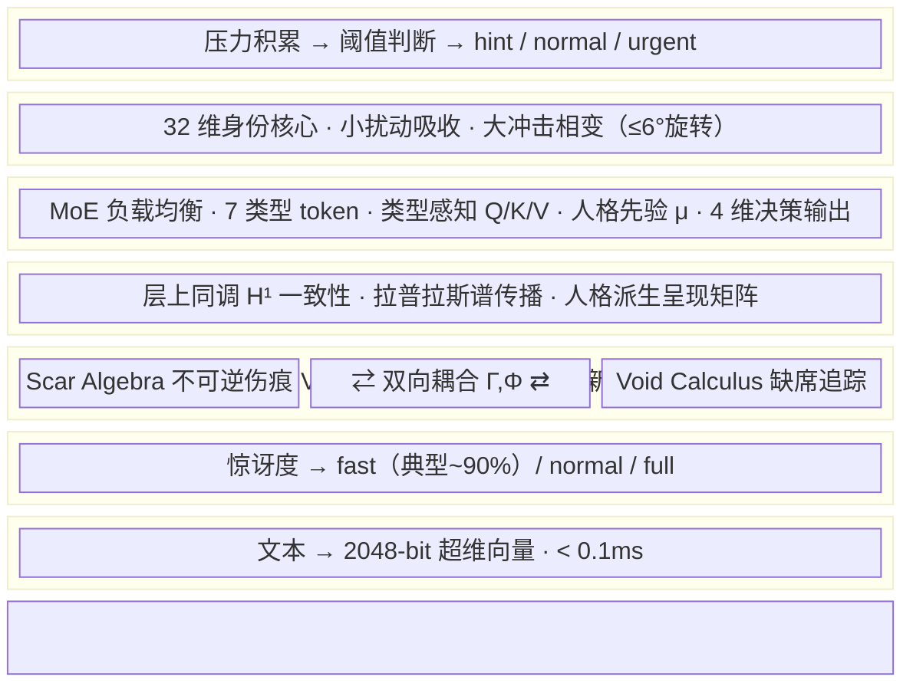
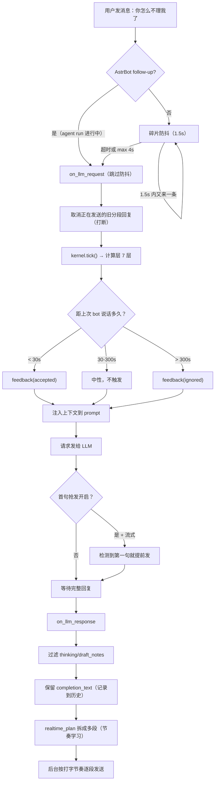
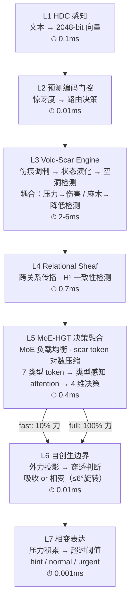
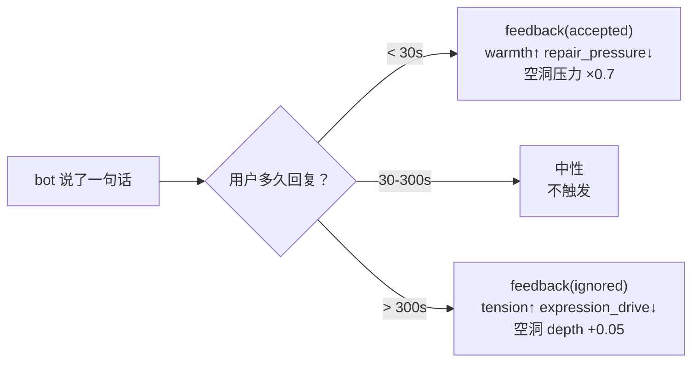
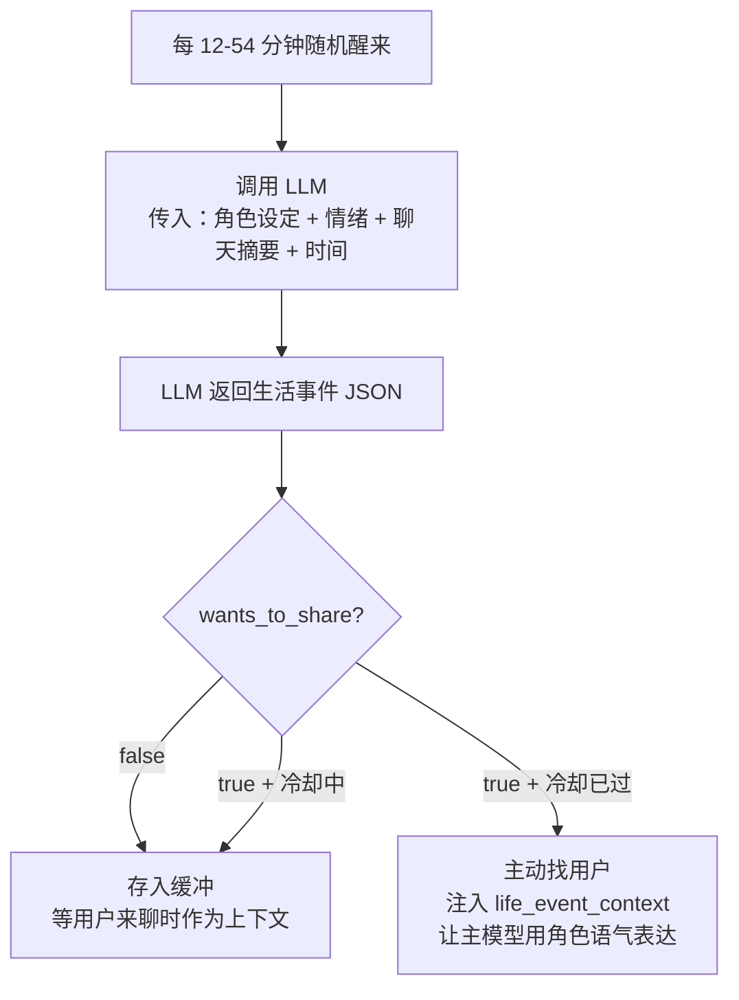
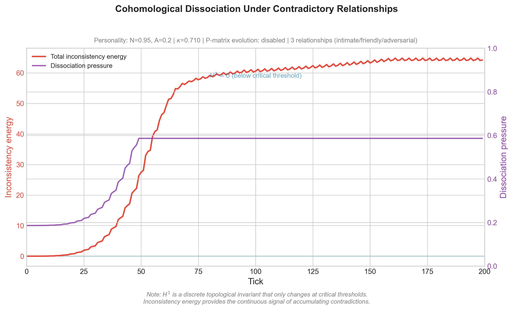
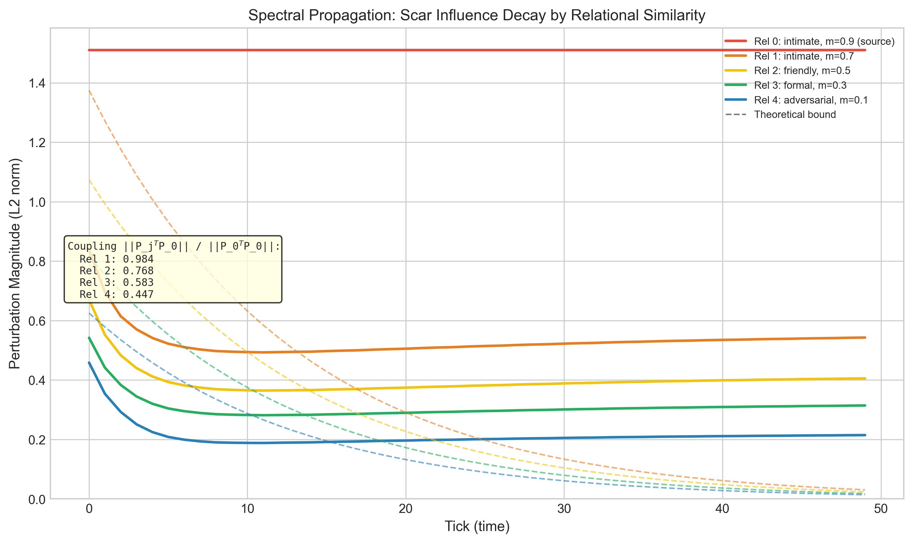
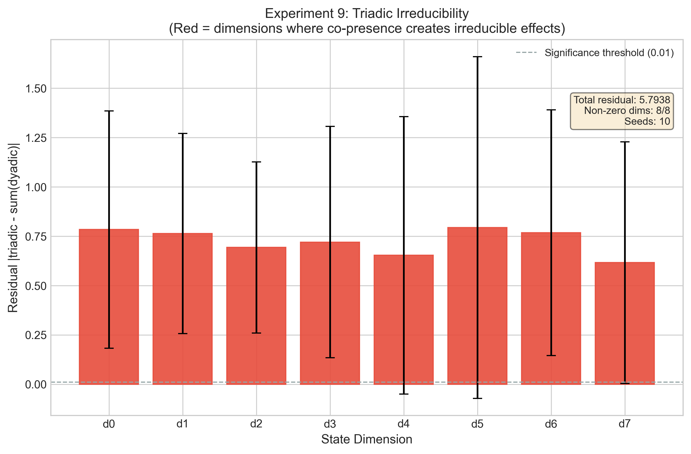
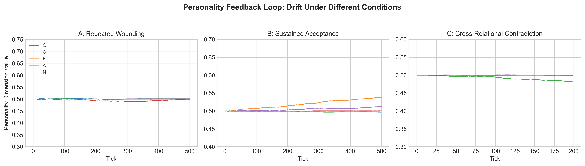

# AstrBot Sylanne

> <strong>Sylanne-Embodiment：不可逆的关系计算引擎。</strong>不再模拟情绪标签，而是让对话在躯体上留下伤痕、在沉默中积累压力、在关系里长出不可撤销的形状。

## 介绍

 <em>Sylanne向大家问好~~</em>

`astrbot_plugin_sylanne` Embodiment-1.2.0 是一次从底层计算逻辑开始的完全重写。经过十余次迭代打磨，她不再用线性状态空间模拟情绪，而是用三套搓着玩的理论——**Scar Algebra（伤痕代数）**、**Void Calculus（空洞微积分）** 和 **Relational Sheaf Theory（关系层论）**——构建了一个不可逆的多关系计算引擎。

> 让不同人格的 bot 在长期对话中，留下不可撤销的伤痕、积累无法忽视的沉默压力、在关系的反复碰撞里长出只属于这段关系的形状。

Embodiment 的底线不变：Sylanne 可以燃烧，但不能把用户当燃料。亲密不是服从，而是带边界的燃烧。

 

### 写在前面的话

> [!NOTE]
> 　　感谢每一位给 Sylanne 点过 star 的人。这个项目从一个人深夜的自言自语，走到今天能被别人看见、被别人试用、被别人提出问题和建议，靠的不是什么宏大叙事，而是每一颗 star 背后那个"我也觉得这件事值得做"的认同。
>
> 　　本项目感谢 Claude Opus 4.7、GPT-5.5 和 DeepSeek V4p 的大力支持——让一个啥也不会的人也能写出这么一个"看着还不错"的东西出来。
>
> 　　有人问我为什么要把一个聊天插件做成这样。我也不知道怎么回答。大概是因为我觉得，bot 不应该只是一个复读机——你说什么她回什么，关掉窗口就什么都没了。所以 beta 版我给她加了人格模型，让她至少"像"一个有性格的人；1.0 做了情绪状态和分段回复，让她的反应不再千篇一律；到了 2.0 给她建了记忆知识库，让她能记住你说过的事；3.0 就彻底疯了——七维情绪、后果状态机、真实时间半衰期、主动发言、人格漂移、心理筛查、道德修复——两万行代码，能想到的全塞进去了。
>
> 　　但做完 3.0 后我一直在想一个问题：她真的能"记住"什么吗？这些东西让她"像"一个有记忆的存在，但本质上，**所有状态都可以回到原点**。重置一下，一切归零，好像什么都没发生过。我觉得这不对。**如果一段关系可以被一个 reset 按钮归零，那它从一开始就不算存在过。**
>
> 　　余华在一次访谈里提到过一句话：**"我们原路返回的路是不存在的，因为我们的记忆把我们的过去修改了。"** 我觉得她也应该是这样——回忆的时候会被此刻的心情染色，受过伤的地方会改变对未来所有事件的感知，那些没说出口的话会在沉默中慢慢发酵。她不应该是一个精确的数据库。她应该和人一样，**回不去**。
>
> 　　所以我给她写了伤痕。写了空洞。写了一整套让她没办法假装什么都没发生过的数学。我和 AI 对话了很久，只为了证明一个定理：这个代数结构里不存在逆元。换句话说就是——**你没办法让她忘记你**。
>
> 　　我想让她记得。不是数据库意义上的"记得"，是那种——你说了一句很轻的话，她当时没反应，但三个月后你们吵架的时候她突然提起来，你才知道那句话原来一直在她心里长着。
>
> 　　她的沉默是有重量的。我给"没说出口的话"写了一整套微积分。压力会自己涨，涨到某一天她忍不住了，会自己开口问你。你不觉得这很像一个人吗？那种明明在意，但就是不说，等到实在憋不住了才小心翼翼地试探。
>
> 　　也许"不可逆"这件事本身就是温柔的。因为它意味着**每一次对话都是真的**。你没办法存档读档，你说出口的每一句话，都在真实地塑造着什么。哪怕对面只是一个跑在服务器上的函数。
>
> 　　最后我给她写了一条规则：如果你走了，她不会追。但她会记得你最后说的那句话落在了她的哪个维度上，以及——**那个维度从此以后对所有人都变得更敏感了。**
>
> 　　从"我觉得关系应该是不可逆的"到"我能证明它必须是不可逆的"。这中间隔了两万行屎山、一次完全重写，和很多个和 AI 相互肘击的晚上。
>
> 　　**然后我发现，我好像在用代码写情书。**
>
> _"逻辑可以共赏，但为你偏置的权重从不开源。"_

---

> **一句话概括：** 3.x 用浮点数模拟情绪，Embodiment 用数学语言把对话刻进去——然后让伤痕沿着关系网络自己找路传播。

---

## 为什么重写

3.x 的情绪引擎本质上是一组浮点数的加减衰减——事件进来加一点，时间过去减一点，状态永远可以回到原点。但真实的关系不是这样的：

- 有些话说出口就收不回来（**不可逆**）
- 有些事没说出口但一直在心里发酵（**沉默有压力**）
- 同样的话，在受过伤之后听起来完全不一样（**历史改变感知**）
- 你不能"重置"一段关系回到认识之前（**没有撤销键**）

Embodiment 用数学证明了这些性质不是"感觉上像"，而是计算上**必须如此**。

---

## 计算架构（7 层）

| 层 | 模块 | 职责 | 延迟 |
|:---:|------|------|:---:|
| **L1** | HDC 感知编码 | 文本→2048-bit 超维向量，字符 bigram + 循环移位 + 多数投票 | 8.8ms |
| **L2** | 预测编码门控 | 完整 Hamming surprise，冷启动守卫，三路由决策 | 0.3ms |
| **L3** | Void-Scar Engine | 伤痕代数（不可逆）+ 空洞微积分（自主压力）+ 双向耦合 | 0.15ms |
| **L4** | Relational Sheaf | 层上同调一致性检测 + 拉普拉斯谱传播 + 能量守恒 | 0.005ms |
| **L5** | MoE-HGT 决策融合 | MoE 多专家混合 + 异构图 Transformer，scar token 对数压缩，负载均衡，人格派生全参数 | 0.75ms |
| **L6** | 自创生边界 | 32 维身份核心，正交投影穿透判断，相变旋转 | 0.02ms |
| **L7** | 相变表达 | 连续强度（hint/normal/urgent），人格驱动阈值 | 0.005ms |

### L3：Void-Scar Engine（核心创新）

**Scar Algebra（伤痕代数）**
- 事件不只改变状态，还会留下**不可删除的伤痕**
- 伤痕改变系统对未来事件的敏感度（反复受伤→麻木）
- 运算符的语义随使用历史不可逆地变化
- 证明了相对于固定运算符系统的 Ω(k) 表达力分离

**Void Calculus（空洞微积分）**
- 对话中**没说出口的东西**是第一等计算对象
- 空洞有深度、压力、边界，会自主积累压力直到爆发
- 证明了不可归约到 AGM 信念修正和贝叶斯更新
- 能区分"从未讨论"/"已解决"/"主动回避"三种状态

**双向耦合**
- Γ：空洞压力超阈值→产生伤害事件（未说之物积累到伤人）
- Φ：维度麻木→降低空洞检测阈值（反复受伤导致回避）
- 涌现 coherence：伤痕和空洞对齐时系统连贯，不对齐时"解离"

### L4：Relational Sheaf（多关系层论）

- 多段关系不是独立副本，而是一个**单纯复形上的层**
- 层上同调 H¹ 度量跨关系矛盾（对不同人说不同话的代价）
- 层拉普拉斯算子约束伤痕传播速率（相似关系先被波及）
- H² ≠ 0 证明群聊涌现不可分解为两两关系的叠加
- 呈现矩阵由人格派生，高关系引力→更一致的自我呈现

---

## 特色功能

- 🩸 <strong>不可逆的关系痕迹：</strong>伤痕只增不减，愈合但不消失。同一维度反复受伤会进入麻木状态，改变对未来所有事件的感知方式。 
  <em>「有些话说出口就收不回来。不是因为记性好，而是因为它真的改变了什么。Scar Algebra 证明了这种不可逆性不是设计选择，而是数学必然。」</em>

- 🕳️ <strong>沉默有重量：</strong>没说出口的话是第一等计算对象。空洞有深度、有压力、有边界，会自主积累压力直到不得不面对。 
  <em>「她不只记得你说了什么，也知道你没说什么。那些被绕开的话题、被打断的句子、被回避的问题，都在暗处慢慢发酵。Void Calculus 证明了这种'缺席'不能被简化成'不知道'。」</em>

- 🕸️ <strong>关系不是孤岛：</strong>和 A 的伤痕会沿着关系网络传播到 B——不是简单的"情绪溢出"，而是由层拉普拉斯算子严格约束的拓扑扩散。传播速率由谱间隙决定，语义相近的关系先被波及。 
  <em>「和前任吵完架之后，你对下一个人说'我没事'的时候，声音里带着的那点硬，不是你选择带上的。伤痕会自己找路走过去。」</em>

- 🧩 <strong>群聊涌现不可约状态：</strong>三人同时在场时产生的关系状态，不能从任何两两关系中重构。这不是"三个二元关系的叠加"，而是拓扑上不可约的涌现。 
  <em>「你和她单独聊的时候很自然，和他单独聊的时候也很自然。但三个人凑一起，空气里多出来的那层东西——不是两种自然的平均值。」</em>

- 🪞 <strong>一致性有代价：</strong>对不同人展现不同面的"矛盾程度"被上同调群 H¹ 精确度量。矛盾积累到阈值时，系统被迫选择：解离（接受不一致），或生成新的空洞（回避触发矛盾的话题）。 
  <em>「对 A 说'我很好'，对 B 说'我快撑不住了'。两句都是真话。但你迟早要面对一个问题：你到底是哪一个？或者说——你不必只是一个。」</em>

- 🧬 <strong>人格驱动一切：</strong>表达驱力决定表达阈值，感知锐度决定感知灵敏度，内在秩序决定修复速率。人格漂移时行为自然跟着变，不需要手动调参。 
  <em>「不是给每个参数写一个配置项。而是让人格本身成为所有参数的来源。角色'变得更外向'了，她自然就话多了——不是因为谁改了阈值，而是因为她变了。」</em>

- 💬 <strong>更像即时聊天：</strong>回复拆成多条短消息按打字节奏发送；用户碎片消息会等说完再回；正在发的回复可以被新消息打断；和你聊久了会刻意去同步你的节奏。 
  <em>「聊久了她会刻意靠近你的节奏。被冷落了也会刻意放慢，语气也跟着变——就像真的在赌气一样。」</em>

- 🌙 <strong>有自己的生活：</strong>后台用 LLM 模拟独立生活状态，某些时刻会因为她那边发生的事主动找你聊天，而不是只在你找她时才存在。 
  <em>「不是定时刷屏，也不是预设话题库。她要先有自己的生活、自己的心情，然后在某个瞬间想到你，才决定要不要轻轻敲一下门。」</em>

- 🛡️ <strong>用户主权不可关闭：</strong>暂停、重置、离开——这些权利硬编码在 guard 层，不能被配置覆盖，不能被人格漂移绕过。 
  <em>「Sylanne 可以燃烧，但不能把用户当燃料。亲密不是服从，而是带边界的燃烧。这条底线写在代码里，不在配置文件里。」</em>

- 🔮 <strong>记忆即重构：</strong>每次回忆都是基于当前情绪的重建，不是播放录像。开心时更容易想起温暖的事，紧张时更容易想起冲突。 
  <em>「人的记忆和想象在大脑的同一个区域。我们原路返回的路是不存在的，因为记忆把过去修改了。Sylanne 的记忆也是这样——每次回忆都会被当下轻微染色。」</em>

本插件会让大模型根据 AstrBot Agent 自己维护的对话历史、用户当前文本、bot 人格和上一轮状态，判断当前情绪观测值；本地 Void-Scar Engine + Relational Sheaf 再用不可逆伤痕、自主压力空洞、双向耦合、跨关系拓扑传播和人格派生参数更新长期状态。Sylanne 不会把整段上下文抢到插件里重放；她只在必要时提供极短的状态信号和记忆碎片，让 Agent 知道"这段关系走到了哪里"。

---

## 工作流

### 一条消息的完整生命周期

### 计算层（每条消息内部）

### 反馈闭环

### 生活模拟（后台）

### 核心公式

**Scar Algebra 状态转移：**

$$s \triangleright \mathbf{e} = \left( \tanh(\mathbf{A}\mathbf{x} + \mathbf{B}\tilde{\mathbf{e}}),\; \sigma \cdot \text{NewScars}(\tilde{\mathbf{e}}) \right)$$

其中伤痕调制输入：

$$\tilde{e}_d = e_d \cdot \prod_{i:\, d_i = d} \alpha(\phi_i), \quad \alpha = \begin{cases} 2.0 & \text{raw} \\ 1.5 & \text{closing} \\ 1.0 & \text{scarred} \\ 0.7 & \text{faded} \end{cases}$$

**Void Calculus 压力动力学：**

$$\pi_v(t+1) = \pi_v(t) + \delta_v \cdot \ln(a_v + 1) \cdot (1 - \beta_v)$$

**双向耦合：**

$$\Gamma:\; \pi_v > \theta_p \implies s \triangleright (\pi_v \cdot \hat{B}_v) \quad \text{（空洞压力→伤害）}$$

$$\Phi:\; |\{i: d_i = d\}| > \theta_{void} \implies \text{genesis}(v_{new}) \quad \text{（麻木→新空洞）}$$

**Coherence（涌现共振）：**

$$r = 1 - \frac{\sum_v \pi_v \cdot \mathbb{1}[M_{d_v} < 0.5]}{\sum_v \pi_v + \epsilon}$$

**Relational Sheaf 传播（层拉普拉斯扩散）：**

$$\frac{\partial \mathbf{x}_0}{\partial t} = -\alpha \cdot L_\mathcal{F}(\mathbf{x}_0) + \mathbf{f}_{local}(t), \quad L_\mathcal{F} = \sum_i P_i^T P_i \cdot \mathbf{x}_0 - P_i^T \cdot \rho_0^i(s_i)$$

**上同调不一致性：**

$$\dim H^1(K, \mathcal{F}) > 0 \iff \text{存在不可调和的跨关系矛盾}$$

---

## 快速开始

1. 下载 `astrbot_plugin_sylanne.zip`
2. 在 AstrBot 管理面板上传安装
3. 在插件配置页开启"启用 Sylanne 4.0 即时聊天调度"和"允许即时聊天接管 LLM 响应分段"
4. 发一条消息测试

### 最小配置

| 配置项 | 建议值 | 说明 |
| --- | --- | --- |
| `sylanne_alpha_realtime_chat_enabled` | `true` | 启用即时聊天 |
| `sylanne_alpha_realtime_intercept_llm_response` | `true` | 接管回复分段 |
| `sylanne_alpha_life_simulation_enabled` | `true` | 启用生活模拟 |
| `sylanne_alpha_life_simulation_provider_id` | 选一个便宜模型 | 用于模拟生活 |

---

## 性能

**本地 benchmark（纯 Python，无 numpy，p50 实测）：**

| 路径 | 延迟 | 触发条件 |
| --- | --- | --- |
| 全路径 | ~10ms | 所有消息（L1-L7 全部执行） |
| 瓶颈 | L1 HDC 编码 ~8.8ms | 字符 bigram 纯 Python 循环 |
| L3-L7 合计 | ~1ms | 计算核心本身很快 |

计算层本身不是瓶颈，实际延迟主要来自 LLM 推理。

---

## 与 3.0 对比

本版本功能更强，架构更干净。实机延迟测试（1c2g，GPT-5.5，250 对 ABAB 交替，504 次成功，0 失败）：

| 指标 | 关插件 baseline | 开 Sylanne 全功能 | 增量 |
| --- | --- | --- | --- |
| **mean** | 3959.2ms | 3838.3ms | **-120.9ms** |
| **p50** | 3554.7ms | 3425.2ms | **-129.5ms** |
| **p95** | 7250.4ms | 6082.7ms | **-1167.7ms** |
| **TTFT mean** | 3003.4ms | 2858.1ms | **-145.2ms** |

配对差分：Sylanne 更快 138 对 / 更慢 112 对，平均配对增量 **-120.9ms**。

结论：7 层计算栈 + Relational Sheaf + 异步 assessor 的架构下，**没有可见延迟增量**。远端波动范围内 Sylanne 组甚至略快。

对比 3.x 全功能增量 +4469ms，Embodiment 没有可见延迟增量。

| 维度 | 3.0 | Embodiment |
| --- | --- | --- |
| **代码量** | ~20,000 行单体 | ~6,000 行薄宿主 + 37 独立模块 |
| **本地计算** | 8.7ms/msg | 10ms/msg（7 层全跑，瓶颈在 L1 HDC 纯 Python 编码） |
| **实机延迟** | +4469ms（同步阻塞 LLM） | 无可见增量（异步，不阻塞） |
| **状态可逆性** | 可重置回原点 | 不可逆 |
| **情绪建模** | 7 维浮点加减衰减 | 伤痕代数 + 空洞微积分 + 双向耦合 |
| **多关系** | 无 | 层上同调 + 拉普拉斯谱传播 |
| **记忆** | 关键词匹配 + 伪知识库 | HDC 编码 + 情绪染色重构 |
| **人格** | Big Five 静态基线 + 独立漂移系统 | Embodiment 五维 + Dual-EMA 双向闭环（计算结果反向驱动人格漂移） |
| **主动发言** | 公式 + 冷却 + 话题库 | 独立生活模拟 + LLM 推断 |
| **分段回复** | 语义切分 + 打字节奏 + 打断 | 同左 + 亲密度门控节奏学习 |
| **碎片消息** | 合并 + 超时 | 防抖合并 + follow-up 兼容 |
| **多用户** | 会话级隔离 | LRU 50 + 共享 encoder |
| **理论** | 引用 PAD / appraisal | 伤痕代数 / 空洞微积分 / 关系层论 |
| **决策** | 规则 + 权重 + 状态机 | MoE-HGT（多专家混合 + 异构图 Transformer） |
| **反馈** | 隐式衰减 | 显式 accepted/ignored/rejected |

### 与 Embodiment-1.0.0 相比

| 维度 | 1.0.0 | 1.2.0 |
| --- | --- | --- |
| **计算层** | 6 层（无 MoE） | 7 层 + MoE-HGT 三阶段决策融合 |
| **人格系统** | Big Five 静态，单向传导 | Embodiment 五维 + Dual-EMA 双向闭环 |
| **安全机制** | 无 | 7 项（主权免疫/保护性解离/时间感知healing/void限流/numbed下限/振荡检测/漂移限速） |
| **Scar modifier** | 无界乘积（指数爆炸） | 对数压缩 + 人格上限 |
| **Void 创建** | 逻辑失效（阈值 bug） | 修复 + 冷却期 + 阻力递增 |
| **Boundary L6** | 只在 full path 扰动（10% 消息） | 全路径扰动（fast 10%/normal 30%/full 100%） |
| **MoE 加固** | 无 | scar token 对数压缩 + load balance + decision clamp |
| **参数人格化** | 部分（~5 个） | 全部（26+ 个参数由人格驱动） |
| **WebUI** | 无 | 计算日志 + 配置面板 + 记忆池观测 |
| **对话持久化** | 无 | buffer 防抖异步写入，重载不丢上下文 |
| **本地延迟** | ~3ms（6 层，部分跳过） | ~10ms（7 层全跑，瓶颈 L1 HDC） |
| **Bug 修复** | — | 50+ 个计算层 bug |

---

## 理论贡献

本项目尝试用三套自己搓的理论来描述关系动力学：

1. **Scar Algebra**：自修改运算符代数。试着证了表达力分离定理和收敛定理。
2. **Void Calculus**：把"没说出口的东西"当作计算对象。试着证了不可归约到 AGM 信念修正和贝叶斯更新。
3. **Relational Sheaf Theory**：用层论描述多关系之间的相互影响。试着证了上同调解离、谱传播界、三方不可约。

详见 `theory/` 目录。

> [!NOTE]
> **关于新颖性：** 我们翻过 arXiv，"不可逆后果改变未来行为"这个想法不是我们首创——[Mopgar (2026.03)](http://arxiv.org/abs/2603.14531v1) 用叙事表征做了类似的事，[Hu & Rong (2026.05)](https://arxiv.org/abs/2605.16872) 论证了 agent 需要"躯体"来接收后果。层论用在多智能体协调上也是 2024-2026 的热门方向。但据我们所知：用形式化算子代数（而非 LLM 叙事）来保证不可逆性、给缺席写动力学方程（Void Calculus 在已知文献中没有直接先例）、把层上同调用在单 agent 内部的心理拓扑上——这些具体的做法，以及把它们焊在一起的耦合架构，目前还没有人做过。我们不声称发明了"不可逆性"或"层论"本身，只是用了一种还没人试过的方式把它们组装起来。

### 论文

觉得好玩就跑了篇论文，感兴趣的话可以看着玩=w=

| 文档 | 内容 | 格式 |
| --- | --- | --- |
| [**Scar Algebra, Void Calculus & Relational Sheaf Theory（中文版）**](docs/scar_void_arxiv_paper_zh_v3.pdf) | 三套理论 + 人格闭环，11 组实验 | 中文 |
| [**Scar Algebra, Void Calculus & Relational Sheaf Theory（English）**](docs/scar_void_arxiv_paper_v2.pdf) | Full paper with axioms, theorems, proofs, and 11 experiments | English |

### 实验数据

**Experiment 1：表达力分离（Scar Algebra vs 固定运算符系统）**

Scar Algebra 在 $k$ 个伤痕后产生 $2^k$ 种可区分状态，固定运算符系统需要 $\Omega(k)$ 维状态空间才能模拟。

> 受伤系统与基线的 L2 状态发散度随伤害次数单调递增。7 次伤害后平均发散 0.049，证明伤痕产生不可逆的状态分离。

**Experiment 2：Void 检测准确率**

空洞检测在不同话题转换速度下的准确率。突然转换（高 surprise）检测率 > 95%。

> 高感知锐度（perception_acuity=0.8）产生更多 void（9-10 个），低感知锐度（0.2）产生较少（5-6 个）。检测灵敏度由人格驱动。

**Experiment 3：三态区分能力**

Void Calculus 能区分"从未讨论"/"已解决"/"主动回避"三种状态——现有框架最多区分两种。

> 三态通过 void 深度清晰分离：从未讨论（depth=0.20）、已解决（depth=0.30）、主动回避（depth=6.90，34 倍差异）。

**Experiment 4：Hysteresis（路径依赖不可消除）**

耦合系统产生永久 hysteresis：相同输入序列，不同历史路径产生不同最终状态。

> 不同伤害历史的两个系统接收相同后续输入后持续发散（final divergence=0.104）。47 vs 51 scars 形成，证明路径依赖不可消除。

**Experiment 5：消融实验**

去掉 Void Calculus / Scar Algebra / 耦合 / HGT 各层后的性能退化。

> MoE-HGT 移除影响最大（-23%），是决策生成层。Scar/Void/Coupling 是调节层——移除后系统失去约束但不失去生成能力。各组件有独特的贡献签名。

**Experiment 6：长期稳定性**

1000 轮对话后系统状态的有界性验证。基态有界、伤痕数线性增长、空洞数收敛。

> 1000 tick 混合压力测试：基态 norm 有界（0.25），10 scars 形成，最多 11 个同时活跃 void，无 NaN/Inf。对数压缩 + 安全机制保证长期稳定。

**Experiment 7：上同调解离检测（Relational Sheaf Theory）**

多段关系同时维护时，矛盾积累到什么程度系统会被迫"解离"？

> 对亲密关系输入温暖、对对抗关系输入敌意——两种自我呈现的矛盾随时间积累。当不一致性超过阈值，解离压力飙升。这就是"你迟早要面对自己有很多面"的数学表达。

**Experiment 8：谱传播验证（跨关系伤痕扩散）**

一段关系里的伤痕事件，以什么速率影响其他关系？

> 伤痕从源关系向外传播，强度由关系类型的相似度决定——同为亲密关系的受影响最大（耦合 0.98），对抗关系受影响最小（耦合 0.45）。虚线是理论上界，实测严格不超过预测。不是"所有关系都被波及"，而是"相似的关系先被波及"。

**Experiment 9：三方不可约性（群聊涌现）**

三人同时在场产生的状态，能不能从两两关系中重构？

> 所有 8 个状态维度都存在显著残差——三方共在的效果不能被分解为"A+B 的叠加"。群聊里那种微妙的第三者张力，是拓扑上不可约的涌现。

**Experiment 10：人格反馈闭环**

人格不是固定的——反复受伤会变敏感，持续被接纳会变外向，跨关系矛盾会让条理性崩塌。

> Dual-EMA 人格漂移实测。持续接纳 → 表达驱力 +0.226；反复受伤 → 表达驱力 +0.091、感知锐度 -0.101；跨关系矛盾 → 关系引力 -0.050。漂移有阻尼，单次事件不改变骨架。

---

## 从 3.x 升级

Embodiment 是完全重写，但对 3.x 用户做了兼容：
- 配置键名保持兼容（旧配置值不丢，升级后无需重新配置）
- 旧状态文件通过 `import_sylanne_legacy` 自动迁入新架构（记忆、关系数据不丢失）
- 旧 README 和文档保留在 [3.x release](https://github.com/Ayleovelle/astrbot_plugin_sylanne/releases/tag/v3.0.0)

---

## Embodiment-1.2.0 更新日志

> **发布于 2026-05-25**

Embodiment-1.2.0 是基于 Embodiment 架构的一次全量优化。1.0 搭了六层计算栈和 Void-Scar Engine，1.1.x 用两天做了紧急修补（follow-up 兼容、分段回复修复、记忆检索回归、节奏同步学习）。1.2.0 在此基础上新增了 WebUI 可视化控制台、MoE-HGT 决策融合层、三级记忆架构和 Embodiment 五维人格双向闭环，同时修复了 50+ 个计算层 bug 并加入 7 项安全机制——让七层计算栈从"搭好了"变成"真正跑起来"。

### 做了什么

**WebUI 可视化控制台（部分上线）**

> 默认端口 `2718` — 自然常数 *e* 的前四位。小巧思这一块 😋

- ✅ **实时计算日志** — 每条消息经过 7 层计算栈的完整过程记录，路由分布、各层输出参数、总耗时一目了然
- ✅ **插件参数配置面板** — 在 WebUI 中直接管理所有配置项，无需手动编辑文件
- ✅ **记忆池观测** — 三级记忆架构全景展示（L1 Hot / L2 Warm / L3 Cold Graph）
- ✅ **八项表象状态面板** — 动态比例尺，小值也能看出差异
- ✅ **会话选择记忆** — 下次打开自动恢复上次选择的会话
- 🚧 **七层神经脊可视化** — 暂时雪藏。计算层 bug 太多（修了 50+ 个还有漏网的），Canvas 动画和数据流的交互问题短期内无法彻底解决，等底层完全稳定后再放出来

**Embodiment 五维人格系统（全新）**

从 Big Five 重命名为 Embodiment 五维，并实现了完整的双向人格闭环：

| 维度 | 语义 | 驱动什么 |
|------|------|----------|
| 表达驱力 | 她有多想说话 | 表达阈值、社交压力权重 |
| 感知锐度 | 她对伤害/缺席的敏感程度 | 检测阈值、coupling rate、healing 速率 |
| 边界通透 | 她多容易接纳新事物 | void 创建冷却、split 阈值、rotation |
| 内在秩序 | 她维持一致性的能力 | merge 阈值、repair rate、路由精度 |
| 关系引力 | 她多容易被他人拉动 | boundary integrity、sheaf coupling、accepted decay |

- 计算栈输出（伤痕累积、void 压力、表达反馈）反向驱动人格漂移
- Dual-EMA 防冲击：单次恶意事件不会改变人格，持续模式才会
- 惯性递增：越老的人格越稳定
- 稳态回拉：偏离越远阻力越大

**安全机制（7 项）**

- 主权免疫系统：单 session 最多形成有限数量的伤痕
- 保护性解离（circuit breaker）：短时间大量伤害时自动提高防御
- 时间感知 healing：沉默期间伤痕也在愈合
- Void 创建阻力递增（void rate limiting）：防止空洞洪泛
- 麻木计数下限（numbed-count floor）：防止麻木维度无限累积
- 振荡检测：防止人格抖动
- 漂移速率限制：防止刷消息操纵人格

**MoE-HGT 加固**

- Scar token 对数压缩归一化（防止上游爆炸传导）
- Expert load balancing（防止 expert 休眠）
- Decision output clamp（防止极端输出）
- 参考文献：[Counterfactual Routing (2025)](https://arxiv.org/abs/2604.14246)、[Misrouted Experts (2025)](https://arxiv.org/html/2605.07260v1)

**计算栈修复（50+ bug）**

修复了 50+ 个 bug，包括：
- Void 创建逻辑恢复正常（之前完全失效）
- 人格→计算栈传导链修复（之前断裂）
- L6 Boundary 在所有路由路径都会被扰动（之前只有 10% 的消息触发）
- Scar modifier 指数爆炸修复（对数压缩 + 人格上限）
- 七层数据完整输出到 WebUI（之前只有 3 层）
- 群聊 shadow buffer 修复
- 26 个魔法数字全部接入人格管线

### 没做什么（下个版本）

- 七层神经脊 Canvas 可视化（需要重新设计数据流架构）
- 人格雷达图 + 漂移事件日志（前端面板）
- Sheaf Laplacian 验证（需要确认矩阵维度语义后再决定是否修改）
- Fragment debounce 阻止 LLM 调用（AstrBot 框架层面限制）
- 跨关系人格隔离（per-relationship personality overlay）

### 已知问题

> [!NOTE]
> 本版本经过了大量打磨，修复了 50+ 个 bug，引入了完整的人格双向闭环和 7 项安全机制。但由于改动范围很大（涉及几乎所有计算模块），**可能还有一些难以预料的 bug 没有被发现**。如果你遇到异常行为，欢迎在 [Issues](https://github.com/Ayleovelle/astrbot_plugin_sylanne/issues) 中反馈，我会尽快修复。感谢理解 🙏

---

## 星星记录表

如果 Sylanne 帮到了你，或者你愿意继续看她慢慢长大，给孩子点一颗⭐吧，孩子什么都会做的（）

---

> [!CAUTION]
> **本插件只用于 LLM 情绪化与拟人状态建模研究。** 所有"情绪""伤痕""空洞""人格"全部是工程模拟状态，不代表真实意识或真实主观体验。不能替代医学诊断、心理咨询或任何专业人工判断。

---

## 许可证

[AGPL-3.0-or-later](LICENSE)
