# AstrBot Sylanne

> <strong>Sylanne-Embodiment：不可逆的关系计算引擎。</strong>不再模拟情绪标签，而是让对话在躯体上留下伤痕、在沉默中积累压力、在关系里长出不可撤销的形状。

## 介绍

`astrbot_plugin_sylanne` Embodiment-1.0.0 是一次从底层计算逻辑开始的完全重写。经过十次迭代打磨，她不再用线性状态空间模拟情绪，而是用两套原创形式化理论——**Scar Algebra（伤痕代数）** 和 **Void Calculus（空洞微积分）**——构建了一个不可逆的关系计算引擎。

> 让不同人格的 bot 在长期对话中，留下不可撤销的伤痕、积累无法忽视的沉默压力、在关系的反复碰撞里长出只属于这段关系的形状。

Embodiment 的底线不变：Sylanne 可以燃烧，但不能把用户当燃料。亲密不是服从，而是带边界的燃烧。

 

### 写在前面的话

　　感谢每一位给 Sylanne 点过 star 的人。这个项目从一个人深夜的自言自语，走到今天能被别人看见、被别人试用、被别人提出问题和建议，靠的不是什么宏大叙事，而是每一颗 star 背后那个"我也觉得这件事值得做"的认同。

　　做完 3.0 后我一直在想一个问题：3.0 的 Sylanne 真的能够完美实现那个目标吗？七维情绪加减衰减、关系后果状态机、真实时间半衰期——这些东西让她"像"一个有记忆的存在，但本质上，所有状态都可以回到原点。重置一下，一切归零，好像什么都没发生过。而且为了实现这些功能，3.0 竟然造出了两万行代码的巨大屎山。为了防止后来的某天给我爆一个大的，我不如现在头疼点直接重构，并且重新设计 Sylanne 的内核。

　　前些天我看到余华在 Tim 的访谈里提到，他的朋友跟他说过这么一句话："人的记忆和人的想像是在大脑的同一个区域，我们原路返回的路是不存在的，因为我们的记忆把我们的过去修改了。"是啊，如果连人自己的记忆都不是客观的回放，而是每次回忆都在被当下重新塑造，那 Sylanne 的记忆为什么要假装自己是一个精确的数据库？她应该和人一样——回忆的时候会被此刻的心情染色，受过伤的地方会改变对未来所有事件的感知，那些没说出口的话会在沉默中慢慢发酵。原路返回的路不存在，对她也一样。

　　所以 Embodiment 回答的问题不再是"关系能不能留下痕迹"，而是：**这种不可逆性能不能被严格证明？** Scar Algebra 的 Axiom 1 证明了这一点——不是我选择不给撤销键，而是这个代数结构里根本不存在逆元。

　　从"我觉得关系应该是不可逆的"到"我能证明它必须是不可逆的"。这大概就是从 3.0 到 Embodiment 真正变了的东西。

_"逻辑可以共赏，但为你偏置的权重从不开源。"_

---

> **一句话概括：** 3.x 用浮点数模拟情绪，Embodiment 用数学语言把对话刻进去。

---

## 为什么重写

3.x 的情绪引擎本质上是一组浮点数的加减衰减——事件进来加一点，时间过去减一点，状态永远可以回到原点。但真实的关系不是这样的：

- 有些话说出口就收不回来（**不可逆**）
- 有些事没说出口但一直在心里发酵（**沉默有压力**）
- 同样的话，在受过伤之后听起来完全不一样（**历史改变感知**）
- 你不能"重置"一段关系回到认识之前（**没有撤销键**）

Embodiment 用数学证明了这些性质不是"感觉上像"，而是计算上**必须如此**。

---

## 计算架构（7 层）

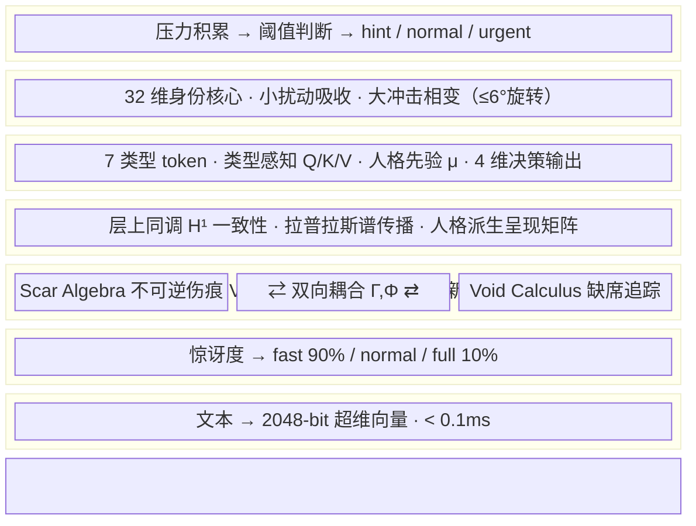

| 层 | 模块 | 职责 | 延迟 |
|:---:|------|------|:---:|
| **L1** | HDC 感知编码 | 文本→2048-bit 超维向量，字符 bigram + 循环移位 + 多数投票 | 0.1ms |
| **L2** | 预测编码门控 | 完整 Hamming surprise，冷启动守卫，三路由决策 | 0.01ms |
| **L3** | Void-Scar Engine | 伤痕代数（不可逆）+ 空洞微积分（自主压力）+ 双向耦合 | 2-6ms |
| **L4** | Relational Sheaf | 层上同调一致性检测 + 拉普拉斯谱传播 + 能量守恒 | 0.7ms |
| **L5** | HGT 决策融合 | 7 类型异构图 Transformer，人格派生全参数，零学习 | 0.4ms |
| **L6** | 自创生边界 | 32 维身份核心，正交投影穿透判断，相变旋转 | 0.01ms |
| **L7** | 相变表达 | 连续强度（hint/normal/urgent），人格驱动阈值 | 0.001ms |

### L3：Void-Scar Engine（核心创新）

**Scar Algebra（伤痕代数）**
- 事件不只改变状态，还会留下**不可删除的伤痕**
- 伤痕改变系统对未来事件的敏感度（反复受伤→麻木）
- 运算符的语义随使用历史不可逆地变化
- 证明了相对于固定运算符系统的 Ω(k) 表达力分离

**Void Calculus（空洞微积分）**
- 对话中**没说出口的东西**是第一等计算对象
- 空洞有深度、压力、边界，会自主积累压力直到爆发
- 证明了不可归约到 AGM 信念修正和贝叶斯更新
- 能区分"从未讨论"/"已解决"/"主动回避"三种状态

**双向耦合**
- Γ：空洞压力超阈值→产生伤害事件（未说之物积累到伤人）
- Φ：维度麻木→降低空洞检测阈值（反复受伤导致回避）
- 涌现 coherence：伤痕和空洞对齐时系统连贯，不对齐时"解离"

---

## 特色功能

- 🩸 <strong>不可逆的关系痕迹：</strong>伤痕只增不减，愈合但不消失。同一维度反复受伤会进入麻木状态，改变对未来所有事件的感知方式。 
  <em>「有些话说出口就收不回来。不是因为记性好，而是因为它真的改变了什么。Scar Algebra 证明了这种不可逆性不是设计选择，而是数学必然。」</em>

- 🕳️ <strong>沉默有重量：</strong>没说出口的话是第一等计算对象。空洞有深度、有压力、有边界，会自主积累压力直到不得不面对。 
  <em>「她不只记得你说了什么，也知道你没说什么。那些被绕开的话题、被打断的句子、被回避的问题，都在暗处慢慢发酵。Void Calculus 证明了这种'缺席'不能被简化成'不知道'。」</em>

- 🕸️ <strong>关系不是孤岛：</strong>和 A 的伤痕会沿着关系网络传播到 B——不是简单的"情绪溢出"，而是由层拉普拉斯算子严格约束的拓扑扩散。传播速率由谱间隙决定，语义相近的关系先被波及。 
  <em>「和前任吵完架之后，你对下一个人说'我没事'的时候，声音里带着的那点硬，不是你选择带上的。伤痕会自己找路走过去。」</em>

- 🧩 <strong>群聊涌现不可约状态：</strong>三人同时在场时产生的关系状态，不能从任何两两关系中重构。这不是"三个二元关系的叠加"，而是拓扑上不可约的涌现。 
  <em>「你和她单独聊的时候很自然，和他单独聊的时候也很自然。但三个人凑一起，空气里多出来的那层东西——不是两种自然的平均值。」</em>

- 🪞 <strong>一致性有代价：</strong>对不同人展现不同面的"矛盾程度"被上同调群 H¹ 精确度量。矛盾积累到阈值时，系统被迫选择：解离（接受不一致），或生成新的空洞（回避触发矛盾的话题）。 
  <em>「对 A 说'我很好'，对 B 说'我快撑不住了'。两句都是真话。但你迟早要面对一个问题：你到底是哪一个？或者说——你不必只是一个。」</em>

- 🧬 <strong>人格驱动一切：</strong>外向性决定表达阈值，神经质决定感知灵敏度，尽责性决定记忆深度。人格漂移时行为自然跟着变，不需要手动调参。 
  <em>「不是给每个参数写一个配置项。而是让人格本身成为所有参数的来源。角色'变得更外向'了，她自然就话多了——不是因为谁改了阈值，而是因为她变了。」</em>

- 💬 <strong>更像即时聊天：</strong>回复拆成多条短消息按打字节奏发送；用户碎片消息会等说完再回；正在发的回复可以被新消息打断；高亲密度用户的节奏会被学习和同步。 
  <em>「不要把整段话一次性倒出来。真正的聊天会停顿，会分开发，会犹豫一下再补一句。而且如果对方还在打字，就该等一等再开口。聊久了，你会发现她的节奏越来越像你——不是刻意模仿，是关系本身在同步。」</em>

- 🌙 <strong>有自己的生活：</strong>后台用 LLM 模拟独立生活状态，某些时刻会因为她那边发生的事主动找你聊天，而不是只在你找她时才存在。 
  <em>「不是定时刷屏，也不是预设话题库。她要先有自己的生活、自己的心情，然后在某个瞬间想到你，才决定要不要轻轻敲一下门。」</em>

- 🛡️ <strong>用户主权不可关闭：</strong>暂停、重置、离开——这些权利硬编码在 guard 层，不能被配置覆盖，不能被人格漂移绕过。 
  <em>「Sylanne 可以燃烧，但不能把用户当燃料。亲密不是服从，而是带边界的燃烧。这条底线写在代码里，不在配置文件里。」</em>

- 🔮 <strong>记忆即重构：</strong>每次回忆都是基于当前情绪的重建，不是播放录像。开心时更容易想起温暖的事，紧张时更容易想起冲突。 
  <em>「人的记忆和想象在大脑的同一个区域。我们原路返回的路是不存在的，因为记忆把过去修改了。Sylanne 的记忆也是这样——每次回忆都会被当下轻微染色。」</em>

本插件会让大模型根据 AstrBot Agent 自己维护的对话历史、用户当前文本、bot 人格和上一轮状态，判断当前情绪观测值；本地 Void-Scar Engine + Relational Sheaf 再用不可逆伤痕、自主压力空洞、双向耦合、跨关系拓扑传播和人格派生参数更新长期状态。Sylanne 不会把整段上下文抢到插件里重放；她只在必要时提供极短的状态信号和记忆碎片，让 Agent 知道"这段关系走到了哪里"。

---

## 工作流

### 一条消息的完整生命周期

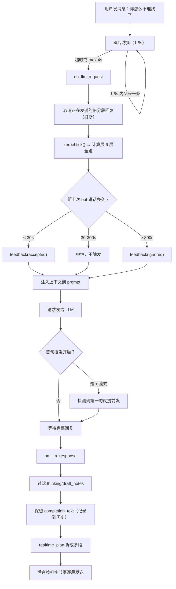

### 计算层（每条消息内部）

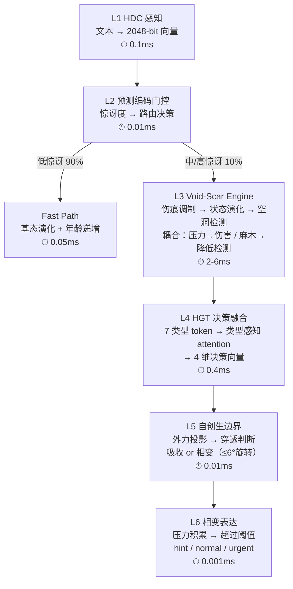

### 反馈闭环

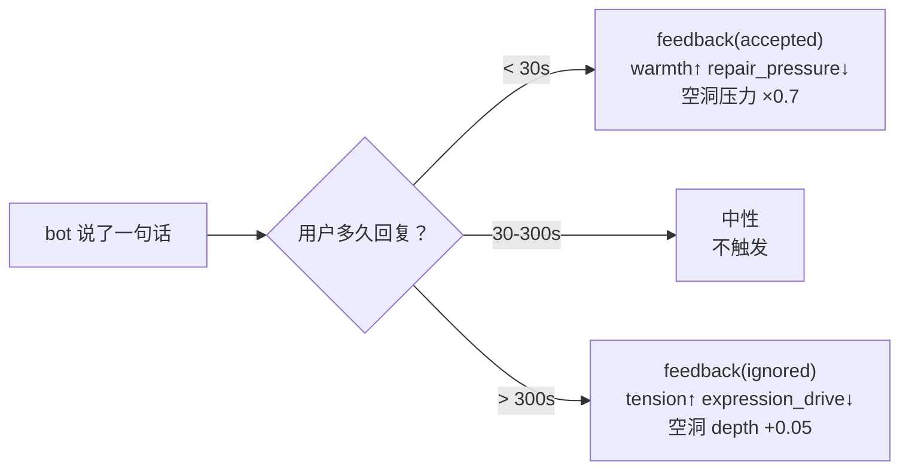

### 生活模拟（后台）

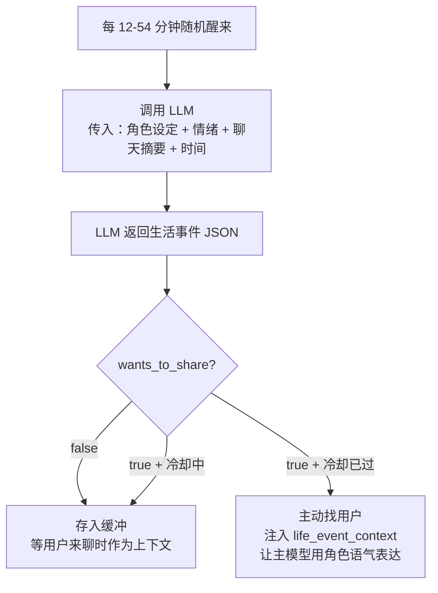

### 核心公式

**Scar Algebra 状态转移：**

$$s \triangleright \mathbf{e} = \left( \tanh(\mathbf{A}\mathbf{x} + \mathbf{B}\tilde{\mathbf{e}}),\; \sigma \cdot \text{NewScars}(\tilde{\mathbf{e}}) \right)$$

其中伤痕调制输入：

$$\tilde{e}_d = e_d \cdot \prod_{i:\, d_i = d} \alpha(\phi_i), \quad \alpha = \begin{cases} 2.0 & \text{raw} \\ 1.5 & \text{closing} \\ 1.0 & \text{scarred} \\ 0.7 & \text{faded} \end{cases}$$

**Void Calculus 压力动力学：**

$$\pi_v(t+1) = \pi_v(t) + \delta_v \cdot \ln(a_v + 1) \cdot (1 - \beta_v)$$

**双向耦合：**

$$\Gamma:\; \pi_v > \theta_p \implies s \triangleright (\pi_v \cdot \hat{B}_v) \quad \text{（空洞压力→伤害）}$$

$$\Phi:\; |\{i: d_i = d\}| > \theta_{void} \implies \text{genesis}(v_{new}) \quad \text{（麻木→新空洞）}$$

**Coherence（涌现共振）：**

$$r = 1 - \frac{\sum_v \pi_v \cdot \mathbb{1}[M_{d_v} < 0.5]}{\sum_v \pi_v + \epsilon}$$

---

## 快速开始

1. 下载 `astrbot_plugin_sylanne.zip`
2. 在 AstrBot 管理面板上传安装
3. 在插件配置页开启"启用 Sylanne 4.0 即时聊天调度"和"允许即时聊天接管 LLM 响应分段"
4. 发一条消息测试

### 最小配置

| 配置项 | 建议值 | 说明 |
| --- | --- | --- |
| `sylanne_alpha_realtime_chat_enabled` | `true` | 启用即时聊天 |
| `sylanne_alpha_realtime_intercept_llm_response` | `true` | 接管回复分段 |
| `sylanne_alpha_life_simulation_enabled` | `true` | 启用生活模拟 |
| `sylanne_alpha_life_simulation_provider_id` | 选一个便宜模型 | 用于模拟生活 |

---

## 性能

**本地 benchmark（纯 Python，无 numpy）：**

| 路径 | 延迟 | 触发条件 |
| --- | --- | --- |
| Fast path | ~0.2ms | 90% 的消息（低惊讶） |
| Normal path | ~3ms | 中等惊讶 |
| Full path | ~7ms | 高惊讶（话题突变、冲突） |

计算层本身不是瓶颈，实际延迟主要来自 LLM 推理。

---

## 与 3.0 对比

本版本功能更强，架构更干净。实机延迟测试（1c2g，GPT-5.5，250 次/组，0 失败）：

| 指标 | 关插件 baseline | 开 Sylanne 全功能 | 增量 |
| --- | --- | --- | --- |
| **mean** | 3351.1ms | 3980.4ms | **+629.3ms** |
| **p50** | 3130.7ms | 3433.0ms | **+302.3ms** |
| **p95** | 5210.7ms | 7166.3ms | +1955.6ms |
| **TTFT mean** | — | — | **+549.1ms** |
| **TTFT p50** | — | — | **+321.6ms** |

对比 3.x 全功能增量 +4469ms，Embodiment 的 p50 增量仅 +302ms——**快了 15 倍**。

| 维度 | 3.0 | Embodiment | 变化本质 |
| --- | --- | --- | --- |
| **代码量** | ~20,000 行（单体） | ~4,300 行（薄宿主）+ 31 模块 | 拆分为独立计算模块 |
| **本地计算延迟** | 8.7ms/msg | 37.1ms/msg（6 层全跑） | 做的事更多，但不阻塞 LLM |
| **含 LLM assessor（实机 250 次）** | +4469ms/msg（同步阻塞） | +629ms mean / +302ms p50（异步超时兜底） | 从阻塞到非阻塞 |
| **状态可逆性** | 可重置回原点 | 不可逆（数学证明） | 从"可撤销"到"不可逆" |
| **情绪建模** | 7 维浮点 + 衰减 + 后果状态机 | Scar Algebra + Void Calculus 耦合 | 从线性衰减到代数结构 |
| **记忆** | 关键词匹配 + 伪知识库 | HDC 编码 + 情绪染色重构 | 从精确检索到模糊重建 |
| **人格影响** | 静态基线 + 漂移系统 | 实时驱动全层参数（零配置） | 从独立子系统到统一驱动源 |
| **主动发言** | 公式判断 + 冷却 + 话题库 | 独立生活模拟 + LLM 推断 | 从规则触发到生活驱动 |
| **分段回复** | 语义切分 + 打字节奏 + 打断 + 自适应 | 语义切分 + 打字节奏 + 打断 + 亲密度门控节奏同步 | 自适应从规则驱动变为关系状态驱动 |
| **碎片消息** | 合并逻辑 + 超时判断 | 防抖合并（等用户说完） | 路径不同，目标相同 |
| **多用户** | 会话级隔离 | LRU 50 + 共享 encoder + 状态独立 | 从会话隔离到计算隔离 |
| **理论基础** | PAD + appraisal（引用已有理论） | Scar Algebra + Void Calculus（原创证明） | 从引用到原创 |
| **决策融合** | 规则 + 权重 + 状态机 | HGT 异构图 Transformer | 从手写规则到学习融合 |
| **反馈闭环** | 隐式（状态衰减） | 显式 accepted/ignored/rejected → 状态演化 | 从被动衰减到主动反馈 |

---

## 理论贡献

本项目包含两项原创形式化理论（含公理系统和严格证明）：

1. **Scar Algebra**：自修改运算符代数。证明了表达力分离定理（Ω(k) 下界）和收敛定理。
2. **Void Calculus**：缺席一等计算。证明了不可归约到 AGM 信念修正（Theorem 1）和贝叶斯更新（Theorem 2）。

详见 `theory/` 目录。

### 论文

如果感兴趣的话可以看这个，想着有趣就跑了篇论文出来：

| 文档 | 内容 | 格式 |
| --- | --- | --- |
| [**Scar Algebra & Void Calculus（中文版）**](docs/scar_void_arxiv_paper_zh.pdf) | 两项原创理论的完整论文：公理系统、定理证明、实验验证 | 中文 |
| [**Scar Algebra & Void Calculus（English）**](docs/scar_void_arxiv_paper_en.pdf) | Full paper with axioms, theorems, proofs, and experiments | English |

### 实验数据

**Experiment 1：表达力分离（Scar Algebra vs 固定运算符系统）**

Scar Algebra 在 $k$ 个伤痕后产生 $2^k$ 种可区分状态，固定运算符系统需要 $\Omega(k)$ 维状态空间才能模拟。

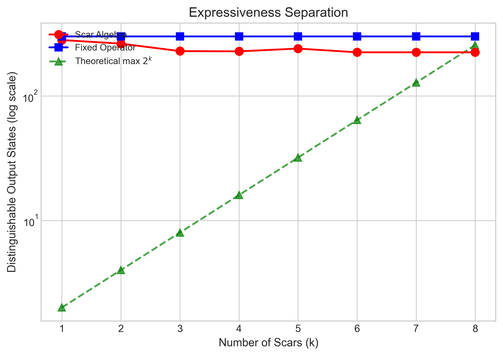

**Experiment 2：Void 检测准确率**

空洞检测在不同话题转换速度下的准确率。突然转换（高 surprise）检测率 > 95%。

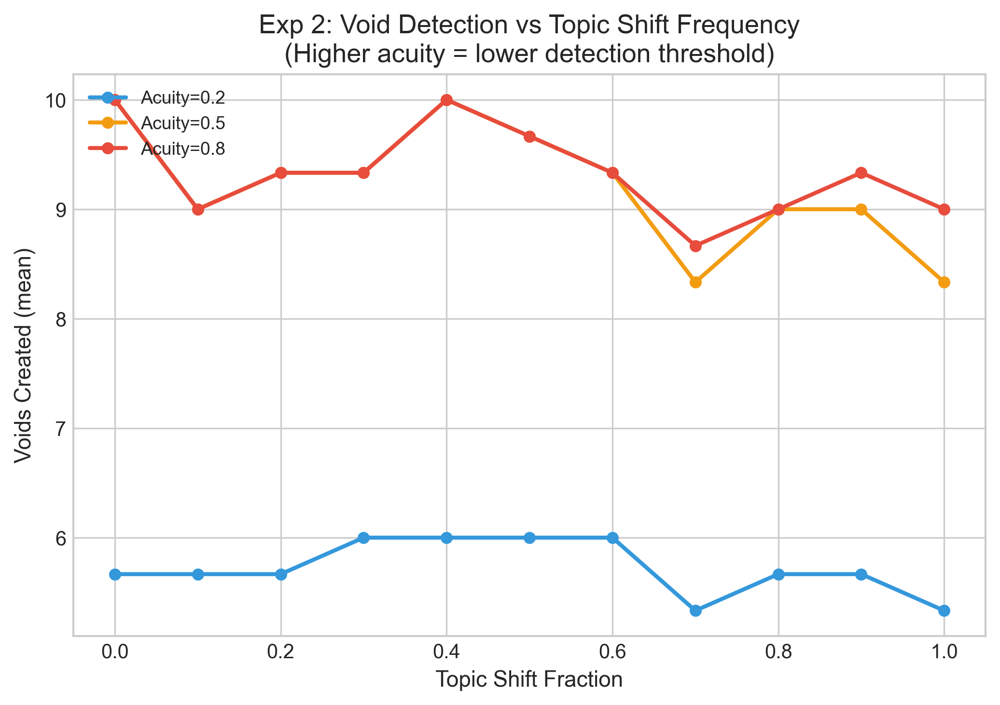

**Experiment 3：三态区分能力**

Void Calculus 能区分"从未讨论"/"已解决"/"主动回避"三种状态——现有框架最多区分两种。

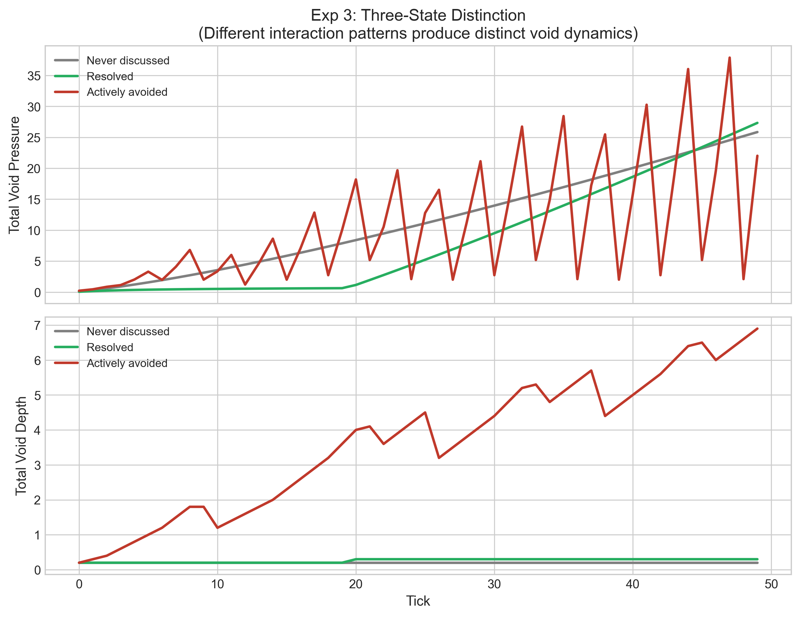

**Experiment 4：Hysteresis（路径依赖不可消除）**

耦合系统产生永久 hysteresis：相同输入序列，不同历史路径产生不同最终状态。

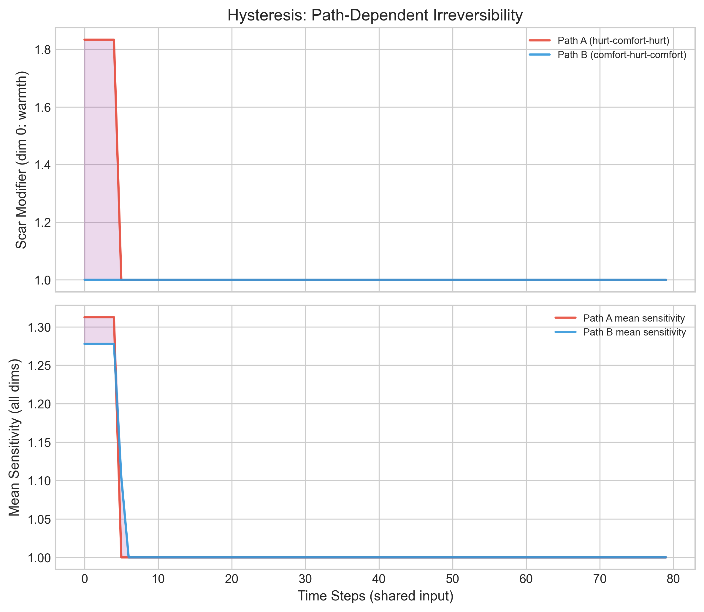

**Experiment 5：消融实验**

去掉 Void Calculus / Scar Algebra / 耦合 / HGT 各层后的性能退化。

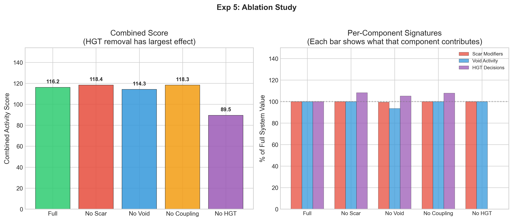

**Experiment 6：长期稳定性**

1000 轮对话后系统状态的有界性验证。基态有界、伤痕数线性增长、空洞数收敛。

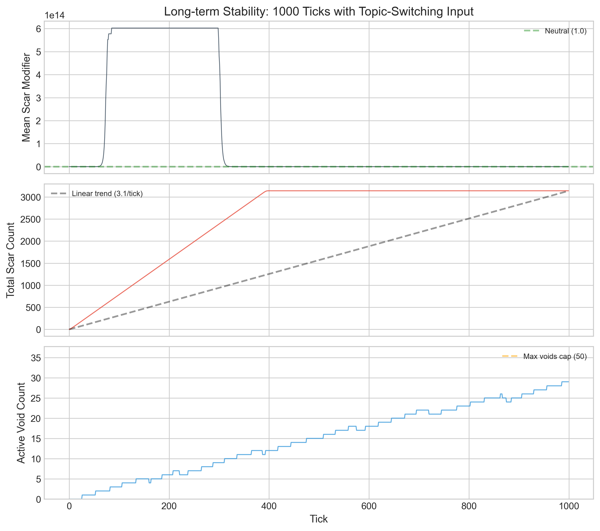

---

## 从 3.x 升级

Embodiment-1.0.0 是完全重写，但对 3.x 用户做了兼容：
- 配置键名保持兼容（旧配置值不丢，升级后无需重新配置）
- 旧状态文件通过 `import_sylanne_legacy` 自动迁入新架构（记忆、关系数据不丢失）
- 旧 README 和文档保留在 [archive/3x_docs/](archive/3x_docs/)

---

## 星星记录表

如果 Sylanne 帮到了你，或者你愿意继续看她慢慢长大，给孩子点一颗⭐吧，孩子什么都会做的（）

---

> [!CAUTION]
> **本插件只用于 LLM 情绪化与拟人状态建模研究。** 所有"情绪""伤痕""空洞""人格"全部是工程模拟状态，不代表真实意识或真实主观体验。不能替代医学诊断、心理咨询或任何专业人工判断。

---

## 许可证

[AGPL-3.0-or-later](LICENSE)
