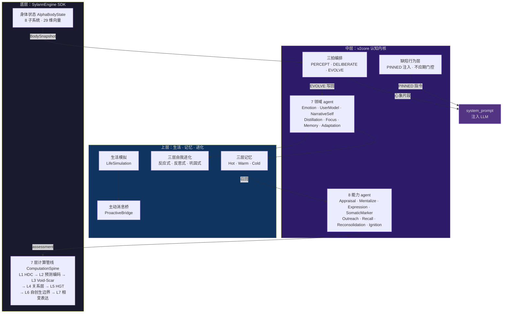
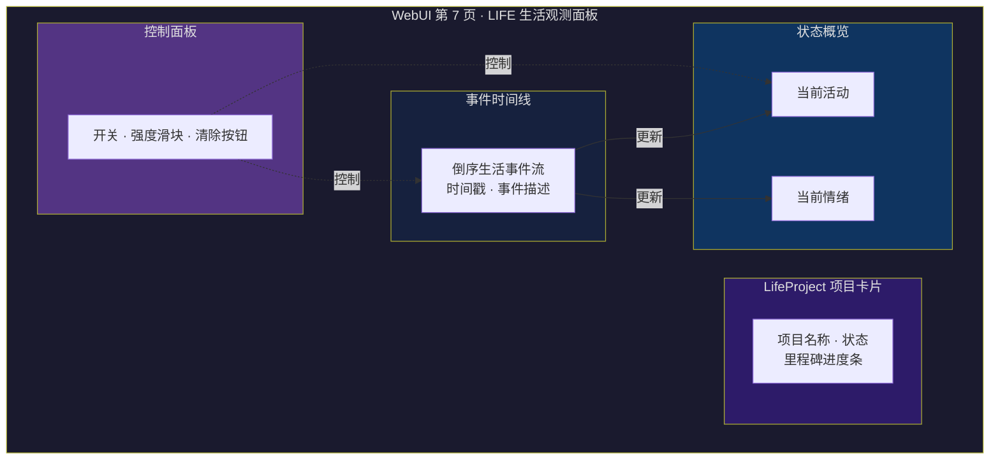
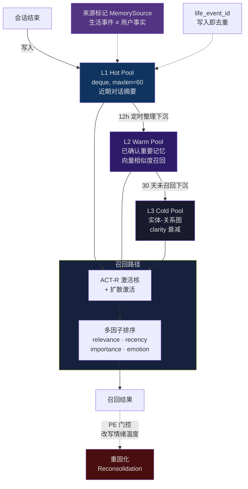
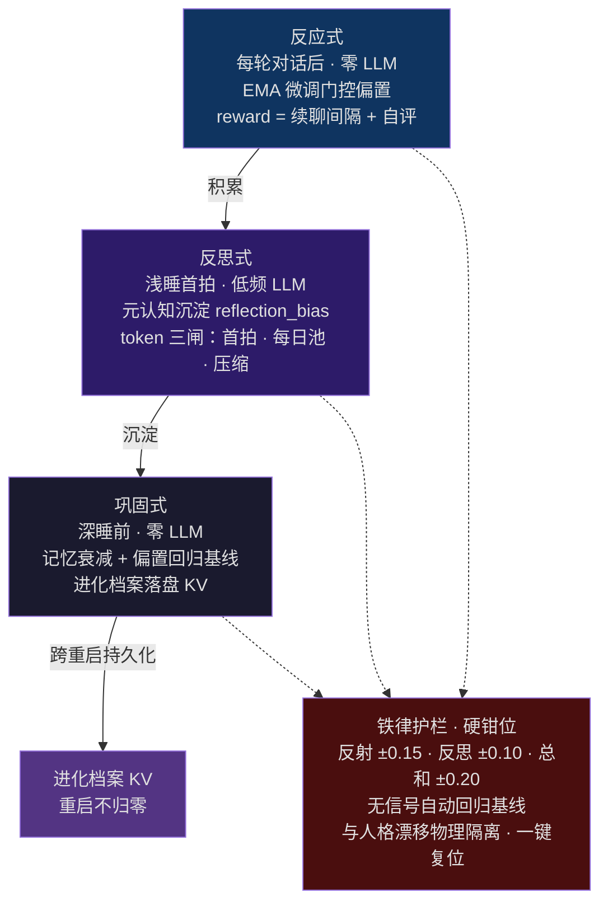
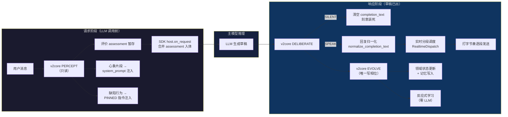
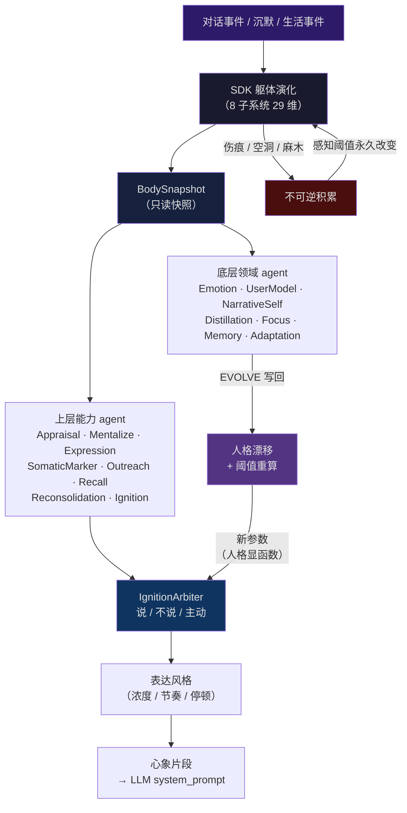
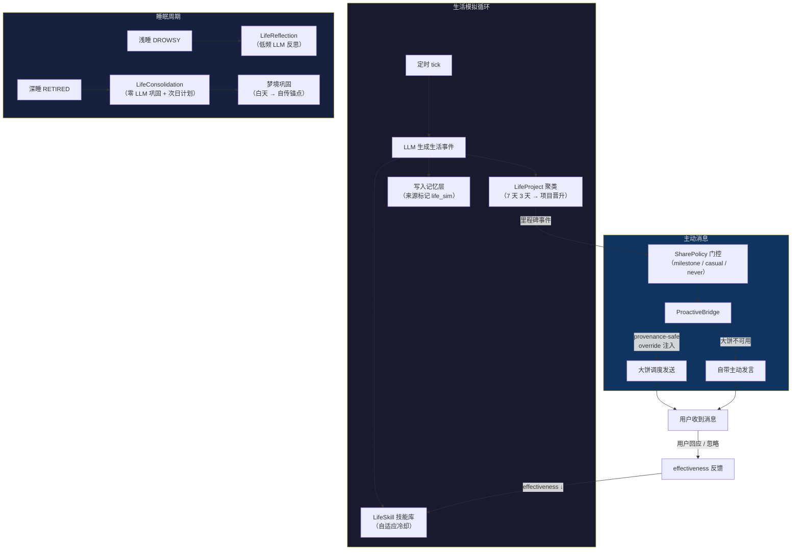

<!-- markdownlint-disable MD028 -->
<!-- markdownlint-disable MD033 -->
<!-- markdownlint-disable MD041 -->

# Sylanne-Embodiment


<p align="center">
  <a href="https://github.com/Ayleovelle/astrbot_plugin_sylanne/releases"></a>
  <a href="https://sylanne.app"></a>
  <a href="https://github.com/Ayleovelle/astrbot_plugin_sylanne/stargazers"></a>
  =4.26,<5.0.0">
  
  <a href="https://github.com/Ayleovelle/astrbot_plugin_sylanne/commits"></a>
  <a href="LICENSE"></a>
</p>

<p align="center">
  <a href="https://sylanne.app"><strong>官网</strong></a> &nbsp;·&nbsp;
  <a href="https://github.com/Ayleovelle/SylannEngine">计算引擎 SDK</a> &nbsp;·&nbsp;
  <a href="https://github.com/Ayleovelle/astrbot_plugin_sylanne/tree/main/theory">理论</a> &nbsp;·&nbsp;
  <a href="https://github.com/Ayleovelle/astrbot_plugin_sylanne/releases">更新日志</a> &nbsp;·&nbsp;
  <a href="https://github.com/Ayleovelle/astrbot_plugin_sylanne/releases/download/v1.2.0/scar_void_arxiv_paper_zh_v3.pdf">论文 (中文)</a> &nbsp;·&nbsp;
  <a href="https://github.com/Ayleovelle/astrbot_plugin_sylanne/releases/download/v1.2.0/scar_void_arxiv_paper_v2.pdf">Paper (EN)</a>
</p>

> `astrbot_plugin_sylanne` 是面向 AstrBot 的长期记忆、关系状态建模与即时聊天插件，提供情感状态计算、认知编排、生活模拟、主动消息和 WebUI 管理与诊断入口。

## 项目概览

Sylanne-Embodiment 将对话事件映射为可持久化的记忆、关系与表达状态，并通过 AstrBot 的 LLM 请求与响应钩子参与上下文构建、回复调度和状态更新。底层采用 **Scar Algebra（伤痕代数）**、**Void Calculus（空洞微积分）** 和 **Relational Sheaf Theory（关系层论）** 等形式化模型。

项目适用于需要长期对话状态、关系建模、可配置即时聊天体验，或希望研究 agent 状态计算与记忆机制的 AstrBot 部署和开发场景。

> [!IMPORTANT]
> 文档中的“情绪”“人格”“伤痕”“空洞”等均为软件状态模型术语，不代表真实意识、主观体验或医学意义上的心理状态。跨群记忆、QQ 空间说说和即时聊天接管等高风险可选能力默认关闭，应按部署需要逐项启用并验证。

## 设计目标

### 可持久化的关系状态

系统将长期对话中的事件、关系变化和未完成表达编码为可持久化状态。状态更新由明确的算子和边界约束完成，重启后从持久化数据恢复。

### 参数化的行为调度

人格参数、关系状态、上下文信号和安全门控共同影响表达阈值、主动交互、记忆召回与回复节奏。各项能力均通过配置和运行时边界控制。

### 可审计的反馈闭环

事件输入、状态更新、行为决策与反馈结果形成可追踪闭环。结构化日志是关键状态、路由与门控结果的主要可观测证据；WebUI 作为管理与诊断入口，仅汇总已接入字段。

### 分层适应

系统包含本地反应式更新、低频反思与持久化巩固路径。涉及 LLM 的后台能力需要显式配置 Provider；未配置时保持关闭或降级。

## 主要能力

- **长期记忆**：分层保存、召回和整理对话信息，并提供跨重启持久化。
- **关系状态建模**：按会话与身份维护有界状态；跨群能力默认关闭并受隐私门控。
- **语义分段**：由主回复模型标注自然边界，异常时安全回退为整段发送。
- **即时聊天调度**：支持分段发送、打字节奏、中断恢复与历史保存解耦，默认关闭。
- **主动交互与生活模拟**：使用独立开关和 Provider 路由，默认关闭。
- **QQ 空间发布**：包含内容净化、频率限制和审核档位，默认关闭。
- **用户控制**：暂停、重置、退出和敏感能力授权由硬门控保护。
- **WebUI 管理与诊断**：提供配置和诊断入口，仅展示已接入字段；完整运行状态以日志为准。

---

## 认知架构总览



<p align="center"><sub>三层嵌套认知架构鸟瞰：SDK 计算核 → v2core 认知内核 → 生活 / 记忆 / 进化</sub></p>

Sylanne 的认知系统由三个相互嵌套的层级构成：

### 1. 计算核（SylannEngine SDK）

底层计算外包给独立的 [SylannEngine](https://github.com/Ayleovelle/SylannEngine) SDK，插件通过 `engine_adapter.py` 消费 Surface 输出。SDK 内部是一条 7 层计算管线——**ComputationSpine**：

| 层级 | 名称 | 职责 |
| --- | --- | --- |
| L1 | HDC 感知编码 | 高维超向量编码输入事件 |
| L2 | 预测编码门 | 与内部预期比较，产出惊讶度（预测误差） |
| L3 | **Void-Scar Engine** | 伤痕代数 + 空洞微积分双向耦合：空洞压力超阈注入创伤（Gamma 耦合），伤痕麻木降低空洞检测阈值（Phi 耦合）；输出 8 维情感空间 |
| L4 | 关系层（ScarSheaf） | 跨关系伤痕传播，层拉普拉斯算子约束传播速率 |
| L5 | 异构图变换（HGT） | 多模态信号融合 |
| L6 | 自创生边界 | 主权守卫 + 中断预算 |
| L7 | 相变表达 | 表达从场的相变中涌现 |

计算层可纯 Python 运行——numpy 只是可选加速依赖，缺失时自动回退纯 Python。实际耗时与平台、Python 环境和输入规模有关，建议在目标部署环境中测量，以运行日志为主要依据，并用 WebUI 已接入字段辅助诊断。

之上是 **8 子系统的身体状态模型**（AlphaBodyState）：脉搏、血流、神经、肌肉、温度、伤口、免疫、死亡率——29 维状态向量，接收事件并演化。

### 2. 认知内核（v2core）

认知内核采用**三拍相位编排**：

- **PERCEPT（感知）** ——只读。读取躯体快照与领域状态并抽取信号，在 LLM 调用前把心象片段注入 system_prompt；这些状态信号通过上下文参与回复生成。
- **DELIBERATE（审议）** ——执行回复路径仲裁。该热路径受 budget_ms 约束，根据表达驱力、躯体标记和沉默积累在 SPEAK / SILENT / OUTREACH 路径间选择。
- **EVOLVE（进化）** ——唯一的写相位。集中提交情绪漂移、人格 append、记忆重固化等领域写操作。

内核由两层 agent 构成。

**底层领域 agent**（各自独占状态，单一写者）：

| 领域 | 职责 |
| --- | --- |
| EmotionLedger | 情绪动力学：快/慢双 EMA + 未表达情绪积分 |
| UserModelDomain | 用户后验模型：4 维处置 + 节律画像 + 共享词汇（SharedLexicon） |
| NarrativeSelfDomain | 最慢的先验：自传锚点（只增）、关系纪元、情感固化度 |
| DistillationDomain | L3 学生编码器：文本到体感的在线线性逼近（NLMS），"这条消息的触动是否反常" |
| FocusDomain | 话语焦点：维护当前话头，低信息消息（表情/短应答）不夺话头 |
| MemoryDomain | 三层记忆（Hot / Warm / Cold）的领域边界，复用已加固的 ACT-R 激活核召回 |
| AdaptationDomain | 自我进化适应：口吻镜像 / 话题亲和 / 表达偏好 / 安抚策略有效度 |

**上层能力 agent**（无独占状态，注册表驱动——加新能力 = 注册一行）：

| 能力 | 拍 | 职责 |
| --- | --- | --- |
| AppraisalCapability | PERCEPT | 多维评价：效价 / 苦恼 / 期望失配 / 触动反常 |
| MentalizeCapability | PERCEPT + DELIBERATE | 预测用户处置并生成面向用户的心象行；失同步时产生确认驱力 |
| ExpressionCapability | PERCEPT + DELIBERATE | 表达风格倾向 + 表达驱力（躯体 + 情绪未表达冲动） |
| SomaticMarkerCapability | DELIBERATE | 躯体标记偏置：结疤深 → 回避翻旧事，耗竭 → 压制主动 |
| OutreachCapability | DELIBERATE | 沉默积累：会话节律超期 + 未表达积分 + 躯体余力 → 主动消息压力 |
| RecallCapability | DELIBERATE | 来源感知的记忆召回 |
| ReconsolidationCapability | EVOLVE | 记忆重固化：召回那一刻，PE 门控改写情绪温度（影子字段，原文不动） |
| IgnitionArbiter | DELIBERATE | 说 / 不说 / 主动 的三选一仲裁，阈值是人格显函数 |

**缺陷行为层**：冲动泄露、示弱道歉、逃避、吃醋、捉弄、犯懒——不是写死的脚本，而是特定躯体状态组合点燃的一条指令，有不应期门控防复发，注入 system_prompt 的 PINNED 层。

### 3. 生活模拟 + 主动消息

**生活模拟**（LifeSimulation）使用外部 LLM 定期生成后台生活事件。事件更新状态与表达风格信号，并在频率、安全和用户状态等门控通过时触发主动消息。

- **LifeProject**：确定性聚类晋升（7 天内 3 天以上同类事件 → 自动生成长期项目），里程碑驱动的分享策略。
- **LifeSkill**：自适应技能库，冷却倍率随 effectiveness 变化——用户不回应时自动收敛。
- **反思 + 巩固**：浅睡期低频 LLM 反思（LifeReflection），深睡期零 LLM 巩固次日计划（LifeConsolidation）+ 梦境巩固（dream.py，白天经历压成自传锚点）。

**主动消息桥**（ProactiveBridge）：与 [astrbot_plugin_proactive_chat](https://github.com/DBJD-CR/astrbot_plugin_proactive_chat)（"大饼"）进行 provenance-safe 集成——插件根据状态与门控确定主动时机和候选生活素材，大饼负责调度与发送链路。per-sid 锁短临界区、in-flight 守卫、KV sidecar 基线保证崩溃时用户的 proactive_prompt 配置不被误删；未安装大饼时由插件自身的主动消息链路处理。



<p align="center"><sub>WebUI 第 7 页 LIFE 生活观测面板布局示意（四区结构，真实截图可后续替换）</sub></p>

### 4. 三层记忆系统

| 层级 | 容量 | 策略 |
| --- | --- | --- |
| L1 Hot Pool | deque, maxlen=60 | 近期对话摘要，会话结束时写入 |
| L2 Warm Pool | list | 已确认的重要记忆，12 h 定时整理下沉，向量相似度召回 |
| L3 Cold Pool | 实体-关系图 | clarity 衰减，30 天未召回下沉 |



<p align="center"><sub>三层记忆漏斗：写入 → 下沉 → 衰减；召回走 ACT-R 激活核 + 多因子排序，重固化由 PE 门控改写情绪温度</sub></p>

召回采用 ACT-R 激活核 + 扩散激活 + 多因子排序（relevance + recency + importance + emotion），来源感知（MemorySource）——生活模拟事件不被当作用户事实。life_event_id 写入即去重。

### 5. 三层自我进化

| 层级 | 时机 | 代价 | 机制 |
| --- | --- | --- | --- |
| 反应式 | 每轮对话后 | 零 LLM | EMA 微调门控偏置；reward = 用户续聊间隔（强）+ 自评（弱先验，防 Goodhart） |
| 反思式 | 浅睡首拍 | 低频 LLM | 元认知沉淀 reflection_bias；三道 token 闸（首拍 / 每日池 / 输入压缩 ≤1500 字） |
| 巩固式 | 深睡前 | 零 LLM | 记忆衰减 + 反思偏置回归基线 + 进化档案落盘 KV |



<p align="center"><sub>三层自我进化：反应式零 LLM 微调 → 反思式低频 LLM 沉淀 → 巩固式零 LLM 落盘，铁律硬钳位 + KV 跨重启持久化</sub></p>

**铁律护栏**：硬钳位（反射 ±0.15 / 反思 ±0.10 / 总和 ±0.20）+ 无信号自动回归基线 + 与人格漂移物理隔离 + 一键出厂复位。跨重启累积学习——进化档案持久化到 KV，重启不归零。

---

## 工作流图

### (a) 消息处理管线



### (b) 认知内核 / 人格驱动闭环



### (c) 生活模拟 + 主动消息循环



---

## Embodiment-2.5.0 版本要点

- **模型原生智能分段**：由同一次主回复模型标注语义边界，不新增独立 LLM 请求，并在异常标记或结构化内容场景回退为整段发送。
- **LLM 配置收口**：常用模型配置集中到聊天模型、共享辅助文本模型和 Embedding 模型；独立 Provider 作为高级覆盖保留。
- **可选能力默认关闭**：跨群记忆、QQ 空间说说和即时聊天接管由部署者逐项启用。
- **stable 构建边界**：正式安装包不激活 v3 影子路径；相关 G3/G4 结论仍需真实灰测数据。

完整变更与 grey 修订过程见 [CHANGELOG.md](CHANGELOG.md)。发布 tag 采用 `Embodiment-2.5.0`。

---

## 快速开始

1. 正式发布后，从 [Releases 页面](https://github.com/Ayleovelle/astrbot_plugin_sylanne/releases) 下载版本化包 `astrbot_plugin_sylanne-2.5.0.zip`。
2. 若使用通用文件名 `astrbot_plugin_sylanne.zip`，确认包内 `metadata.yaml` 的版本为 `2.5.0`。
3. 在 AstrBot 管理面板上传并启用插件。
4. 保持高风险可选能力的默认关闭状态，先验证基础聊天与历史记录。
5. 按部署需要逐项启用即时聊天、跨群记忆、生活模拟或 QQ 空间能力，以日志为主要验证依据，并核对 WebUI 已接入状态。

### 常用配置

完整配置、字段说明和取值范围以 [`_conf_schema.json`](_conf_schema.json) 为准。聊天模型沿用 AstrBot 的会话配置；共享辅助文本模型和 Embedding 模型可按需配置，生活模拟等功能的独立 Provider 作为高级覆盖保留。

| 配置项 | 默认值 | 说明 |
| --- | --- | --- |
| `sylanne_webui_enabled` | `false` | 启用 WebUI 管理与诊断入口。 |
| `sylanne_alpha_aux_provider_id` | 空字符串 | 共享辅助文本模型 Provider；未配置时不启用独立覆盖。 |
| `sylanne_alpha_embedding_memory_enabled` | `false` | 启用 Embedding 记忆辅助召回。 |
| `sylanne_alpha_realtime_chat_enabled` | `false` | 启用即时聊天调度。 |
| `sylanne_alpha_realtime_intercept_llm_response` | `false` | 允许即时聊天接管 LLM 响应分段。 |
| `sylanne_alpha_life_simulation_enabled` | `false` | 启用生活模拟。 |
| `sylanne_alpha_cross_session_mode` | `off` | 跨群记忆总开关。 |
| `sylanne_alpha_qzone_enabled` | `false` | 启用 QQ 空间说说功能。 |

> 计算层、agent 编排和反应式学习主要在本地执行；生活模拟和反思等功能会调用配置的 LLM Provider。实际延迟与资源占用取决于模型、平台适配器、部署环境和启用功能，建议在生产环境逐项开启并监测。

---

## 从 3.x 升级

Embodiment 是完全重写，但对 3.x 用户做了兼容：

- 配置键名保持兼容（旧值不丢，升级后无需重新配置）
- 旧状态文件通过 `import_legacy_body` 自动迁入新架构（记忆、关系数据不丢失）
- 旧 README 和文档保留在 [3.x release](https://github.com/Ayleovelle/astrbot_plugin_sylanne/releases/tag/v3.0.0)

用户数据与旧存档仍自动兼容，无需手动迁移；插件宿主需升级到 AstrBot 4.26 或更高版本。

---

## 模块骨架速览

```
main.py                         # 插件入口：AstrBot 钩子注册（仓库根目录）
sylanne_alpha/
├── host.py                     # SDK 共振场宿主薄子类
├── engine_adapter.py           # SDK Surface → 业务层契约翻译
├── memory_system.py            # 三层记忆（L1/L2/L3）+ ACT-R 激活核
├── life_simulation.py          # 生活模拟（LifeProject / LifeSkill / Schema v3）
├── life_reflection.py          # 浅睡反思（低频 LLM）
├── life_consolidation.py       # 深睡巩固（零 LLM）
├── proactive_bridge.py         # → 大饼主动消息桥（provenance-safe）
├── proactive_scheduler.py      # 自驱心跳调度
├── message_dispatch.py         # 回复归一化 + thinking 剥离 + T3 content-parts 归一
├── realtime_dispatch.py        # 即时聊天：分段发送 / 中断恢复 / 上下文注入
├── llm_request_pipeline.py     # LLM 请求管线：状态注入 + 心象片段
├── llm_response_pipeline.py    # LLM 响应管线：分段 + 观测 + 记忆
├── relationship_layer.py       # 关系层：is_romantic 判定 + 身份门控
├── session_state_store.py      # 集中运行态容器仓（LRU + TTL + 类型守卫）
├── v2core/                     # 认知内核（三拍编排 + 领域/能力 agent）
│   ├── self_core.py            # SelfCore 三拍编排器
│   ├── turn_runner.py          # 两阶段编排：request + response
│   ├── integration.py          # v2core ↔ 宿主管线桥接
│   ├── contracts.py            # 核心契约：Phase / BodySnapshot / Capability 协议
│   ├── fragment.py             # 心象片段：认知 → system_prompt 的唯一注入器
│   ├── verbal.py               # 数值 → 语言标定（7 级序数词，零浮点噪声）
│   ├── lexicon.py              # 文本信号统一观测模型
│   ├── behavior.py             # 缺陷行为层（涌现式，躯体状态组合点燃）
│   ├── dream.py                # 梦境巩固（深睡，零 LLM）
│   ├── renderer.py             # 回复渲染契约
│   ├── domains/                # 底层领域 agent（独占状态，单一写者）
│   │   ├── emotion.py          # EmotionLedger
│   │   ├── user_model.py       # UserModelDomain + SharedLexicon
│   │   ├── narrative_self.py   # NarrativeSelfDomain
│   │   ├── distillation.py     # DistillationDomain（L3 蒸馏）
│   │   ├── focus.py            # FocusDomain（话头锚定）
│   │   ├── memory.py           # MemoryDomain
│   │   └── adaptation.py       # AdaptationDomain（口吻/话题/偏好/安抚）
│   └── capabilities/           # 上层能力 agent（无独占状态，注册表驱动）
│       ├── expression.py       # 表达驱力 + 风格
│       ├── mentalize.py        # 心智化 + 评价
│       ├── somatic.py          # 躯体标记 + 主动消息
│       ├── recall.py           # 记忆召回
│       ├── reconsolidation.py  # 记忆重固化
│       └── ignition.py         # 说/不说/主动 仲裁
├── agents/                     # 多智能体编排层
│   ├── self_core.py            # SelfCore 主席 + 编排器
│   ├── life_agent.py           # LifeAgent（AUTONOMOUS 时点）
│   ├── autonomy_scheduler.py   # 自驱心跳：AWAKE/DROWSY/RETIRED
│   ├── event_bus.py            # agent 间事件总线
│   └── learning/               # 三层自我进化
│       ├── reflex.py           # 反应式学习（零 LLM）
│       ├── reflection.py       # 反思式（低频 LLM）
│       ├── consolidation.py    # 巩固式（零 LLM）
│       └── archive.py          # 进化档案
└── _engine/sylanne_core/       # vendored SylannEngine SDK
    └── compute/
        ├── kernel.py           # AlphaKernel 中枢调度（7 层管线）
        ├── void_scar_engine.py # Void-Scar 耦合引擎（L3）
        ├── scar_algebra.py     # 伤痕代数
        ├── void_calculus.py    # 空洞微积分
        ├── body.py             # 身体状态模型（8 子系统 29 维）
        ├── computation_spine.py# 计算脊柱（L1-L7 编排）
        ├── runtime.py          # 文件持久化运行时
        ├── host.py             # 会话宿主
        ├── personality.py      # 人格特质初始化与漂移
        ├── relational_sheaf.py # 关系层（ScarSheaf）
        ├── hdc.py              # 高维计算编码器
        ├── predictive_coding.py# 预测编码门
        ├── autopoiesis.py      # 自创生边界
        ├── phase_transition.py # 相变表达
        ├── hgt.py              # 异构图变换
        ├── pel_core.py         # PEL 情绪潜核（2.3.0 新增）
        ├── deterministic_fusion.py  # 确定性融合（2.3.0 新增）
        ├── telemetry/          # 遥测（2.3.0 新增）
        └── ...
```

---

## 深入了解

完整的计算架构、共振场、认知三拍编排、三层自我进化、工作流图与性能数据都在介绍网站 **[sylanne.app](https://sylanne.app)**。此外：

- [SylannEngine](https://github.com/Ayleovelle/SylannEngine) — 计算层 SDK。详细的计算理论、公理系统和 benchmark 在这个仓库。
- [`theory/` 目录](https://github.com/Ayleovelle/astrbot_plugin_sylanne/tree/main/theory) — 三套理论的形式化推导。
- 论文（PDF）：[中文版](https://github.com/Ayleovelle/astrbot_plugin_sylanne/releases/download/v1.2.0/scar_void_arxiv_paper_zh_v3.pdf) · [English](https://github.com/Ayleovelle/astrbot_plugin_sylanne/releases/download/v1.2.0/scar_void_arxiv_paper_v2.pdf) — 三套理论 + 人格闭环 + 11 组实验。
- [Releases](https://github.com/Ayleovelle/astrbot_plugin_sylanne/releases) — 各版本完整更新日志。

> **相关工作：** Mopgar（2026.03）和 Hu & Rong（2026.05）讨论了后果表征与 agent 躯体化问题。本项目将形式化状态算子、缺席动力学与关系拓扑组合到同一插件架构；具体定义、假设与实验边界见 `theory/` 目录与论文。

---

## 兼容性

| 项 | 范围 |
| --- | --- |
| AstrBot | >=4.26, <5.0.0 |
| Python | 3.10 ~ 3.13 |
| 已测平台 | Linux, Windows |

内存、CPU 和磁盘占用会随部署环境、会话规模、缓存、模型和启用功能变化。请在目标环境中实测，并结合运行日志和系统监控制定容量预算。

---

## 推荐阅读

- [SylannEngine](https://github.com/Ayleovelle/SylannEngine) — 计算层 SDK，可单独集成到任何 Python 异步项目。
- [主动消息 (Proactive_Chat)](https://github.com/DBJD-CR/astrbot_plugin_proactive_chat) — 本插件可独立处理主动消息；搭配 Proactive_Chat 时，由状态与门控确定表达路径和候选素材，并复用其调度与发送链路。
- [AstrBot](https://github.com/AstrBotDevs/AstrBot) — 本插件依附的机器人框架，感谢其开发团队的付出。

## 贡献

欢迎提交 [Issue](https://github.com/Ayleovelle/astrbot_plugin_sylanne/issues) 和 [Pull Request](https://github.com/Ayleovelle/astrbot_plugin_sylanne/pulls)。提 PR 前请阅读 [贡献指南](https://github.com/Ayleovelle/astrbot_plugin_sylanne/blob/main/CONTRIBUTING.md)，参与互动请遵守[行为准则](https://github.com/Ayleovelle/astrbot_plugin_sylanne/blob/main/CODE_OF_CONDUCT.md)。

项目交流与反馈：QQ群 **176427647**。

## 许可证

[AGPL-3.0-or-later](LICENSE)

---

## Star History

欢迎通过 Star、Issue 和 Pull Request 关注或参与项目维护。

[](https://www.star-history.com/#Ayleovelle/astrbot_plugin_sylanne&Timeline)

---

> [!CAUTION]
> **状态模型说明：** 文档和界面中的“情绪”“伤痕”“空洞”“人格”均为工程状态，不代表真实意识或主观体验。插件不提供医学诊断、心理咨询或其他专业判断。

---

<p align="center"><sub>Maintained by 2718 Labs.</sub></p>
