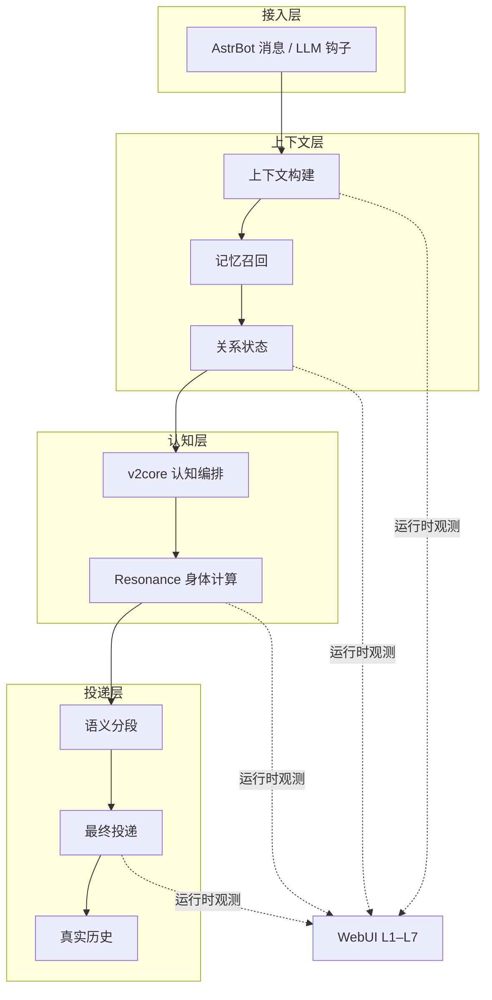

# Sylanne-Embodiment

<p align="center">
  
</p>

<p align="center">
  <a href="https://github.com/Ayleovelle/astrbot_plugin_sylanne/releases"></a>
  <a href="https://github.com/Ayleovelle/astrbot_plugin_sylanne/stargazers"></a>
  =4.26,<5.0.0" />
  
  <a href="https://github.com/Ayleovelle/astrbot_plugin_sylanne/commits/main"></a>
  <a href="LICENSE"></a>
</p>

<p align="center">
  <a href="#功能">功能</a> · <a href="#架构">架构</a> · <a href="#安装与兼容性">安装</a> · <a href="#常用配置">配置</a> · <a href="CHANGELOG.md">CHANGELOG</a> · <a href="CONTRIBUTING.md">贡献</a>
</p>

面向 AstrBot 的长期记忆、关系状态建模与即时聊天插件，由 2718 Labs 维护。`Embodiment-2.5.0` 把一次对话中的上下文、节拍、投递和观测收在可验证的运行链路里。

它服务于持续对话的产品体验，但不替代 AstrBot 的消息、模型或权限边界。插件始终以框架提供的会话、Provider 与投递机制为基础；可选能力应由部署者根据场景逐项决定。

> “情绪”“人格”“伤痕”“空洞”等词在本项目中表示软件状态或产品概念，不表示真实意识、医学状态或生物学结论。

## 功能

| 能力 | 做什么 | 默认边界 |
| --- | --- | --- |
| 长期记忆 | 按会话保存、召回和整理信息，支持跨重启恢复。 | 仅处理插件需要的记忆状态。 |
| 关系状态 | 为会话和身份维护有界状态。 | 跨群/跨会话默认关闭。 |
| 自然节奏 | 以本轮模型输出的语义边界安排文本分段与停顿。 | 没有合法边界即安全回退。 |
| 主动交互 | 支持生活模拟、主动消息和 QQ 空间等可选能力。 | 高风险能力默认关闭。 |
| 用户控制 | 对敏感能力使用独立配置和功能专用确认流程。 | 未显式启用或确认时保持关闭。 |
| WebUI 可观测性 | 提供配置、运行状态与诊断入口。 | 默认不启用 WebUI。 |

高风险可选能力默认关闭。请先验证基础聊天与历史，再按需启用即时聊天、跨会话记忆、主动消息或 QQ 空间能力。

### 推荐启用顺序

1. 保持所有可选能力关闭，确认普通聊天和上下文连续性。
2. 验证内置长期记忆在重启后的恢复；如需语义增强，再开启 Embedding 辅助召回。
3. 开启即时聊天，确认平台、TTS 和其他消息插件的投递协作。
4. 仅在需求明确时启用跨会话、生活模拟、主动消息或 QQ 空间能力。

每次只改变一项配置，并在 WebUI 或日志中确认运行状态。这样更容易定位 Provider、权限或平台适配造成的差异。

## Embodiment-2.5.0

- **模型原生语义节拍**：同一次主模型生成中标注节拍边界，不增加额外 LLM 请求。
- **Provider 配置收口**：共享辅助文本模型集中配置；前台即时判断由本地 `v2core` 完成。
- **风险能力默认关闭**：主动、跨会话及外部能力须显式开启。
- **发送所有权与历史最终化**：装饰完成后决定唯一发送者，历史只落真实投递文本。
- **WebUI L1–L7 观测接线**：从运行时分支汇总状态、事件和诊断信号。

### 本版关注的边界

| 边界 | 处理方式 |
| --- | --- |
| 模型调用 | 语义节拍复用主回复生成，不为节拍再发起模型请求。 |
| 功能授权 | 主动与跨会话等能力使用独立开关，不随安装自动打开。 |
| 消息投递 | 文本计划与最终组件协商唯一所有者，避免重复发送。 |
| 聊天历史 | 内部标记与运行时状态不写入最终用户历史。 |
| 运行排查 | WebUI 汇总 L1–L7 观测信号，供配置和诊断使用。 |

### 使用原则

**先可用，后扩展。** 基础对话、真实历史和重启恢复是每次部署的起点；可选能力不是安装完成后必须打开的清单。

**让行为可解释。** 上下文、记忆、状态与投递各有明确边界。遇到异常时，应从对应运行阶段和观测信号定位，而不是把内部信息写回用户历史。

**把发送看作最终决策。** 一次回复可能经过节拍、装饰或组件转换；只有实际发送的结果才属于本轮可持久化的助手回复。

**保留安全回退。** marker、Provider、状态文件或平台组件不满足条件时，插件应回到完整文本、原始对象或新状态，而非猜测性恢复。

## 架构



语义节拍与同一次主模型生成同行，不增加额外 LLM。装饰阶段结束后才决定唯一最终发送者；历史只保存真正投递给用户的内容。

WebUI 是观测分支而非另一条控制链：它汇总运行时信息，不改变已确定的消息投递或历史最终化规则。

## 安装与兼容性

| 项目 | 支持范围 |
| --- | --- |
| AstrBot | `>=4.26,<5.0.0` |
| Python | `3.10`–`3.13` |
| 发布包 | `Embodiment-2.5.0` |
| 许可证 | [AGPL-3.0-or-later](LICENSE) |

1. 从 [Releases](https://github.com/Ayleovelle/astrbot_plugin_sylanne/releases) 下载版本化 ZIP。
2. 在 AstrBot 管理面板上传 ZIP 并启用插件。
3. 确认包内 `metadata.yaml` 的版本为 `2.5.0`。
4. 先验证普通对话、连续多轮上下文和重启后的历史恢复。
5. 再逐项开启可选能力并观察运行状态。

本地调试也可将插件目录放进 `AstrBot/data/plugins/`，随后在 WebUI 重载插件。

### 升级提示

从旧状态机版本升级前，请先备份 AstrBot 数据目录。旧核心快照不会被自动转换为 Embodiment 核心状态：原文件保留，插件以当前 schema 启动；用户记忆的格式兼容由记忆模块处理。

升级后建议先保持可选能力关闭，完成一次普通对话与重启恢复验证，再恢复此前按需启用的能力。

## 常用配置

完整字段、类型与默认值以 [`_conf_schema.json`](_conf_schema.json) 为准。配置页默认展示常用路由；功能专用 Provider 位于高级覆盖区。

| 配置项 | 默认值 | 说明 |
| --- | --- | --- |
| `sylanne_webui_enabled` | `false` | 启用 WebUI。 |
| `sylanne_alpha_aux_provider_id` | 空 | 共享辅助文本模型 Provider。 |
| `sylanne_alpha_embedding_memory_enabled` | `false` | 启用 Embedding 辅助召回。 |
| `sylanne_alpha_realtime_chat_enabled` | `false` | 启用即时聊天调度。 |
| `sylanne_alpha_realtime_intercept_llm_response` | `false` | 允许即时聊天接管模型回复。 |
| `sylanne_alpha_life_simulation_enabled` | `false` | 启用生活模拟。 |
| `sylanne_alpha_cross_session_mode` | `off` | 跨会话记忆总开关。 |
| `sylanne_alpha_qzone_enabled` | `false` | 启用 QQ 空间功能。 |

前台即时判断不需要单独配置 LLM Provider。后台生活、关系和内容生成功能仅在启用对应能力且 Provider 可用时调用模型。

### 配置检查清单

- 确认所选 Provider 可被 AstrBot 正常调用，再填入辅助模型配置。
- 若不需要诊断页面，保持 `sylanne_webui_enabled` 为 `false`。
- 即时聊天需要同时评估平台限长、TTS 和其他消息插件的协作方式。
- 跨会话与 QQ 空间等能力涉及更宽的使用范围，应在明确授权后开启。
- 修改配置后重载插件，并以真实会话验证，而非只检查配置页显示。

<details>
<summary>详细运行契约：历史、分段、发送所有权与持久化</summary>

### 对话历史

插件只把真实用户输入和最终助手回复保存到 AstrBot 对话历史。人格、记忆、状态和调度信息通过本轮 `system_prompt` 提供，不写入长期聊天记录。

请求阶段不会永久改写 AstrBot 已加载的 `request.contexts`。需要过滤旧内部标记或修复工具配对时，插件为当前 Provider 构造临时视图，并在 AstrBot 保存历史前恢复原始对象。临时视图变化后会按实际消息重新计算 token 数；只有框架明确跳过保存时，插件才补写本轮真实消息。

### 语义分段

主回复模型可在输出中生成带本轮 nonce 的隐藏边界。存在合法边界时按边界发送；没有 marker 时以正文显式换行回退。代码块、表格和列表保持完整，孤立标点并入相邻文本；marker 异常、越界或位于保护区时，移除 marker 并回退到正文显式换行，无可用换行时才整条发送。超长内容仍按平台限制安全切分。

隐藏 marker 不进入用户可见文本，也不进入最终历史。

分段计划只描述候选文本和节奏，不代表最终投递已经发生。最终投递仍以后续装饰结果和发送所有权判断为准。

### 发送所有权

`on_llm_response` 只准备投递计划，不直接发送正文。装饰阶段的最终结果为纯文本时，插件认领并分段发送；若已被 TTS 或其他插件转换为语音、图片或文件，则放弃文本计划，由 AstrBot 发送最终组件。同一轮只有一个最终发送者。

### 状态持久化

- 当前 Embodiment schema 可直接恢复。
- 损坏的 JSON 状态文件会隔离为 `.damaged` 文件。
- 用户记忆格式兼容由记忆模块处理。
- 旧状态机核心快照不会自动转换为 Embodiment 核心状态；原文件会保留，并以新状态启动。

持久化异常应先保留现场与日志，再检查隔离出的 `.damaged` 文件；不要将不明格式的旧核心快照覆盖到当前 schema。

</details>

## 代码结构

```text
main.py                                AstrBot 插件入口和钩子注册
sylanne_alpha/llm_request_pipeline.py  请求构建、临时历史视图和状态注入
sylanne_alpha/llm_response_pipeline.py 回复处理、分段和保存边界
sylanne_alpha/semantic_segmentation.py 语义边界解析与安全回退
sylanne_alpha/message_dispatch.py      消息归一化与发送
sylanne_alpha/state_persistence.py     状态和必要的历史补写
sylanne_alpha/memory_system.py         长期记忆
sylanne_alpha/realtime_dispatch.py     即时聊天调度
sylanne_alpha/v2core/                  逐轮认知编排和状态域
sylanne_alpha/_engine/                 Resonance 身体计算后端
tests/                                  回归测试
```

## 开发与验证

开发约束见 [CONTRIBUTING.md](CONTRIBUTING.md)。常用命令：

```powershell
python -m pytest
python -m ruff check .
python -m compileall -q main.py sylanne_alpha
```

## 反馈与贡献

提交问题时，请说明 AstrBot 与 Python 版本、启用的能力开关、复现步骤，以及是否涉及 TTS 或其他消息插件。避免在公开 Issue 中提交聊天正文、密钥或未脱敏的用户数据。

对运行行为的改动应同时覆盖发送、历史和回退路径；对可选能力的变更应明确默认值与授权边界。

需要反馈或参与？欢迎通过 [Issues](https://github.com/Ayleovelle/astrbot_plugin_sylanne/issues) 提交问题，阅读 [CONTRIBUTING.md](CONTRIBUTING.md) 参与贡献，查阅 [CHANGELOG.md](CHANGELOG.md) 了解版本变化，或阅读 [LICENSE](LICENSE) 了解授权条款。

发布说明以 CHANGELOG 为准；请在升级前阅读其中的兼容性提示，并保留可回退的备份。

感谢每一份可复现的反馈。
