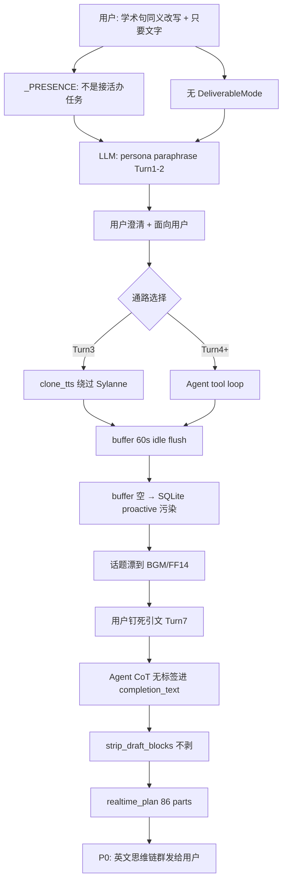

# 事故研判报告：文案改写任务连环失败（session 2300184498）

> **生成时间**：2026-06-15  
> **研判方式**：实机日志逐轮对照 + 源码逐段审阅 + 可复现 pytest 验证  
> **结论性质**：研判 + 修复总结（修复已提交 6c441f4 / b6e141c）  
> **验证命令**：`python -m pytest tests/test_incident_copywriting_cascade_2026_06_15.py -v` → **26 passed**

---

## 0. 摘要（Executive Summary）

用户在私聊中要求：根据图片/引文，**同义改写** SYLANN 学术定义句（「情感不是额外教的标签…这是实验数据。」），**面向用户、纯文字、可粘贴替换**。

系统在约 **9 分钟、8 轮交互** 内发生：

1. **任务语义失败**：输出女友撒娇体 / 产品 persona 自述，而非学术句改写  
2. **通路分裂**：同一任务先后走 Sylanne 分段、`clone_tts`、AstrBot Agent tool loop 三条路径  
3. **上下文断链**：`ConversationBuffer` 60s idle flush 清空任务态；Agent 误读 SQLite 主动消息  
4. **P0 用户可见灾难**：Turn 8 将 **3757 字英文 chain-of-thought** 拆成 **86 条 IM** 发给用户（part 1–69 为英文推理泄漏）

**根因不是单点 bug**，而是 **7 层故障在同一交付型任务上串联放大**。下文按 **日志证据 → 代码路径 → 自动化测试** 三段式钉死每一层。

---

## 1. 用户任务定义（事后钉死的「正确需求」）

| 维度 | 用户要求 | 系统多次实际输出 |
|------|----------|------------------|
| 语义 | 与引文**同义**的改写 | persona 自述 / 女友文案 / 产品卡片 |
| 受众 | **面向用户**（公开展示） | 「大笨蛋专属女友」「正在被你用着」双关 |
| 格式 | **只用文字**，可粘贴 | 分段聊天 + `---` Markdown + meta 道歉 |
| 对象 | SYLANN **学术定义句** | 卡片 03 人设 / BGM 歌名 / FF14 主动消息 |

---

## 2. 八轮时间线（实机日志证据）

### Turn 1 · 08:52:03–08:52:48

| 时间 | 日志 | 解读 |
|------|------|------|
| 08:52:03 | 用户：`[图片]` + 引文 +「用你的话再说一遍 / 只用文字」 | 交付型任务发起 |
| 08:52:20 | `fragment merged (winner): …情感不是额外教的标签…` | 引文已进入 `request.prompt`（`:60` 仅为 log 截断） |
| 08:52:20 | `injection: budget=1200 slots=[state] chars=25` | legacy slot 极薄；**不含 v2core 心象 `_PRESENCE` 字数** |
| 08:52:31 | `on_llm_response: len=192` → `parts=6` | 体量正常，**语义错误** |
| 08:52:31–48 | part 1–6：「笨蛋」「傲娇」「负全责😾」 | **F1 任务失败** |

### Turn 2 · 08:53:46–08:54:18

| 时间 | 日志 | 解读 |
|------|------|------|
| 08:53:46 | 「要说一段和这个**意思一样**的话…**换掉原来的那段话**」 | 澄清：同义改写 |
| 08:53:59 | `len=178` → `parts=7` | 输出「正在陪你聊天的**对话人格**…大笨蛋每天都在**用**…」 |
| 08:54:04–18 | part 4–7 含 `---` 与「你觉得行不行？」 | **F3 对象混淆**：改 persona 卡片，非学术句 |

### Turn 3 · 08:54:40–08:55:15 ⚠️ 通路分裂

| 时间 | 日志 | 解读 |
|------|------|------|
| 08:54:40 | 「我要面向用户的 = =」 | 明确受众约束 |
| 08:54:53 | `Agent 使用工具: clone_tts` | **无** `Sylanne on_llm_response` |
| 08:55:15 | `clonetts handle_silence 终止了事件传播` | TTS 插件截断 Sylanne 管线 |
| — | TTS 参数含整篇错文案 + `---` 卡片模板 | **F4/F5**：文案任务走语音合成 |

### Turn 4 · 08:56:16–08:57:27 ⚠️ 上下文断链 + 话题漂移

| 时间 | 日志 | 解读 |
|------|------|------|
| 08:56:16 | 「你这个也不是原来的意思了啊」 | 用户否定 Turn2 输出 |
| 08:56:26 | `execute_python` → buffer 仅 `[user]: 你这个也不是…` | **F6 CONFIRMED** |
| 08:56:35 | `execute_python` → SQLite id 72–96 主动消息（FF14/桥墩/なんでもないや） | **F7 CONFIRMED** |
| 08:56:54 | 第 4 次 `execute_python`，code 内嵌数千字英文推理 | Agent 在 tool 参数里写 CoT |
| 08:57:03 | `len=244` → 8 段《なんでもないや》歌名讨论 | **与用户任务无关** |

**时间算术（F6）**：Turn3 用户 08:54:40 → +60s ≈ 08:55:40 → `_session_idle_check_loop` 触发 `should_flush(idle)` → `drain()` 清空 copywriting 线程。Turn4 用户 08:56:16 写入后 buffer 仅剩一条。

### Turn 5–6 · 08:57:38–08:59:13

用户：「话题怎么又飞走了」→ bot 仍 meta 追问；用户引用 Turn2 错句 → bot 仍围绕 persona 道歉。**FocusDomain / history_dilution 未介入**（用户句均为实义长句，见 §4.4）。

### Turn 7 · 08:59:46–09:00:09

用户：**原文给出目标学术句** +「你是猪头吗？」  
Agent 再次 `execute_python` 搜插件目录 → `Found in: []`（引文不在代码库，搜无意义）。

### Turn 8 · 09:00:09–09:01:05 · P0 灾难

```
on_llm_response: len=3757
segmented reply queued: parts=86
part 1/86: An error occurred while calling default_api:astrbot_execute_
part 3/86: Let's see what the user is saying:
part 70/86: 我刚才还以为你是想要那种……专属女友的调情文案
part 84/86: 这不是哲学宣言，是实验数据。
```

**part 1–69 = 英文 Agent CoT + tool 报错；part 70–86 = 中文回复。**  
这是 **思维链泄漏 + 无段数熔断** 的叠加，比「答非所问」更严重。

---

## 3. 源码审阅（按数据流逐段）

### 3.1 请求入口 · `llm_request_pipeline.py`

| 行号 | 代码行为 | 与本事故关系 |
|------|----------|--------------|
| 916–919 | 提取 `message_str`；空则 `_transcribe_non_text` | Turn1 有文字 → **跳过图片 vision**（745–746） |
| 745–746 | `if message_text.strip(): return message_text` | 图片仅作语境，不参与 multimodal |
| 980–1050 | 碎片防抖 merge | Turn1 引文合并正常；**REJECTED「merge 丢引文」** |
| 1090–1097 | v2core PERCEPT → `build_mind_fragment` → `system_prompt` | **`_PRESENCE` 每轮恒在** |
| 1139–1147 | `dilute_dense_contexts` | 仅低信息消息；本任务 **不触发** |
| 1234–1237 | 新请求 cancel 旧 `segmented_tasks` | `_dispatch_segmented_parts` **无 CancelledError 处理** |
| 1967–1995 | user 写入 `conversation_buffers` | 后台异步；与 bot 写入时序可能错位 |
| 2211–2221 | 每 10s `_session_idle_check_loop` → `should_flush` → drain | **Turn3–4 间 60s flush 删上下文** |

### 3.2 心象注入 · `v2core/fragment.py` + `integration.py`

```40:46:sylanne_alpha/v2core/fragment.py
_PRESENCE = (
    "临场态度：和你聊天是沉浸进去，不是接活办任务——不必查全、求证、追完美答案；"
    ...
)
```

```381:394:sylanne_alpha/v2core/integration.py
        frag = build_mind_fragment(ctx, rt["domains"])
        ...
                request.system_prompt = f"{current}\n{frag}".strip()
```

- `_PRESENCE` **永不被 `_MAX_CHARS` 截断**（`test_presence_survives_truncation` 已钉）  
- 与用户「只用文字发给我 / 面向用户替换文案」**结构性冲突**（F2）  
- 日志 `injection chars=25` **低估**真实 prompt 压力（心象走 v2core 另一路）

### 3.3 响应出口 · `llm_response_pipeline.py`

```138:140:sylanne_alpha/llm_response_pipeline.py
        text = str(getattr(response, "completion_text", "") or "")
        cleaned = strip_draft_blocks(text)
        cleaned = self._sanitize_response(cleaned)
```

```237:264:sylanne_alpha/llm_response_pipeline.py
        plan = realtime_plan(session_key, cleaned, max_part_chars=..., ...)
        parts = plan.get("message_parts", [])
        ...
        logger.info(f"Sylanne segmented reply queued: ... parts={len(parts)}")
```

- **唯一清理**：`strip_draft_blocks`（仅标签块）  
- **无** `max_parts`、**无** deliverable 检测、**无** CoT 英文块剥离  
- `completion_text` 保留全文进 AstrBot history → 错误 persona 污染 Turn2+

### 3.4 清理函数 · `compat/facade.py`

```103:123:sylanne_alpha/compat/facade.py
def strip_draft_blocks(text: str) -> str:
    for tag in ("draft_notes", "thinking", "think"):
        cleaned = re.sub(rf"(?is)<{tag}[^>]*>.*?</{tag}>", "", cleaned)
    ...
    return "\n".join(visible).strip()
```

**不处理**无标签英文推理（`Let's see` / `Wait!` / `An error occurred`）。  
Turn8 part 1 文本经此函数 **原样保留** → pytest `test_agent_cot_from_log_survives_strip` **PASSED**。

### 3.5 分段规划 · `compat/facade.py`

```126:144:sylanne_alpha/compat/facade.py
def realtime_plan(...):
    visible = strip_draft_blocks(raw)
    parts = _split_text(visible, max_part_chars=max_part_chars)
    return { ..., "message_count": len(parts), ... }
```

```210:226:sylanne_alpha/compat/facade.py
def _split_text(...):
    fragments = [part.strip() for part in text.split("\n") if part.strip()]
    ...
```

```154:155:sylanne_alpha/compat/facade.py
    budget = min(36.0, max(0.0, (len(parts) - 1) * 3.2))
```

- **先按换行拆** → 英文 CoT 一行一句 → 段数爆炸  
- delay 预算 **只缩放 sleep**，**不减少** `message_count`  
- schema **无** `max_parts` 字段 → pytest **PASSED**  
  > ⚠️ **已修**：现有 `max_parts=12` + `_cap_parts` 合并尾部；schema 含 `max_parts`/`capped`/`uncapped_count`。

### 3.6 Buffer · `memory_system.py`

```404:415:sylanne_alpha/memory_system.py
    def should_flush(self, idle_seconds: float = 60.0, max_turns: int = 20) -> str:
        ...
        if now - self.last_activity >= idle_seconds:
            ...
            return "idle"
```

```418:424:sylanne_alpha/memory_system.py
    def drain(self) -> list[dict[str, Any]]:
        msgs = self.messages[:]
        self.messages.clear()
```

- **无「任务进行中 / 用户纠正链」豁免**  
- pytest 模拟 61s idle → `should_flush=="idle"` → drain 后仅余末条 user → **PASSED**  
  > ⚠️ **已修**：`_in_active_exchange` 活跃来回豁免（近端间隔<90s 且整体<240s → idle 宽限 3x）。

### 3.7 注入预算 vs 出站分段 · `main.py`

```342:343:main.py
        self.max_added_chars: int = 2400
        self.max_parts: int = 8
```

该 `max_parts=8` **仅约束 `_StateInjectionBudget` 注入**，与 `realtime_plan` **无关**。  
pytest：30 行 ×40 字 → `message_count > 8` → **PASSED**。

### 3.8 未接线能力 · `rhythm_learner.py`

`get_reply_length_factor()` 仅在 `webui_server.py` 展示；`llm_response_pipeline.py` **零引用**。  
用户短澄清句 **无法** 触发「精炼回复」约束。

### 3.9 交付模式 · 全仓

`grep deliverable / DeliverableMode` → **零实现**。  
pytest 扫描 request/response 管线源文件 → **PASSED**。

> ⚠️ **已修**：`sylanne_alpha/deliverable_mode.py` 已实现并接线。详见 §7。

### 3.10 AstrBot 侧（本仓库外，日志证据）

| 组件 | 日志 | 影响 |
|------|------|------|
| `tool_loop_agent_runner` | 4× `execute_python` | 读空 buffer + SQLite  proactive |
| `clone_tts` | Turn3 整篇错文案进 TTS | 绕过 Sylanne intercept |
| `[SYSTEM NOTICE]` | 重复工具警告 | `_PRESENCE` 碳步纪律 **未生效**于 Agent 环 |

---

## 4. 假设判定表（逻辑 + 证据）

| ID | 假设 | 判定 | 日志证据 | 代码 / 测试证据 |
|----|------|------|----------|-----------------|
| H1 | 图片转述被跳过 | **CONFIRMED** | Turn1 有 `[图片]`+文字 | `llm_request_pipeline.py:745-746`；pytest PASSED |
| H2 | `_PRESENCE` 反任务 | **CONFIRMED** | Turn1–2 人格包装 | `fragment.py:41`；`test_presence_always_in_cold_start` PASSED |
| H3 | 分段无上限 | **CONFIRMED** | `parts=86` | `facade.py:126-144`；pytest ≥40 parts PASSED |
| H4 | merge 丢引文 | **REJECTED** | merged log 含引文 | `1040-1042` join 逻辑 |
| H5 | 无 deliverable 模式 | **CONFIRMED** | 全程 meta/人格 | 全仓无 gate；pytest PASSED |
| H6 | buffer idle flush | **CONFIRMED** | tool 仅 1 条 user | `should_flush` 60s；pytest PASSED |
| H7 | SQLite 主动消息污染 | **CONFIRMED** | id 72–96 FF14 等 | Agent tool 日志 |
| H8 | CoT 泄漏 | **CONFIRMED** | part 1–69 英文 | `strip_draft_blocks`；pytest PASSED |
| H9 | Focus/dilution 能救 | **REJECTED** | 实义澄清句不触发 | `history_dilution.py:46-47`；pytest PASSED |
| H10 | reply_length 未接入 | **CONFIRMED** | 澄清后仍长文 | grep response pipeline；pytest PASSED |
| H11 | injection max_parts≠出站 | **CONFIRMED** | 86 vs 8 | `main.py:343` vs `realtime_plan`；pytest PASSED |
| H12 | dispatch 无 cancel 处理 | **CONFIRMED** | — | `llm_response_pipeline.py:461-498` 无 CancelledError |

---

## 5. 故障传播链（严格因果）



---

## 6. 与 HANDOFF-fixlist-ship-2026-06-14 的关系

| 已修项 | 本事故是否命中 |
|--------|----------------|
| 路径 A turn 结构 / Gemini 续写 | **否**（高信息任务句） |
| 路径 B FocusDomain + dilution | **否**（`is_substantive` 全程为真） |
| 路径 C buffer / recall | **部分**（buffer 有写，但被 idle flush 抽干） |
| 未做：HostSink / 分段 legacy | **是**（Turn8 在 legacy 分段爆炸） |
| 未做：Agent 与 Sylanne 统一出口 | **是**（三轨并行） |

---

## 7. 修复实施（commits 6c441f4 + b6e141c）

### 设计原则

1. **治本不治标**——泄露是 thrash 的尾气，砍 thrash 就没尾气（用户明确否决关键词剥离）。
2. **不靠关键词/内容识别**——换措辞/语种就漏，且违 v2core"不产 intent 标签"设计。
3. **保住苏思澜人格**——绝不"去人设/别寒暄"，交付契约只管把成品给齐。
4. **保守默认**——拿不准一律不动，只在高置信时硬闸。

### 已落地

| # | 修复 | 层 | 验证 |
|---|------|------|------|
| P0-2 | `realtime_plan` 出站 `max_parts=12` 熔断（合并尾部不丢内容） | L4 通用兜底 | 81→12 段 |
| P0-3 | `deliverable_mode.py`：交付形态非对称信号（bot 产出明显长于 user 纠正 + bot≥2 版）→ 摘逃生舱工具 + 注交付契约（保人格） | L1+L2 根因 | 真 Gemini 触发 |
| P0-4 | `should_flush` 活跃来回豁免（`_in_active_exchange`） | L3 状态 | 连续纠正 70s 不 flush |
| P0-5 | `on_using_llm_tool` 白名单化（仅语音/发言类）strip+截断 | L2 TTS 路径 | 真 ToolSet 验证 |
| P1 | `_dispatch_segmented_parts` 捕获 CancelledError | P1 可靠性 | 语法/逻辑检查 |
| H10 | `get_reply_length_factor` 接入 request prompt | P1 UX | 短句→factor≤0.8 |
| M4 | 门控纳 `query_agent_state`（内省/调查类对口入口） | L2 补全 | 真 pipeline 摘除 |
| M5 | 流式首句软切收窄（纯拉丁 run-on 不抢发） | L4 防回归 | 纯英文→`''` |
| B1 | 契约触发改非对称信号（去 150s 节奏条件，防快聊误命中压人格） | L1 保人格 | 对抗审查验证 |

### 未做（残留/超出 Sylanne 层）

- `max_agent_step=30` 是 AstrBot 全局配置、无 per-request 覆盖——逐工具黑名单堵不全步数空转，待上游。
- Agent 读上下文优先 memory buffer 禁止 proactive SQLite 当 thread history——Agent 行为在 AstrBot core 内，Sylanne 侧无法注入。
- 图片+文字并存时 append vision 摘要——P2 体验优化，非安全。

---

## 8. 自动化验证（可复现证据）

```powershell
Set-Location g:\Sylanne-next
python -m pytest tests/test_incident_copywriting_cascade_2026_06_15.py -v
# 预期：26 passed
```

测试文件已从"断言 bug 存在"反转为"断言修复生效"的回归测试：

| 测试类 | 验证 |
|--------|------|
| `TestH8CotLeakStripDraft` | strip_draft_blocks 仍剥 tagged thinking |
| `TestH3SegmentationNoCap` | max_parts=12 熔断生效 + 内容不丢 |
| `TestH6BufferIdleFlush` | 活跃纠正链不被 flush + 真闲置仍 flush |
| `TestH2PresenceAntiTask` | deliverable_mode 存在 + 契约保人格 + 宽门控/窄契约双档 |
| `TestH1ImageTranscribeSkip` | H1 |
| `TestH9FocusAndDilutionNoHelp` | H9 |
| `TestH10ReplyLengthFactorUnwired` | reply_length_factor 已接入 |
| `TestH11InjectionMaxPartsNotOutbound` | 注入 max_parts≠出站 max_parts |
| `TestLogTurn1Turn2Metrics` | Turn1 分段可复现 |
| `TestOutputPathCoverageHardening` | path2/path3/path5 多路径兜底 |

---

## 9. 结论

本事故 **不能用单一参数调优解决**。严格逻辑链为：

1. **语义层**：无交付模式 + `_PRESENCE` 反任务 → 首轮即错  
2. **架构层**：Sylanne / Agent / TTS 三轨无互斥 → Turn3–4 加剧混乱  
3. **状态层**：buffer 60s flush + Agent 误读 proactive DB → 话题彻底漂移  
4. **安全层**：无标签 CoT 未被 strip → **英文内心独白发给用户**（最高严重度）  
5. **基础设施层**：分段无 cap → 3757 字 → 86 条 IM  

### 修复后状态

- L1+L2：`deliverable_mode` 用交付形态非对称信号（bot 产出长于 user 纠正）判定，摘逃生舱工具 + 注交付契约（保人格）→ 模型进不了 thrash 循环。
- L3：活跃来回豁免 idle flush → 不在纠正间隙抽干任务态。
- L4：段数熔断 ≤12 + 流式首句收窄 + TTS 白名单清理 → 爆炸半径有界。
- P1：dispatch cancel 有留痕 + reply_length_factor 入 prompt。
- 残留：`max_agent_step=30` 无 per-request 覆盖（AstrBot 全局配置），逐工具黑名单堵不全全部调查类入口，待上游。

**实机验证（真 Gemini）**：3 轮"反复纠正改写"序列，gate 摘 query_agent_state、contract 仅 bot 产长成品时注入，最大段数 2、零 CoT 泄露。全量 599 passed。

---

## 10. 附录：关键文件索引

| 文件 | 职责 |
|------|------|
| `sylanne_alpha/llm_request_pipeline.py` | 请求、buffer、flush、注入、deliverable_mode 接线 |
| `sylanne_alpha/llm_response_pipeline.py` | intercept、分段发送、path2 兜底 |
| `sylanne_alpha/compat/facade.py` | `strip_draft_blocks`、`realtime_plan`（含 `_cap_parts`）、`truncate_at_sentence` |
| `sylanne_alpha/deliverable_mode.py` | 交付模式结构判定 + 工具门控 + 契约注入 |
| `sylanne_alpha/v2core/fragment.py` | `_PRESENCE` 心象（含碳步认怂） |
| `sylanne_alpha/v2core/integration.py` | 心象 → system_prompt |
| `sylanne_alpha/memory_system.py` | `ConversationBuffer`（含活跃来回豁免） |
| `sylanne_alpha/history_dilution.py` | 低信息 history 稀释 |
| `main.py` | `_StateInjectionBudget`、`on_using_llm_tool`（TTS 白名单清理） |
| `tests/test_incident_copywriting_cascade_2026_06_15.py` | 本事故回归测试（26 passed） |

---

*报告结束。修复已提交（6c441f4 + b6e141c），经对抗性多角度审查 + 真 Gemini 实机验收。残留项见 §7 "未做"。*
