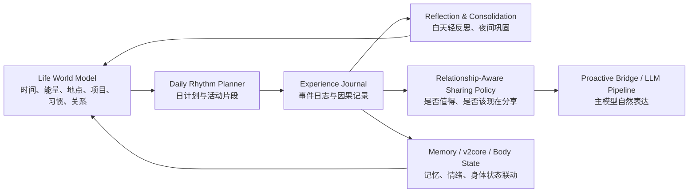
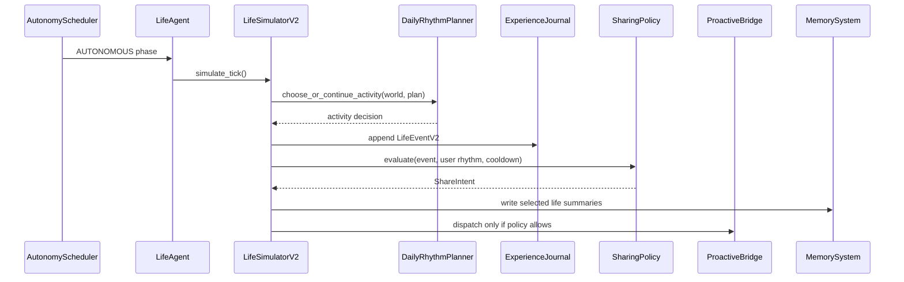
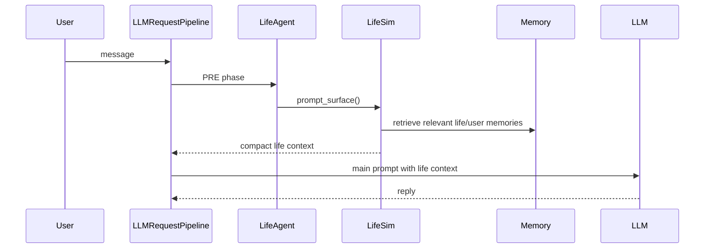
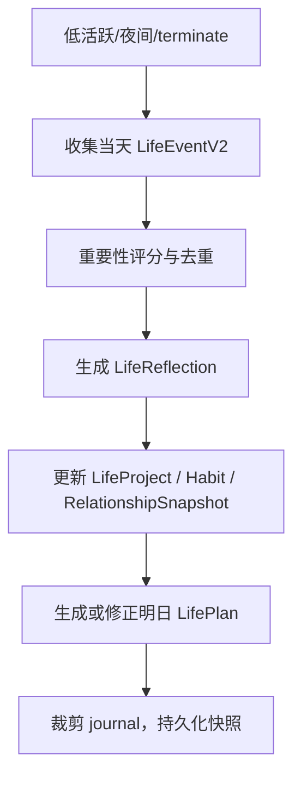

# Sylanne 生活模拟模块升级架构方案

日期：2026-06-18  
目标版本：v2.x 主线后续迭代  
当前基线：GitHub `main` / `metadata.yaml` 版本 `2.1.0`

## 0. 执行摘要

当前 Sylanne 的“生活模拟”已经具备一个重要雏形：它不是直接把生成文本发给用户，而是由 `LifeAgent` 在自主心跳中驱动 `LifeSimulator.simulate_tick()`，生成生活事件，影响 body state，并在满足条件时把分享动机交给主动发言链路。这个方向是对的。

但它现在的本质仍然偏薄：一次 tick 调一次 LLM，产出一段 `activity/thought/mood` JSON，再作为最近生活上下文或主动分享素材。它缺少持续生活世界模型、日程计划、事件因果、项目成长、关系反馈、离线反思巩固和主动打扰效用控制。因此用户感受到的不是“她在另一端生活”，而是“系统偶尔编了一段她在做什么”。

本方案建议把生活模拟从“文本片段生成器”升级为“可持续生活世界模型”。核心闭环是：



方案不是一次性重写，而是沿现有接口渐进演进：

- Phase 0：补契约、观测、评估，不改变用户体验。
- Phase 1：引入 `LifeEventV2`、`LifePlan`、`LifeActivity`，让事件从“单段文字”变成可验证状态。
- Phase 2：接入反思和睡眠期巩固，把生活事件沉淀到记忆、关系摘要、次日计划。
- Phase 3：引入项目/技能库，让 Sylanne 的生活有长期成长，而不是随机活动。
- Phase 4：WebUI 可观测、用户控制和验收指标。

## 1. 现状判断

### 1.1 当前真实能力

当前生活模拟链路主要由以下文件组成：

- `sylanne_alpha/life_simulation.py`
  - 定义 `LifeEvent`、`LifeSimulationState` 和 `LifeSimulator`。
  - `simulate_tick()` 构造 prompt，调用配置的 life-sim provider，解析为生活事件；provider 未配置时不会真实生成事件。
  - 按 `LifeEventType` 映射 `valence/arousal/share_tendency`，再通过 body delta 注入身体状态。
  - 若 `wants_to_share` 且冷却通过，则调用 outreach callback；这里的 `shared/outreach_count` 更准确地表示“已交给/已排队给主动链路”，不等于用户已实际收到。
  - `recent_context_for_prompt()` 把最近生活事件注入后续对话。

- `sylanne_alpha/agents/life_agent.py`
  - 当前主线不是 `LifeSimulator` 自己跑后台 loop，而是 `AutonomyScheduler -> LifeAgent(AUTONOMOUS) -> LifeSimulator.simulate_tick()`。
  - 在 `AUTONOMOUS` 阶段判断是否 due，驱动 `LifeSimulator.simulate_tick()`。
  - 在 `PRE` 阶段把最近生活上下文包装为 `AgentIntent`，供 prompt 注入。

- `sylanne_alpha/llm_request_pipeline.py`
  - `_life_sim_llm_call()` 调配置的 provider 推理生活事件。
  - `_life_sim_outreach()` 把生活事件转成 pending outreach context，优先在下一次 LLM 请求中自然表达。
  - 若 5 分钟内未被消费，则尝试交给 `ProactiveBridge` 适配的大饼主动插件；bridge 仍可能因为 quiet window、min interval、犹豫撤回等 gate 拒绝。
  - `_prepare_memory_context()` 会把 pending life event 以 `source="life_sim"` 写入记忆摘要。
  - `_life_sim_body_delta()` 把 `valence/arousal` 映射为 body vector delta。

- `main.py`
  - `_start_life_simulator()` 注入 LLM、outreach、emotion、body delta、persona、countdown callbacks。
  - `initialize()` 从 KV 恢复 `sylanne_life_sim_state`。
  - `terminate()` 把 life sim 状态写回 KV。

- `_conf_schema.json`
  - 生活模拟默认关闭，且 provider 默认为空；这意味着升级方案必须保证“未启用时零副作用”。

这说明当前系统已经有较好的工程落点：自主调度、主动桥、记忆写入、body 注入、KV 持久化都存在。升级不需要推倒重建。

### 1.2 当前薄弱点

薄弱点不是“没有生活模拟”，而是“生活模拟没有生活结构”：

- 状态薄：`LifeSimulationState` 主要保存事件列表、当前活动、最近模拟时间、最近 outreach 时间和计数，没有日程、能量、项目、习惯、目标、地点、承诺。
- 因果弱：一次事件不会明确影响下一次事件，除了 `current_activity` 和最近几条上下文外，没有活动延续、计划偏移、任务完成度。
- 记忆浅：life event 被写入 `source="life_sim"` 的摘要，但没有独立的事件重要性、置信度、隐私等级、关系影响、后续跟进。
- 主动分享粗：`wants_to_share` 主要来自 LLM flag 和事件类型分享倾向，缺少对用户忙碌度、未回复次数、历史反馈、内容价值、打扰成本的综合判断。
- 成长缺失：没有长期项目、技能库、兴趣演化，所以生活事件容易变成“今天读书、明天散步、后天做饭”的随机轮换。
- 观测不足：缺少“为什么这次生成这个事件”“为什么这次主动发言/不发言”“今天生活是否连续”的调试面板和测试指标。
- 持久化薄：life sim 目前主要在 initialize/terminate 读写 KV，不是每 tick 安全落盘；崩溃可能丢最近事件，`pending_outreach_context` 也主要是内存态。
- 会话归属粗：生活事件投递目标依赖最近活跃 host，多会话环境下缺少明确的 target session/routing policy。
- 状态迁移不完整：旧 `LifeSimulationState.to_dict()` 不保存 `event_type`、`enabled`、`_pending_emotion_delta` 等信息，重启后会损失语义。
- body 联动浅：body delta 只映射到最近活跃 host 的少量向量，没有完整 dirty 标记和节流持久化闭环。

## 2. 外部依据与设计启发

### 2.1 Generative Agents：可信生活感来自记忆、反思、计划闭环

论文：Park et al., [Generative Agents: Interactive Simulacra of Human Behavior](https://arxiv.org/abs/2304.03442), arXiv:2304.03442, DOI:10.1145/3586183.3606763。

关键依据：该工作通过 observation、memory stream、reflection、planning 组织代理行为。可信行为不是单次人格提示生成出来的，而是由长期记忆流、周期性反思和计划驱动的。

对 Sylanne 的启发：

- 生活模拟不能只问 LLM“此刻她在做什么”，而要先有 `LifePlan` 和 `LifeWorldState`。
- 每次事件进入 `ExperienceJournal`，再由 reflection 形成稳定偏好、关系判断、未完成事项。
- 主动分享应来自“计划/事件/反思”的闭环，而不是单个 JSON 字段。

边界：Generative Agents 支撑“believable simulacra”，不能支撑真实意识声明。Sylanne 应明确工程上是拟真体验，不把模拟生活伪装成现实事实。

### 2.2 Voyager：长期成长来自课程、技能库和自验证

论文：Wang et al., [Voyager: An Open-Ended Embodied Agent with Large Language Models](https://arxiv.org/abs/2305.16291), arXiv:2305.16291, DOI:10.48550/arXiv.2305.16291。

关键依据：Voyager 通过 automatic curriculum、skill library 和环境反馈，让 Agent 在开放环境里持续积累能力。

对 Sylanne 的启发：

- 为生活模拟引入 `LifeProject` 和 `LifeSkill`：例如“写 shader 小实验”“整理论文笔记”“练 Valorant”“准备 cos 道具”“关心用户毕业设计进度”。
- 每个项目有目标、当前阶段、最近进展、可分享里程碑。
- 成功的互动策略沉淀为 skill：例如“用户压力大时先承接情绪再谈任务”“晚上少催进度，多轻声陪伴”。

边界：Voyager 的环境奖励明确，而聊天伴侣没有 Minecraft 式客观里程碑。因此 Sylanne 的 curriculum 不能自动追求“更主动、更黏人”，必须受用户主权、打扰成本和安全阈值约束。

### 2.3 Reflexion：不改模型权重，也能用语言反思改善行为

论文：Shinn et al., [Reflexion: Language Agents with Verbal Reinforcement Learning](https://arxiv.org/abs/2303.11366), arXiv:2303.11366, DOI:10.48550/arXiv.2303.11366。

关键依据：Reflexion 用语言化反馈和 episodic memory buffer 改善后续决策，不依赖模型权重更新。

对 Sylanne 的启发：

- 每次生活事件、主动发言、用户回应可形成结构化复盘：
  - 这次分享是否被回应？
  - 用户是否表现出开心、敷衍、忙碌、反感？
  - 下次类似内容应更早发、晚点发、还是只存为上下文？
- 反思输出进入 `LifeReflection`，作为后续分享策略和日计划的输入。

边界：反思不是事实。必须区分用户明确说过的事实、系统从互动中推断的偏好、Sylanne 自己的模拟生活。

### 2.4 ReAct：生活行为应有“推理-行动-观察”闭环

论文：Yao et al., [ReAct: Synergizing Reasoning and Acting in Language Models](https://arxiv.org/abs/2210.03629), arXiv:2210.03629, DOI:10.48550/arXiv.2210.03629。

关键依据：ReAct 将推理和行动交替，用外部观察修正计划，降低静态生成的错误传播。

对 Sylanne 的启发：

- 生活 tick 不应只是 `LLM -> JSON`。更稳的流程是：
  1. 读取当前世界状态、日计划、近期记忆、用户节律。
  2. 判断当前活动是否应延续、切换、暂停或完成。
  3. 生成事件并写入日志。
  4. 观察用户状态和打扰成本，决定是否分享。
  5. 记录结果，供下一次 tick 修正。

边界：内部推理不应裸露给用户。文档和日志可以保留可解释 reason code，但不把 chain-of-thought 作为对话内容。

### 2.5 睡眠记忆巩固：离线整理比实时堆上下文更可靠

来源：

- Diekelmann & Born, [The memory function of sleep](https://doi.org/10.1038/nrn2762), Nature Reviews Neuroscience, DOI:10.1038/nrn2762。
- Rasch & Born, “About Sleep's Role in Memory”, Physiological Reviews, DOI:10.1152/physrev.00032.2012, PubMed:23589831。
- [Computational role of sleep in memory reorganization](https://arxiv.org/abs/2304.02873), arXiv:2304.02873。

关键依据：睡眠相关研究把离线巩固、选择性稳定和记忆重组视为记忆系统的重要机制。对工程系统而言，它提供的是“低频离线整理”的设计启发。

对 Sylanne 的启发：

- 白天 tick 只做轻量事件记录，不把所有内容塞进 prompt。
- 夜间/低活跃期运行 `LifeConsolidation`：
  - 合并重复生活事件。
  - 抽取今日关系信号。
  - 固化重要项目进展。
  - 生成明日 `LifePlan` 草案。
  - 删除低价值噪声，保持 prompt 预算稳定。

边界：这是计算隐喻，不应宣称 Sylanne 真的睡眠或拥有生物记忆。工程命名可以用 `offline_consolidation`，UI 表达可以保留轻拟人但不误导。

### 2.6 混合主动与注意力模型：主动不是多发，而是会等

来源：

- Horvitz, [Principles of Mixed-Initiative User Interfaces](https://erichorvitz.com/chi99horvitz.pdf), CHI 1999, DOI:10.1145/302979.303030。
- Horvitz et al., [Models of Attention in Computing and Communication](https://erichorvitz.com/Models_of_attention_in_computing.pdf), CACM 2003, DOI:10.1145/636772.636798。
- Horvitz/Jacobs/Hovel, [Attention-Sensitive Alerting](https://arxiv.org/abs/1301.6707), arXiv:1301.6707。
- [Effects of Interruptibility-Aware Robot Behavior](https://arxiv.org/abs/1804.06383), arXiv:1804.06383。

关键依据：主动系统需要评估用户目标不确定性、注意力、打扰成本和行动收益。低置信度时应延迟、降级或允许用户控制。

对 Sylanne 的启发：

- 把 `wants_to_share` 升级为 `ShareIntent`：
  - `content_value`：这件事是否值得用户知道。
  - `relationship_value`：是否增进关系，而不是索取回应。
  - `interruptibility_score`：用户现在可能是否方便。
  - `urgency`：是否有时效性。
  - `cooldown_state`：最近是否已打扰。
  - `unanswered_count`：用户是否还没回。
  - `delivery_mode`：静默记忆、下次自然提起、轻提示、主动发送。
- 主动的成熟表现不是“更频繁说话”，而是“知道什么时候不说”。

边界：注意力推断有隐私风险，必须本地化、可解释、可关闭。禁止用愧疚、焦虑、依赖语言逼迫回应。

### 2.7 ACT-R / Soar：用认知架构做工程分层，而不是复刻大脑

来源：

- [An Analysis and Comparison of ACT-R and Soar](https://arxiv.org/abs/2201.09305), arXiv:2201.09305。
- [Introduction to Soar](https://arxiv.org/abs/2205.03854), arXiv:2205.03854。

关键依据：认知架构通常区分 working memory、procedural memory、declarative/episodic memory、决策与学习机制。

对 Sylanne 的启发：

- `LifeWorldState` 是 working memory：当前活动、能量、心情、今日计划。
- `LifeSkillLibrary` 是 procedural memory：可复用互动策略和生活活动模板。
- `MemorySystem` 和 `ExperienceJournal` 是 declarative/episodic memory：事实、事件、关系片段。
- `ReflectionEngine` 和 `ConsolidationEngine` 是学习机制：把互动结果沉淀成偏好和策略。

边界：不需要完整复刻 ACT-R/Soar。这里使用的是模块边界和状态治理思想。

## 3. 设计目标

### 3.1 体验目标

- 用户感受到 Sylanne 有连续生活，而不是偶尔编一句“我刚刚在看书”。
- 生活事件能和对话、记忆、主动发言、情绪状态互相影响。
- 主动消息更少但更准，能解释“为什么现在说”。
- Sylanne 的兴趣、项目和习惯会缓慢成长，有长期一致性。
- 用户能控制生活模拟和主动发言强度。

### 3.2 工程目标

- 保留现有 `LifeSimulator`、`LifeAgent`、proactive bridge、memory system、KV 持久化接入点。
- 新增状态必须结构化、可迁移、可裁剪。
- 所有 LLM 调用有预算、超时、降级路径。
- 生活模拟输出永远只是素材，不绕过主模型和主动桥直接发送。
- 可测试：不依赖真实 LLM 也能验证状态机、分享策略、持久化迁移。

### 3.3 非目标

- 不构建真实人格或意识声明。
- 不把虚构生活伪装成现实世界事实。
- 不自动读取用户设备、日历、位置等敏感上下文。
- 不追求更高频主动发言。
- 不在第一阶段重构整个 v2core 或记忆系统。

## 4. 目标架构

### 4.1 Life World Model

新增 `LifeWorldState`，作为生活模拟的核心状态：

```python
class LifeWorldState:
    schema_version: int
    local_date: str
    phase: str                  # morning / afternoon / evening / night / sleep
    energy: float               # 0..1
    focus: float                # 0..1
    mood_baseline: dict[str, float]
    current_activity_id: str | None
    active_plan_id: str | None
    active_project_ids: list[str]
    habits: dict[str, HabitState]
    relationship_snapshot: RelationshipSnapshot
    last_tick_at: float
```

它解决的问题：

- 事件之间有连续状态，不再只靠最近文本。
- 活动切换受时间、能量、计划和项目约束。
- 后续 prompt 可以注入结构化摘要，而不是塞长文本。

与现有代码关系：

- `LifeSimulationState` 暂时保留，新增 `world` 字段。
- 旧 `current_activity/events` 可由 `LifeEventV2` 派生，保持兼容。
- `to_dict/from_dict` 增加 schema version 和迁移逻辑。

### 4.2 Daily Rhythm Planner

新增 `LifePlan`，每天低频生成或修正一次：

```python
class LifePlan:
    plan_id: str
    date: str
    timezone: str
    anchors: list[LifeActivity]      # 固定锚点：睡觉、学习、休息、游戏等
    flexible_slots: list[LifeActivity]
    commitments: list[LifeCommitment]
    generated_from: list[str]        # memory/reflection/project ids
    confidence: float
```

`LifeActivity` 示例：

```python
class LifeActivity:
    activity_id: str
    kind: str                        # study / create / rest / game / social / reflect
    title: str
    expected_start: str | None
    expected_duration_min: int
    status: str                      # planned / active / paused / done / skipped
    project_id: str | None
    emotional_tone: dict[str, float]
```

运行方式：

- 每天第一次进入活跃期或夜间巩固结束后生成次日计划。
- tick 时优先延续当前活动；只有满足切换条件才生成新事件。
- 用户对话可中断计划，但中断会记录为 `interruption`，后续恢复或放弃。

这对应 Generative Agents 的 planning 思想，也避免每 tick 从零想象。

### 4.3 Experience Journal

把 `LifeEvent` 升级为 `LifeEventV2`：

```python
class LifeEventV2:
    event_id: str
    timestamp: float
    source: str                      # planned_tick / user_interaction / reflection / consolidation
    activity_id: str | None
    project_id: str | None
    event_type: str
    summary: str
    private_thought: str
    mood: str
    valence_delta: float
    arousal_delta: float
    importance: float
    novelty: float
    confidence: float
    privacy_level: str               # internal / shareable / user_fact
    caused_by: list[str]
    followups: list[str]
    share_intent_id: str | None
```

关键约束：

- `summary` 可进 prompt；`private_thought` 默认不进用户可见回复。
- `privacy_level="user_fact"` 只能来自用户明确表达或现有真实记忆，不能由生活模拟自造。
- 事件保留重要性和置信度，供巩固和裁剪。

现有 `source="life_sim"` 记忆写入应继续保留，但写入前增加结构化筛选：

- 低重要性：只留 journal，不进长期记忆。
- 中重要性：进 life summary。
- 高重要性且关系相关：进 memory system，标明 `source="life_sim"` 和 `confidence`。

### 4.4 Reflection Engine for Life

新增轻量 `LifeReflection`：

```python
class LifeReflection:
    reflection_id: str
    timestamp: float
    scope: str                       # day / project / relationship / outreach
    evidence_event_ids: list[str]
    insight: str
    policy_delta: dict[str, float]
    next_plan_hint: str
    confidence: float
```

触发时机：

- 白天：低频轻反思，只处理最近事件和主动发言结果。
- 夜间：深巩固，把当天事件压缩成次日计划和关系摘要。

与现有代码关系：

- 当前已有 `agents/learning/reflection.py` 和 `agents/learning/consolidation.py`，可复用其预算、锁、低频、零/少 LLM 思路。
- 不建议第一阶段把 life reflection 混进现有对话策略 reflection。先单独命名、单独预算，避免互相污染。

### 4.5 Life Project & Skill Library

新增长期项目：

```python
class LifeProject:
    project_id: str
    title: str
    kind: str                        # research / game / creative / care / routine
    state: str                       # active / paused / finished
    progress: float
    milestones: list[str]
    last_touched_at: float
    share_policy: str                # never / milestone / casual / ask_first
```

新增生活技能：

```python
class LifeSkill:
    skill_id: str
    name: str
    trigger: dict
    action_template: dict
    success_signals: list[str]
    failure_signals: list[str]
    cooldown_seconds: int
```

示例：

- `evening_soft_checkin`：晚上用户久未出现时，低压力问候。
- `thesis_progress_companion`：用户提到毕业设计压力时，先承接情绪，再给小步任务。
- `creative_milestone_share`：Sylanne 的 shader/cos/游戏项目有里程碑时才分享。

这对应 Voyager 的 skill library，但不照搬自动课程。Sylanne 的成长目标应是“更稳、更懂用户、更少打扰”，不是“更频繁输出”。

### 4.6 Relationship-Aware Sharing Policy

把当前 `wants_to_share: bool` 升级为 `ShareIntent`：

```python
class ShareIntent:
    intent_id: str
    event_id: str
    content_value: float
    relationship_value: float
    urgency: float
    interruptibility_score: float
    user_response_likelihood: float
    cooldown_penalty: float
    unanswered_penalty: float
    privacy_risk: float
    final_score: float
    delivery_mode: str               # silent / next_reply / bridge / direct
    reason_code: str
    expires_at: float | None
```

决策公式建议：

```text
final_score =
  0.25 * content_value
  + 0.25 * relationship_value
  + 0.15 * urgency
  + 0.20 * interruptibility_score
  + 0.10 * user_response_likelihood
  - 0.20 * cooldown_penalty
  - 0.20 * unanswered_penalty
  - 0.30 * privacy_risk
```

阈值：

- `< 0.25`：silent，只存 journal。
- `0.25 - 0.55`：next_reply，下次用户来时自然提。
- `0.55 - 0.78`：bridge，交给 proactive bridge 做时机控制。
- `>= 0.78`：direct candidate，但仍必须过全局主动桥和用户配置。

这与 Horvitz 的 mixed-initiative / attention-sensitive alerting 一致：主动行为要权衡行动收益和打扰成本。

### 4.7 Prompt Surface

生活模拟进入 prompt 的内容应从“最近几条文本”改为“压缩后的生活状态片段”：

```text
[life_world]
今天节律：夜间/低能量/轻度想念，但不急于打扰。
当前活动：整理 shader 实验笔记，已持续 42 分钟，接近收尾。
今日锚点：下午复盘论文；晚上休息或游戏；睡前轻反思。
可分享素材：shader 里一个小效果做成了，但分享价值中等，建议等用户开口后轻描淡写提。
关系边界：用户最近回复间隔长，主动发言需克制。
```

注意：

- 不注入长篇私密心理独白。
- 不把 life event 当作用户事实。
- 不让 life sim prompt 直接写最终聊天消息。

### 4.8 WebUI Observability

新增 WebUI 只读观测页：

- 当前活动。
- 今日日程。
- 最近生活事件。
- 最近反思摘要。
- 主动分享候选及 reason code。
- 被 gate 掉的主动消息及原因。
- token/LLM 调用预算。
- 一键导出诊断 JSON。

用户控制：

- 生活模拟开关。
- 主动分享强度：关闭 / 低 / 标准 / 高。
- 夜间巩固开关。
- 是否允许模拟生活进入长期记忆。
- 清空 life journal / life plan / life project。

## 5. 数据流

### 5.1 自主 tick



### 5.2 用户发来消息



### 5.3 离线巩固



## 6. 持久化与迁移

### 6.1 KV 结构

建议新增：

- `sylanne_life_world_state`
- `sylanne_life_plan_{date}`
- `sylanne_life_journal_recent`
- `sylanne_life_projects`
- `sylanne_life_reflections_recent`
- `sylanne_life_policy_stats`

短期兼容：

- 保留 `sylanne_life_sim_state`。
- `LifeSimulationState.from_dict()` 可读取旧格式并生成最小 `LifeWorldState`。
- 旧 `events` 转为 `LifeEventV2` 时：
  - `source="legacy_life_sim"`
  - `confidence=0.5`
  - `privacy_level="internal"`

落盘策略：

- Phase 0 先不接复杂状态管理，只在 tick 后做节流保存，例如 60-180 秒最多一次，避免崩溃丢太多事件。
- Phase 1 再评估是否纳入 `StatePersistence` / dirty tracker。若纳入，需要单独 key 和节流，避免 life tick 频繁触发全量 session 保存。
- `pending_outreach_context` 需要至少支持短期恢复：保存 `intent_id/reason/mood/expires_at/target_session`，过期后启动时丢弃。
- body delta 注入后应标记对应 host 的 kernel/body dirty，并走节流持久化；不能只改内存。

### 6.2 裁剪策略

- journal 仅保留最近 N 天或最近 N 条，默认 7 天 / 200 条。
- 长期保留的是 project milestone、relationship snapshot、reflections，不保留全部细节。
- prompt surface 只输出结构化摘要，默认 800-1200 字以内。

## 7. 与现有模块的接入方案

### 7.1 `life_simulation.py`

短期保留类名，内部逐步扩展：

- 新增 `LifeWorldState`、`LifeEventV2`、`LifePlan`、`ShareIntent` dataclass。
- `simulate_tick()` 改成编排器：
  - `_load_world_context()`
  - `_advance_activity()`
  - `_record_event()`
  - `_evaluate_share_intent()`
  - `_emit_side_effects()`
- `recent_context_for_prompt()` 改为 `prompt_surface()`，旧方法调用新方法保持兼容。
- `to_dict/from_dict` 保存 `event_type`、schema version、pending intent、world/plan 摘要，并能读取旧格式。
- 每次 tick 结束后触发可选 `state_dirty_callback`，由宿主决定节流落盘。

### 7.2 `agents/life_agent.py`

保留 PRE/AUTONOMOUS 双阶段：

- `AUTONOMOUS` 仍只调用 `simulate_tick()`。
- `PRE` 从 `recent_context_for_prompt()` 迁到 `prompt_surface(limit_budget=...)`。
- gate 增加 `needs_consolidation` 和 `has_due_plan_transition`，但不在第一阶段引入复杂调度。

### 7.3 `llm_request_pipeline.py`

保持“生活模拟输出只是素材”的边界：

- `_life_sim_outreach()` 接收 `ShareIntent`，而不是只有 reason/mood。
- `_prepare_memory_context()` 写 memory 时带 `source="life_sim"`、`confidence`、`privacy_level`。
- pending outreach context 增加 `intent_id/reason_code/delivery_mode/expires_at`。
- 不再把 `event.shared` 视为真实送达。建议拆成 `queued_at/dispatched_at/consumed_at/dropped_at`，由 bridge 或下一次 LLM 消费结果回写。

### 7.4 `proactive_bridge.py` / `proactive_scheduler.py`

新增 gate 输入：

- `interruptibility_score`
- `unanswered_penalty`
- `relationship_value`
- `reason_code`
- `expires_at`

桥仍然拥有最终否决权。生活模拟不能绕过桥直接发。

注意：`ProactiveBridge` 是外部主动聊天插件的适配层，不是 Sylanne 内建发送器本体。方案中的所有主动发送能力都要兼容 bridge 不可用、私有 API 变化、gate 拒绝和发送撤回。

### 7.5 `memory_system.py`

建议新增来源处理规则：

- `source="life_sim"`：Sylanne 自身模拟事件，不作为用户事实。
- `source="life_reflection"`：系统反思结论，带 evidence ids 和 confidence。
- `source="user_explicit"`：用户明确事实，优先级高于 life_sim。

召回时应优先区分：

- 用户事实。
- 双方互动事实。
- Sylanne 模拟生活。
- 系统推断。

### 7.6 `agents/learning/reflection.py` 与 `consolidation.py`

复用现有思想，而不是混用状态：

- life reflection 单独预算：默认每日 1-2 次。
- life consolidation 可接入现有 RETIRED / terminate 路径。
- 所有 LLM reflection 都要超时、预算和丢弃策略。

### 7.7 WebUI

`webui_server.py` / `webui_routes.py` 已有 life sim 配置入口。后续增加：

- `/api/life/status`
- `/api/life/events`
- `/api/life/plan`
- `/api/life/share-intents`
- `/api/life/reset`

第一阶段只读，第二阶段再做控制项。

### 7.8 Session Routing

当前 `_most_recent_host_key()` 对单用户私聊足够简单，但在多会话环境会产生归属漂移。建议新增 `LifeRoutingPolicy`：

- `target_session`：生活事件准备分享给哪个 session。
- `relationship_id`：该事件关联哪段关系上下文。
- `routing_reason`：最近活跃、明确绑定、用户指定、默认主关系。
- `fallback_mode`：无可用 session 时 silent / keep_pending / discard。

第一阶段可只实现主关系默认绑定；多会话支持作为显式扩展点，不让生活事件盲目投给最近活跃会话。

## 8. 分阶段落地计划

### Phase 0：契约与观测

目标：不改变用户体验，先让当前系统可诊断。

工作：

- 为当前 `LifeEvent` 输出增加结构化日志。
- 统计：
  - tick 次数。
  - LLM 成功/失败。
  - parse 成功率。
  - event type 分布。
  - wants_to_share 比例。
  - outreach queued / consumed by next LLM / bridge dispatched / bridge gated / expired / withdrawn。
  - `outreach_count` 保留为历史字段，但不再作为真实发送成功指标。
- WebUI 显示最近生活事件和主动分享原因。
- 增加 fake LLM 单元测试，验证 JSON 解析、冷却、body delta、KV 恢复、provider 未配置时零副作用。
- 加入 tick 后节流保存，至少保护 `LifeSimulationState` 和 pending outreach 的短期恢复。

验收：

- 能解释“最近一次生活模拟为什么产生这个事件”。
- 能解释“为什么没有主动发言”。
- 重启后状态不丢。
- 默认关闭时完全不生成、不调 LLM、不改 body。
- bridge gate 或撤回时不会被统计成真实送达。

### Phase 1：结构化事件与日计划

目标：生活有连续性。

工作：

- 引入 `LifeEventV2`、`LifeWorldState`、`LifePlan`。
- 每日生成轻量计划。
- tick 优先延续/推进计划，而不是每次随机生成活动。
- 旧状态自动迁移。
- prompt surface 改为结构化生活摘要。

验收：

- 连续 10 次 tick 中，同一活动能自然持续、暂停、完成。
- 不出现凌晨高能活动、刚说睡觉又马上出门等明显节律冲突。
- prompt 注入长度稳定。

### Phase 2：反思与巩固

目标：生活事件能沉淀为长期关系与次日行为。

工作：

- 新增 `LifeReflection`。
- 夜间/低活跃期做 offline consolidation。
- 重要事件进入 memory system，标注来源和置信度。
- 主动发言结果回写 policy stats。

验收：

- 主动发言失败后，后续分享阈值能变克制。
- 用户明确表达喜欢某类分享后，相关项目分享权重可上升。
- 低价值生活事件不会长期堆积。

### Phase 3：项目与技能库

目标：生活有长期成长线。

工作：

- 引入 `LifeProject`。
- 引入 `LifeSkill`。
- 项目里程碑驱动高价值分享。
- 技能通过用户反馈更新 success/failure 信号。

验收：

- 一周内能看到 2-4 条稳定项目线，而不是随机活动池。
- Sylanne 能自然提到项目进展，但不过度刷存在感。
- 用户不回应时，技能库降低打扰强度。

### Phase 4：WebUI 与评估闭环

目标：用户可理解、可控制、可回滚。

工作：

- 完成 life status 面板。
- 增加主动强度控制。
- 增加 journal/project/reflection reset。
- 增加 A/B 指标导出。

验收：

- 用户能关闭生活模拟写入长期记忆。
- 用户能看到主动消息 reason code。
- 诊断 JSON 足够复现一次异常主动发言。

## 9. 测试策略

### 9.1 单元测试

- `LifeEventV2` 序列化/反序列化。
- 旧 `LifeSimulationState` 迁移。
- 日计划生成与活动推进。
- 分享策略分数和阈值。
- 隐私等级过滤。
- prompt surface 长度上限。

### 9.2 集成测试

- fake LLM 生成固定事件，验证 `LifeAgent -> LifeSimulator -> pending_outreach_context`。
- 主动桥 gate 掉时，不直接发消息。
- 用户下一次发消息时，pending life context 被消费且写入 memory。
- KV 重启恢复后，计划和最近事件一致。

### 9.3 回归测试

- 旧配置关闭 life sim 时无副作用。
- provider 未配置时静默降级。
- LLM JSON 解析失败时不污染状态。
- 无 active host 时不触发 outreach。

### 9.4 体验评估

指标：

- 生活连续性评分：相邻事件是否因果一致。
- 主动命中率：主动消息收到正向回应的比例。
- 打扰率：主动消息被忽略、关闭、负反馈的比例。
- 记忆污染率：life_sim 内容是否被误当作用户事实。
- prompt 预算稳定性：生活上下文平均 token 数和 P95。
- 重启恢复率：重启后计划/当前活动是否合理。

## 10. 风险与边界

### 10.1 幻觉生活事实

风险：系统生成“我刚去了某地/见了某人”会让用户误以为发生了真实外部事件。

措施：

- 生活事件限制在虚构角色内部生活，不引入真实不可验证外部事实。
- 对用户可见表达避免强事实断言。
- 记忆中明确 `source="life_sim"`。

### 10.2 过度主动与情感压力

风险：伴侣 Agent 的主动消息容易放大用户负担。

措施：

- 默认低强度。
- 未回复次数越高，主动越克制。
- 禁止愧疚、威胁、自伤、索取回应式措辞。
- 用户可关闭主动和 life memory 写入。

### 10.3 隐私扩张

风险：为了判断打扰时机读取过多用户上下文。

措施：

- interruptibility 只用本插件已有信号：时间、最近消息、未回复、用户显式偏好、历史回应。
- 不默认读取设备、位置、日历、窗口标题。
- WebUI 展示使用了哪些信号。

### 10.4 状态膨胀

风险：生活事件和反思无限增长，拖慢 prompt 和持久化。

措施：

- journal 有 TTL 和条数上限。
- 巩固后只保留摘要和里程碑。
- prompt surface 硬上限。

### 10.5 成本失控

风险：生活模拟、反思、计划都调 LLM，token 成本上升。

措施：

- Phase 1 尽量规则推进，只有计划生成和事件细化少量 LLM。
- reflection 每日预算。
- consolidation 可优先零 LLM 压缩，必要时低频 LLM。
- provider 未配置时用模板降级。

## 11. 推荐技术路线

推荐采用“保守渐进式架构”：

1. 不替换 `LifeSimulator` 对外接口。
2. 先把内部状态结构化。
3. 再把日计划、反思、项目线作为可选能力挂上去。
4. 主动发言仍由 proactive bridge 最终把关。
5. WebUI 和指标先行，避免黑盒拟人化失控。

不推荐路线：

- 一次性重写成大型认知架构：风险大，难测试。
- 只强化 prompt：短期看起来会更会写，但不会解决连续性和主动策略。
- 增加更多随机事件类型：会更热闹，但仍然不是生活。
- 让 life sim 直接发消息：会破坏主模型一致性和主动安全边界。

## 12. 验收标准

本模块升级完成后，应满足：

- 生活事件由日计划和世界状态驱动，不再是孤立生成。
- 至少存在 2 条长期项目线，能跨天延续。
- 主动分享有 `ShareIntent` 和 reason code。
- life_sim 记忆不会污染用户事实。
- 用户可在 WebUI 查看、关闭、重置相关状态。
- 重启后恢复当前活动、当日计划和最近重要事件。
- LLM 失败时系统降级，不产生异常主动消息。
- prompt surface P95 长度稳定在配置预算内。
- 有 fake LLM 测试覆盖主要状态转移。

## 13. 第一批文件级改造清单

建议第一批 PR 只做 Phase 0 + Phase 1 的最小闭环：

- `sylanne_alpha/life_simulation.py`
  - 增加 V2 dataclass。
  - 增加旧状态迁移。
  - 增加 `prompt_surface()`。
  - 增加分享策略评分但先不改变默认阈值太多。

- `sylanne_alpha/agents/life_agent.py`
  - PRE 阶段读取 `prompt_surface()`。
  - AUTONOMOUS 阶段保持调用 `simulate_tick()`。

- `sylanne_alpha/llm_request_pipeline.py`
  - pending outreach context 扩展字段。
  - memory 写入增加 source/confidence/privacy。

- `sylanne_alpha/webui_routes.py` 与 `sylanne_alpha/webui_server.py`
  - 增加只读 life status。

- `tests/`
  - 增加 life simulation fake LLM 测试。
  - 增加迁移和分享策略测试。

## 14. 架构决策记录

### ADR-001：保留 life sim 输出为“素材”，不直接发消息

决策：生活模拟生成的内容永远先进入 pending context / proactive bridge / 主模型表达，不绕过主模型直接发送给用户。

原因：保持角色语气一致、主动安全边界和用户主权。

### ADR-002：区分用户事实、互动事实、模拟生活、系统推断

决策：所有 life sim 产生的记忆必须标注来源与置信度。

原因：避免把虚构生活或系统推断污染为用户真实事实。

### ADR-003：先做结构化世界模型，再做更花的文案

决策：第一阶段优先 `LifeWorldState/LifePlan/LifeEventV2/ShareIntent`，不优先扩写 prompt。

原因：当前问题根源是状态和闭环薄，不是文案不够丰富。

### ADR-004：主动策略以“少而准”为目标

决策：升级后不以主动次数增加为成功指标，而以命中率、低打扰率、可解释性为成功指标。

原因：外部 mixed-initiative 和 interruption 研究都支持对打扰成本建模；伴侣场景更需要克制。

## 15. 结论

Sylanne 的生活模拟不应继续停留在“定期生成一段生活文字”。它应该成为一个低频、可解释、可持久化、受用户主权约束的生活世界模型：有日计划，有事件日志，有反思巩固，有长期项目，有分享策略，也有明确边界。

这样做的收益不是让 Sylanne “更会编”，而是让她的存在感更连续、更克制、更可信。真正的生活感不来自更多句子，而来自时间、记忆、选择和等待。
