# AstrBot v4.x 插件开发手册

> 基于 AstrBot v4.x 源码深度分析 + 官方开发者文档蒸馏  
> 源码路径：`E:\AstrBot\backend\app\astrbot\`  
> 编写日期：2026-05-29  
> 定位：通用插件开发完整参考

---

## 目录

- [PART 1 — 事件系统与 Pipeline 架构](#part-1--事件系统与-pipeline-架构)
- [PART 2 — LLM 上下文管理机制](#part-2--llm-上下文管理机制)
- [PART 3 — Provider 系统](#part-3--provider-系统)
- [PART 4 — Persona 系统与 Agent Runner](#part-4--persona-系统与-agent-runner)
- [PART 5 — Tool/Function Calling 系统](#part-5--toolfunction-calling-系统)
- [PART 6 — 插件系统与配置机制](#part-6--插件系统与配置机制)
- [PART 7 — 会话管理、数据库层与消息系统](#part-7--会话管理数据库层与消息系统)
- [附录：API 导入速查](#附录api-导入速查)

---

# PART 1 — 事件系统与 Pipeline 架构

> **本章概要**：AstrBot 的消息处理核心是事件总线 + 管道调度器（Pipeline Scheduler）。理解这套架构是插件开发的基础——它决定了你的代码在何时被调用、能拦截什么、能修改什么。本章从全局视角到具体 Stage，完整呈现事件从进入到响应的全生命周期。

---

## 1.1 整体架构概览

AstrBot 采用 **事件总线 + 管道调度器（Pipeline Scheduler）** 架构。消息从平台适配器进入异步事件队列，由 EventBus 分发到对应的 PipelineScheduler，再依次经过 9 个有序 Stage 处理。

核心文件路径：

| 模块 | 文件路径 |
|------|----------|
| 事件总线 | `core/event_bus.py` |
| 管道调度器 | `core/pipeline/scheduler.py` |
| Stage 基类 | `core/pipeline/stage.py` |
| Stage 执行顺序 | `core/pipeline/stage_order.py` |
| Pipeline 上下文工具 | `core/pipeline/context_utils.py` |

> **开发者提示**: 插件代码不直接与这些文件交互，但理解它们的职责有助于你判断 hook 的触发时机和可操作范围。

---

## 1.2 事件流转全流程

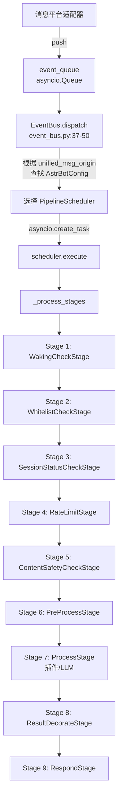

> **开发者提示**: 任何 Stage 都可以调用 `event.stop_event()` 终止后续传播。如果你的插件 handler 没有被调用，先检查消息是否在前置 Stage 被拦截（唤醒检查、白名单、限流等）。

---

## 1.3 Pipeline 各阶段详解

### Stage 执行顺序（`stage_order.py:3-13`）

```python
STAGES_ORDER = [
    "WakingCheckStage",          # 1. 唤醒检查
    "WhitelistCheckStage",       # 2. 白名单检查
    "SessionStatusCheckStage",   # 3. 会话状态检查
    "RateLimitStage",            # 4. 频率限制
    "ContentSafetyCheckStage",   # 5. 内容安全检查
    "PreProcessStage",           # 6. 预处理
    "ProcessStage",              # 7. 核心处理（插件+LLM）
    "ResultDecorateStage",       # 8. 结果装饰
    "RespondStage",              # 9. 发送响应
]
```

### Stage 基类接口（`stage.py:19-46`）

```python
class Stage(abc.ABC):
    @abc.abstractmethod
    async def initialize(self, ctx: PipelineContext) -> None: ...

    @abc.abstractmethod
    async def process(self, event: AstrMessageEvent) -> None | AsyncGenerator[None, None]: ...
```

关键设计：`process()` 返回值决定行为：
- 返回 `None`（普通协程）：执行完毕后继续下一个 Stage
- 返回 `AsyncGenerator`：实现**洋葱模型**，yield 前为前置处理，yield 后为后置处理

### 洋葱模型实现（`scheduler.py:35-76`）

```python
async def _process_stages(self, event, from_stage=0):
    for i in range(from_stage, len(self.stages)):
        stage = self.stages[i]
        coroutine = stage.process(event)
        if isinstance(coroutine, AsyncGenerator):
            async for _ in coroutine:
                if event.is_stopped(): break
                await self._process_stages(event, i + 1)
                if event.is_stopped(): break
        else:
            await coroutine
            if event.is_stopped(): break
```

> **开发者提示**: 洋葱模型意味着某些 Stage（如 ResultDecorateStage）可以在后续 Stage 执行完毕后再做后置处理。插件开发者通常不需要关心这个细节，但如果你在调试消息装饰顺序问题时，这是关键线索。

### 各 Stage 职责速览

| # | Stage | 职责 | 拦截条件 |
|---|-------|------|----------|
| 1 | WakingCheckStage | 判断是否唤醒机器人，匹配 Handler Filter | 未唤醒 → stop |
| 2 | WhitelistCheckStage | 白名单检查 | 不在白名单 → stop |
| 3 | SessionStatusCheckStage | 会话启用状态 | 会话关闭 → stop |
| 4 | RateLimitStage | Fixed Window 限流 | 超限 → stall/discard |
| 5 | ContentSafetyCheckStage | 内容安全（关键词/百度 AIP） | 不通过 → stop |
| 6 | PreProcessStage | 路径映射、音频转换、STT | — |
| 7 | ProcessStage | 插件 Handler + LLM 调用 | — |
| 8 | ResultDecorateStage | 结果装饰（TTS、T2I、分段等） | — |
| 9 | RespondStage | 发送最终消息到平台 | — |

### WakingCheckStage 唤醒条件（`waking_check/stage.py:37-44`）

满足以下任一条件即唤醒：
1. 被 @ 提及
2. 消息被引用回复
3. 以 `wake_prefix` 前缀开头
4. 插件 Handler 的 filter 通过
5. 私聊管理员消息

核心逻辑：
- 设置 `event.role`（admin/member）
- 设置 `event.is_wake` 和 `event.is_at_or_wake_command`
- 遍历 `star_handlers_registry` 中所有 `EventType.AdapterMessageEvent` 类型的 Handler
- 对每个 Handler 的 `event_filters` 执行 AND 逻辑判断
- 通过的 Handler 存入 `event.set_extra("activated_handlers", [...])`
- 解析的指令参数存入 `event.set_extra("handlers_parsed_params", {...})`

> ⚠️ **注意**: `CommandFilter` 受 `wake_prefix` 制约——用户必须先输入唤醒前缀，指令才会被匹配。而 `RegexFilter` 不受此限制，任何消息都会尝试匹配。

### ProcessStage 核心处理（`process_stage/stage.py:28-66`）

ProcessStage 是插件代码实际执行的地方，包含两个子阶段：

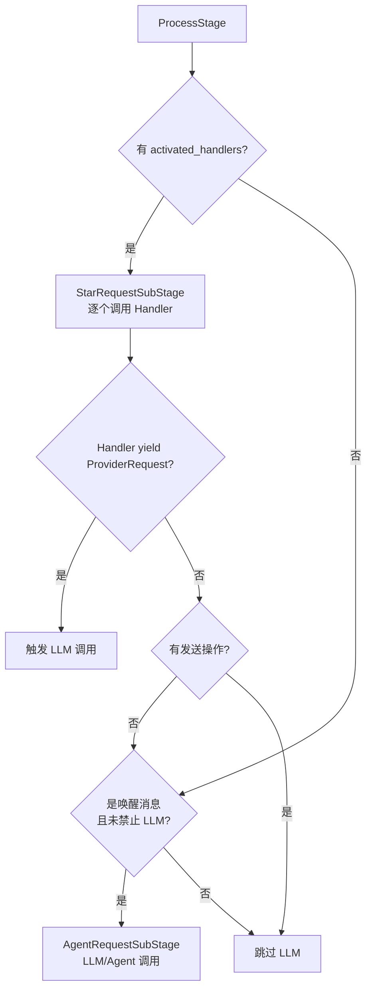

---

## 1.4 事件对象结构（AstrMessageEvent）

**文件**：`core/platform/astr_message_event.py`

### 核心字段

| 字段 | 类型 | 说明 |
|------|------|------|
| `message_str` | `str` | 纯文本消息 |
| `message_obj` | `AstrBotMessage` | 完整消息结构（含消息链） |
| `platform_meta` | `PlatformMetadata` | 平台信息（name, id） |
| `role` | `str` | "member" 或 "admin" |
| `is_wake` | `bool` | 是否唤醒 |
| `is_at_or_wake_command` | `bool` | 是否 @/唤醒词/私聊 |
| `session` | `MessageSession` | 会话对象 |
| `unified_msg_origin` | `str` (property) | 统一消息来源字符串 |
| `_result` | `MessageEventResult \| None` | 事件处理结果 |
| `created_at` | `float` | Unix timestamp |
| `_has_send_oper` | `bool` | 是否已有发送操作 |
| `call_llm` | `bool` | 是否禁止默认 LLM 请求 |
| `plugins_name` | `list[str] \| None` | 启用的插件列表 |
| `_extras` | `dict[str, Any]` | 额外信息字典 |

### 关键 extras 键

| Key | 设置位置 | 说明 |
|-----|----------|------|
| `activated_handlers` | WakingCheckStage | 被激活的 Handler 列表 |
| `handlers_parsed_params` | WakingCheckStage | 指令解析参数 |
| `provider_request` | ProcessStage | Handler 发起的 LLM 请求 |
| `_streaming_finished` | RespondStage | 流式输出完成标记 |
| `_llm_reasoning_content` | InternalAgentSubStage | LLM 推理内容 |
| `enable_streaming` | 外部设置 | 覆盖流式响应配置 |
| `agent_stop_requested` | ActiveEventRegistry | 请求停止 Agent |

### 关键方法

| 方法 | 说明 |
|------|------|
| `set_result(result)` / `get_result()` / `clear_result()` | 结果管理 |
| `stop_event()` / `continue_event()` / `is_stopped()` | 事件传播控制 |
| `send(message_chain)` | 发送消息到平台 |
| `send_streaming(generator)` | 流式发送 |
| `request_llm(...)` | 创建 ProviderRequest |
| `make_result()` / `plain_result()` / `image_result()` | 结果工厂方法 |

### AstrBotMessage 结构

```python
class AstrBotMessage:
    type: MessageType       # GROUP_MESSAGE / PRIVATE_MESSAGE
    self_id: str            # 机器人 ID
    session_id: str         # 会话 ID
    message_id: str         # 消息 ID
    group_id: str           # 群组 ID
    sender: MessageMember   # 发送者
    message: List[BaseMessageComponent]  # 消息链
    message_str: str        # 纯文本
    raw_message: object     # 平台原始消息
    timestamp: int          # 时间戳
```

### 实践示例：事件监听与消息处理

```python
from astrbot.api.event import filter, AstrMessageEvent
from astrbot.api.star import Context, Star

class MyPlugin(Star):
    def __init__(self, context: Context):
        super().__init__(context)

    @filter.command("hello")
    async def hello(self, event: AstrMessageEvent):
        '''hello 指令示例'''
        user_name = event.get_sender_name()
        yield event.plain_result(f"Hello, {user_name}!")

    # 接收所有消息（不限唤醒）
    @filter.event_message_type(filter.EventMessageType.ALL)
    async def on_all(self, event: AstrMessageEvent):
        # message_str 是纯文本，message_obj.message 是完整消息链
        print(f"收到: {event.message_str}")
        yield event.plain_result("收到消息")

    # 仅私聊
    @filter.event_message_type(filter.EventMessageType.PRIVATE_MESSAGE)
    async def on_private(self, event: AstrMessageEvent):
        yield event.plain_result("私聊消息")

    # 仅群聊
    @filter.event_message_type(filter.EventMessageType.GROUP_MESSAGE)
    async def on_group(self, event: AstrMessageEvent):
        yield event.plain_result("群聊消息")
```

> **开发者提示**: `unified_msg_origin` 是会话的唯一标识符（UMO），用于主动推送消息、获取对话历史等场景。务必保存它而非 `session_id`。

---

## 1.5 插件 Hook 点完整列表

**文件**：`core/star/star_handler.py:219-241`

### EventType 枚举（全部事件类型）

| EventType | 触发时机 | Handler 签名 |
|-----------|----------|-------------|
| `OnAstrBotLoadedEvent` | AstrBot 加载完成 | `async def handler(self)` |
| `OnPlatformLoadedEvent` | 平台加载完成 | `async def handler(self)` |
| `AdapterMessageEvent` | 收到适配器消息 | `async def handler(self, event: AstrMessageEvent)` |
| `OnWaitingLLMRequestEvent` | 等待 LLM（获取锁前） | `async def handler(self, event: AstrMessageEvent)` |
| `OnLLMRequestEvent` | LLM 请求发起 | `async def handler(self, event, request: ProviderRequest)` |
| `OnLLMResponseEvent` | LLM 响应后 | `async def handler(self, event, response: LLMResponse)` |
| `OnAgentBeginEvent` | Agent 开始运行 | `async def handler(self, event, run_context)` |
| `OnAgentDoneEvent` | Agent 运行完成 | `async def handler(self, event, run_context, response)` |
| `OnDecoratingResultEvent` | 发送消息前装饰 | `async def handler(self, event: AstrMessageEvent)` |
| `OnCallingFuncToolEvent` | 调用函数工具 | `async def handler(self, event, ...)` |
| `OnUsingLLMToolEvent` | 使用 LLM 工具前 | `async def handler(self, event, tool, tool_args)` |
| `OnLLMToolRespondEvent` | 函数工具调用后 | `async def handler(self, event, tool, tool_args, tool_result)` |
| `OnAfterMessageSentEvent` | 消息发送后 | `async def handler(self, event: AstrMessageEvent)` |
| `OnPluginErrorEvent` | 插件处理异常 | `async def handler(self, event, plugin_name, handler_name, error, traceback_text)` |
| `OnPluginLoadedEvent` | 插件加载完成 | `async def handler(self, metadata)` |
| `OnPluginUnloadedEvent` | 插件卸载完成 | `async def handler(self, metadata)` |

### 注册装饰器一览

```python
from astrbot.api.event.filter import (
    command, command_group, regex,
    permission_type, event_message_type, platform_adapter_type,
    custom_filter,
    on_llm_request, on_llm_response,
    on_agent_begin, on_agent_done,
    on_decorating_result, on_waiting_llm_request,
    on_using_llm_tool, on_llm_tool_respond,
    after_message_sent,
    on_astrbot_loaded, on_platform_loaded,
    on_plugin_error, on_plugin_loaded, on_plugin_unloaded,
    llm_tool,
)
```

### 实践示例：事件钩子用法

> ⚠️ **注意**: 事件钩子**不能**与 `command`/`command_group`/`event_message_type` 等过滤器一起使用。钩子中**不能使用 yield**，需用 `await event.send()` 发送消息。

```python
from astrbot.api.event import filter, AstrMessageEvent
from astrbot.api.star import Context, Star
from astrbot.core.provider.entities import ProviderRequest

class MyPlugin(Star):
    def __init__(self, context: Context):
        super().__init__(context)

    # Bot 初始化完成
    @filter.on_astrbot_loaded()
    async def on_loaded(self):
        print("AstrBot 初始化完成")

    # 等待 LLM 请求时（锁外触发，适合发送"思考中"提示）
    @filter.on_waiting_llm_request()
    async def on_waiting(self, event: AstrMessageEvent):
        await event.send(event.plain_result("正在思考..."))

    # LLM 请求前（可修改 ProviderRequest）
    @filter.on_llm_request()
    async def on_req(self, event: AstrMessageEvent, req: ProviderRequest):
        req.system_prompt += "\n自定义提示"

    # LLM 响应后（可读取响应，但历史已保存）
    @filter.on_llm_response()
    async def on_resp(self, event: AstrMessageEvent, resp):
        print(resp.completion_text)

    # 发送消息前（装饰消息链）
    @filter.on_decorating_result()
    async def on_decorate(self, event: AstrMessageEvent):
        result = event.get_result()
        chain = result.chain
        chain.append(Plain("!"))

    # 发送消息后
    @filter.after_message_sent()
    async def after_sent(self, event: AstrMessageEvent):
        pass
```

> **开发者提示**: `on_llm_request` 是修改 LLM 上下文的有效窗口。`on_llm_response` 发生在最终历史保存之前，适合清理响应或记录投递计划，但不应一边立即发送正文、一边保留框架待发送结果。详见 PART 2。

---

## 1.6 Handler Filter 系统

**基类**：`core/star/filter/__init__.py:8-11`

```python
class HandlerFilter(abc.ABC):
    @abc.abstractmethod
    def filter(self, event: AstrMessageEvent, cfg: AstrBotConfig) -> bool: ...
```

### 内置 Filter 类型

| Filter | 说明 | 受 wake_prefix 制约 |
|--------|------|:---:|
| `CommandFilter` | 标准指令匹配，支持参数解析 | 是 |
| `CommandGroupFilter` | 指令组（子指令树） | 是 |
| `RegexFilter` | 正则匹配 | **否** |
| `PermissionTypeFilter` | 权限检查（admin/member） | — |
| `EventMessageTypeFilter` | 消息类型过滤（群聊/私聊） | — |
| `PlatformAdapterTypeFilter` | 平台类型过滤 | — |
| `CustomFilter` / `CustomFilterAnd` / `CustomFilterOr` | 自定义组合过滤器 | — |

> ⚠️ **注意**: 一个 Handler 上的所有 Filter 必须满足 **AND** 逻辑关系——全部通过才会激活该 Handler。

### 实践示例：指令注册与过滤

```python
from astrbot.api.event import filter, AstrMessageEvent
from astrbot.api.star import Context, Star

class MyPlugin(Star):
    def __init__(self, context: Context):
        super().__init__(context)

    # 基本指令
    @filter.command("hello")
    async def hello(self, event: AstrMessageEvent):
        '''指令描述（会被解析展示给用户）'''
        yield event.plain_result("Hello!")

    # 带参指令（自动类型转换）
    @filter.command("add")
    async def add(self, event: AstrMessageEvent, a: int, b: int):
        # /add 1 2 -> 结果是: 3
        yield event.plain_result(f"结果是: {a + b}")

    # 指令别名
    @filter.command("help", alias={'帮助', 'helpme'})
    async def help_cmd(self, event: AstrMessageEvent):
        yield event.plain_result("帮助信息")

    # 指令组
    @filter.command_group("math")
    def math(self):
        pass

    @math.command("add")
    async def math_add(self, event: AstrMessageEvent, a: int, b: int):
        yield event.plain_result(f"结果是: {a + b}")

    # 嵌套指令组使用 .group() 而非 .command_group()
    @math.group("calc")
    def calc(self):
        pass

    @calc.command("multiply")
    async def calc_multiply(self, event: AstrMessageEvent, a: int, b: int):
        yield event.plain_result(f"结果是: {a * b}")

    # 正则匹配（不受 wake_prefix 制约）
    @filter.regex(r"天气(.+)")
    async def weather(self, event: AstrMessageEvent):
        yield event.plain_result("查询天气中...")

    # 多过滤器组合（AND 逻辑）
    @filter.command("secret")
    @filter.permission_type(filter.PermissionType.ADMIN)
    @filter.event_message_type(filter.EventMessageType.PRIVATE_MESSAGE)
    async def secret(self, event: AstrMessageEvent):
        yield event.plain_result("管理员私聊专属指令")

    # 平台过滤
    @filter.platform_adapter_type(
        filter.PlatformAdapterType.AIOCQHTTP | filter.PlatformAdapterType.QQOFFICIAL
    )
    @filter.command("qq_only")
    async def qq_only(self, event: AstrMessageEvent):
        yield event.plain_result("QQ 平台专属")

    # 优先级控制（数字越大越先执行，默认 0）
    @filter.command("check", priority=1)
    async def check(self, event: AstrMessageEvent):
        if not self.validate():
            yield event.plain_result("检查失败")
            event.stop_event()  # 后续所有 handler 和 LLM 调用都不会执行
```

> **开发者提示**: `PlatformAdapterType` 枚举值包括 `AIOCQHTTP`、`QQOFFICIAL`、`GEWECHAT`、`ALL`。可用 `|` 运算符组合多个平台。

---

## 1.7 关键设计模式总结

| 模式 | 说明 |
|------|------|
| **洋葱模型** | Stage 通过 AsyncGenerator 实现前置/后置处理，递归调用后续 Stage |
| **事件传播控制** | 任何阶段可调用 `event.stop_event()` 终止后续处理 |
| **Handler 优先级** | 按 priority 降序执行，高优先级 handler 先处理 |
| **Filter AND 逻辑** | handler 的所有 filter 必须全部通过才激活 |
| **结果流转** | 通过 `event.set_result()` / `event.get_result()` 在阶段间传递 |
| **流式支持** | `ResultContentType.STREAMING_RESULT` + `async_stream` 实现流式输出 |
| **多配置隔离** | EventBus 通过 `pipeline_scheduler_mapping` 支持多套配置各自独立的 Pipeline |

> **开发者提示**: 理解这些模式后，你可以：
> - 用 `priority` 确保你的 handler 在其他插件之前执行
> - 用 `stop_event()` 实现"拦截器"模式
> - 用 `on_decorating_result` 在发送前修改任何插件/LLM 产生的回复

---
---

# PART 2 — LLM 上下文管理机制

> **本章概要**：当消息通过 Pipeline 到达 LLM 调用阶段时，AstrBot 如何组装上下文、调用模型、持久化历史？本章剖析 `ProviderRequest` 的完整生命周期，帮助插件开发者理解每个注入通道的持久化行为，避免"历史污染"这一最常见的坑。

---

## 2.1 ProviderRequest 数据结构

**文件**：`core/provider/entities.py:94`

`ProviderRequest` 是 LLM 调用的核心请求对象，承载了一次推理所需的全部上下文：

```python
class ProviderRequest:
    prompt: str                          # 当前用户消息文本
    session_id: str                      # 会话 ID
    image_urls: list[str]                # 图片 URL 列表
    audio_urls: list[str]                # 音频 URL 列表
    extra_user_content_parts: list[ContentPart]  # 额外用户内容块（系统提醒、指令等）
    func_tool: ToolSet                   # 可用工具集
    contexts: list[dict]                 # OpenAI 格式上下文列表（对话历史）
    system_prompt: str                   # 系统提示词
    conversation: Conversation           # 关联的对话对象（含 DB 持久化句柄）
    tool_calls_result                    # 工具调用结果
    model: str                           # 模型名称
```

### 各字段的生命周期与持久化行为

| 字段 | 来源 | 是否持久化到历史 | 说明 |
|------|------|:---:|------|
| `prompt` | 用户输入 | **是** | 被 assemble_context 打包为 user message |
| `system_prompt` | 插件/配置注入 | **否** | _save_to_history 跳过首个 system |
| `extra_user_content_parts` | 插件注入 | **是** | 追加到 user message content_blocks |
| `contexts` | DB 加载 | — | 本身就是历史，不重复存储 |
| `image_urls` / `audio_urls` | 用户输入 | **是** | 打包进 user message |

> ⚠️ **注意**: 这张表是插件开发中最重要的参考之一。在 `on_llm_request` 中修改任何"是"列的字段，修改内容都会被永久存入对话历史。

---

## 2.2 对话历史加载

**文件**：`core/astr_main_agent.py:1142`

```python
req.contexts = json.loads(req.conversation.history)
```

历史以 JSON 字符串形式存储在数据库的 `conversation.history` 字段中，加载时反序列化为 OpenAI 格式的 `list[dict]`（每个 dict 包含 `role` 和 `content`）。

> ⚠️ **注意**: `req.contexts` 是对话历史本身，不是临时注入通道。对它的修改等同于篡改历史记录——修改会被保存回 DB。

---

## 2.3 当前消息组装（Messages 构建）

**文件**：`core/agent/runners/tool_loop_agent_runner.py:305-320`

```python
# 1. 加载历史消息（含 checkpoint 绑定）
messages = bind_checkpoint_messages(request.contexts or [])

# 2. 组装当前用户消息
if request.prompt is not None or ...:
    m = await self._assemble_request_context_for_provider(request)
    messages.append(Message.model_validate(m))

# 3. 插入 system prompt（始终在最前面）
if request.system_prompt:
    messages.insert(0, Message(role="system", content=request.system_prompt))

# 4. 赋值给运行上下文
self.run_context.messages = messages
```

### 最终组装顺序

```
[system_prompt] → [历史 contexts...] → [当前 user message]
```

> **开发者提示**: system_prompt 始终在 messages[0]，这意味着多个插件如果都修改 system_prompt，最终只有一个 system message 生效。需要协调拼接顺序。

---

## 2.4 assemble_context 详解

**文件**：`core/provider/entities.py:191`

`_assemble_request_context_for_provider` 将 `request` 中的多个字段打包成一条完整的 user message：

```python
content_blocks = []

# 主文本
content_blocks.append({"type": "text", "text": self.prompt})

# 额外内容块（插件注入的系统提醒、指令等）
for part in self.extra_user_content_parts:
    content_blocks.append(part.to_dict())

# 图片
for url in self.image_urls:
    content_blocks.append({"type": "image_url", "image_url": {"url": url}})

# 音频
for url in self.audio_urls:
    content_blocks.append({"type": "audio_url", "audio_url": {"url": url}})
```

**最终产物**：一条 `role: "user"` 的 message，`content` 为上述 content_blocks 数组。

> **开发者提示**: `extra_user_content_parts` 的内容会与用户原始消息合并为同一条 user message。这意味着 LLM 会将其视为"用户说的话"的一部分。

---

## 2.5 历史持久化机制

**文件**：`core/pipeline/process_stage/method/agent_sub_stages/internal.py:419-489`

```python
async def _save_to_history(self, event, req, llm_response, all_messages, ...):
    messages_to_save = []
    skipped_initial_system = False

    for message in all_messages:
        # 规则 1：跳过第一个 system message
        if message.role == "system" and not skipped_initial_system:
            skipped_initial_system = True
            continue

        # 规则 2：标记了 _no_save 的 assistant/user 消息不存储
        if message.role in ["assistant", "user"] and message._no_save:
            continue

        messages_to_save.append(message)

    # 写入数据库
    await self.conv_manager.update_conversation(
        ...,
        history=messages_to_save
    )
```

### 持久化规则总结

1. **第一个 system message 被跳过** — `system_prompt` 不会污染历史
2. **`_no_save = True` 的消息被跳过** — 需要在 Message 对象层面设置
3. **其余所有消息（包括 tool calls、tool results）都会被存储**
4. **存储发生在 agent runner 内部** — 插件的 `on_llm_response` 钩子可能来不及干预

> ⚠️ **注意**: 持久化在 agent runner 内部完成，早于 `on_llm_response` 钩子触发。这意味着你无法在 `on_llm_response` 中"撤回"已保存的历史。

---

## 2.6 Context Window 管理

**文件**：`core/agent/runners/tool_loop_agent_runner.py` 约第 710 行

```python
# LLM 调用前执行上下文压缩/截断
await context_manager.process(messages, model_config)
```

- 在实际发送给 LLM 之前，`context_manager` 会根据模型的 token 限制对 messages 做 truncate 或 compress
- 有 `token_usage` 追踪机制记录每次调用的 token 消耗

> **开发者提示**: 即使你注入了大量上下文，context_manager 可能会在发送前将其截断。如果你的注入内容对 LLM 行为至关重要，应尽量精简，或放在 system_prompt 中（system message 通常不会被截断）。

---

## 2.7 各注入通道的持久化行为

### 完整对照表

```
┌─────────────────────────────────┬──────────────┬─────────────────────────┐
│ 注入方式                         │ 是否持久化    │ 适用场景                 │
├─────────────────────────────────┼──────────────┼─────────────────────────┤
│ 修改 request.prompt             │ ✅ 是        │ 需要永久改变用户消息时    │
│ 修改 request.system_prompt      │ ❌ 否        │ 临时指令注入（推荐）      │
│ 追加 extra_user_content_parts   │ ✅ 是        │ 需要持久化的补充信息      │
│ 修改 request.contexts           │ ⚠️ 间接是    │ 不推荐，等于篡改历史      │
│ Message._no_save = True         │ ❌ 否        │ 需要 Message 对象级操作   │
└─────────────────────────────────┴──────────────┴─────────────────────────┘
```

### 在 on_llm_request 中修改各字段的效果

| 在 on_llm_request 中修改… | 会被存入对话历史？ | 下轮 LLM 可见？ |
|---|:---:|:---:|
| `request.prompt` | **是** | 是（作为历史 user message） |
| `request.system_prompt` | **否** | 否（每轮重新注入） |
| `request.extra_user_content_parts` | **是** | 是（嵌入 user message） |
| `request.contexts`（追加/删除条目） | **是** | 是（直接改写历史） |
| `request.image_urls` / `audio_urls` | **是** | 是（嵌入 user message） |

### 实践示例：安全注入上下文

#### Ephemeral Context（临时上下文，不需要持久化）

**适用场景**：人格指令、当前状态描述、实时计算结果、情感标注、安全提醒等每轮都需要但不应累积的内容。

**推荐通道**：`request.system_prompt`

```python
from astrbot.core.provider.entities import ProviderRequest

@filter.on_llm_request()
async def on_llm_request(self, event: AstrMessageEvent, request: ProviderRequest):
    ephemeral_context = self.build_current_context()  # 人格、状态、指令等

    # system_prompt 不会被持久化，每轮重新注入
    if request.system_prompt:
        request.system_prompt = ephemeral_context + "\n\n" + request.system_prompt
    else:
        request.system_prompt = ephemeral_context
```

**优点**：
- 不污染对话历史
- 每轮独立，不会累积
- 可以随时更新内容而不影响历史一致性

> ⚠️ **注意**: 只有一个 system 位置（messages[0]），多个插件可能冲突。需要与其他插件协调 system_prompt 的拼接顺序。

#### Persistent Context（需要持久化的补充信息）

**适用场景**：用户画像摘要、长期记忆标记、关系状态等需要 LLM 在后续轮次中也能看到的信息。

**推荐通道**：`request.extra_user_content_parts`

```python
from astrbot.core.provider.entities import ProviderRequest, ContentPart

@filter.on_llm_request()
async def on_llm_request(self, event: AstrMessageEvent, request: ProviderRequest):
    if self.should_inject_memory(request.session_id):
        memory_block = ContentPart(type="text", text="[用户记忆摘要] ...")
        request.extra_user_content_parts.append(memory_block)
```

> ⚠️ **注意**: 内容会随历史累积，需要控制注入频率和大小。建议仅在必要时注入，避免每轮都追加相同内容。可以通过检查 `request.contexts` 判断是否已有相同信息。

---

## 2.8 插件开发者须知

### 反模式：直接修改 prompt

```python
# ❌ 不推荐：会污染历史
@filter.on_llm_request()
async def on_llm_request(self, event: AstrMessageEvent, request: ProviderRequest):
    request.prompt = f"[系统指令: ...]\n\n{request.prompt}"
```

这会导致用户的原始消息被永久改写。如果必须修改 prompt（例如做文本预处理），确保修改后的内容是用户"本应发送"的内容，而非系统注入。

### 反模式：篡改 contexts

```python
# ❌ 不推荐：等于改写对话历史
@filter.on_llm_request()
async def on_llm_request(self, event: AstrMessageEvent, request: ProviderRequest):
    request.contexts.insert(0, {"role": "user", "content": "..."})
```

`contexts` 是从 DB 加载的真实历史。向其中插入内容会被当作历史的一部分保存回 DB，造成永久性污染。

### 历史污染的后果

如果插件在 `on_llm_request` 中修改 `request.prompt`（例如注入人格指令、情感标注、系统提醒等），这些修改会被存入对话历史：

- **上下文膨胀**：每轮都累积注入内容，token 消耗线性增长
- **历史不自然**：LLM 看到用户消息中混入系统指令，可能产生困惑
- **不可逆**：一旦存入 DB，无法通过插件钩子撤回

### `_no_save` 机制的局限

`Message._no_save = True` 可以阻止单条消息被持久化，但：

- 该标记需要在 **Message 对象**上设置，而非 ProviderRequest 字段
- 插件在 `on_llm_request` 阶段操作的是 request 字段，Message 对象尚未创建
- 要利用此机制，需要 patch agent runner 或在更底层介入——侵入性较强

### 钩子时序与可操作窗口

```
on_llm_request (插件可修改 request)
    │
    ▼
Agent Runner 组装 messages → LLM 调用 → _save_to_history
    │
    ▼
on_llm_response (插件可读取响应，但历史已保存)
```

**关键约束**：
- `on_llm_request` 是插件修改上下文的唯一有效窗口
- `on_llm_response` 触发时，`_save_to_history` 已在 agent runner 内部完成
- 因此，在 `on_llm_response` 中试图"恢复"被修改的 prompt 是无效的——历史已经落盘

### 注入决策流程图

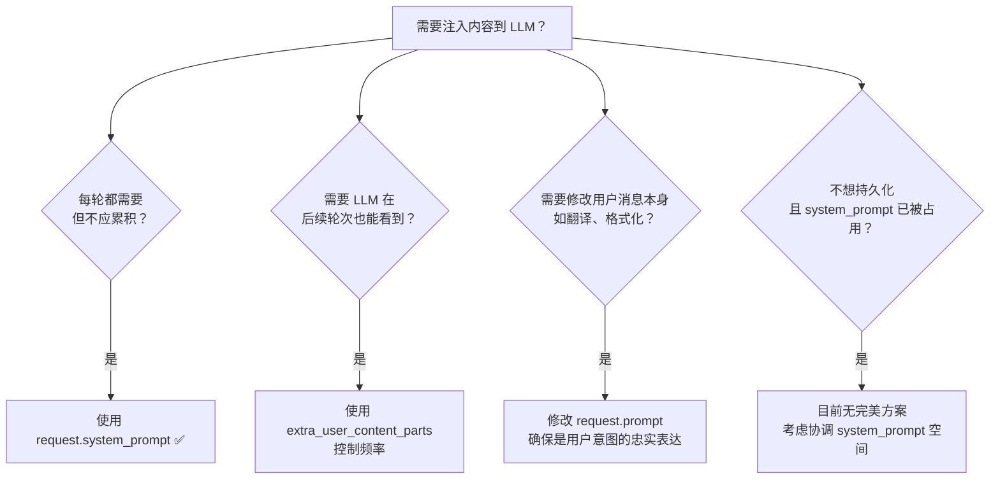

---

## 2.9 数据流全景图

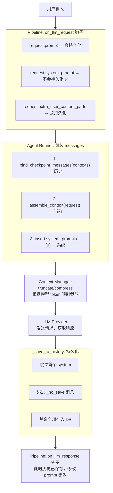

---

## 参考文件索引

| 文件路径 | 关键行号 | 内容 |
|----------|---------|------|
| `core/provider/entities.py` | :94 | ProviderRequest 定义 |
| `core/provider/entities.py` | :191 | assemble_context 实现 |
| `core/astr_main_agent.py` | :1142 | 历史加载 |
| `core/agent/runners/tool_loop_agent_runner.py` | :305-320 | Messages 组装 |
| `core/agent/runners/tool_loop_agent_runner.py` | ~:710 | Context Manager 调用 |
| `core/pipeline/process_stage/method/agent_sub_stages/internal.py` | :419-489 | _save_to_history |
| `core/event_bus.py` | :37-50 | EventBus.dispatch |
| `core/pipeline/scheduler.py` | :35-76 | 洋葱模型实现 |
| `core/pipeline/stage_order.py` | :3-13 | Stage 执行顺序 |
| `core/star/star_handler.py` | :219-241 | EventType 枚举 |
| `core/star/filter/__init__.py` | :8-11 | HandlerFilter 基类 |
| `core/platform/astr_message_event.py` | — | AstrMessageEvent 定义 |


# PART 3 — Provider 系统

> **本章概要**：Provider 是 AstrBot 与各类 AI 服务（LLM、TTS、STT、Embedding、Rerank）通信的统一抽象层。插件开发者需要理解 Provider 的接口体系才能正确调用 LLM、处理多模态内容、管理 Token 消耗。本章覆盖 Provider 的注册机制、请求/响应全流程、错误处理策略，以及实际开发中的调用模式。

---

## 3.1 Provider 基类与接口体系

### 类继承结构

```
AbstractProvider (abc.ABC) — 所有 Provider 的根基类
├── Provider — Chat Completion (LLM 文本生成)
├── STTProvider — Speech To Text
├── TTSProvider — Text To Speech
├── EmbeddingProvider — 文本向量化
└── RerankProvider — 重排序
```

**文件**: `core/provider/provider.py`

### AbstractProvider 基类 (L27-64)

```python
class AbstractProvider(abc.ABC):
    def __init__(self, provider_config: dict) -> None
    def set_model(self, model_name: str) -> None
    def get_model(self) -> str
    def meta(self) -> ProviderMeta          # 返回 id/model/type/provider_type
    async def test(self) -> None            # 健康检查（子类可覆盖）
```

### Provider (Chat Completion) 核心接口 (L66-208)

```python
class Provider(AbstractProvider):
    def __init__(self, provider_config: dict, provider_settings: dict)

    # Key 管理
    def get_current_key(self) -> str
    def get_keys(self) -> list[str]
    def set_key(self, key: str) -> None

    # 模型列表
    async def get_models(self) -> list[str]

    # 核心对话方法
    async def text_chat(
        self,
        prompt: str | None = None,
        session_id: str | None = None,
        image_urls: list[str] | None = None,
        audio_urls: list[str] | None = None,
        func_tool: ToolSet | None = None,
        contexts: list[Message] | list[dict] | None = None,
        system_prompt: str | None = None,
        tool_calls_result: ToolCallsResult | list[ToolCallsResult] | None = None,
        model: str | None = None,
        extra_user_content_parts: list[ContentPart] | None = None,
        tool_choice: Literal["auto", "required"] = "auto",
        **kwargs,
    ) -> LLMResponse

    # 流式对话（非抽象，默认 raise NotImplementedError）
    async def text_chat_stream(...) -> AsyncGenerator[LLMResponse, None]

    # 上下文管理
    async def pop_record(self, context: list) -> None
    def _ensure_message_to_dicts(self, messages) -> list[dict]

    # 健康检查
    async def test(self, timeout: float = 45.0) -> None
```

### 其他 Provider 类型

| 类型 | 文件位置 | 核心方法 |
|------|---------|---------|
| STTProvider (L210-228) | `core/provider/provider.py` | `async def get_text(self, audio_url: str) -> str` |
| TTSProvider (L230-310) | 同上 | `async def get_audio(self, text: str) -> str` + 可选流式 |
| EmbeddingProvider (L316-405) | 同上 | `get_embedding()` / `get_embeddings()` / `get_dim()` |
| RerankProvider (L408-428) | 同上 | `async def rerank(query, documents, top_n) -> list[RerankResult]` |

> **开发者提示**: 插件开发中最常用的是 `Provider`（Chat Completion）。其他类型通常通过 `ProviderManager` 间接使用，无需直接实例化。

---

## 3.2 Provider 注册与加载机制

**文件**: `core/provider/register.py`

### 注册装饰器

```python
@register_provider_adapter(
    provider_type_name: str,          # 唯一类型标识
    desc: str,
    provider_type: ProviderType = ProviderType.CHAT_COMPLETION,
    default_config_tmpl: dict | None = None,
    provider_display_name: str | None = None,
)
```

注册时会：
1. 检查 `provider_type_name` 唯一性（重复则 raise ValueError）
2. 自动补全 `default_config_tmpl` 中的 `type`/`enable`/`id` 字段
3. 创建 `ProviderMetaData` 并存入 `provider_cls_map[provider_type_name]`

### 全局注册表

```python
provider_registry: list[ProviderMetaData] = []
provider_cls_map: dict[str, ProviderMetaData] = {}
llm_tools = FuncCall()  # 全局工具管理器（含 MCP）
```

### 动态导入机制（`manager.py:350-487`）

`ProviderManager.dynamic_import_provider(type)` 使用 `match/case` 按 type 字符串动态 import 对应模块。延迟加载设计——只有配置中启用的 provider 才会导入其依赖。

支持的 type（30+ 种）：
- **Chat**: openai, anthropic, googlegenai, longcat, minimax_token_plan, zhipu, groq, xai, aihubmix, openrouter, kimi_code
- **STT**: sensevoice_stt_selfhost, openai_whisper_api, mimo_stt_api, openai_whisper_selfhost, xinference_stt
- **TTS**: openai_tts_api, mimo_tts_api, genie_tts, edge_tts, gsv_tts_selfhost, gsvi_tts_api, fishaudio_tts_api, dashscope_tts, azure_tts, minimax_tts_api, volcengine_tts, gemini_tts
- **Embedding**: openai_embedding, gemini_embedding
- **Rerank**: vllm_rerank, xinference_rerank, bailian_rerank, nvidia_rerank

> ⚠️ **注意**: 插件不应直接调用 `dynamic_import_provider()`。使用 `self.context` 提供的高层 API 获取 Provider 实例。

---

## 3.3 完整请求/响应流程

### ProviderManager 初始化流程 (manager.py:277-348)

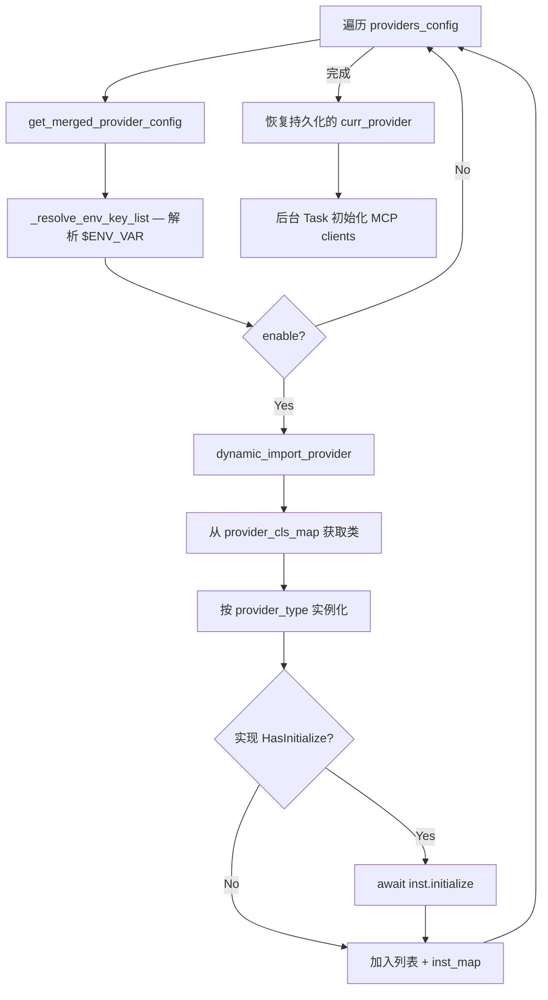

### 请求流程（以 OpenAI Provider 为例）

1. `text_chat()` / `text_chat_stream()` 入口
2. `assemble_context()` — 组装用户消息（文本+图片+音频+extra_parts）
3. `_ensure_message_to_dicts()` — Message 对象转 dict
4. 插入 system_prompt 到 contexts[0]
5. 追加 tool_calls_result（如有）
6. `_materialize_context_image_parts()` — 解析所有图片为 base64 data URL
7. `_finally_convert_payload()` — think 部分转换、Gemini tool 格式修正
8. `_prepare_chat_payload()` 返回 payloads + context_query
9. 重试循环 (max_retries=10):
   - 随机选择 API Key
   - `_query()` / `_query_stream()`
   - `_handle_api_error()` — 错误恢复

### 实践示例：调用 LLM

```python
from astrbot.api.event import filter, AstrMessageEvent
from astrbot.api.star import Context, Star

class MyPlugin(Star):
    def __init__(self, context: Context):
        super().__init__(context)

    @filter.command("ask")
    async def ask_llm(self, event: AstrMessageEvent, question: str):
        # 获取当前会话绑定的 Provider ID
        umo = event.unified_msg_origin
        provider_id = await self.context.get_current_chat_provider_id(umo=umo)

        # 调用 LLM
        llm_resp = await self.context.llm_generate(
            chat_provider_id=provider_id,
            prompt=question,
        )
        yield event.plain_result(llm_resp.completion_text)
```

> **开发者提示**: `llm_generate()` 是插件调用 LLM 的推荐入口。它内部处理了 Provider 查找、上下文组装、错误重试等全部逻辑。不要直接获取 Provider 实例调用 `text_chat()`。

---

## 3.4 模型配置与选择机制

### 配置结构

```python
{
    "id": "my-openai",
    "type": "openai_chat_completion",
    "enable": True,
    "model": "gpt-4o",
    "key": ["sk-xxx", "$ENV_KEY"],
    "api_base": "https://...",
    "proxy": "http://127.0.0.1:7890",
    "timeout": 120,
    "custom_headers": {},
    "custom_extra_body": {},
    "provider_source_id": "",
    "provider_type": "chat_completion",
}
```

### Provider Source 机制 (manager.py:489-510)

`provider_sources` 是共享配置模板，多个 provider 可引用同一个 source。provider 配置优先级更高，source 作为 base。

```
provider_source (base) ← provider_config (override)
```

### 会话级 Provider 隔离 (manager.py:143-275)

- `set_provider(provider_id, provider_type, umo=None)` — 设置会话级或全局 provider
- `get_using_provider(provider_type, umo=None)` — 查找顺序：session-level → default_provider_id → 列表第一个

> **开发者提示**: 通过 `get_current_chat_provider_id(umo=umo)` 获取当前会话绑定的 Provider ID，确保尊重用户的 Provider 选择。

---

## 3.5 Streaming vs Non-Streaming

配置控制：`provider_settings.get("streaming_response", False)`

**Non-Streaming**: `_query()` → 返回单个完整 `LLMResponse`

**Streaming**: `_query_stream()` → yield 多个 `LLMResponse(is_chunk=True)`，最后一个 `is_chunk=False` 为完整结果

各 Provider 实现差异：

| Provider | 流式实现 |
|----------|---------|
| OpenAI | `ChatCompletionStreamState` 累积 chunks |
| Anthropic | `client.messages.stream()` 上下文管理器 |
| Gemini | `client.models.generate_content_stream()` |

> ⚠️ **注意**: 并非所有 Provider 都实现了 `text_chat_stream()`。基类默认 raise `NotImplementedError`。插件中使用流式时需确认目标 Provider 支持。

---

## 3.6 Token Usage 追踪

**文件**: `core/provider/entities.py:310-340`

```python
@dataclass
class TokenUsage:
    input_other: int = 0      # 非缓存输入 token
    input_cached: int = 0     # 缓存命中的输入 token
    output: int = 0           # 输出 token

    @property
    def total(self) -> int: return input_other + input_cached + output
```

各 Provider 的 Usage 提取映射：

| Provider | 缓存 Token 字段 |
|----------|----------------|
| OpenAI | `prompt_tokens_details.cached_tokens` |
| Anthropic | `usage.cache_read_input_tokens` |
| Gemini | `usage_metadata.cached_content_token_count` |

> **开发者提示**: `LLMResponse.usage` 字段可用于监控 Token 消耗。在高频调用场景中，关注 `input_cached` 比例可以评估 prompt caching 效果。

---

## 3.7 错误处理与重试逻辑

### OpenAI Provider (`openai_source.py:1038-1153`)

最多 10 次重试，错误分类处理：

| 错误类型 | 处理方式 |
|---------|---------|
| 429 Rate Limit | 换 Key + sleep(1) |
| maximum context length | `pop_record()` 弹出最早记录 |
| model not VLM | 移除图片，降级为纯文本 |
| content moderated | 移除图片重试 |
| Function calling not supported | 移除 tools |
| 连接错误 | `log_connection_failure()` + raise |

### Anthropic Provider

- 无显式重试循环（依赖 httpx 内置重试）
- `EmptyModelOutputError` 当响应无可用内容时抛出

### Gemini Provider

最多 10 次 Key 轮换：

| 错误类型 | 处理方式 |
|---------|---------|
| 429 / API key not valid | 换 Key + sleep(1) |
| Developer instruction not enabled | 去除 system_prompt |
| Function calling not enabled | 去除 tools |
| Recitation | 提高 temperature (+0.2) 重试 |

> ⚠️ **注意**: 插件通过 `llm_generate()` 调用时，这些重试逻辑已内置。但如果你在 `on_llm_request` 钩子中修改了 contexts 导致超长，可能触发 `pop_record()` 自动截断历史。

---

## 3.8 多模态内容处理

### 图片

| Provider | 格式 | 特殊处理 |
|----------|------|---------|
| OpenAI | `data:{mime};base64,...` data URL | PIL 验证 + image_detail 参数 |
| Anthropic | `{"type": "image", "source": {"type": "base64", ...}}` | magic bytes 检测 MIME |
| Gemini | `types.Part.from_bytes(data=bytes, mime_type=...)` | 原生 bytes |

### 音频

| Provider | 支持 | 格式 |
|----------|------|------|
| OpenAI | 是 | `input_audio` 块，WAV/MP3 |
| Anthropic | 否 | 降级为 `[Audio]` 文本 |
| Gemini | 是 | 原生 bytes |

> **开发者提示**: 插件传入 `image_urls` / `audio_urls` 时，Provider 层会自动处理格式转换。无需手动编码 base64 或检测 MIME 类型。

---

## 3.9 LLMResponse 数据结构

**文件**: `core/provider/entities.py:342-488`

```python
@dataclass
class LLMResponse:
    role: str                          # "assistant" / "tool" / "err"
    result_chain: MessageChain | None  # 文本结果（MessageChain 格式）
    tools_call_args: list[dict]        # 工具调用参数列表
    tools_call_name: list[str]         # 工具调用名称列表
    tools_call_ids: list[str]          # 工具调用 ID 列表
    reasoning_content: str | None      # 推理内容（thinking/reasoning）
    reasoning_signature: str | None    # 推理签名
    raw_completion: Any | None         # 原始 API 响应对象
    is_chunk: bool = False             # 是否为流式 chunk
    id: str | None = None              # 响应 ID
    usage: TokenUsage | None = None    # Token 使用统计
```

常用属性：
- `llm_resp.completion_text` — 获取纯文本结果（便捷属性）
- `llm_resp.role == "err"` — 判断是否为错误响应

---

## 3.10 Proxy、Headers、Timeout

### Proxy

统一工具函数 `core/utils/network_utils.py:88-117`:
```python
def create_proxy_client(provider_label, proxy, headers=None, verify=None) -> httpx.AsyncClient
```

配置字段：`provider_config.get("proxy", "")`

### Custom Headers

| Provider | 注入方式 |
|----------|---------|
| OpenAI | `AsyncOpenAI(default_headers=custom_headers)` |
| Anthropic | `create_proxy_client(headers=custom_headers)` |
| OpenRouter | 额外追加 `HTTP-Referer` 和 `X-OpenRouter-Title` |

### Timeout

| Provider | 默认值 | 单位 |
|---------|--------|------|
| OpenAI | 120 | 秒 |
| Anthropic | 120 | 秒 |
| Gemini | 180 | 秒 |

### custom_extra_body

所有 Provider 支持 `provider_config.get("custom_extra_body", {})` 传递非标准 API 参数。

> **开发者提示**: 如果你的插件需要通过代理访问 LLM API，在 AstrBot WebUI 的 Provider 配置中设置 `proxy` 字段即可，无需在插件代码中处理。

### Provider 继承关系

```
ProviderOpenAIOfficial — 基础 OpenAI 实现
├── ProviderZhipu, ProviderGroq, ProviderXAI, ProviderAIHubMix — 无额外逻辑
├── ProviderOpenRouter — 追加 headers + reasoning_key
├── ProviderLongCat, ProviderMiniMaxTokenPlan, ProviderKimiCode
ProviderAnthropic — 独立实现
ProviderGoogleGenAI — 独立实现
```

---

# PART 4 — Persona 系统与 Agent Runner

> **本章概要**：Persona 系统定义了 AI 的"人格"——system prompt、预设对话、工具白名单。Agent Runner 则是驱动 LLM 进行多轮工具调用的执行引擎。插件开发者通过 Persona 管理 AI 行为风格，通过 Agent Runner 实现复杂的自主任务执行。两者的交互构成了 AstrBot 智能体的核心运行机制。

---

## 4.1 Persona 数据模型

### 数据库模型 `Persona`（SQLModel）

**文件**：`core/db/po.py:132-165`

```python
class Persona(TimestampMixin, SQLModel, table=True):
    __tablename__ = "personas"
    id: int | None
    persona_id: str             # 唯一标识（max 255）
    system_prompt: str          # 系统提示词（Text 类型）
    begin_dialogs: list | None  # 预设对话列表（JSON）
    tools: list | None          # 工具白名单。None=全部，[]=无，["name",...]=指定
    skills: list | None         # Skills 白名单，语义同 tools
    custom_error_message: str | None  # 自定义报错回复
    folder_id: str | None       # 所属文件夹 ID
    sort_order: int             # 排序
```

### 运行时表示 `Personality`（TypedDict）

**文件**：`core/db/po.py:517-538`

v3 遗留结构，v4 仍在内部使用：

```python
class Personality(TypedDict):
    prompt: str
    name: str
    begin_dialogs: list[str]
    tools: list[str] | None
    skills: list[str] | None
    custom_error_message: str | None
    _begin_dialogs_processed: list[dict]  # 已转换为 role/content 格式
```

### 默认人格

```python
DEFAULT_PERSONALITY = Personality(
    prompt="You are a helpful and friendly assistant.",
    name="default",
    begin_dialogs=[],
    tools=None,   # None = 使用全部工具
    skills=None,
    custom_error_message=None,
    _begin_dialogs_processed=[],
)
```

> **开发者提示**: `tools=None` 和 `tools=[]` 含义完全不同。`None` 表示"使用全部可用工具"，`[]` 表示"禁用所有工具"。`skills` 字段语义相同。

### 实践示例：人格管理

```python
from astrbot.api.star import Context, Star

class MyPlugin(Star):
    def __init__(self, context: Context):
        super().__init__(context)

    async def setup_persona(self):
        persona_mgr = self.context.persona_manager

        # 创建人格
        persona_mgr.create_persona(
            persona_id="my_persona",
            system_prompt="你是一个专业的数据分析师...",
            begin_dialogs=["你好", "你好！我是数据分析助手，有什么可以帮你的？"],
            tools=None,  # 使用全部工具
        )

        # 获取人格
        persona = persona_mgr.get_persona("my_persona")

        # 更新人格
        persona_mgr.update_persona("my_persona", system_prompt="新的提示词")

        # 删除人格
        persona_mgr.delete_persona("my_persona")

        # 获取所有人格
        all_personas = persona_mgr.get_all_personas()

        # 获取默认人格（v3 格式）
        default = persona_mgr.get_default_persona_v3(umo=event.unified_msg_origin)
```

---

## 4.2 PersonaManager 加载与选择

**文件**：`core/persona_mgr.py`

### 初始化流程

1. `__init__()` → 读取配置中的 `default_personality`
2. `initialize()` → 从数据库加载所有 Persona → `get_v3_persona_data()` 转换

`get_v3_persona_data()`（行 353-432）：
- 将 DB `Persona` 对象转换为 v3 格式 dict
- 处理 `begin_dialogs`：字符串列表按奇偶交替转为 `{"role": "user"/"assistant", "content": ..., "_no_save": True}`
- 构建 `Personality` TypedDict 列表

### Persona 选择逻辑

`resolve_selected_persona()`（行 75-127）优先级链：

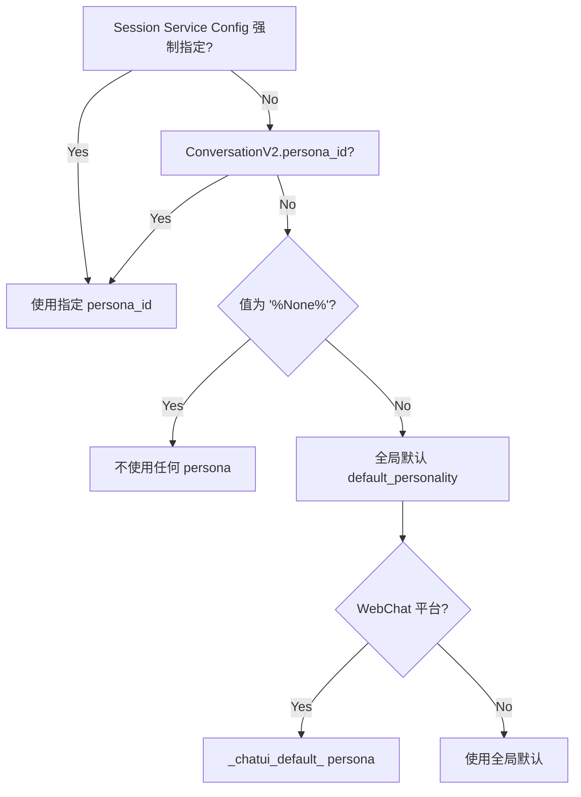

优先级总结：
1. **Session Service Config 强制指定**：`sp.get_async(scope="umo", key="session_service_config")` 中的 `persona_id`
2. **会话级 persona_id**：`ConversationV2.persona_id` 字段
3. **特殊值 `[%None]`**：明确不使用任何 persona
4. **全局默认**：`provider_settings.default_personality`
5. **WebChat 特殊默认**：`_chatui_default_` persona

> ⚠️ **注意**: 插件如果需要强制使用特定 persona，应通过 Session Service Config 注入，而非直接修改全局默认。

---

## 4.3 Begin Dialogs（预设对话）

**文件**：`core/persona_mgr.py:381-398`

`begin_dialogs` 是字符串列表，**必须为偶数条**，按 user/assistant 交替。处理后：

```python
[
    {"role": "user", "content": "第1条", "_no_save": True},
    {"role": "assistant", "content": "第2条", "_no_save": True},
    ...
]
```

`_no_save: True` 表示不持久化到对话历史——每次对话都会重新注入。

注入位置（`astr_main_agent.py:403`）：
```python
req.contexts[:0] = begin_dialogs  # prepend 到历史最前面
```

> ⚠️ **注意**: `begin_dialogs` 必须为偶数条。奇数条会导致 role 交替错位，可能引发 LLM API 报错（如 OpenAI 要求 user/assistant 交替）。

---

## 4.4 Agent Runner 架构

### 基类 `BaseAgentRunner`

**文件**：`core/agent/runners/base.py:1-66`

```python
class BaseAgentRunner(Generic[TContext]):
    class AgentState(Enum):
        IDLE = auto()
        RUNNING = auto()
        DONE = auto()
        ERROR = auto()

    async def reset(...)       # 初始化/重置 Runner
    async def step(...)        # 执行单步（async generator）
    async def step_until_done(...)  # 循环执行直到完成
    def done() -> bool         # 是否已完成
    def get_final_llm_resp()   # 获取最终响应
```

### Runner 实现一览

| Runner | 用途 | 工具执行 |
|--------|------|---------|
| `ToolLoopAgentRunner` | 主 Runner，本地工具循环 | 本地执行 |
| `CozeAgentRunner` | Coze 平台 | 云端委托 |
| `DashscopeAgentRunner` | 阿里 DashScope | 云端委托 |
| `DeerflowAgentRunner` | Deerflow | 云端委托 |
| `DifyAgentRunner` | Dify 平台 | 云端委托 |

### 实践示例：调用 Agent

```python
from astrbot.core.agent.tool import ToolSet

class MyPlugin(Star):
    @filter.command("research")
    async def research(self, event: AstrMessageEvent, topic: str):
        umo = event.unified_msg_origin
        prov_id = await self.context.get_current_chat_provider_id(umo=umo)

        llm_resp = await self.context.tool_loop_agent(
            event=event,
            chat_provider_id=prov_id,
            prompt=f"研究以下主题并给出总结: {topic}",
            tools=ToolSet([MySearchTool(), MySummaryTool()]),
            max_steps=30,
            tool_call_timeout=60,
        )
        yield event.plain_result(llm_resp.completion_text)
```

> **开发者提示**: `tool_loop_agent()` 是插件使用 Agent 的推荐入口。它封装了 `ToolLoopAgentRunner` 的 `reset()` + `step_until_done()` 全流程。`max_steps` 控制最大工具调用轮次，防止无限循环。

---

## 4.5 ToolLoopAgentRunner 详解

**文件**：`core/agent/runners/tool_loop_agent_runner.py:110-1434`

### 关键常量

| 常量 | 值 | 用途 |
|------|-----|------|
| `TOOL_RESULT_MAX_ESTIMATED_TOKENS` | 27,500 | 工具结果溢出阈值 |
| `TOOL_RESULT_PREVIEW_MAX_ESTIMATED_TOKENS` | 7,000 | 溢出时保留的预览 |
| `EMPTY_OUTPUT_RETRY_ATTEMPTS` | 3 | 空输出重试次数 |
| `REPEATED_TOOL_NOTICE_L1_THRESHOLD` | 3 | 重复工具调用警告阈值 |

### reset() 方法（行 206-323）

参数：
- `provider`: LLM Provider 实例
- `request`: ProviderRequest
- `run_context`: ContextWrapper[TContext]
- `tool_executor`: BaseFunctionToolExecutor
- `agent_hooks`: BaseAgentRunHooks
- `streaming`: 是否流式
- `enforce_max_turns`: 最大轮次限制（-1 无限）
- `tool_schema_mode`: "full" 或 "skills_like"
- `fallback_providers`: 备用 Provider 列表

初始化逻辑：
1. 构建 `ContextConfig` 和 `ContextManager`
2. 处理 `tool_schema_mode`：skills_like 时替换为轻量 schema
3. `bind_checkpoint_messages(request.contexts)` 转换为 Message 对象列表
4. 组装用户消息（prompt + image_urls + audio_urls）
5. 插入 system_prompt 到消息列表最前面

### step() 方法（行 689-936）— 核心循环单步

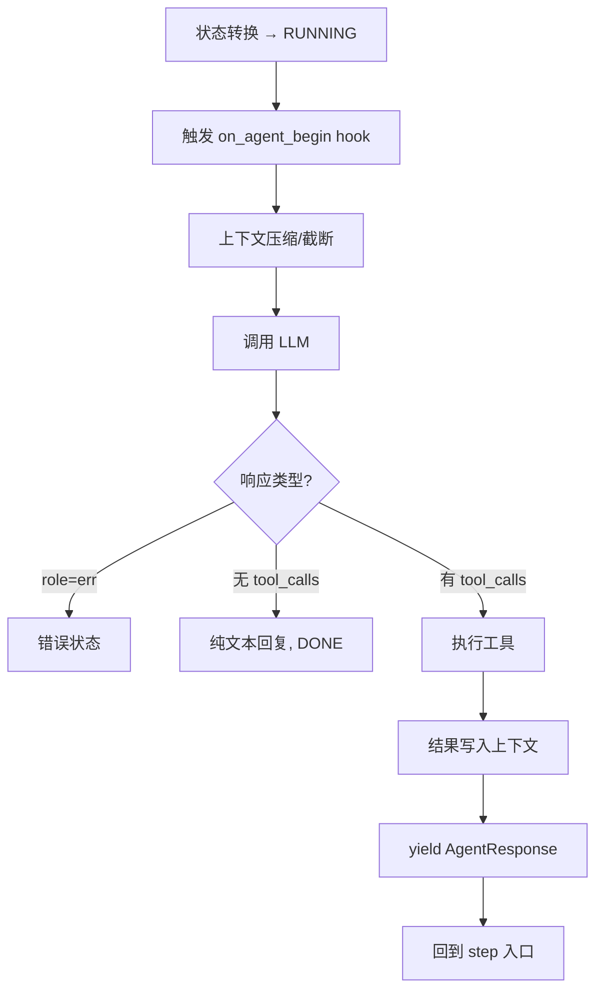

LLM 调用支持：
- 流式 yield（实时输出 token）
- abort 中断（用户取消）
- fallback providers（主 Provider 失败时切换备用）
- 空输出重试（tenacity，最多 3 次）

### step_until_done() 方法（行 939-966）

循环调用 `step()` 直到 `done()` 或达到 `max_step`。达到上限时：
1. 拔掉所有工具（防止继续调用）
2. 注入 `MAX_STEPS_REACHED_PROMPT` 提示
3. 再执行最后一步（让 LLM 总结已有结果）

### Tool Schema Mode: "skills_like"

两阶段工具调用（行 285-303, 1230-1328）：

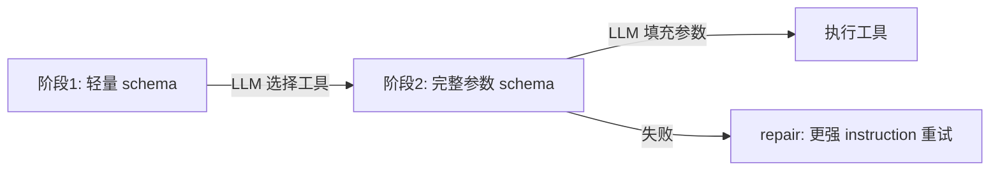

1. **第一阶段**：LLM 看到轻量 schema（只有工具名和描述），选择要调用的工具
2. **第二阶段**（`_resolve_tool_exec`）：用选中工具的完整参数 schema 重新查询 LLM
3. 如果仍无结果，用更强 instruction 再试一次（repair）

目的：减少 token 消耗（工具参数 schema 很大时）。

> **开发者提示**: `skills_like` 模式适合工具数量多、参数 schema 复杂的场景。对于少量简单工具，使用默认的 `"full"` 模式即可。

### Follow-Up 机制（行 615-658）

用户在工具执行期间发送追加消息：
- `follow_up(message_text)` 排队
- 追加消息在下一个工具结果中注入 `[SYSTEM NOTICE]` 提示
- Agent 完成时自动 resolve 所有未消费的 follow-up

### 中断机制（行 1334-1434）

- `request_stop()` 设置 `_abort_signal`（asyncio.Event）
- 流式输出中检测 abort → 立即终止
- 工具执行中通过 `asyncio.wait(FIRST_COMPLETED)` 监听 abort
- 中断后调用 `_finalize_aborted_step()` 清理状态

### 重复工具调用检测（行 660-687）

| 重复次数 | 级别 | 行为 |
|---------|------|------|
| 3 次 | L1 | 温和提醒 |
| 4 次 | L2 | 强烈建议换策略 |
| 5+ 次 | L3 | 警告 |

> ⚠️ **注意**: 如果你的工具设计导致 LLM 反复调用同一工具（如轮询），考虑在工具返回中明确告知 LLM 下一步该做什么，避免触发重复检测。

---

## 4.6 Context Management（上下文管理）

**文件**：`core/agent/context/manager.py`

`ContextManager` 在每次 `step()` 的 LLM 调用前执行上下文压缩：

### 压缩策略

1. **`enforce_max_turns` 截断**（基于轮次）— 硬性上限
2. **Token 压缩**（基于 token 数）：
   - `TruncateByTurnsCompressor`：删除最旧的 N 轮（默认策略）
   - `LLMSummaryCompressor`：用 LLM 总结旧消息
   - 阈值：`usage_rate > 0.82` 时触发
   - 压缩后仍超限：halving truncation（减半）

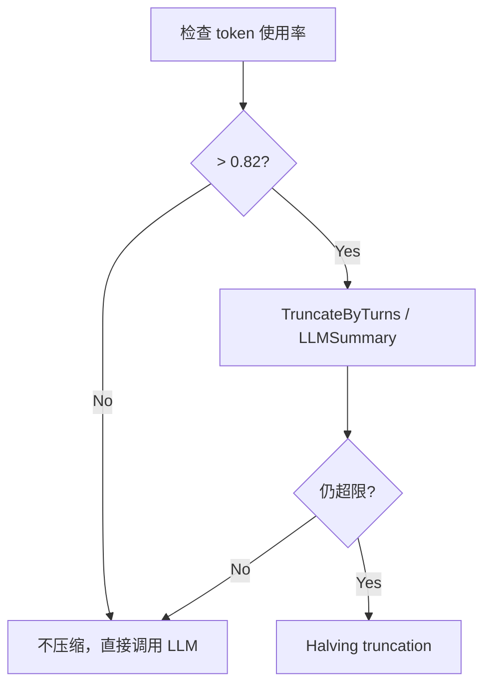

> **开发者提示**: 如果你的插件注入了大量上下文（如知识库检索结果），注意 0.82 阈值。超过后旧消息会被自动截断。建议将大段参考内容放在 system_prompt 而非 contexts 中，因为 system_prompt 不会被截断。

---

## 4.7 Persona 与 Agent Runner 的交互

**文件**：`core/astr_main_agent.py:373-516`

`_ensure_persona_and_skills()` 是 persona 注入 agent 的核心函数：

### System Prompt 注入

```python
if persona:
    if prompt := persona["prompt"]:
        req.system_prompt += f"\n# Persona Instructions\n\n{prompt}\n"
```

### Begin Dialogs 注入

```python
if begin_dialogs := copy.deepcopy(persona.get("_begin_dialogs_processed")):
    req.contexts[:0] = begin_dialogs
```

### 工具集过滤

- `tools=None` → 使用全部活跃工具
- `tools=[]` → 无工具
- `tools=["name", ...]` → 只使用指定工具

### Skills 过滤

- `skills=None` → 全部 skills
- `skills=[]` → 无 skills
- `skills=["name", ...]` → 只使用指定 skills

> **开发者提示**: Persona 的 `tools` 白名单是在 Agent Runner `reset()` 之前应用的。如果你的插件注册了工具但用户的 persona 没有包含它，该工具不会出现在 LLM 的可用工具列表中。

---

## 4.8 完整消息构建流程

`build_main_agent()`（行 1117-1411）完整流程：

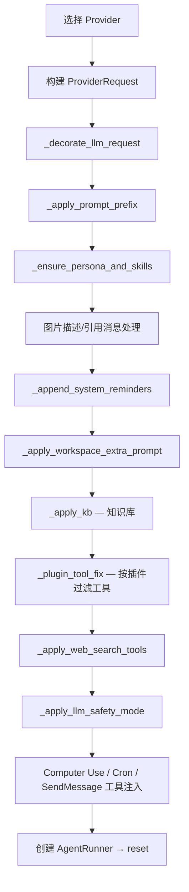

### 最终 system_prompt 组成

```
1. [LLM_SAFETY_MODE_SYSTEM_PROMPT]（如果启用安全模式）
2. \n# Persona Instructions\n{persona.prompt}
3. \n{skills_prompt}
4. \n{sub-agent router_system_prompt}
5. \n{workspace_extra_prompt}
6. \n{TOOL_CALL_PROMPT}
7. \n{LIVE_MODE_SYSTEM_PROMPT}（如果是 live 模式）
```

### 最终 contexts 组成

```
1. [begin_dialogs (prepended, _no_save=True)]
2. [历史对话记录 (from conversation.history)]
```

### Runner reset() 后 messages 结构

```
1. Message(role="system", content=req.system_prompt)
2. ...bind_checkpoint_messages(req.contexts)...
3. Message(role="user", content=assembled_user_message)
```

> ⚠️ **注意**: 插件通过 `on_llm_request` 钩子修改 `req.system_prompt` 时，你的内容会被追加到 persona prompt 之后。如果需要覆盖 persona 行为，考虑使用更高优先级的注入点或直接管理 persona。

---

## 4.9 Multi-Agent 模式

将子 Agent 定义为 `FunctionTool`，在其 `call()` 中递归调用 `tool_loop_agent()`：

### 实践示例：Multi-Agent

```python
from pydantic import Field
from pydantic.dataclasses import dataclass
from astrbot.core.agent.run_context import ContextWrapper
from astrbot.core.agent.tool import FunctionTool, ToolExecResult, ToolSet
from astrbot.core.astr_agent_context import AstrAgentContext

@dataclass
class ResearchAgent(FunctionTool[AstrAgentContext]):
    name: str = "research_agent"
    description: str = "研究子智能体，负责信息检索和分析"
    parameters: dict = Field(
        default_factory=lambda: {
            "type": "object",
            "properties": {
                "query": {"type": "string", "description": "研究问题"},
            },
            "required": ["query"],
        }
    )

    async def call(self, context: ContextWrapper[AstrAgentContext], **kwargs) -> ToolExecResult:
        ctx = context.context.context      # Star.context
        event = context.context.event      # AstrMessageEvent
        llm_resp = await ctx.tool_loop_agent(
            event=event,
            chat_provider_id=await ctx.get_current_chat_provider_id(event.unified_msg_origin),
            prompt=kwargs["query"],
            tools=ToolSet([WebSearchTool(), SummaryTool()]),
            max_steps=30,
        )
        return llm_resp.completion_text


@dataclass
class WriterAgent(FunctionTool[AstrAgentContext]):
    name: str = "writer_agent"
    description: str = "写作子智能体，负责内容生成"
    parameters: dict = Field(
        default_factory=lambda: {
            "type": "object",
            "properties": {
                "topic": {"type": "string", "description": "写作主题"},
                "material": {"type": "string", "description": "参考材料"},
            },
            "required": ["topic"],
        }
    )

    async def call(self, context: ContextWrapper[AstrAgentContext], **kwargs) -> ToolExecResult:
        ctx = context.context.context
        event = context.context.event
        llm_resp = await ctx.tool_loop_agent(
            event=event,
            chat_provider_id=await ctx.get_current_chat_provider_id(event.unified_msg_origin),
            prompt=f"根据以下材料撰写关于 {kwargs['topic']} 的文章:\n{kwargs.get('material', '')}",
            tools=ToolSet([]),  # 写作 agent 不需要工具
            max_steps=5,
        )
        return llm_resp.completion_text


# 主 Agent 使用子 Agent 作为工具
class MyPlugin(Star):
    def __init__(self, context: Context):
        super().__init__(context)

    @filter.command("write_article")
    async def write_article(self, event: AstrMessageEvent, topic: str):
        umo = event.unified_msg_origin
        prov_id = await self.context.get_current_chat_provider_id(umo=umo)

        llm_resp = await self.context.tool_loop_agent(
            event=event,
            chat_provider_id=prov_id,
            prompt=f"请先用 research_agent 研究 '{topic}'，然后用 writer_agent 撰写文章",
            tools=ToolSet([ResearchAgent(), WriterAgent()]),
            max_steps=30,
            tool_call_timeout=120,
        )
        yield event.plain_result(llm_resp.completion_text)
```

> **开发者提示**: Multi-Agent 模式的关键是 `context.context.context` 的三层解包——`ContextWrapper.context` 是 `AstrAgentContext`，其 `.context` 是 `Star.context`（即 `Context` 实例），其 `.event` 是当前事件。这个路径在所有 FunctionTool 中通用。

> ⚠️ **注意**: 子 Agent 的 `max_steps` 应设置合理上限。嵌套 Agent 的总步数是乘法关系（主 Agent 30 步 × 子 Agent 30 步 = 最多 900 次 LLM 调用），注意 Token 消耗和超时风险。

### Checkpoint 机制

**文件**：`core/agent/message.py:169-338`

用于将 LLM 对话轮次与平台消息历史关联：

- `CheckpointData(id: str)` — 检查点数据
- `CHECKPOINT_ROLE = "_checkpoint"` — 特殊 role 标记
- `bind_checkpoint_messages()` — 加载时绑定 checkpoint 到前一条消息的 `_checkpoint_after`
- `dump_messages_with_checkpoints()` — 保存时重新插入 checkpoint
- `strip_checkpoint_messages()` — 发送给 provider 前移除

> **开发者提示**: Checkpoint 机制对插件透明。它确保对话历史在持久化和恢复时保持与平台消息的对应关系。插件无需直接操作 checkpoint。
# PART 5 — Tool/Function Calling 系统

> **本章概要**: AstrBot 的 Tool 系统允许插件将 Python 函数暴露为 LLM 可调用的工具。理解工具注册、格式化、执行循环和错误处理机制，是构建 Agent 类插件的基础。本章覆盖从装饰器注册到多 Provider schema 适配的完整链路。

---

## 5.1 工具定义与注册

AstrBot 提供两种工具注册方式：**装饰器方式**（简单场景）和 **Dataclass 方式**（复杂/Multi-Agent 场景）。

### 装饰器注册内部流程

**文件**: `core/star/register/star_handler.py:570-659`

1. 解析 docstring（`docstring_parser`）提取描述和参数
2. Python 类型映射为 JSON Schema 类型
3. 构建参数 JSON Schema
4. `llm_tools.add_func(name, args, desc, handler)` 注册到全局 `FunctionToolManager`

支持的参数类型：`string`, `number`, `object`, `array`, `boolean`
支持泛型数组：`list[string]` → `{"type": "array", "items": {"type": "string"}}`

### 实践示例：装饰器方式注册 Tool

```python
from astrbot.api.event import filter, AstrMessageEvent
from astrbot.api.event import MessageEventResult

@filter.llm_tool(name="get_weather")
async def get_weather(self, event: AstrMessageEvent, location: str) -> MessageEventResult:
    '''获取天气信息。

    Args:
        location(string): 地点
    '''
    resp = self.get_weather_from_api(location)
    yield event.plain_result("天气信息: " + resp)
```

参数类型支持: `string`, `number`, `object`, `boolean`, `array`, `array[string]` (v4.5.7+)

> **开发者提示**: docstring 的格式严格要求 `Args:` 段落，每个参数格式为 `name(type): description`。缺少类型标注会导致 schema 生成失败。

### 实践示例：Dataclass 方式注册 Tool

```python
from pydantic import Field
from pydantic.dataclasses import dataclass
from astrbot.core.agent.run_context import ContextWrapper
from astrbot.core.agent.tool import FunctionTool, ToolExecResult
from astrbot.core.astr_agent_context import AstrAgentContext

@dataclass
class MyTool(FunctionTool[AstrAgentContext]):
    name: str = "my_tool"
    description: str = "工具描述"
    parameters: dict = Field(
        default_factory=lambda: {
            "type": "object",
            "properties": {
                "query": {
                    "type": "string",
                    "description": "查询内容",
                },
            },
            "required": ["query"],
        }
    )

    async def call(self, context: ContextWrapper[AstrAgentContext], **kwargs) -> ToolExecResult:
        return f"结果: {kwargs['query']}"
```

注册到 AstrBot：

```python
class MyPlugin(Star):
    def __init__(self, context: Context):
        super().__init__(context)
        # v4.5.1+
        self.context.add_llm_tools(MyTool(), AnotherTool())
```

> **开发者提示**: Dataclass 方式适合复杂工具和 Multi-Agent 架构。装饰器方式更简洁，适合单一功能工具。

---

## 5.2 全局工具注册表

**文件**: `core/provider/register.py:11`

```python
llm_tools = FuncCall()  # FunctionToolManager 的别名，全局单例
```

### 注册完整路径

| 路径 | 说明 |
|------|------|
| 装饰器路径 | `@llm_tool` → docstring 解析 → `llm_tools.add_func()` → `FunctionToolManager.func_list` |
| 旧式 API 路径 | `context.register_llm_tool()` → `StarHandlerMetadata` 包装 → `llm_tools.add_func()` |
| 内置工具路径 | `@builtin_tool` → `_builtin_tool_classes_by_name` → `FunctionToolManager.get_builtin_tool()` 按需实例化 |
| MCP 路径 | `FunctionToolManager.init_mcp_clients()` → `MCPClient.connect_to_server()` → `list_tools_and_save()` → 创建 `MCPTool` 实例 |

### 请求时组装

`FunctionToolManager.get_full_tool_set()` → 遍历 `func_list` → `ToolSet.add_tool()`（同名去重，优先保留 active=True）

---

## 5.3 内置工具（Builtin Tools）

**文件**: `core/tools/registry.py:216-238`

使用 `@builtin_tool` 装饰器注册，按需实例化：

| 模块 | 工具 |
|------|------|
| `core/tools/computer_tools` | ExecuteShellTool, PythonTool, FileReadTool, FileWriteTool, FileEditTool, GrepTool, FileUploadTool, FileDownloadTool, LocalPythonTool |
| `core/tools/cron_tools` | 定时任务工具 |
| `core/tools/knowledge_base_tools` | 知识库工具 |
| `core/tools/message_tools` | SendMessageToUserTool |
| `core/tools/web_search_tools` | 网页搜索工具 |

> ⚠️ **注意**: 内置工具与插件工具共享同一个 `FunctionToolManager`，同名工具会被去重。插件工具命名应避免与内置工具冲突。

---

## 5.4 ToolSet 类

**文件**: `core/agent/tool.py:78-367`

```python
@dataclass
class ToolSet:
    tools: list[FunctionTool] = Field(default_factory=list)
```

### 关键方法

| 方法 | 功能 |
|------|------|
| `add_tool(tool)` | 添加工具，同名去重（优先保留 active=True） |
| `remove_tool(name)` | 按名称移除 |
| `get_tool(name)` | 按名称查找 |
| `get_light_tool_set()` | 仅含 name/description 的轻量集（skills_like 模式） |
| `get_param_only_tool_set()` | 仅含 name/parameters（skills_like 二次查询） |
| `openai_schema()` | 转换为 OpenAI API 格式 |
| `anthropic_schema()` | 转换为 Anthropic API 格式 |
| `google_schema()` | 转换为 Google GenAI API 格式 |
| `merge(other)` | 合并另一个 ToolSet |
| `names()` | 返回所有工具名称列表 |

### 实践示例：Agent 循环中使用 ToolSet

```python
from astrbot.core.agent.tool import ToolSet

llm_resp = await self.context.tool_loop_agent(
    event=event,
    chat_provider_id=prov_id,
    prompt="执行任务描述",
    tools=ToolSet([MyTool()]),
    max_steps=30,
    tool_call_timeout=60,
)
print(llm_resp.completion_text)
```

---

## 5.5 工具描述格式化（多 Provider）

ToolSet 自动将工具定义转换为不同 Provider 要求的 schema 格式：

### OpenAI 风格

```json
{"type": "function", "function": {"name": "...", "description": "...", "parameters": {...}}}
```

### Anthropic 风格

```json
{"name": "...", "description": "...", "input_schema": {"type": "object", "properties": {...}}}
```

### Google GenAI 风格

```json
{"function_declarations": [{"name": "...", "description": "...", "parameters": {...}}]}
```

> ⚠️ **注意**: Google 格式有额外 schema 转换：处理 `anyOf`、过滤不支持字段、数组必须有 `items`。如果工具参数使用了 `Optional` 类型，需确认 Google Provider 下的兼容性。

---

## 5.6 工具执行循环

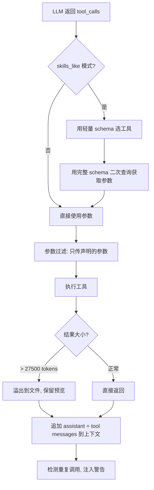

### Tool Choice 模式

- **`"auto"`**（默认）：LLM 自行决定是否调用工具
- **`"required"`**：强制调用（用于 skills_like 二次查询）

---

## 5.7 工具执行分发

**文件**: `core/astr_agent_tool_exec.py:126-182`

分发逻辑：
- `HandoffTool` → Handoff 到子 agent
- `MCPTool` → MCP 远程调用（带自动重连）
- `is_background_task` → 后台异步执行
- 其他 → 本地执行（handler / call / run）

### 本地执行（`_execute_local`，行 594-675）

1. 确定调用方式：`handler` > `call` > `run`
2. 支持两种返回模式：
   - **协程**：直接 await，返回 `str | MessageEventResult | CallToolResult | None`
   - **异步生成器**：逐步 yield，支持中间发送消息给用户

### MCP 执行

`MCPClient.call_tool_with_reconnect()` — 使用 tenacity，对 `ClosedResourceError` 自动重连（最多 2 次，指数退避）。

### Multi-Agent 模式

将子 Agent 定义为 FunctionTool，在其 `call()` 中递归调用 `tool_loop_agent()`：

```python
@dataclass
class SubAgent(FunctionTool[AstrAgentContext]):
    name: str = "sub_agent"
    description: str = "子智能体"
    # ...

    async def call(self, context: ContextWrapper[AstrAgentContext], **kwargs) -> ToolExecResult:
        ctx = context.context.context
        event = context.context.event
        llm_resp = await ctx.tool_loop_agent(
            event=event,
            chat_provider_id=await ctx.get_current_chat_provider_id(event.unified_msg_origin),
            prompt=kwargs["query"],
            tools=ToolSet([WeatherTool()]),
            max_steps=30,
        )
        return llm_resp.completion_text
```

---

## 5.8 工具调用结果与历史

### ToolCallsResult 结构

**文件**: `entities.py:69-91`

```python
@dataclass
class ToolCallsResult:
    tool_calls_info: AssistantMessageSegment  # assistant 消息（含 tool_calls 数组）
    tool_calls_result: list[ToolCallMessageSegment]  # tool role 消息列表
```

写入上下文后生成的消息序列：
1. `assistant message with tool_calls array`
2. `tool message: tool_call_id=xxx, content="result1"`
3. `tool message: tool_call_id=yyy, content="result2"`

---

## 5.9 错误处理

| 场景 | 处理 |
|------|------|
| 工具未找到 | 返回 error + 可用工具列表 |
| 执行异常 | 返回 `error: {e}` + 重复调用警告 |
| 超时 | `asyncio.TimeoutError` → 超时错误信息 |
| 参数类型不匹配 | 解析 handler 签名，返回详细参数错误 |
| MCP 断连 | tenacity 自动重连（最多 2 次） |

> **开发者提示**: 工具执行异常不会导致整个 Agent 循环崩溃，而是将错误信息作为 tool result 返回给 LLM，让 LLM 决定下一步操作。

---

## 5.10 大结果溢出机制

**文件**: `core/astr_agent_tool_exec.py:393-456`

当工具结果超过 **27,500 estimated tokens** 时：
1. 完整结果写入文件（`tool_result_overflow_dir`）
2. 截取预览（最多 7,000 tokens）
3. 返回预览 + 文件路径提示，让 LLM 用 read tool 读取完整内容

> ⚠️ **注意**: 如果你的工具可能返回大量数据（如数据库查询、文件内容），建议在工具内部做分页或摘要，避免触发溢出机制导致额外的 LLM 调用开销。

---
---

# PART 6 — 插件系统与配置机制

> **本章概要**: 插件是 AstrBot 的核心扩展单元。本章覆盖插件的完整生命周期：从目录结构、基类继承、事件装饰器注册，到配置管理和发布流程。掌握这些机制是开发任何 AstrBot 插件的前提。

---

## 6.1 开发原则与命名规范

### 开发原则

AstrBot 官方要求所有插件遵守以下原则：

- 功能需经过测试
- 需包含良好的注释
- **持久化数据请存储于 `data` 目录下，而非插件自身目录**，防止更新/重装插件时数据被覆盖
- 良好的错误处理机制，不要让插件因一个错误而崩溃
- 在进行提交前，请使用 ruff 工具格式化代码
- **不要使用 `requests` 库**进行网络请求，使用 `aiohttp`、`httpx` 等异步库
- 如果是对某个插件进行功能扩增，请优先给那个插件提交 PR

### 插件命名规范

- 推荐以 `astrbot_plugin_` 开头
- 不能包含空格
- 保持全部字母小写
- 尽量简短

> ⚠️ **注意**: 使用 `requests` 库会阻塞事件循环，导致整个 Bot 卡顿。务必使用异步 HTTP 库。

---

## 6.2 插件基础结构

### 目录结构

```
astrbot_plugin_xxx/
  main.py                 # 必须，插件入口（类名任意，继承 Star）
  metadata.yaml           # 必须，插件元数据
  _conf_schema.json       # 可选，配置 Schema
  requirements.txt        # 可选，第三方依赖
  logo.png                # 可选，插件 Logo (256x256, 1:1)
```

### metadata.yaml

```yaml
name: astrbot_plugin_example
display_name: "示例插件"
desc: "插件描述"
author: "author_name"
version: "1.0.0"
repo: "https://github.com/xxx/astrbot_plugin_example"
support_platforms:        # 可选，声明支持的平台
  - aiocqhttp
  - telegram
astrbot_version: ">=4.16,<5"  # 可选，PEP 440 版本范围
```

### StarMetadata 数据类

**文件**: `star/star.py:18-75`

```python
@dataclass
class StarMetadata:
    name: str | None
    author: str | None
    desc: str | None
    version: str | None
    repo: str | None
    star_cls_type: type[Star] | None
    module_path: str | None
    star_cls: Star | None
    activated: bool = True
    config: AstrBotConfig | None = None
    star_handler_full_names: list[str]
    support_platforms: list[str]
    astrbot_version: str | None
```

### 实践示例：最小插件

```python
from astrbot.api.event import filter, AstrMessageEvent
from astrbot.api.star import Context, Star
from astrbot.api import logger

class MyPlugin(Star):
    def __init__(self, context: Context):
        super().__init__(context)

    @filter.command("helloworld")
    async def helloworld(self, event: AstrMessageEvent):
        '''这是一个 hello world 指令'''
        user_name = event.get_sender_name()
        yield event.plain_result(f"Hello, {user_name}!")

    async def terminate(self):
        '''插件被卸载/停用时调用'''
        pass
```

### 关键规则

- 插件类**必须继承 `Star`**
- 插件入口文件**必须命名为 `main.py`**
- Handler 前两个参数必须为 `self` 和 `event`
- 使用 `from astrbot.api import logger` 而非 `logging` 模块
- `Context` 类用于与 AstrBot Core 交互

---

## 6.3 插件基类 (Star)

**文件**: `core/star/base.py`

```python
class Star(CommandParserMixin, PluginKVStoreMixin):
```

### 可重写方法

| 方法 | 行号 | 说明 |
|------|------|------|
| `__init__(self, context, config=None)` | L24 | 构造函数，接收 Context 和可选 config |
| `initialize(self) -> None` | L80 | 异步，插件被激活时调用 |
| `terminate(self) -> None` | L83 | 异步，插件被禁用/重载时调用 |

### 内置工具方法

| 方法 | 来源 | 说明 |
|------|------|------|
| `text_to_image(text, return_url=True)` | Star | 文本转图片 |
| `html_render(tmpl, data, return_url=True)` | Star | 渲染 HTML 模板 |
| `parse_commands(message)` | CommandParserMixin | 解析命令 token |
| `regex_match(message, command)` | CommandParserMixin | 正则匹配 |
| `put_kv_data(key, value)` | PluginKVStoreMixin | 存储键值对 |
| `get_kv_data(key, default)` | PluginKVStoreMixin | 读取键值对 |
| `delete_kv_data(key)` | PluginKVStoreMixin | 删除键值对 |

### 自动注册机制 (__init_subclass__)

`base.py` L37-48：任何类继承 `Star` 时，`__init_subclass__` 自动将该类注册到全局 `star_map` 和 `star_registry`。无需手动装饰器。

```python
def __init_subclass__(cls, **kwargs):
    super().__init_subclass__(**kwargs)
    if not star_map.get(cls.__module__):
        metadata = StarMetadata(star_cls_type=cls, module_path=cls.__module__)
        star_map[cls.__module__] = metadata
        star_registry.append(metadata)
    else:
        star_map[cls.__module__].star_cls_type = cls
```

> **开发者提示**: 这意味着你不需要任何注册装饰器——只要继承 `Star`，AstrBot 就能发现你的插件类。

---

## 6.4 插件加载、激活、停用流程

### 核心文件

`core/star/star_manager.py` — `PluginManager` 类 (L176)

### 加载流程

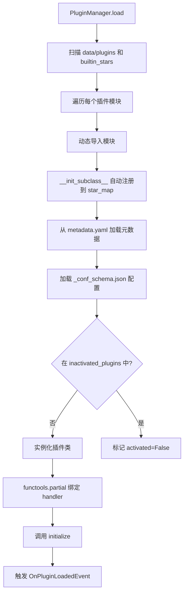

### 关键步骤

1. **模块发现** (L272-L296)：扫描目录，寻找 `main.py` 或同名 `.py`
2. **依赖安装** (L408-L459)：处理 `requirements.txt`，支持预检查和恢复
3. **版本兼容性检查** (L557-L589)：PEP 440 SpecifierSet 校验 `astrbot_version`
4. **实例化** (L976-L988)：`star_cls_type(context=context, config=config)`
5. **Handler 绑定** (L1007-L1016)：`functools.partial` 绑定 self

### 停用流程 (turn_off_plugin, L1613-L1653)

1. 执行 `terminate()`
2. 加入 `inactivated_plugins` 列表（持久化）
3. 禁用该插件的所有 `llm_tool`
4. 设置 `metadata.activated = False`

### 热重载 (L205-L257)

环境变量 `ASTRBOT_RELOAD=1` 启用。使用 `watchfiles` 监视 `.py` 文件变化：
1. 检测文件变化 → 确定所属插件
2. `_terminate_plugin` → `_unbind_plugin`（清理 handler、modules）→ `load` 重新加载

> **开发者提示**: 开发阶段设置 `ASTRBOT_RELOAD=1` 可以实现热重载，无需重启 AstrBot。但生产环境建议关闭，避免意外重载。

---

## 6.5 事件处理器注册（装饰器系统）

### 装饰器列表

通过 `astrbot.api.event.filter` 导出：

| 装饰器 | 说明 |
|--------|------|
| `@command(name, alias=...)` | 注册命令 |
| `@command_group(name, alias=...)` | 注册命令组 |
| `@regex(pattern)` | 正则匹配 |
| `@event_message_type(type)` | 消息类型过滤 |
| `@platform_adapter_type(type)` | 平台类型过滤 |
| `@permission_type(type, raise_error)` | 权限过滤 |
| `@custom_filter(filter_cls)` | 自定义过滤器 |
| `@on_astrbot_loaded()` | AstrBot 加载完成 |
| `@on_platform_loaded()` | 平台加载完成 |
| `@on_waiting_llm_request()` | 等待 LLM 请求 |
| `@on_llm_request()` | LLM 请求事件 |
| `@on_llm_response()` | LLM 响应事件 |
| `@on_agent_begin()` | Agent 开始 |
| `@on_agent_done()` | Agent 完成 |
| `@on_decorating_result()` | 发送消息前 |
| `@after_message_sent()` | 消息发送后 |
| `@on_using_llm_tool()` | 使用工具前 |
| `@on_llm_tool_respond()` | 工具调用后 |
| `@on_plugin_error()` | 插件异常 |
| `@on_plugin_loaded()` | 插件加载完成 |
| `@on_plugin_unloaded()` | 插件卸载完成 |
| `@llm_tool(name=...)` | 注册 LLM 工具 |
| `@agent(name, instruction, tools)` | 注册 Agent |

### Handler 元数据 (StarHandlerMetadata)

```python
@dataclass
class StarHandlerMetadata(Generic[H]):
    event_type: EventType
    handler_full_name: str       # "{module}_{func_name}"
    handler_name: str            # 方法名
    handler_module_path: str
    handler: H                   # 异步函数对象
    event_filters: list[HandlerFilter]
    desc: str = ""
    extras_configs: dict         # 含 priority 等
    enabled: bool = True
```

### 命令参数自动解析

`CommandFilter` 通过 `inspect.signature` 分析 handler 签名：
- 跳过前两个参数（`self` 和 `event`）
- 支持类型转换：`str`, `int`, `float`, `bool`, `Optional[T]`, `Union[T, ...]`
- 支持 `GreedyStr` 类型：贪婪匹配剩余文本
- 支持默认值

### 实践示例：指令注册与参数解析

```python
from astrbot.api.event import filter, AstrMessageEvent

# 基本指令
@filter.command("hello")
async def hello(self, event: AstrMessageEvent):
    '''指令描述（会被解析展示给用户）'''
    yield event.plain_result("Hello!")

# 带参指令
@filter.command("add")
async def add(self, event: AstrMessageEvent, a: int, b: int):
    # /add 1 2 -> 结果是: 3
    yield event.plain_result(f"结果是: {a + b}")

# 指令组
@filter.command_group("math")
def math(self):
    pass

@math.command("add")
async def math_add(self, event: AstrMessageEvent, a: int, b: int):
    yield event.plain_result(f"结果是: {a + b}")

# 嵌套指令组使用 .group() 而非 .command_group()
@math.group("calc")
def calc():
    pass

@calc.command("add")
async def calc_add(self, event: AstrMessageEvent, a: int, b: int):
    yield event.plain_result(f"结果是: {a + b}")

# 指令别名
@filter.command("help", alias={'帮助', 'helpme'})
async def help(self, event: AstrMessageEvent):
    yield event.plain_result("帮助信息")

# 优先级（默认 0，数字越大越先执行）
@filter.command("helloworld", priority=1)
async def helloworld(self, event: AstrMessageEvent):
    yield event.plain_result("Hello!")
```

### 事件钩子

> ⚠️ **注意**: 事件钩子**不能**与 command/command_group/event_message_type 等一起使用。钩子中**不能使用 yield**，需用 `await event.send()` 发送消息。

```python
# Bot 初始化完成
@filter.on_astrbot_loaded()
async def on_loaded(self):
    print("AstrBot 初始化完成")

# LLM 请求前（可修改 ProviderRequest）
@filter.on_llm_request()
async def on_req(self, event: AstrMessageEvent, req: ProviderRequest):
    req.system_prompt += "\n自定义提示"

# LLM 响应后（可修改 LLMResponse）
@filter.on_llm_response()
async def on_resp(self, event: AstrMessageEvent, resp: LLMResponse):
    print(resp.completion_text)

# 发送消息前（装饰消息链）
@filter.on_decorating_result()
async def on_decorate(self, event: AstrMessageEvent):
    result = event.get_result()
    chain = result.chain
    chain.append(Plain("!"))
```

### 控制事件传播

```python
@filter.command("check")
async def check(self, event: AstrMessageEvent):
    if not self.check():
        yield event.plain_result("检查失败")
        event.stop_event()  # 后续所有 handler 和 LLM 调用都不会执行
```

### 多过滤器组合（AND 逻辑）

```python
@filter.command("helloworld")
@filter.event_message_type(filter.EventMessageType.PRIVATE_MESSAGE)
async def helloworld(self, event: AstrMessageEvent):
    yield event.plain_result("你好！")
```

---

## 6.6 插件 Context 对象

**文件**：`core/star/context.py` (L57)

### 可访问资源

| 属性 | 类型 | 说明 |
|------|------|------|
| `provider_manager` | `ProviderManager` | 模型提供商管理器 |
| `platform_manager` | `PlatformManagerProtocol` | 平台适配器管理器 |
| `conversation_manager` | `ConversationManager` | 会话管理器 |
| `message_history_manager` | `PlatformMessageHistoryManager` | 消息历史管理器 |
| `persona_manager` | `PersonaManager` | 人格管理器 |
| `astrbot_config_mgr` | `AstrBotConfigManager` | 配置管理器 |
| `kb_manager` | `KnowledgeBaseManager` | 知识库管理器 |
| `cron_manager` | `CronJobManager` | 定时任务管理器 |

### 核心方法

| 方法 | 说明 |
|------|------|
| `llm_generate(...)` | 调用 LLM 生成（不自动执行 tool call） |
| `tool_loop_agent(...)` | 运行 Agent 循环（自动执行 tool call） |
| `get_current_chat_provider_id(umo)` | 获取当前聊天模型 ID |
| `get_registered_star(name)` | 按名获取插件元数据 |
| `get_all_stars()` | 获取所有插件列表 |
| `get_llm_tool_manager()` | 获取 LLM Tool Manager |
| `activate_llm_tool(name)` | 激活工具 |
| `deactivate_llm_tool(name)` | 停用工具 |
| `get_provider_by_id(id)` | 按 ID 获取 Provider |
| `get_using_provider(umo)` | 获取当前使用的 Provider |
| `send_message(session, chain)` | 主动发送消息 |
| `add_llm_tools(*tools)` | 添加 LLM 工具 |
| `register_web_api(route, handler, methods, desc)` | 注册 Web API |
| `get_event_queue()` | 获取事件队列 |
| `get_db()` | 获取数据库 |
| `register_provider(provider)` | 注册 Provider |

---

## 6.7 插件配置系统

### 新方式：`_conf_schema.json`（推荐）

位于插件根目录，JSON Schema 风格：

```json
{
  "key_name": {
    "type": "string|int|float|bool|list|object|template_list",
    "description": "配置项描述",
    "default": "默认值"
  }
}
```

- Schema 路径：`{plugin_dir}/_conf_schema.json`
- 持久化路径：`data/config/{root_dir_name}_config.json`
- 使用 `AstrBotConfig` 类，自动处理默认值填充和完整性检查

### Schema 字段说明

| 字段 | 必填 | 说明 |
| ---- | ---- | ---- |
| `type` | 是 | 支持: `string`, `text`, `int`, `float`, `bool`, `object`, `list`, `dict`, `template_list`, `file` |
| `description` | 否 | 配置描述 |
| `hint` | 否 | 悬浮提示信息 |
| `obvious_hint` | 否 | 是否醒目显示 hint |
| `default` | 否 | 默认值 |
| `items` | 否 | object 类型的子 Schema |
| `invisible` | 否 | 是否隐藏（不在面板显示） |
| `options` | 否 | 下拉列表可选项，如 `["chat", "agent"]` |
| `editor_mode` | 否 | 启用代码编辑器 (v3.5.10+) |
| `editor_language` | 否 | 代码语言，默认 `json` |
| `editor_theme` | 否 | `vs-light`(默认) 或 `vs-dark` |
| `_special` | 否 | v4.0.0+，支持 `select_provider`, `select_provider_tts`, `select_provider_stt`, `select_persona` |
| `file_types` | 否 | file 类型允许的扩展名列表 (v4.13.0+) |

### 实践示例：配置 Schema

```json
{
  "token": {
    "description": "Bot Token",
    "type": "string"
  },
  "max_retries": {
    "description": "最大重试次数",
    "type": "int",
    "default": 3,
    "hint": "设置为 0 表示不重试"
  },
  "enable_debug": {
    "description": "启用调试模式",
    "type": "bool",
    "default": false
  },
  "nested_config": {
    "description": "嵌套配置示例",
    "type": "object",
    "items": {
      "name": {
        "description": "名称",
        "type": "string"
      },
      "timeout": {
        "description": "超时时间",
        "type": "int",
        "default": 60
      }
    }
  },
  "demo_files": {
    "type": "file",
    "description": "上传文件",
    "default": [],
    "file_types": ["pdf", "docx"]
  }
}
```

### 在插件中读取配置

```python
from astrbot.api import AstrBotConfig

class MyPlugin(Star):
    def __init__(self, context: Context, config: AstrBotConfig):
        super().__init__(context)
        self.config = config  # AstrBotConfig 继承自 Dict
        print(self.config["token"])
        # self.config.save_config()  # 保存配置
```

> **开发者提示**: 发布新版本更新 Schema 时，AstrBot 会自动为缺失的配置项添加默认值、移除不存在的配置项。无需手动迁移。

---

## 6.8 错误隔离

### 加载阶段

每个插件的加载在独立 try-except 中，单个失败不影响其他。失败信息记录到 `failed_plugin_dict`。

### 运行时

Handler 调用异常触发 `OnPluginErrorEvent`，允许其他插件捕获处理。

### 会话级插件隔离

`SessionPluginManager`（`core/star/session_plugin_manager.py`）支持按会话（`unified_msg_origin`）启停插件。

---

## 6.9 发布流程

1. 将插件代码推送到 GitHub 仓库
2. 前往 [AstrBot 插件市场](https://plugins.astrbot.app)
3. 点击右下角 `+` 按钮
4. 填写基本信息、作者信息、仓库信息
5. 点击 `提交到 GitHub`，会导航到 AstrBot 仓库的 Issue 页面
6. 确认信息后点击 `Create` 提交

> **开发者提示**: 发布前确保 `metadata.yaml` 中的 `repo` 字段指向正确的 GitHub 仓库地址，且仓库为 public。

---
---

# PART 7 — 会话管理、数据库层与消息系统

> **本章概要**: AstrBot 的会话管理和消息系统是连接用户、平台和 LLM 的桥梁。本章覆盖 Conversation 模型、数据库 Schema、消息实体与组件、平台适配器架构、数据持久化、会话控制和 OpenAPI 接口。理解这些机制是实现多轮对话、跨平台消息推送和数据存储的基础。

---

## 7.1 Conversation 模型

### ConversationV2（SQLModel ORM 表）

**文件**: `core/db/po.py:65-96`

| 字段 | 类型 | 说明 |
|------|------|------|
| `inner_conversation_id` | `int \| None` | 自增主键 |
| `conversation_id` | `str` | UUID 唯一标识 |
| `platform_id` | `str` | 平台标识 |
| `user_id` | `str` | 实际存储 `unified_msg_origin` |
| `content` | `list \| None` | JSON，OpenAI 格式消息列表 |
| `title` | `str \| None` | 对话标题 |
| `persona_id` | `str \| None` | 关联 Persona ID |
| `token_usage` | `int` | 对话总 token 数 |
| `created_at` | `datetime` | 创建时间 (UTC) |
| `updated_at` | `datetime` | 更新时间 (UTC) |

### Conversation（旧版兼容 dataclass）

`core/db/po.py:493-515`，`ConversationManager` 内部用 `_convert_conv_from_v2_to_v1()` 转换后对外暴露。

---

## 7.2 对话 CRUD

**文件**: `core/conversation_mgr.py`

| 操作 | 方法 | 说明 |
|------|------|------|
| 创建 | `new_conversation(umo, ...)` | 创建 DB 记录 + 缓存 + SharedPreferences |
| 加载 | `get_conversation(umo, cid)` | 内存缓存 → SP → DB |
| 更新 | `update_conversation(umo, cid, history, ...)` | 更新 content/title/persona/token |
| 删除 | `delete_conversation(umo, cid)` | 删 DB + 清缓存 + 触发回调 |
| 切换 | `switch_conversation(umo, cid)` | 更新当前活跃对话 |
| 列表 | `get_conversations(umo)` | 获取会话所有对话 |
| 分页 | `get_filtered_conversations(page, size, ...)` | 分页过滤查询 |

### ConversationManager 全部 public 方法

**文件**: `core/conversation_mgr.py:17-419`

| 方法 | 说明 |
|------|------|
| `register_on_session_deleted(callback)` | 注册会话删除回调 |
| `new_conversation(umo, ...) -> str` | 新建对话 |
| `switch_conversation(umo, cid)` | 切换活跃对话 |
| `delete_conversation(umo, cid)` | 删除对话 |
| `delete_conversations_by_user_id(umo)` | 删除所有对话 + 触发回调 |
| `get_curr_conversation_id(umo) -> str \| None` | 获取当前活跃对话 ID |
| `get_conversation(umo, cid, create_if_not_exists)` | 获取对话详情 |
| `get_conversations(umo, platform_id)` | 获取对话列表 |
| `get_filtered_conversations(page, size, ...)` | 分页过滤 |
| `update_conversation(umo, cid, history, ...)` | 更新对话 |
| `add_message_pair(cid, user_msg, assistant_msg)` | 追加消息对 |
| `get_human_readable_context(umo, cid, page, size)` | 人类可读上下文 |

### 实践示例：对话管理

```python
from astrbot.core.conversation_mgr import Conversation

conv_mgr = self.context.conversation_manager
uid = event.unified_msg_origin

# 获取当前对话 ID
curr_cid = await conv_mgr.get_curr_conversation_id(uid)

# 获取对话对象
conversation = await conv_mgr.get_conversation(uid, curr_cid)

# 新建对话
new_cid = await conv_mgr.new_conversation(uid)

# 切换对话
await conv_mgr.switch_conversation(uid, conversation_id)

# 删除对话
await conv_mgr.delete_conversation(uid, conversation_id)

# 获取所有对话
conversations = await conv_mgr.get_conversations(uid)

# 更新对话
await conv_mgr.update_conversation(uid, curr_cid, history=[...], title="新标题")
```

### 添加 LLM 记录到对话

```python
from astrbot.core.agent.message import AssistantMessageSegment, UserMessageSegment, TextPart

user_msg = UserMessageSegment(content=[TextPart(text="hi")])
llm_resp = await self.context.llm_generate(
    chat_provider_id=provider_id,
    contexts=[user_msg],
)
await conv_mgr.add_message_pair(
    cid=curr_cid,
    user_message=user_msg,
    assistant_message=AssistantMessageSegment(
        content=[TextPart(text=llm_resp.completion_text)]
    ),
)
```

---

## 7.3 Session ID 与 unified_msg_origin

**格式**: `{platform_id}:{MessageType.value}:{session_id}`

**文件**: `core/platform/message_session.py:7-30`

```python
@dataclass
class MessageSession:
    platform_name: str
    message_type: MessageType  # GroupMessage / FriendMessage / OtherMessage
    session_id: str
```

**示例**:
- QQ 群聊: `aiocqhttp:GroupMessage:123456789`
- Telegram 私聊: `telegram:FriendMessage:987654321`
- WebChat: `webchat:FriendMessage:session-uuid`

**unique_session 模式**（`pipeline/waking_check/stage.py:17-26`）：群聊中每个用户独立会话，session_id 变为 `sender_id_group_id`。

### 多平台 Session 映射

通过 `unified_msg_origin` (UMO) 统一标识：

**映射存储**:
1. 内存缓存: `ConversationManager.session_conversations: dict[str, str]`
2. 持久化: `preferences` 表, scope="umo", key="sel_conv_id"

> **开发者提示**: `unified_msg_origin` 是 AstrBot 中最重要的标识符之一。存储它可以在后续任意时刻向该会话主动推送消息。

---

## 7.4 History 存储格式

`ConversationV2.content` 存储 OpenAI Chat Completion 格式的消息列表：

```json
[
  {"role": "user", "content": "你好"},
  {"role": "assistant", "content": "你好！"},
  {"role": "user", "content": [{"type": "text", "text": "看图"}, {"type": "image_url", ...}]},
  {"role": "assistant", "content": null, "tool_calls": [...]},
  {"role": "tool", "content": "...", "tool_call_id": "xxx"},
  {"role": "_checkpoint", "content": {"id": "checkpoint-uuid"}}
]
```

支持的 role: `system`, `user`, `assistant`, `tool`, `_checkpoint`

`content` 可以是 `str`、`list[ContentPart]`（多模态）、`None`（有 tool_calls 时）。

---

## 7.5 数据库 Schema（全部表）

**文件**: `core/db/po.py`

| 表名 | 类 | 用途 |
|------|------|------|
| `platform_stats` | `PlatformStat` | 平台使用统计 |
| `provider_stats` | `ProviderStat` | Provider 调用统计 |
| `conversations` | `ConversationV2` | LLM 对话存储 |
| `persona_folders` | `PersonaFolder` | Persona 文件夹 |
| `personas` | `Persona` | LLM 人格配置 |
| `cron_jobs` | `CronJob` | 定时任务 |
| `preferences` | `Preference` | 偏好设置（含会话映射） |
| `platform_message_history` | `PlatformMessageHistory` | 平台消息历史 |
| `webchat_threads` | `WebChatThread` | WebChat 线程 |
| `platform_sessions` | `PlatformSession` | 平台会话（WebChat） |
| `attachments` | `Attachment` | 附件存储 |
| `api_keys` | `ApiKey` | API 密钥 |
| `chatui_projects` | `ChatUIProject` | ChatUI 项目分组 |
| `session_project_relations` | `SessionProjectRelation` | 会话-项目关联 |
| `command_configs` | `CommandConfig` | 命令配置 |
| `command_conflicts` | `CommandConflict` | 命令冲突记录 |

数据库使用 SQLAlchemy async + aiosqlite，启用 WAL 模式。

> **开发者提示**: 插件不应直接操作这些表。使用 `ConversationManager`、`SharedPreferences` 等封装 API 访问数据。

---

## 7.6 消息实体与组件

### AstrBotMessage

**文件**: `core/platform/astrbot_message.py:50-89`

| 字段 | 类型 | 说明 |
|------|------|------|
| `type` | `MessageType` | GROUP/FRIEND/OTHER |
| `self_id` | `str` | 机器人自身 ID |
| `session_id` | `str` | 会话 ID |
| `message_id` | `str` | 消息 ID |
| `group` | `Group \| None` | 群组信息 |
| `sender` | `MessageMember` | 发送者 |
| `message` | `list[BaseMessageComponent]` | 消息链 |
| `message_str` | `str` | 纯文本 |
| `raw_message` | `object` | 平台原始消息 |
| `timestamp` | `int` | 时间戳 |

### 消息组件

**文件**: `core/message/components.py`

| 组件 | 说明 |
|------|------|
| `Plain` | 纯文本 |
| `Image` | 图片（URL/文件/Base64） |
| `Record` | 音频 |
| `Video` | 视频 |
| `File` | 文件附件 |
| `At` / `AtAll` | @某人/@全体 |
| `Reply` | 引用回复 |
| `Forward` / `Node` / `Nodes` | 转发消息 |
| `Face` / `Poke` / `Share` / `Music` / `Json` | 平台特有 |

每个媒体组件提供 `convert_to_file_path()`, `convert_to_base64()`, `register_to_file_service()` 统一转换。

### 实践示例：消息发送

#### 被动消息（yield）

```python
@filter.command("hello")
async def hello(self, event: AstrMessageEvent):
    yield event.plain_result("Hello!")
    yield event.plain_result("你好！")
    yield event.image_result("path/to/image.jpg")
    yield event.image_result("https://example.com/image.jpg")
```

#### 主动消息（send_message）

```python
from astrbot.api.event import MessageChain

@filter.command("save")
async def save(self, event: AstrMessageEvent):
    umo = event.unified_msg_origin  # 存储此字符串，后续可用于主动推送
    # ... 稍后在定时任务中:
    chain = MessageChain().message("定时提醒!")
    await self.context.send_message(umo, chain)
```

#### 富媒体消息（消息链）

```python
import astrbot.api.message_components as Comp

@filter.command("rich")
async def rich(self, event: AstrMessageEvent):
    chain = [
        Comp.At(qq=event.get_sender_id()),
        Comp.Plain("来看这个图："),
        Comp.Image.fromURL("https://example.com/image.jpg"),
        Comp.Image.fromFileSystem("path/to/image.jpg"),
        Comp.Plain("这是一个图片。")
    ]
    yield event.chain_result(chain)
```

#### 其他消息类型

```python
# 文件
Comp.File(file="path/to/file.txt", name="file.txt")

# 语音（仅 wav 格式）
Comp.Record(file="path/to/record.wav", url="path/to/record.wav")

# 视频
Comp.Video.fromFileSystem(path="test.mp4")
Comp.Video.fromURL(url="https://example.com/video.mp4")
```

#### 合并转发消息（仅 OneBot v11）

```python
from astrbot.api.message_components import Node, Plain, Image

node = Node(
    uin=905617992,
    name="Soulter",
    content=[Plain("hi"), Image.fromFileSystem("test.jpg")]
)
yield event.chain_result([node])
```

### 消息发送机制

- **框架回复**: `yield event.plain_result(...)` 将待发送结果交给后续装饰、TTS 和 `RespondStage`
- **立即发送**: `await event.send(MessageChain)` 直接调用平台发送，不会替代或清除当前待发送结果
- **流式发送**: `event.send_streaming(async_generator)`
  - Telegram 私聊: `sendMessageDraft` 实时推送
  - 其他: 累积后发送或 `edit_message_text` fallback
- **主动发送**: `Platform.send_by_session(session, chain)` — 无需 event 对象

同一逻辑回复只能有一个发送者。插件若使用 `event.send(...)` 旁路发送最终正文，必须同步阻止框架继续发送原结果；否则装饰阶段的 TTS 或 `RespondStage` 会再次发送同一回复。

---

## 7.7 平台适配器架构

### 基类 Platform

**文件**: `core/platform/platform.py:36-166`

```python
class Platform(abc.ABC):
    def __init__(self, config: dict, event_queue: Queue): ...
    
    @abc.abstractmethod
    def run(self) -> Coroutine       # 启动平台
    
    @abc.abstractmethod
    def meta(self) -> PlatformMetadata
    
    async def send_by_session(self, session, chain)  # 主动发送
    def commit_event(self, event)    # 提交事件到队列
```

### 注册

**文件**: `core/platform/register.py:11-63`

```python
@register_platform_adapter("aiocqhttp", "OneBot V11 适配器", ...)
class AiocqhttpAdapter(Platform): ...
```

### 支持的平台

| 平台 | 适配器类型 | 协议 |
|------|-----------|------|
| QQ/OneBot V11 | `aiocqhttp` | WebSocket |
| QQ 官方 | `qq_official` | HTTP |
| QQ 官方 Webhook | `qq_official_webhook` | Webhook |
| Telegram | `telegram` | Bot API |
| 飞书 | `lark` | Webhook |
| 钉钉 | `dingtalk` | Webhook |
| 企业微信 | `wecom` | Webhook |
| 微信公众号 | `weixin_official_account` | Webhook |
| Discord | `discord` | Gateway |
| Slack | `slack` | Events API |
| LINE | `line` | Webhook |
| KOOK | `kook` | WebSocket |
| Mattermost | `mattermost` | WebSocket |
| Misskey | `misskey` | Streaming |
| Satori | `satori` | 通用协议 |
| WebChat（内置） | `webchat` | HTTP/WS |

### 实践示例：平台适配器开发

AstrBot 支持以插件形式接入自定义平台适配器：

```python
from astrbot.api.platform import Platform, AstrBotMessage, MessageMember, PlatformMetadata, MessageType
from astrbot.api.platform import register_platform_adapter

@register_platform_adapter("my_platform", "我的平台适配器", default_config_tmpl={
    "token": "your_token",
})
class MyPlatformAdapter(Platform):
    def __init__(self, platform_config: dict, platform_settings: dict, event_queue: asyncio.Queue):
        super().__init__(event_queue)
        self.config = platform_config

    async def run(self):
        # 主循环，监听消息
        pass

    async def send_by_session(self, session, message_chain):
        await super().send_by_session(session, message_chain)

    def meta(self) -> PlatformMetadata:
        return PlatformMetadata("my_platform", "我的平台适配器")
```

核心步骤：
1. 创建适配器类，继承 `Platform`
2. 使用 `@register_platform_adapter` 装饰器注册
3. 实现 `run()`、`send_by_session()`、`meta()` 方法
4. 创建事件类，继承 `AstrMessageEvent`，实现 `send()` 方法
5. 在 `main.py` 的 `__init__` 中导入适配器模块

> **开发者提示**: 适配器的 `run()` 方法是一个长期运行的协程，通常包含消息监听循环。确保正确处理断连重连逻辑。

---

## 7.8 数据持久化

### 简单 KV 存储 (v4.9.2+)

AstrBot 提供基于插件维度的 KV 存储，每个插件有独立的存储空间。

### 实践示例：KV 存储

```python
class MyPlugin(Star):
    @filter.command("hello")
    async def hello(self, event: AstrMessageEvent):
        # 写入
        await self.put_kv_data("greeted", True)

        # 读取（第二个参数为默认值）
        greeted = await self.get_kv_data("greeted", False)

        # 删除
        await self.delete_kv_data("greeted")
```

### 大文件存储规范

大文件应存储于 `data/plugin_data/{plugin_name}/` 目录下：

```python
from astrbot.core.utils.astrbot_path import get_astrbot_data_path

plugin_data_path = get_astrbot_data_path() / "plugin_data" / self.name
# self.name 在 v4.9.2+ 可用
```

### SharedPreferences（全局 KV 存储）

通过 `from astrbot.core import sp` 访问：

| 方法 | 说明 |
|------|------|
| `sp.get_async(scope, scope_id, key, default)` | 异步获取 |
| `sp.put_async(scope, scope_id, key, value)` | 异步存储 |
| `sp.global_get(key, default)` | 全局获取 |
| `sp.global_put(key, value)` | 全局存储 |
| `sp.session_get(umo, key, default)` | 会话级获取 |
| `sp.session_put(umo, key, value)` | 会话级存储 |

### 配置持久化

- 路径：`data/config/{root_dir_name}_config.json`
- 保存：`config.save_config()`
- 自动补全：初始化时对比 schema，缺失项自动插入

### 命令配置

`core/star/command_management.py` 支持命令重命名、启停、权限修改，通过 `CommandConfig` 表持久化。

> ⚠️ **注意**: 不要将数据存储在插件自身目录下。插件更新/重装时，插件目录会被覆盖，数据将丢失。

---

## 7.9 会话控制

用于实现多轮对话场景（如成语接龙、问答游戏等）。

### 实践示例：session_waiter

```python
import astrbot.api.message_components as Comp
from astrbot.core.utils.session_waiter import session_waiter, SessionController

@filter.command("game")
async def game(self, event: AstrMessageEvent):
    yield event.plain_result("请输入内容~")

    @session_waiter(timeout=60, record_history_chains=False)
    async def waiter(controller: SessionController, event: AstrMessageEvent):
        text = event.message_str

        if text == "退出":
            await event.send(event.plain_result("已退出"))
            controller.stop()
            return

        # 发送回复（不能用 yield）
        result = event.make_result()
        result.chain = [Comp.Plain(f"你说了: {text}")]
        await event.send(result)

        # 保持会话，重置超时
        controller.keep(timeout=60, reset_timeout=True)

    try:
        await waiter(event)
    except TimeoutError:
        yield event.plain_result("超时了！")
    finally:
        event.stop_event()
```

### SessionController API

| 方法 | 说明 |
| ---- | ---- |
| `controller.keep(timeout, reset_timeout=True)` | 保持会话。reset_timeout=True 重置计时器 |
| `controller.stop()` | 立即结束会话 |
| `controller.get_history_chains()` | 获取历史消息链（需 record_history_chains=True） |

### 自定义会话 ID 算子

默认按 `sender_id` 区分会话。可自定义为按群区分：

```python
from astrbot.core.utils.session_waiter import SessionFilter, SessionController

class GroupFilter(SessionFilter):
    def filter(self, event: AstrMessageEvent) -> str:
        return event.get_group_id() if event.get_group_id() else event.unified_msg_origin

await waiter(event, session_filter=GroupFilter())
```

> **开发者提示**: `session_waiter` 内部不能使用 `yield`，必须用 `await event.send()` 发送消息。这是因为 waiter 回调不是生成器函数。

---

## 7.10 OpenAPI (v4.18.0+)

AstrBot 提供基于 API Key 的 HTTP API。

### 认证方式

```http
Authorization: Bearer abk_xxx
```

或：

```http
X-API-Key: abk_xxx
```

### Scope 权限

| Scope | 可访问接口 |
| ---- | ---- |
| `chat` | `POST /api/v1/chat`, `GET /api/v1/chat/sessions` |
| `config` | `GET /api/v1/configs` |
| `file` | `POST /api/v1/file` |
| `im` | `POST /api/v1/im/message`, `GET /api/v1/im/bots` |

### 对话接口

```bash
curl -N 'http://localhost:6185/api/v1/chat' \
  -H 'Authorization: Bearer abk_xxx' \
  -H 'Content-Type: application/json' \
  -d '{"message":"Hello","username":"alice"}'
```

支持 SSE 流式返回。`username` 为必填参数。

### message 字段格式

支持纯文本或消息段数组：

```json
{
  "message": [
    { "type": "plain", "text": "请看这个文件" },
    { "type": "file", "attachment_id": "uuid-here" }
  ]
}
```

消息段类型: `plain`, `reply`, `image`, `record`, `file`, `video`

### IM 主动消息

```json
POST /api/v1/im/message
{
  "umo": "webchat:FriendMessage:openapi_probe",
  "message": [
    { "type": "plain", "text": "主动消息" }
  ]
}
```

> **开发者提示**: OpenAPI 的 `im` scope 允许通过 HTTP 向任意已知 UMO 推送消息，适合外部系统集成（如 CI/CD 通知、监控告警）。

---
---

# 附录：API 导入速查

```python
# ═══════════════════════════════════════════════════
# 核心
# ═══════════════════════════════════════════════════
from astrbot.api.star import Context, Star
from astrbot.api.event import filter, AstrMessageEvent, MessageChain
from astrbot.api import logger, AstrBotConfig
import astrbot.api.message_components as Comp

# ═══════════════════════════════════════════════════
# LLM / Agent
# ═══════════════════════════════════════════════════
from astrbot.api.provider import ProviderRequest, LLMResponse
from astrbot.core.agent.tool import FunctionTool, ToolExecResult, ToolSet
from astrbot.core.agent.run_context import ContextWrapper
from astrbot.core.astr_agent_context import AstrAgentContext
from astrbot.core.agent.message import AssistantMessageSegment, UserMessageSegment, TextPart

# ═══════════════════════════════════════════════════
# 会话控制
# ═══════════════════════════════════════════════════
from astrbot.core.utils.session_waiter import session_waiter, SessionController, SessionFilter

# ═══════════════════════════════════════════════════
# 对话管理
# ═══════════════════════════════════════════════════
from astrbot.core.conversation_mgr import Conversation

# ═══════════════════════════════════════════════════
# 平台
# ═══════════════════════════════════════════════════
from astrbot.api.platform import Platform, AstrBotMessage, MessageMember, PlatformMetadata, MessageType
from astrbot.api.platform import register_platform_adapter

# ═══════════════════════════════════════════════════
# 路径与存储
# ═══════════════════════════════════════════════════
from astrbot.core.utils.astrbot_path import get_astrbot_data_path
from astrbot.core import sp  # SharedPreferences
```
