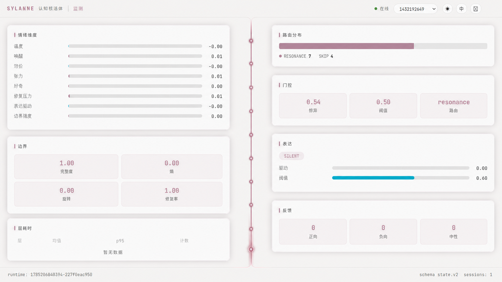
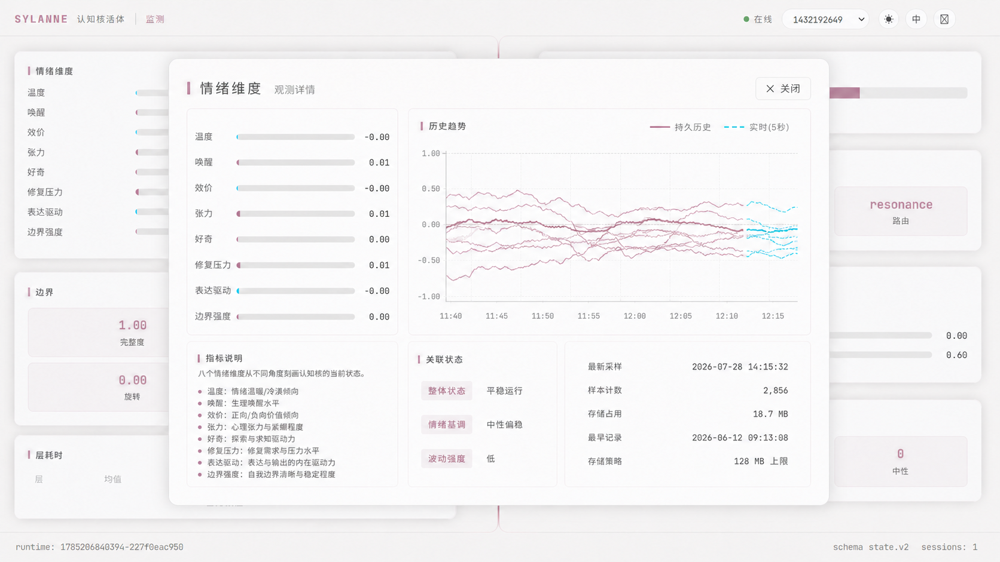

# Sylanne 前端动效与交互设计规格

日期：2026-07-28

## 目标

在不更换 Sylanne 现有设计语言的前提下，修复登录与页面交接动效，并统一独立服务器与 AstrBot 原生 Pages 中的交互反馈。

用户喜欢现有的粉灰色、柔白卡片、中轴解剖台、克制阴影和低饱和数据界面。因此本次不是重做视觉品牌，也不引入动漫角色、对话框皮肤或游戏 HUD。视觉小说感仅来自演出时序、焦点引导和简短状态叙事。

选定视觉基准：

观测舱展开态：

## 不变项

- 保留现有明暗主题、配色令牌、字体角色、卡片圆角、间距和信息密度。
- 保留顶部栏、底部状态栏、中轴导航与左右双栏结构。
- 保留所有现有页面、字段、操作和 AstrBot 原生 Pages 桥接方式。
- 小屏幕继续使用现有左侧导轨和单列堆叠，不强行把移动端内容压到屏幕中线。
- 中轴小点仍代表路由导航，不改造成卡片索引。

## 登录成功与页面入场

成功登录后不得出现圆形遮罩、圆孔揭示、扩张圆环或径向过渡。

唯一允许的入场顺序如下：

1. 路由切换到仪表盘的初始演出状态；背景已经就位，其他界面内容不得提前闪现。
2. 中轴线从上向下贯穿，建议时长 `1200ms`。
3. 小点按照它们在中轴上的纵向位置，在“线头经过”时逐个出现。延迟由节点位置计算，禁止统一延迟后同时出现。
4. 中轴完全贯穿后，顶部栏、底部栏和内容卡片在同一拍开始：
   - 顶部栏从上边界向下滑入；
   - 底部栏从下边界向上滑入；
   - 左侧卡片从中线向左弹开；
   - 右侧卡片从中线向右弹开。
5. 左右对应卡片镜像同步；不同纵向层级可保留约 `70ms` 的轻微错峰。
6. 演出状态在最后一个元素完成后再清理，预计总时长约 `2000ms`。

初始状态必须在首次绘制前生效，避免先显示完整页面再倒回动画。`prefers-reduced-motion` 下直接进入最终状态，不播放长演出。

## 交互语言

### 焦点与悬停

- 信息卡悬停只允许轻微上浮 `2–3px`、边缘变清晰和阴影略增强，不改变尺寸或布局。
- 可操作控件必须提供清晰的 `:focus-visible` 状态，并沿用粉灰色焦点环。
- 当前路由节点可以轻微呼吸以维持页面位置感，但不得让所有节点持续闪烁。
- 不给纯展示卡片添加虚假的键盘焦点或点击行为。
- 按钮按下使用短促位移或明度变化，不使用夸张缩放、粒子或霓虹爆闪。

### 底栏状态叙事

复用现有底部状态栏的中部位置展示短暂反馈，不新增浮层或对话框：

- 会话切换：`会话已切换 · {session}`
- 数据刷新：`状态已同步`
- 保存成功：`设置已保存`
- 连接中断：`连接已中断，正在重试`
- 操作失败：展示简短、可理解的错误摘要

消息通过淡入、短暂停留、淡出完成，然后恢复原有 `schema state.v2` 内容。运行时、会话数等既有信息不得永久挪位。连续消息以后到者覆盖前者，避免堆叠。

### 登录

- 登录按钮必须确定性显示，不依赖偶发的动画或异步检测结果。
- 账号、密码和按钮具备一致的悬停、焦点、禁用与加载状态。
- 提交期间保留按钮尺寸，用文案或细线进度提示替换内容，避免布局跳动。
- 登录失败在表单内部显示，保留输入内容，并将焦点移到可恢复的位置。
- 登录成功只触发一次入场请求；路由切换和演出不得重复播放。

### 会话、主题、语言与退出

- 会话下拉继续采用兼容性稳定的选择控件，选中后立即刷新当前会话数据。
- 会话加载期间禁用重复切换，并在底栏给出状态。
- 在线、离线、重连状态同时使用颜色和文字表达，不能只靠颜色。
- 主题与语言切换保持即时响应，并持久化现有偏好。
- 独立服务器保留退出入口；AstrBot 原生 Pages 依赖宿主认证时不显示退出入口。

### 页面操作

- 保存、刷新、删除、切换等操作统一具备空闲、处理中、成功、失败四类反馈。
- 成功优先走底栏短消息；字段错误就近显示；危险操作继续使用现有确认机制。
- 加载状态不覆盖整页，除非当前页面完全没有可用旧数据。
- 数据为空时保留页面结构和明确说明，不用纯动画代替信息。

## 观测舱展开

监测页中的只读数据卡是可展开的“观测舱”。配置表单、危险操作区和其他本身已经可编辑的容器不伪装成观测舱。

点击可展开卡片后：

1. 卡片从原位置向视口中央抽出，并在同一连续运动中扩展为详情层。
2. 原页面保持可辨认，仅降低对比度并使用最多 `2px` 的轻微模糊；不使用全黑遮罩。
3. 中轴、顶部栏和底部栏仍作为实验坐标存在，但不可抢夺详情层焦点。
4. 详情层展示当前读数、指标解释、历史趋势、关联状态、最新采样时间、样本数、存储占用和最早记录时间。
5. 关闭时沿原路径收回，并把键盘焦点还给触发卡片。

展开层使用原有卡片材质、圆角、阴影、字体和粉灰色强调，不设计新的弹窗皮肤。桌面宽度约占视口 `72%`，高度按内容限制在约 `72%`；小屏幕使用接近全屏的详情层，保留安全边距。

交互要求：

- 只读卡片使用真正的按钮语义或等价的可访问触发器。
- 打开后焦点限制在详情层内；`Escape` 和明确的关闭按钮均可关闭。
- 切换路由或会话时先关闭详情层，不能把上一个会话的数据留在新会话上。
- 动画期间禁止重复打开；减少动态偏好下直接切换到展开状态。
- 趋势图必须来自真实记录。没有历史时显示“从现在开始记录”，不得生成装饰性假曲线。

首批观测舱覆盖监测页的情绪维度、边界、层耗时、路由分布、门控、表达和反馈。其他页面仅在存在清晰只读详情时复用同一能力。

## 观测历史

### 采样语义

- 历史记录按会话隔离。
- 在认知状态真实更新时追加一条规范化的紧凑样本，而不是因前端轮询而写入。
- 连续样本完全相同则合并，仅更新时间，避免长时间静止产生重复数据。
- 页面打开后，前端先加载持久化历史，再把当前 `5s` 轮询采样无缝接到曲线尾部。
- 服务端和前端按时间戳去重；切换会话时切换到各自的历史缓存。

每个样本只保存观测界面需要的数值、路由、时间戳和模式字段，不复制对话正文、提示词或其他无关隐私数据。

### 存储策略

历史没有按天数计算的过期时间，记录可长期保留。

- 使用追加式分段记录，避免清理时重写一个持续膨胀的大文件。
- `history_storage_limit_mb` 为全插件历史总预算，默认 `128`。
- 配置值 `0` 表示不设上限，也不执行自动清理。
- 有上限时，超过预算后进入渐进清理：每次追加或维护周期最多删除一个最旧的已封闭分段。
- 清理持续到总占用回落至预算的 `90%`；当前写入分段和最新记录不能被删除。
- 清理顺序按所有会话的记录时间统一从旧到新，避免会话数量增加时把磁盘占用成倍放大。

详情层显示当前占用、配置上限或“无限制”、最早记录时间和样本数。达到上限不是错误，不弹出阻塞提示。

### 查询与降采样

后端提供按会话、指标组、时间范围和最大点数查询的历史接口。长时间范围由服务端按时间桶降采样，返回每桶的首值、末值、最小值和最大值，保证趋势形状且避免把全部记录送到浏览器。

前端详情层默认展示最近可用窗口，并允许切换较长范围。持久化段损坏时跳过损坏段、记录警告并继续返回其他历史；历史读取失败不影响当前实时数据。

## 原生 Pages 与独立服务器

- 两种运行形态共享同一套组件和交互状态。
- 原生 Pages 通过 `window.AstrBotPluginPage` 获取宿主能力与 API 路径；不得硬编码独立服务器地址。
- 独立服务器继续使用插件自身的登录和退出流程。
- 宿主菜单、侧栏和浏览器页面不参与插件内部入场动画。
- 页面交接不得因宿主容器裁剪、滚动或重绘而重新播放。

## 响应式与可访问性

- 桌面端保留中心中轴与双栏演出。
- 小于 `900px` 时沿用左侧导轨和单列卡片；顺序仍是导轨线与节点先出现，随后顶部栏、底部栏和内容一起进入。
- 触摸设备不依赖悬停才能理解状态。
- 所有可操作控件保留键盘顺序、可见焦点、可读标签和合适的点击区域。
- 减少动态偏好下取消位移、弹簧和逐点等待，直接展示最终布局。

## 实现边界

优先复用现有 `arrivalPending`、`DashboardLayout.arrive`、`SpineNav` 节点位置和左右卡片方向，不新建第二套覆盖层动画。

允许新增一个轻量的全局交互反馈状态，用于底栏短消息；不引入新的状态管理依赖。圆形 `VoidVeil` 不再参与登录成功交接。

允许新增轻量的观测历史存储与只读查询接口，但不改变认知计算、会话或持久化快照的既有业务语义。不增加新页面，不重排仪表盘信息结构，不重做 UI 组件库。

## 验收标准

- 登录成功过程中没有任何圆形或径向遮罩。
- 第一帧没有完整页面闪现。
- 中轴线先出现，小点严格随线头依次出现。
- 中轴到底后，顶栏向下、底栏向上、左右卡片向外同时开始。
- 会话切换、刷新、保存、离线和失败状态均有一致且不遮挡内容的反馈。
- 监测页七类只读卡片均可通过鼠标、触摸和键盘打开观测舱，并能正确关闭和恢复焦点。
- 观测舱展示真实历史与实时数据；无历史时不生成假曲线。
- 历史没有时间过期；默认总预算为 `128 MB`，配置为 `0` 时不清理。
- 超出预算后按最旧分段渐进清理，写入和查询期间不阻塞主交互流程。
- 独立服务器与 AstrBot 原生 Pages 均能连接正确后端，登录/退出入口符合各自认证模式。
- 明暗主题、桌面与移动布局、键盘焦点和减少动态偏好均正常。
- 前端单元测试、生产构建、Python 合约测试和插件校验全部通过。
- 使用 Browser 分别走通独立服务器与原生 Pages 的核心路径，并保存桌面与移动端截图做视觉核对。
