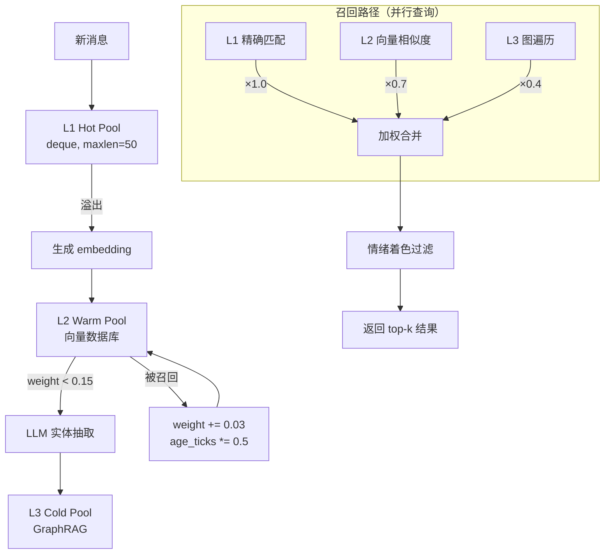
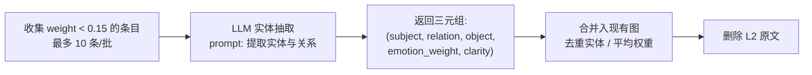

# Sylanne-Embodiment 三层记忆架构设计

## 概述

三层记忆系统以**印象深度（weight）**而非时间为分层依据。记忆在层间流动：新鲜记忆驻留热池，随衰减下沉至向量池，最终压缩为抽象知识图谱。被回忆的记忆会加深印象、抵抗衰减，模拟人类"越想越记得"的再巩固效应。

## 架构总览



## 层定义

| 层 | 存储形式 | 容量 | 访问方式 | 保留内容 |
|---|---|---|---|---|
| L1 Hot Pool | 内存 deque | 50 条 | 直接遍历 | 完整消息文本 + 元数据 |
| L2 Warm Pool | embedding 向量 + 原文 | 无硬上限（靠衰减自然淘汰） | 余弦相似度 | 完整文本 + weight + temperature |
| L3 Cold Pool | 实体-关系图 | < 1000 节点 | NER → 图遍历 | 抽象知识三元组 |

## 流转规则

1. **每条消息** → 写入 L1
2. **L1 溢出**（> 50）→ 最旧条目生成 embedding → 沉入 L2
3. **L2 持续衰减** → weight 低于阈值 → 触发 LLM 压缩 → 写入 L3 → 删除 L2 原文
4. **L2 被召回** → weight 增加 → 留在 L2（印象加深）
5. **L3 实体/关系** → 也有 emotion_weight，召回时发生再巩固漂移

## 衰减动力学

### 核心公式

```
weight(t+1) = weight(t) × (1 - decay_rate)
decay_rate  = base_decay × (1 + age_coeff × ln(age_ticks + 1))
```

### 参数

| 参数 | 默认值 | 含义 |
|---|---|---|
| `base_decay` | 0.02 / tick | 基础衰减率（每 tick 衰减 2%） |
| `age_coeff` | 0.15 | 年龄对遗忘的加速系数 |
| `age_ticks` | — | 自**上次被召回**以来的 tick 数（非创建时间） |

### 召回时的再巩固

```
weight    += 0.03                                    # 印象加深
age_ticks  = age_ticks × 0.5                         # 部分年龄重置
temperature = temperature × 0.95 + current_warmth × 0.05  # 情绪再巩固漂移
```

### 衰减曲线示意

```
decay_rate 随 age_ticks 的变化（base_decay=0.02, age_coeff=0.15）:

age_ticks=0:   decay = 0.020  (纯基础衰减)
age_ticks=10:  decay = 0.020 × (1 + 0.15 × ln(11)) ≈ 0.027
age_ticks=50:  decay = 0.020 × (1 + 0.15 × ln(51)) ≈ 0.032
age_ticks=200: decay = 0.020 × (1 + 0.15 × ln(201)) ≈ 0.036
```

越久不被想起，遗忘越快——但增速是对数级的，不会爆炸。

## 召回策略

### 并行查询

三层同时查询，结果按层权重合并：

```python
final_score = layer_weight × item_weight × relevance_score × emotion_bias
```

| 层 | layer_weight | 理由 |
|---|---|---|
| L1 | 1.0 | 最新鲜，最高优先 |
| L2 | 0.7 | 仍具体，但较旧 |
| L3 | 0.4 | 抽象，优先级最低但覆盖最广 |

### 情绪着色召回

当前情绪状态（`current_warmth`）会偏置召回结果：

```python
emotion_bias = 1.0 + bias_strength × cosine_similarity(item.temperature, current_warmth)
```

正向情绪时更容易想起温暖记忆，负向情绪时更容易想起冷淡记忆。

## L3 GraphRAG 压缩

### 触发条件

L2 item 的 `weight < 0.15`（压缩阈值）。

### 压缩流程



### 图结构

```python
# 节点
Node = {
    "id": str,
    "label": str,
    "type": "person" | "topic" | "event" | "preference" | "boundary",
    "emotion_weight": float,   # [-1.0, 1.0]
    "clarity": float,          # [0.0, 1.0], 初始 1.0, 随时间衰减
    "recall_count": int,
}

# 边
Edge = {
    "source": str,
    "target": str,
    "relation": str,
    "emotion_weight": float,
    "clarity": float,
    "last_recalled": int,      # tick 时间戳
}
```

### Clarity 衰减与表达

`clarity` 从 1.0 开始，每 tick 衰减：

```
clarity(t+1) = clarity(t) × 0.998
```

影响输出语气：

| clarity 范围 | 表达方式 | 示例 |
|---|---|---|
| > 0.7 | 确信 | "你喜欢猫" |
| 0.3 – 0.7 | 不确定 | "你好像提过喜欢猫？" |
| < 0.3 | 不浮现 | （不主动提及） |

### L3 召回流程

1. 从当前消息提取实体（简单 NER / 关键词匹配）
2. 在图中查找匹配节点
3. 遍历 1-2 跳获取相关知识
4. 以自然语言片段返回，附带 clarity 标记

## 时间感知（Temporal Awareness）

L3 图中的实体/关系并非同质——有些知识是永恒的，有些会过期。通过 `temporal_type` 属性区分：

### 时间类型

| temporal_type | 含义 | 衰减行为 | 示例 |
| --- | --- | --- | --- |
| `permanent` | 永恒属性，不会随时间失效 | clarity 不衰减 | 名字、性别、血型、母语 |
| `evolving` | 会随时间变化的状态 | clarity 加速衰减（超过有效期后） | 年级、工作、住址、年龄、恋爱状态 |
| `episodic` | 一次性事件 | 正常衰减 | "某天去了咖啡馆"、"上周考试" |

### Evolving 类型的时效机制

```python
# evolving 节点额外字段
EvolvingNode = {
    ...Node,
    "temporal_type": "evolving",
    "valid_from": "2026-03-01",      # 获知该信息的时间
    "staleness_threshold": 180,       # 天数，超过后加速衰减（默认 6 个月）
}
```

#### 加速衰减公式

```
days_since_valid = (current_date - valid_from).days

if days_since_valid > staleness_threshold:
    staleness_factor = 1 + 0.5 × ln((days_since_valid - staleness_threshold) / 30 + 1)
    clarity(t+1) = clarity(t) × (0.998 / staleness_factor)
else:
    clarity(t+1) = clarity(t) × 0.998  # 正常衰减
```

超过有效期后，每多一个月，衰减速度增加约 50% × ln(月数)。

#### 召回时的确认语气

| 条件 | 输出行为 |
|---|---|
| evolving + clarity > 0.7 | 正常断言："你在读大一" |
| evolving + clarity 0.3–0.7 | 确认语气："你现在还是大一吗？" |
| evolving + clarity < 0.3 | 不主动提及，或极度不确定："我记得你之前好像是大一...？" |

#### 示例时间线

```
2026-03-01: 用户说"我是大一学生"
  → Node: {label: "大一学生", temporal_type: "evolving", valid_from: "2026-03-01", clarity: 1.0}

2026-06-01 (3个月后): clarity ≈ 0.83（正常衰减）
  → bot 仍可自信说"你大一"

2026-09-01 (6个月后，超过 staleness_threshold):
  → 加速衰减启动，clarity 快速下降
  → clarity ≈ 0.45 → bot 改为确认："你现在还是大一吗？"

2026-12-01 (9个月后):
  → clarity ≈ 0.20 → bot 不再主动提及
```

#### 更新确认机制

当用户回答确认问题时：

- 确认不变："对，还是大一" → `valid_from` 更新为当前日期，`clarity` 重置为 1.0
- 已变化："不，我大二了" → 旧节点标记为历史（`clarity = 0`），创建新节点

### 图节点完整结构（含时间字段）

```python
Node = {
    "id": str,
    "label": str,
    "type": "person" | "topic" | "event" | "preference" | "boundary",
    "temporal_type": "permanent" | "evolving" | "episodic",
    "emotion_weight": float,        # [-1.0, 1.0]
    "clarity": float,               # [0.0, 1.0]
    "recall_count": int,
    # evolving 专用
    "valid_from": str | None,       # ISO date, e.g. "2026-03-01"
    "staleness_threshold": int,     # 天数，默认 180
}
```

### LLM 实体抽取 prompt 扩展

压缩时的 LLM prompt 需要额外指示：

```text
对每个提取的实体，判断其 temporal_type：
- permanent: 不会随时间改变的固有属性（名字、性别、出生地）
- evolving: 可能随时间变化的状态（年级、职业、住址、关系状态）
- episodic: 一次性发生的事件（某天做了某事）

对 evolving 类型，记录 valid_from 为你获知该信息的大致时间。
```

## 再巩固机制（各层）

| 层 | 被着色的属性 | 公式 |
|---|---|---|
| L1 | `item.temperature` | `0.95 × old + 0.05 × current_warmth` |
| L2 | `item.temperature` | `0.95 × old + 0.05 × current_warmth` |
| L3 | `edge.emotion_weight` | `0.90 × old + 0.10 × current_warmth`（抽象知识漂移更慢） |

每次召回都会轻微改变记忆的情绪色彩——记忆不是静态快照，而是活的、会被当下心境重塑的东西。

## 人格参数集成

记忆系统参数由人格维度调制：

| 人格维度 | 影响的参数 | 机制 |
|---|---|---|
| Conscientiousness（尽责性） | L2 容量上限 | 高 C → 更有条理，保留更多具体记忆 |
| Neuroticism（神经质） | 负面记忆衰减率 | 高 N → 负面记忆衰减更慢 |
| Openness（开放性） | L3 压缩阈值 | 高 O → 更愿意抽象化，阈值更高（更早压缩） |
| Agreeableness（宜人性） | 召回偏置 | 高 A → 正面记忆更容易浮现 |

```python
# 人格调制示例
effective_base_decay = base_decay × (1.2 - conscientiousness × 0.4)  # C=1.0 时衰减降低 40%
negative_decay_mult  = 1.0 - neuroticism × 0.5                       # N=1.0 时负面记忆衰减减半
compression_threshold = 0.15 + openness × 0.10                       # O=1.0 时阈值升至 0.25
positive_recall_bias  = 1.0 + agreeableness × 0.3                    # A=1.0 时正面记忆权重 +30%
```

## 实现方案

### 技术选型

| 组件 | 初期方案 | 升级路径 |
|---|---|---|
| L1 | `collections.deque(maxlen=50)` | — |
| L2 存储 | 内存 list + numpy 余弦相似度 | ChromaDB / FAISS |
| L2 embedding | 复用 AstrBot 已有 embedding 接口 | 独立 embedding 服务 |
| L3 图 | NetworkX 或 `dict[str, dict]` | Neo4j（如规模超 1000 节点） |
| L3 实体抽取 | 复用现有 assessor LLM（后台调用） | 专用小模型 |
| 序列化 | JSON（三层统一 `to_dict` / `from_dict`） | SQLite + JSON 混合 |

### 无外部依赖原则

作为 AstrBot 插件，初期不引入外部数据库依赖。所有数据序列化为 JSON 文件，随插件数据目录持久化。

## API 接口

```python
from dataclasses import dataclass

@dataclass
class MemoryResult:
    text: str                    # 记忆内容（L1/L2 为原文，L3 为自然语言摘要）
    layer: str                   # "L1" | "L2" | "L3"
    weight: float                # 当前权重
    relevance: float             # 与查询的相关度
    clarity: float               # 清晰度（L3 专用，L1/L2 固定为 1.0）
    temperature: float           # 情绪温度
    final_score: float           # 最终排序分数


class MemorySystem:
    """三层记忆系统主接口"""

    def write(
        self,
        text: str,
        embedding: list[float] | None = None,
        temperature: float = 0.0,
    ) -> None:
        """写入新记忆到 L1。溢出时自动下沉到 L2。"""
        ...

    def recall(
        self,
        query: str,
        query_embedding: list[float] | None = None,
        current_warmth: float = 0.0,
        limit: int = 5,
    ) -> list[MemoryResult]:
        """并行查询三层，返回加权合并后的 top-k 结果。"""
        ...

    def tick_decay(self) -> None:
        """每条消息调用一次，推进衰减时钟。"""
        ...

    def compress_check(self) -> None:
        """检查 L2 中是否有条目需要压缩到 L3。异步执行。"""
        ...

    def to_dict(self) -> dict:
        """序列化全部三层为可 JSON 化的 dict。"""
        ...

    def from_dict(self, data: dict) -> None:
        """从 dict 恢复全部三层状态。"""
        ...
```

## 生命周期时序

```mermaid
sequenceDiagram
    participant User
    participant Body as Sylanne Body Runtime
    participant Mem as MemorySystem
    participant LLM as Assessor LLM

    User->>Body: 发送消息
    Body->>Mem: write(text, embedding, temperature)
    Note over Mem: 写入 L1; 若溢出则下沉到 L2
    Body->>Mem: tick_decay()
    Note over Mem: 所有 L2 条目 weight 衰减一步
    Body->>Mem: recall(query, embedding, warmth)
    Note over Mem: 并行查询 L1/L2/L3
    Mem-->>Body: list[MemoryResult]
    Body->>Mem: compress_check()
    alt 有条目 weight < threshold
        Mem->>LLM: 批量实体抽取请求
        LLM-->>Mem: 三元组列表
        Note over Mem: 合并入 L3 图，删除 L2 原文
    end
    Body->>User: 生成回复（含记忆上下文）
```

## 边界与约束

- **隐私边界**：L3 中标记为 `boundary` 类型的节点不参与主动召回，仅在用户明确提及时浮现
- **容量保护**：L2 条目数超过 500 时强制触发批量压缩（即使 weight 未低于阈值）
- **序列化频率**：每 10 条消息持久化一次，异常退出时在 `__del__` 中兜底保存
- **embedding 缺失降级**：若 embedding 接口不可用，L2 退化为关键词匹配（TF-IDF）
- **LLM 调用限流**：L3 压缩每分钟最多 1 次批量调用，避免 token 消耗过快
